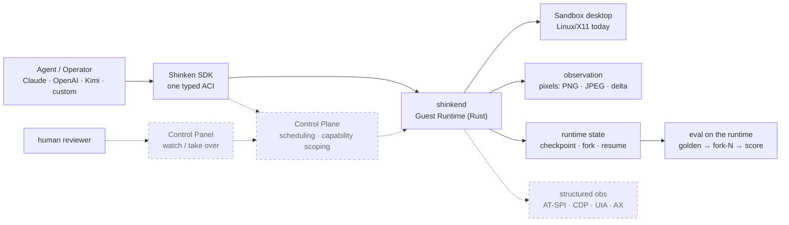
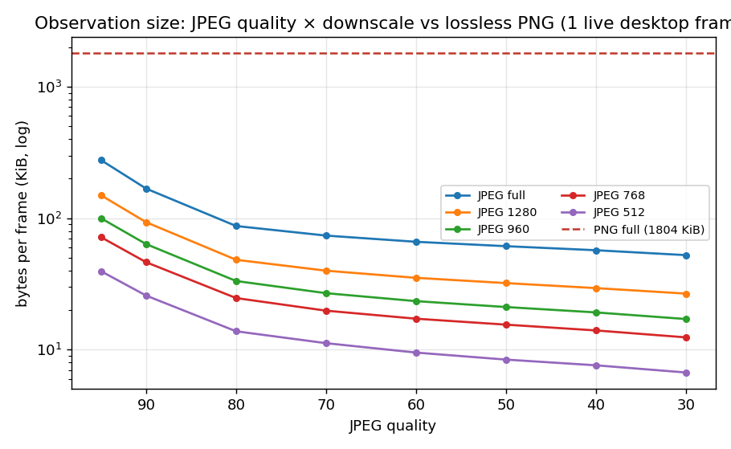
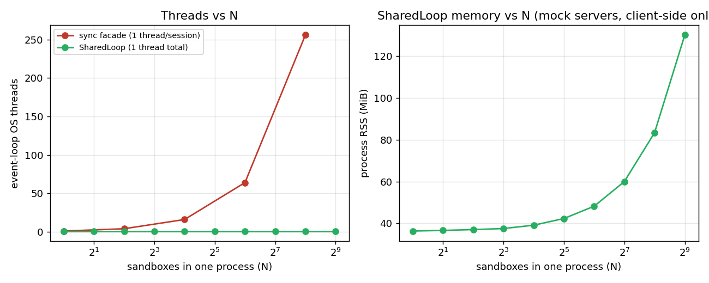

# Shinken

[](https://github.com/Meirtz/Shinken/actions/workflows/ci.yml)
[](LICENSE)

> The open infrastructure stack for computer-use agents: real computers, one typed interface,
> low-bandwidth observation, checkpoint/fork/resume of live runtime state, and eval on the same substrate.

Shinken is an AI-native, cross-platform **runtime + control plane + control panel** for
computer-use agents (CUAs). It boots real desktops and browsers, drives them through one
**Agent-Computer Interface (ACI)**, streams and supervises sessions live, **checkpoints / forks
/ resumes that live runtime state**, and runs evals on the *same* substrate the agent runs on —
the inversion of a benchmark harness, where eval is thin orchestration over a production runtime.

It is not a benchmark, a cloud browser, a VNC desktop, or a model adapter. It is the foundation
those plug into: production agent runtime, eval environment, runtime-state manager, and cross-OS
fleet manager.

<p align="center">
  
</p>

## Status — honest built-vs-designed map (2026-06-11)

Shinken's *design* is the full CUA stack above. The table marks what is **proven in CI today**
vs **designed-only**. The authoritative map is
[`docs/engineering/status.md`](docs/engineering/status.md); the measured numbers behind the
"built" claims are in [`docs/benchmarks/`](docs/benchmarks/README.md).

| area | state | what exists |
|---|---|---|
| ACI v0 (typed actions + observation) | ✅ built | handshake/auth, pointer+keyboard via X11/XTEST, screenshot, real-time screencast (idle-suppress + downscale + reconnect), focused-window capture; 11 verbs, contract-tested |
| Observation codec | ✅ built | PNG (lossless) **+ JPEG** lever (20–139× smaller) **+ lossless dirty-tile delta** (12× on text); codec capability negotiation |
| Runtime state | ✅ built | Docker disk-tier **checkpoint / fork / resume** behind a provider interface; `run_eval_forked` (golden → fork-N → score) |
| Concurrency | ✅ built | `SharedLoop` — N sync sessions on one event-loop thread (512 → 1 thread); global frame-budget + ping-jitter knobs |
| Eval | ✅ built | tiny verifier harness, **OSWorld-as-a-Workload**, typed exit-reason, subprocess scorer isolation; **OSWorld alpha gate passed (score 1.0)** |
| SDK + adapters | ✅ built | Python SDK (sync + async), TypeScript SDK, Anthropic/OpenAI/Kimi-VL adapters → canonical ACI |
| Structured a11y/DOM default (D3) | ⏳ provisional | coverage measured (E5): hybrid per-window structured + pixel fallback, *not* structured-by-default |
| Capability scoping (D6) | ○ mostly designed | a Sandbox is granted the resources its task needs (egress / fs / GPU / …); a local gateway shim records the granted envelope, control-plane resolution is designed |
| CRIU memory + sub-ms CoW fork | ○ designed | only the Docker disk tier is built |
| Control plane, WebRTC/GPU, cross-OS, `.skn` replay | ○ designed | reference path collapses these to one local `shinkend` |

## Why "Shinken"?

Most computer-use sandboxes are **mogitō** — training swords: fine for demos and benchmarks, not
built for real side effects, forkable state, eval artifacts, or scale. **Shinken (真剣)** means a
real sword: sharp enough for production work, with the runtime substance — typed actions,
checkpointable state, eval on the same runtime — that practice swords skip.

<p align="center">
  
</p>

## Architecture

Solid = built & in CI today. Dashed = designed, not yet built (the target the same ACI/runtime
semantics grow into).



Most CUA stacks run: `screenshot → model → pixel click → sleep → screenshot → throw the trace away`.
Shinken runs a different loop, and *that* loop is the product:

```text
structured/pixel observation → typed action → verified result → checkpointable state
```

## Measured results

First-party, reproducible (`python docs/benchmarks/plots.py`); full tables +
provenance in [`docs/benchmarks/`](docs/benchmarks/README.md).

**Observation bandwidth** — encoded in `shinkend`, pulled over the SDK. PNG is the lossless
default; JPEG is a **content-dependent** lever (it shines on photographic/content-rich frames
and *loses* to PNG on sparse/flat UIs, so it stays opt-in), and the **lossless dirty-tile
delta** stream is the robust win during interaction.

<p align="center"></p>

| measurement | result |
|---|---|
| JPEG q80 vs PNG, content-rich 1080p desktop frame (remote, WAN) | 1804 → 87 KiB, **20.7×** |
| JPEG q80 vs PNG, dense-text 1280px frame (local) | 747 → 553 KiB, **1.35×** |
| JPEG q80 vs PNG, sparse/flat desktop (local) | 65 → 86 KiB, **PNG wins** |
| downscale to model input res (q50 @512) | up to **~12×** on top |
| lossless dirty-tile delta during typing | **11–12×** vs full PNG |

The honest read: the codec is a *lever*, not a constant multiplier — which is why PNG is the
default and JPEG/downscale/delta are explicit. Full ladders (≈3.5k datapoints, local + remote)
in [`docs/benchmarks/`](docs/benchmarks/README.md) and
[`docs/engineering/benchmarks.md`](docs/engineering/benchmarks.md).

**Concurrency** — holding N sandbox sessions in one process. The default sync facade spends one
OS thread per session; `SharedLoop` holds 512 on **one** thread. The codec is what makes the
aggregate egress tractable: 1024 sandboxes at 1 Hz project to ~405 Mbps in JPEG vs ~15 Gbps in PNG.

<p align="center"></p>

**Functional** — OSWorld alpha gate **passed** (Kimi K2.6 over `shinkend` on a remote sandbox,
official evaluator **score 1.0**, 6 steps, 110 s); 74 Rust + 472 Python tests in a 9-job CI.
Accessibility coverage measured across real apps (E5): strong for Qt (0.87) and browser-via-CDP,
weak for GTK, absent for terminals — hence the *hybrid* observation default.

## Core concepts

| concept | what it is |
|---|---|
| **Sandbox / Session** | one isolated guest computer; a Session is a live attach. Reset and branch are the same fork-from-snapshot primitive. |
| **ACI** | the versioned, typed action/observation protocol every agent speaks: one tagged-union action (verb + `point_px`/`point_norm`/`element_ref` target), explicit coordinate space, handshake capability negotiation. |
| **`shinkend`** | the in-sandbox Rust Guest Runtime that executes the ACI and emits the event stream — the structured successor to OSWorld's Flask server. |
| **Operator / adapter** | client-side translation of a model's grammar (Anthropic/OpenAI/Kimi/OSWorld) to/from canonical ACI; the seam for human takeover. |
| **Checkpoint / fork / resume** | name a runnable checkpoint of live state, fork it into N replicas from one golden state, resume a suspended session — the headline differentiator. |
| **Workload × Runtime × Provider** | the semantics-free narrow waist: eval/train/interactive are *consumers*; substrates are *providers*; OSWorld is one Workload. |
| **Capability** | a runtime entitlement — the resources a Sandbox is granted (net egress, fs scope, GPU, credentials, …). Resource scoping, a supporting feature, not a pillar. |

## How it compares

Shinken's wedge is the unclaimed intersection, not winning any single axis. (Competitor speed/
density figures are vendor-published; see [`docs/design/landscape.md`](docs/design/landscape.md).)

| | cross-OS desktop | runtime fork | structured + pixel obs | eval on same runtime | streaming |
|---|---|---|---|---|---|
| **Shinken** | designed (Linux built) | **disk tier built, local-first** | hybrid (measured) | **yes (built)** | PNG/JPEG/delta built; WebRTC designed |
| trycua/cua | yes | cloud-only, not in its own bench | a11y trees | recreates per reset | VNC |
| E2B desktop | Linux | snapshot-restore | none | n/a | raw VNC |
| Morph | Linux | **best-in-class µs CoW** | none | n/a | n/a |
| OSWorld | Linux (in practice) | slow revert, no fork | full-XML per step | *is* the benchmark | full-frame PNG poll |
| browser SaaS | no (Chromium only) | no | DOM | no | WebRTC/HLS |

## Quickstart

```bash
# 1) run the Guest Runtime (loopback, no token)
cargo run --manifest-path shinkend/Cargo.toml

# 2) install the Python SDK
cd sdk/python && pip install -e ".[dev]"
```

```python
import shinken

with shinken.connect() as env:                 # connect + ACI handshake
    print(env.platform, env.screen_size())     # 'linux'  {'w':…, 'h':…}
    shot = env.screenshot(format="jpeg", quality=80)   # the bandwidth lever
    env.click(x=640, y=420)
    env.type_text("real desktops, one typed interface")
```

**Drive with a model adapter** — model dialect in, validated ACI actions out:

```python
from shinken.adapters import AnthropicComputerUseAdapter
adapter = AnthropicComputerUseAdapter()
with shinken.connect() as env:
    obs = env.screenshot()
    action = adapter.to_aci_action(model_tool_call)   # one validated, normalized ACI action
    env.act(action["verb"], action.get("target"), **action.get("args", {}))
    result = adapter.to_tool_result(env.screenshot()) # observation back in the model's grammar
```

**Runtime state** — checkpoint / fork / resume a live session, and the forked-eval loop:

```python
ckpt = env.checkpoint(name="golden")   # name a runnable checkpoint of live state
fork = env.fork()                       # branch a live replica from here
env.resume(ckpt)                        # bring a checkpoint back to a connectable sandbox

from shinken.providers import DockerLocalProvider
from shinken.eval import run_eval_forked
# golden → fork-N replicas → score, all from ONE checkpoint (provider must support fork):
summary = run_eval_forked(task, DockerLocalProvider(), n=5)
```

**Many sandboxes, one process** — the async core is the native fan-out; `SharedLoop` is the
sync convenience (one thread for all N):

```python
with shinken.SharedLoop() as loop:
    envs = [shinken.connect(addr, token=tok, loop=loop) for addr, tok in endpoints]
    shots = [e.screenshot(format="jpeg") for e in envs]
```

## Repository layout

```text
shinken/
├─ schema/         ACI JSON Schema (the wire contract)
├─ shinkend/       Rust Guest Runtime inside the Sandbox
├─ sdk/python/     Python SDK + CLI       sdk/typescript/  TS control-surface SDK
├─ images/linux/   Local Linux Sandbox image
├─ docs/           Design canon (ADRs D1–D12), engineering status, benchmarks
└─ spikes/         a11y-coverage spike (E5) evidence
```

- [Benchmarks](docs/benchmarks/README.md) — first-party tables + plots.
- [Implementation status](docs/engineering/status.md) — precise built-vs-designed map.
- [Design canon](docs/design/README.md) — scope, architecture, ADRs, tradeoffs.

> "Shinken" (真剣) means a real, live blade: sharp by default, safe by design.
