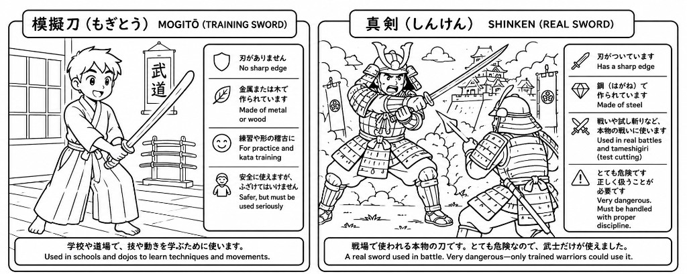
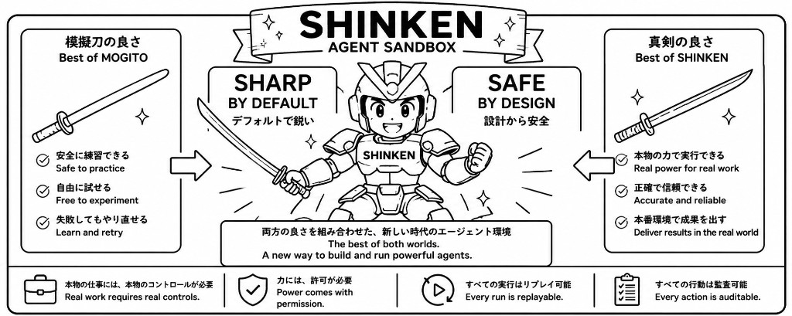
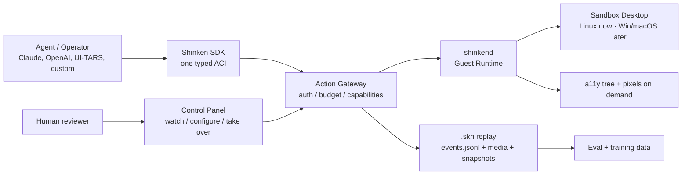
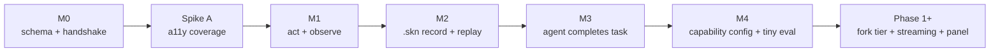

# Shinken

[](https://github.com/Meirtz/Shinken/actions/workflows/ci.yml)
[](LICENSE)

<p align="center">
  
</p>

> An **AI-native computer runtime**: give an agent a real desktop, unlock the capabilities
> that desktop needs, and replay the whole run as data.

Shinken is a cross-platform computer sandbox for agents: a real desktop runtime with streaming,
replay, and capability management built in.

It is designed as one platform for production computer-use agents, evals, and training-data
capture: every session can be watched live, audited, replayed, forked, and exported as trajectory
data.

## Why "Shinken"?

Most computer-use sandboxes today are **mogitō**: training swords. They are useful for demos,
benchmarks, and learning the motions, but they are not built for real side effects, real
capabilities, real audit, or real scale.

**Shinken (真剣)** means a real sword. The point is not recklessness; it is discipline. A real
agent runtime must be sharp enough to do production work, and safe enough that every boundary
capability is scoped, recorded, replayable, and under operator control.

<p align="center">
  
</p>

That is Shinken's stance: **real desktops, real actions, real capabilities, real replay.**

<p align="center">
  
</p>

The product shape follows from that stance: keep the practice-friendly ergonomics, then add the
real-runtime edge: sandbox entitlements, replayable runs, and auditable boundary crossings.



## What It Lets You Do

- **Drive a real desktop with a clean API.** Agents call typed actions like `click`,
  `type_text`, and `observe` through one Agent-Computer Interface (ACI), not ad hoc
  `pyautogui` strings.
- **Start with screenshots, then add structure.** Phase 0's baseline is the universal GUI-agent loop:
  screenshot observation plus typed mouse/keyboard actions. Accessibility trees and element refs are
  the parallel upgrade path for lower cost and more stable actions.
- **Grant real sandbox capabilities.** A Sandbox can be provisioned with network egress,
  credentials, GPU, persistence, privileged installs, clipboard, screenshots, or OS automation
  entitlements.
- **Move files fast.** Task fixtures, generated artifacts, logs, media, and replay resources need a
  high-throughput Sandbox↔client transfer path with checksums, backpressure, and profiling.
- **Replay every run.** The event stream is the replay log: actions, observations, permission
  decisions, and media references become a `.skn` bundle for debugging, eval, and training data.
- **Scale beyond one laptop.** The local PoC grows into a control plane with warm pools,
  fork-from-snapshot reset, policy enforcement, WebRTC media, and cross-OS substrates.

## Why It Is Different

Most computer-use stacks still run a loop like this:

```text
screenshot -> model -> pixel click -> sleep -> screenshot -> throw trace away
```

Shinken is designed around a different loop:

```text
screenshot observation -> typed action -> sandbox capability -> verified result -> replay event
```

That difference is the product:

- **Works before instrumentation:** screenshots are universal, so the first GUI loop works even on
  canvas, Electron, games, and custom-rendered apps.
- **Lower bandwidth and token cost over time:** add a11y/DOM diffs and element refs when the UI
  exposes useful structure.
- **Auditable authority:** sandbox capabilities such as network egress, credentials, GPU,
  persistence, host mounts, and OS automation are explicit, scoped, revocable, and recorded.
- **Fast artifacts:** file transfer is a profiled data path, not JSON/base64 bolted onto control RPC.
- **Forkable trajectories:** the same run can be scrubbed, audited, branched, and exported.

## Client / Server Shape

M0 is intentionally simple: the Python client talks directly to the Rust Guest Runtime. The target
architecture inserts the Control Plane as the mandatory server-side boundary.


The rule of thumb: **clients request, the Control Plane authorizes and records, `shinkend` executes,
the guest OS changes, and `.skn` preserves the timeline.**

## How Simple It Should Feel

The Phase-0 SDK target is a screenshot-first blocking API:

```python
import shinken

with shinken.connect() as env:
    shot = env.screenshot()                     # universal GUI observation
    # send shot["png"] to your computer-use model, then execute its action
    env.click(x=640, y=420)
    env.type_text("agent sandbox runtime")
    env.key("enter")
    shot = env.screenshot()

    env.save_replay("search-demo.skn")          # replay/debug/train later
```

Boundary-crossing capabilities should be just as explicit:

```python
with shinken.connect() as env:
    env.unlock("net.egress", scope="github.com")  # provisioned capability, recorded in replay
    env.run_task("open the project repo and file a bug")
```

And replay should become a first-class artifact:

```bash
shinken replay search-demo.skn                  # scrub by action/observation seq
shinken branch search-demo.skn --at 42          # rerun a counterfactual from step 42
```

Those examples are the product target. See [docs/10-phase0-plan.md](docs/10-phase0-plan.md) for the
milestones that make them real.

## What Works Today

**M1/M2 is underway:** schema scaffold, Rust `shinkend`, Python SDK/CLI, a Linux Docker image
skeleton, pointer/keyboard actions, screenshots, an OSWorld shim, and a minimal `.skn` replay
recorder exist. A11y observation, sandbox capability management, eval, real checkpoint/restore,
and model adapters are the next Phase-0 milestones.

```bash
# 1) run the Guest Runtime
cargo run --manifest-path shinkend/Cargo.toml

# 2) install and use the Python SDK
cd sdk/python
pip install -e ".[dev]"
shinken connect
```

```python
import shinken

env = shinken.connect()
print(env.platform)
print(env.screen_size())
print(env.capabilities)
env.close()
```

Expected today: connect, print platform/RTT/screen/capabilities, run basic pointer/keyboard actions,
capture screenshots, and save a minimal `.skn` replay. Not expected yet: a11y trees, sandbox
capability UI, eval, real checkpoint/restore, or cloud fork.

## Roadmap



Phase 0 is tracked under the
[Phase 0 milestone](https://github.com/Meirtz/Shinken/milestone/1). The load-bearing gate is
**a11y coverage**: Shinken must measure whether real apps expose enough structure for the
structured-first thesis to hold.

## Repository Layout

```text
shinken/
├─ schema/        ACI and .skn JSON Schemas
├─ shinkend/      Rust Guest Runtime inside the Sandbox
├─ sdk/python/    Python SDK and CLI
├─ images/linux/  Local Linux Sandbox image
├─ docs/          Authoritative design docs and Phase-0 plan
├─ notes/         Working notes, open questions, and sources
└─ references/    Public prior-art provenance and re-clone notes
```

Start with [docs/README.md](docs/README.md) for the full design index, especially
[Architecture](docs/02-architecture.md), [Technical decisions](docs/05-tech-decisions.md), and the
[Phase-0 implementation plan](docs/10-phase0-plan.md).

> The name "Shinken" (真剣 / 神剣) means a real, live blade: sharp by default, safe by design.
