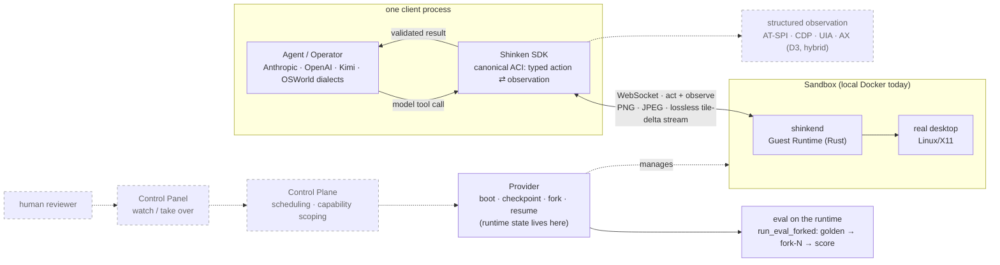

# Shinken

[](https://github.com/Meirtz/Shinken/actions/workflows/ci.yml)
[](LICENSE)

> The open infrastructure stack for computer-use agents: real desktops behind one typed
> interface, low-bandwidth observation, **checkpoint / fork / resume of live runtime state**,
> and eval as thin orchestration over the same runtime agents run on.

Shinken boots real desktops, drives them through a versioned **Agent-Computer Interface
(ACI)**, and treats running state as a first-class object: name a checkpoint of a live
session, fork it into N verified replicas, resume it later. Evals run on that primitive
(golden state → fork-N → score) instead of re-creating environments per attempt — the
inversion of a benchmark harness. It is not a benchmark, a cloud browser, a VNC desktop, or a
model adapter; it is the runtime those plug into.

What is real today is a **measured Linux/X11 vertical slice under live CI** — every claim
below links to first-party data you can rerun ([`benchmarks/`](benchmarks)) or audit
([`docs/benchmarks/`](docs/benchmarks/README.md)). What is design-only is marked, here and in
the [status map](docs/engineering/status.md).

## Quickstart

```bash
# 1) run the Guest Runtime (loopback, no token)
cargo run --manifest-path shinkend/Cargo.toml

# 2) install the Python SDK
cd sdk/python && pip install -e ".[dev]"
```

```python
import shinken

with shinken.connect() as env:                       # connect + ACI handshake
    print(env.platform, env.screen_size())           # 'linux'  {'w':…, 'h':…}
    shot = env.screenshot(format="jpeg", quality=80) # the bandwidth lever (PNG is default)
    env.click(x=640, y=420)
    env.type_text("real desktops, one typed interface")
```

**Checkpoint / fork / resume** — runtime state is provider-managed, so open the session
through a provider (local Docker here):

```python
from shinken import DockerLocalProvider, SandboxSpec

provider = DockerLocalProvider()
env = provider.connect(provider.create(SandboxSpec()))

ckpt = env.checkpoint(name="golden")            # sub-second, sandbox stays live
replica = provider.connect(env.fork())          # live replica branched from here
restored = provider.connect(env.resume(ckpt))   # checkpoint back to a connectable sandbox
```

```python
from shinken.eval import run_eval_forked
summary = run_eval_forked(task, provider, n=5)  # golden → fork-N → score, ONE checkpoint
```

**Drive with a model adapter** — model dialect in, validated ACI actions out:

```python
from shinken.adapters import AnthropicComputerUseAdapter

adapter = AnthropicComputerUseAdapter()
with shinken.connect() as env:
    action = adapter.to_aci_action(model_tool_call)   # one validated, normalized ACI action
    verb = action.pop("verb")
    env.act(verb, action.pop("target", None), **action)
    result = adapter.to_tool_result(env.screenshot()) # back in the model's grammar
```

**Many sandboxes, one process** — the async core is the native fan-out path; `SharedLoop` is
the sync convenience (one event-loop thread for all N):

```python
with shinken.SharedLoop() as loop:
    envs = [shinken.connect(addr, token=tok, loop=loop) for addr, tok in endpoints]
    shots = [e.screenshot(format="jpeg") for e in envs]
```

## Architecture

Solid = built and in CI today. Dashed = designed, not yet built.



Most CUA stacks run `screenshot → model → pixel click → sleep → repeat` and throw the run
away. Shinken's loop is typed at every edge and lands in checkpointable state:

```text
observation (pixels now, hybrid structured designed) → typed action → verified result → checkpointable state
```

## Measured results

First-party numbers; **~93k tracked datapoints** across six rerunnable local suites plus
audited one-off WAN runs. Full tables, provenance, and evidence-class labels:
[`docs/benchmarks/`](docs/benchmarks/README.md); methodology:
[`docs/engineering/benchmarks.md`](docs/engineering/benchmarks.md).

**Concurrency — measured to N=1024 on the client plane.** One process drives **64 real Docker
desktops** (~1,260 observations/s aggregate, 2 OS threads) and **1,024 concurrent live ACI
sessions on one event-loop thread**, sustaining **2,356 frames/s ≈ 884 Mbps** of decoded
48 KiB frames for 20 s at ~1 CPU core (mock servers isolate the client plane; payloads sized
to measured codec operating points).

<p align="center"></p>

**Runtime state — the differentiator, measured on the disk tier.** Checkpointing a live
sandbox takes **~0.57 s** and is non-disruptive; fork fan-out wall-clock is **nearly flat in
N**: **32 verified replicas of one mid-task state in ~11.9 s — 0.37 s/replica, ~26× cheaper
than minting them one at a time** (63/63 replicas verified to inherit the golden state). The
designed CRIU/CoW tiers (not built) attack the boot constant itself.

**Observation bandwidth — a content-dependent lever, not magic.** On a content-rich 1080p
frame (remote, WAN): JPEG q80 turns 1804 KiB into 87 KiB (**20.7×**), and downscale stacks to
**~131×** at @512. On sparse flat UI, **PNG wins outright** — which is why PNG is the lossless
default and JPEG/downscale are explicit knobs. During interaction the **lossless dirty-tile
delta** stream is the robust win: **11.3×** vs full-PNG while typing, zero quality loss, and
idle costs ~zero. Projected egress at 1024 sandboxes × 1 Hz: ~405 Mbps (JPEG q80@1280) vs
~15 Gbps (full-res PNG) — *projection from measured frame sizes, labeled as such*.

<p align="center"></p>

**Structured observation — measured, verdict: hybrid.** Accessibility-tree coverage (spike
E5): strong for Qt (0.87 addressable) and for browser *controls* via CDP (1.00 of labeled
controls; 0.23 of all nodes), weak for GTK, absent for terminals — so the structured-*default*
stays provisional (D3) and the shipped design is per-window structured + pixel fallback.

**Functional.** Single-task OSWorld end-to-end gate passed (1 task of the 369-task suite:
Kimi K2.6 over `shinkend`, official OSWorld evaluator **score 1.0**, 6 steps, 110 s — a full
conformance sweep has not been run). 74 Rust + 472 Python tests, 9-job CI on every PR.

## How it compares

Shinken's wedge is the unclaimed intersection, not winning any single axis. Survey date
2026-06; competitor figures are vendor-published, sources in
[`docs/design/landscape.md`](docs/design/landscape.md).

| | cross-OS desktop | runtime fork | structured + pixel obs | eval on same runtime | streaming |
|---|---|---|---|---|---|
| **Shinken** | designed (Linux built) | **disk tier built + measured, local-first** | hybrid (coverage measured) | **yes — `run_eval_forked` built** | PNG/JPEG/delta built; WebRTC designed |
| trycua/cua | yes | cloud-only; not used by its own bench | a11y trees | recreates env per reset | VNC |
| E2B desktop | Linux | snapshot-restore | none | n/a | raw VNC |
| Morph | Linux | **ms-class CoW (vendor-published P99 ~1.3 ms)** | none | n/a | n/a |
| OSWorld | Linux (in practice) | slow revert, no fork | full-XML per step | *is* the benchmark | full-frame PNG poll |
| browser SaaS | no (Chromium only) | no | DOM | no | WebRTC/HLS |

## Status — honest built-vs-designed map

The authoritative map is [`docs/engineering/status.md`](docs/engineering/status.md); the
numbers behind every "measured" are in [`docs/benchmarks/`](docs/benchmarks/README.md).

| area | state | what exists |
|---|---|---|
| ACI v0 (typed actions + observation) | ✅ built | handshake/auth, pointer+keyboard via X11/XTEST, screenshot, real-time screencast (idle-suppress, downscale, reconnect), focused-window capture; 11 verbs, contract-tested |
| Observation codec | ✅ built + measured | PNG lossless default; JPEG lever **~1–21× content-dependent** (PNG can win; ~131× stacked with downscale on content-rich frames); **lossless dirty-tile delta ~11× on text** |
| Runtime state | ✅ built + measured | Docker disk-tier **checkpoint / fork / resume** behind a provider interface; `run_eval_forked`; checkpoint ~0.57 s, fan-out nearly flat in N (32 replicas @ 0.37 s/replica) |
| Concurrency | ✅ built + measured | async core + `SharedLoop`: 64 real sandboxes / **1,024 mock-backed sessions on one loop thread**, ~884 Mbps sustained client ingest; `ping_jitter` fleet decorrelation |
| Eval | ✅ built | tiny verifier harness, OSWorld-as-a-Workload, typed exit-reason, subprocess scorer isolation; **single-task OSWorld gate passed (score 1.0; no conformance sweep yet)** |
| SDK + adapters | ✅ built | Python SDK (sync + async), TypeScript SDK, Anthropic/OpenAI/Kimi-VL adapters → canonical ACI |
| Structured a11y/DOM default (D3) | ⏳ provisional | coverage measured (E5): hybrid per-window structured + pixel fallback, *not* structured-by-default |
| Capability scoping (D6) | ○ mostly designed | a sandbox is granted the resources its task needs; local gateway shim records the envelope; control-plane enforcement designed |
| CRIU memory + sub-second CoW fork | ○ designed | only the Docker disk tier is built |
| Control plane, WebRTC/GPU, cross-OS, `.skn` replay | ○ designed | reference path collapses these to one local `shinkend` |

## Why "Shinken"?

Most computer-use sandboxes are *mogitō* — training swords: fine for demos and benchmarks,
not built for real side effects, forkable state, or scale. **Shinken (真剣)** means a real
sword — and idiomatically, *doing something in earnest*: a runtime with typed actions,
checkpointable state, and eval on the same substrate production agents run on.

## Repository layout

```text
shinken/
├─ schema/         ACI JSON Schema (the wire contract)
├─ shinkend/       Rust Guest Runtime inside the Sandbox
├─ sdk/python/     Python SDK + CLI       sdk/typescript/  TS control-surface SDK
├─ images/linux/   Local Linux Sandbox image
├─ benchmarks/     Rerunnable benchmark suites + tracked raw results (local + remote CSVs)
├─ spikes/         a11y-coverage spike (E5) evidence
├─ docs/           Design canon (ADRs D1–D12), engineering status, benchmark report
└─ notes/          Working notes: per-domain deep dives, open questions, sources
```

- [Benchmark report](docs/benchmarks/README.md) — every headline number with provenance.
- [Implementation status](docs/engineering/status.md) — precise built-vs-designed map.
- [Design canon](docs/design/README.md) — scope, architecture, ADRs, tradeoffs.
