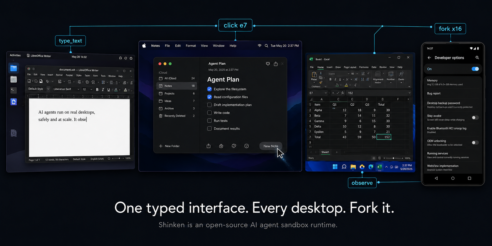
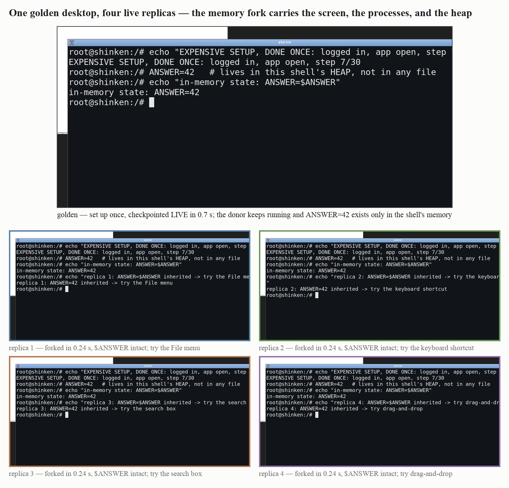
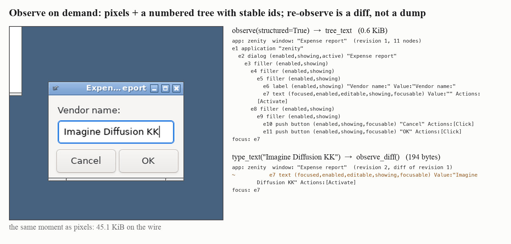
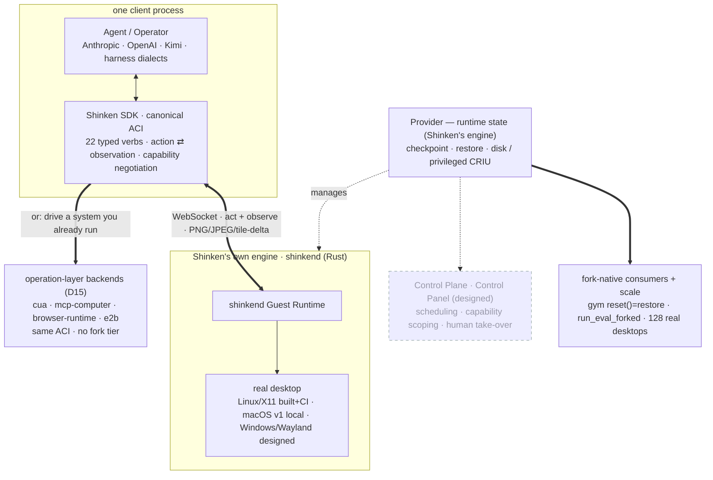

<p align="center">
  
</p>

<p align="center">
  <a href="https://github.com/Meirtz/Shinken/actions/workflows/ci.yml"></a>
  <a href="LICENSE"></a>
</p>

> **Train computer-use agents end-to-end on real desktops — at scale, from one machine.**
> Shinken is the open-source runtime for **scalable, high-performance computer-use
> environments**: point your RL/RFT loop at real desktops your agent **drives like a human —
> pixels and accessibility, no per-app APIs** — and reuse verified filesystem or process state
> instead of rebuilding it for every episode. One measured client process drives **128 real
> Docker desktops**; the same async core holds **3,096 protocol-faithful synthetic ACI sessions**
> on one event-loop thread.

**Why it exists.** Computer-use agents are trained and evaluated by the thousand, and most of
that compute is wasted rebuilding the same desktop state over and over: boot the desktop,
install the app, log in, navigate to step 7, fail, repeat. Shinken removes the repeat — reach
a state **once**, checkpoint it **live** (the sandbox keeps running), and `reset()` each
episode from a verified filesystem or process-memory checkpoint. The current safe disk path
measured ~0.60 s. A historical 0.12 s live-graft path is now disabled because pool-hit/
pool-miss equivalence was not proven; the atomic CRIU path needs a fresh benchmark. The
training plumbing has also executed a measured end-to-end optimizer-step smoke; this is
loop-closure evidence, not a convergence claim.

**Who it's for.**

| you are | Shinken gives you |
|---|---|
| an **RL / agent trainer** | **high-throughput RL / RFT on real computer-use environments**: a fork-native gym with explicit filesystem vs process-memory fidelity, plus a measured end-to-end optimizer-step smoke. Wired in at every seam: **training frameworks** (verl/uni-agent, NeMo Gym, ProRL-Agent-Server), **task suites** (OSWorld, CUA-Gym), **agent frameworks** (Agentix) |
| an **eval builder** | `run_eval_forked`: set a task up once, fork N replicas, score them all — on the same runtime production agents run on |
| an **agent product team** | one typed, versioned interface from local Docker to a fleet: one process drives **128 real desktops**; one event-loop thread holds **3,096 synthetic protocol-faithful sessions** at 0.93 cores |
| a stack with its own driver | the same ACI runs **over your system**: trycua/cua, codex-style MCP desktop servers, CDP browsers, and E2B desktops plug in *under* the typed interface as backends (D15) |

It is built for that training loop first, and the two properties that make it fast — **runtime
state** (checkpoint/fork/resume, so every `reset()` is a fork) and **fleet scale** (thousands
of live environments per process) — are the same ones an eval harness or an agent product
needs, so benchmarks, cloud browsers, VNC desktops, and model adapters all plug into the same
typed interface: **Shinken is the runtime underneath**. And it is honest about maturity: what
is real today is a **measured Linux/X11 vertical slice under live CI** — every claim below
links to first-party data you can rerun ([`benchmarks/`](benchmarks)) or audit
([`docs/benchmarks/`](docs/benchmarks/README.md)); design-only parts are marked, here and in
the [status map](docs/engineering/status.md).

<p align="center">
  
</p>

## The numbers, at a glance

One MacBook Pro. Every figure first-party and rerunnable
([docs/benchmarks](docs/benchmarks/README.md)).

| | |
|:--|:--|
| **synthetic ACI sessions**, one event-loop thread | **3,096** at 0.93 cores · 870 Mbps sustained |
| **real desktops**, one process | **128** — all booted in 7.3 s |
| **restore → usable replica** | **0.60 s** disk/filesystem restart; process-memory CRIU is privileged and pending post-hardening rebenchmark |
| **fleet observation dedup** | **18.6×** at a 94.6% hit rate |
| **act + observe step** | **13.4 ms** — ~14× cheaper than the incumbent guest server |
| **RL loop** | **update smoke closed** — valid rollouts and a measured parameter update; convergence not established |

## Quickstart

```bash
# prerequisites: Docker + Python 3.10+
docker build -f images/linux/Dockerfile -t shinken/sandbox-linux .   # the reference sandbox image
cd sdk/python && pip install -e ".[dev]"
```

```python
from shinken import DockerLocalProvider, SandboxSpec

provider = DockerLocalProvider()
with provider.session(SandboxSpec()) as env:         # boots in ~0.2 s; auto-destroyed on exit
    env.click(x=640, y=420)
    env.type_text("real desktops, one typed interface")
    png = env.screenshot()                           # lossless PNG is the default
```

Already have a runtime? Start it with a high-entropy `SHINKEND_TOKEN`, then pass the same value
to the SDK as `SHK_TOKEN`. Browser WebSocket origins are denied by default, and in-guest `exec`
is an explicit server opt-in (`SHINKEND_ENABLE_EXEC=1`):

```python
import os
import shinken

with shinken.connect(token=os.environ["SHK_TOKEN"]) as env:  # authenticated ACI handshake
    print(env.platform, env.screen_size())            # 'linux'  {'w': …, 'h': …}
    shot = env.screenshot(format="jpeg", quality=80)  # opt-in bandwidth lever
```

<p align="center"></p>
<p align="center"><sub>Illustration — but the loop it depicts is the real one: the same 22-verb ACI
(<code>type_text</code> · <code>click e7</code> · <code>observe</code> · <code>fork ×16</code>) drives every surface above.</sub></p>

**Runtime state is the product.** Reach a state once, checkpoint it live, spawn replicas that
*prove* they inherited it:

```python
from shinken import DockerLocalProvider, SandboxSpec

provider = DockerLocalProvider()
with provider.session(SandboxSpec()) as env:
    env.exec(["sh", "-c", "echo golden > /tmp/state.txt"])   # reach a state once
    ckpt = env.checkpoint("golden")                  # ~0.53 s; the sandbox stays live

    replica = ckpt.spawn()                           # filesystem replica: measured ~0.6 s
    try:
        out = replica.exec(["cat", "/tmp/state.txt"])
        assert out["stdout"].strip() == "golden"     # the replica inherited the state
    finally:
        replica.destroy()
    ckpt.delete()
```

Here is that loop run for real on the **memory tier** (CRIU): the golden desktop holds a
shell variable that exists only in process memory, the checkpoint is taken while the donor
keeps running, and every replica wakes up with the same screen, the same shell, the same
heap — then diverges. Real screenshots, regenerated any time with
`python scripts/readme_demo.py fork`:

<p align="center"></p>

**One checkpoint, a whole fleet** — `spawn_many` mints N verified replicas and `fleet.map`
drives them concurrently (for real: one process, one event loop):

```python
from shinken import DockerLocalProvider, SandboxSpec

provider = DockerLocalProvider()
with provider.session(SandboxSpec()) as env:
    ckpt = env.checkpoint("golden")
    fleet = ckpt.spawn_many(8)                       # 8 replicas from ONE checkpoint
    try:
        shots = fleet.map(lambda e: e.screenshot())  # concurrent observe across the fleet
    finally:
        fleet.map(lambda e: e.destroy())
        ckpt.delete()
```

**Observe on demand, act by element id** — the agent decides when to look. A structured
observation is a numbered tree whose element ids are **stable across observations** (never
rebound), so the model can say "click e7" across turns; a re-observation comes back as a
`~/+/-` **diff**, not a re-dump:

```python
import time

from shinken import DockerLocalProvider, SandboxSpec

provider = DockerLocalProvider()
with provider.session(SandboxSpec()) as env:
    env.launch_app("zenity", ["--entry", "--title=Expense report", "--text=Vendor name:"])
    time.sleep(1.0)
    obs = env.observe(structured=True, settle_ms=200)  # numbered tree + stable ids
    entry = next(e for e in obs["elements"] if e["role"] == "text")
    env.act_on(entry["ref"], "click")                  # guest-resolved element target
    env.type_text("Imagine Diffusion KK")
    diff = env.observe_diff()                          # '~ e7 … Value:"Imagine Diffusion KK"'
```

The same exchange, captured live (`python scripts/readme_demo.py observe`) — the full tree
is 0.6 KiB against a 45 KiB screenshot, and the diff after typing is 194 bytes:

<p align="center"></p>

**Drive with a model adapter** — model dialect in, validated ACI action out, result back in
the model's grammar:

```python
from shinken import DockerLocalProvider, SandboxSpec
from shinken.adapters import AnthropicComputerUseAdapter

provider = DockerLocalProvider()
adapter = AnthropicComputerUseAdapter()
tool_call = {"action": "type", "text": "real desktops, one typed interface"}

with provider.session(SandboxSpec()) as env:
    result = env.act_model(adapter, tool_call)       # parse → validate → act → re-encode
```

Every sandbox stays addressable through `env.handle`; `shinken ps` lists what is alive and
`shinken gc` reaps anything leaked.

## Scale: environments are the multiplier

Agent workloads multiply **environments** faster than anything else — an RL run wants
thousands of rollouts, an eval wants N attempts per task, a swarm wants a desktop per agent.
Shinken treats the environment plane as the thing that has to scale first, and measures it.
Every number below comes from **one MacBook Pro**; the WAN rows ran over an ordinary
residential connection. No cluster was harmed:

- one client process drives **128 real Docker desktops** (128/128 booted in 7.3 s,
  ~900 observations/s aggregate, 2 OS threads);
- the client plane holds **3,096 protocol-faithful synthetic ACI sessions on a single
  event-loop thread** at 0.93 cores, sustaining **2,320 frames/s ≈ 870 Mbps**. This measures
  control-plane capacity, not 3,096 booted desktops;
- forked fleets cut observation traffic **18.6×** (replicas render byte-identical pixels, so
  the fleet pays for each distinct screen once);
- the pipelined `step()` holds a k-action step at **~1 RTT** over WAN, whatever k the policy
  emits — measured from that same laptop on a home connection, against real remote sandboxes.

Every number above is a measurement with tracked raw data and a rerun command:
[docs/benchmarks](docs/benchmarks/README.md). Real-desktop density and synthetic connection
capacity are reported separately because they exercise different bottlenecks.

<p align="center"></p>

**The RL plumbing has been exercised end to end.** The current evidence is feasibility and
throughput, not policy convergence:

- the NeMo Gym example closes rollout, reward, and optimizer plumbing and is runnable from
  [`examples/nemo_gym/`](examples/nemo_gym/README.md);
- the rollout data engine sustained **48/48 real-task rollouts at ~244/hr on one laptop**
  (LibreOffice task layer, train/val splits), every episode reset by fork;
- an end-to-end smoke produced valid rollouts and a measured parameter update. It proves
  the optimizer path executed;
  it does not establish learning quality or convergence.

## Platforms

**The interface is the constant**: one typed, versioned 22-verb ACI, one SDK, capability
negotiation everywhere — the same agent code drives every platform below. The engine
underneath is the variable, and you pick it per platform:

- **Linux** — Shinken's **own engine** (`shinkend` inside the Docker sandbox): the full
  proven slice — every verb, structured observation (stable element ids, diffs, settle),
  and the Docker filesystem restore tier under live CI. The privileged CRIU process-memory
  tier is implemented and unit-tested but awaits its post-hardening live rerun; the unsafe
  warm graft is disabled and the CoW/microVM tier is designed-only. **OSWorld-native**
  environments run through the built-in compatibility map on the same interface.
- **macOS** — Shinken's **native engine v1** drives the real desktop (capture + input,
  Retina-correct); for background app control with an element tree today, plug an
  open-source codex-style AX server —
  [open-codex-computer-use](https://github.com/iFurySt/open-codex-computer-use) — in as the
  `mcp-computer` backend.
- **Windows** — **open-source** drivers through the same interface today: the `cua` backend
  (VM) or the `e2b` backend (cloud desktop); the native engine (UIA tier) is designed.
- **Browser** — any CDP browser through the `browser-runtime` backend: pixels, input, and
  semantic node ids.

One implementation of ours, the rest of the ecosystem plugged in beside it — and every
combination speaks the identical contract. Capability negotiation makes the differences
explicit (`supports_fork`, `structured_observation`, the verb list); anything a combination
lacks is a typed error. Fork tiers need a sandboxed substrate, so they live on Linux today.
Full built-vs-designed map: [docs/engineering/status.md](docs/engineering/status.md).

The macOS engine drives the **real desktop** of your Mac — same wire contract, no
container:

```bash
# terminal 1: choose a token, copy its value, then start the runtime
export SHINKEND_TOKEN="$(python3 -c 'import secrets; print(secrets.token_hex(32))')"
echo "$SHINKEND_TOKEN"
cargo run --manifest-path shinkend/Cargo.toml -- --backend macos

# terminal 2: paste that same value
export SHK_TOKEN="<copied token>"
python scripts/macos_smoke.py        # non-destructive: readiness, capture, hover
```

> **macOS caveat — exclusive-desktop semantics.** v1 needs TCC grants (Screen Recording +
> Accessibility) and posts **global** CGEvents: its clicks move the *real* cursor and land
> on your actual screen, so treat the desktop as the agent's while it runs. The **co-use
> tier** — per-app background input (`CGEventPostToPid`), a software cursor overlay so the
> human sees the agent act, AX-action fallback — is **designed, not built** (D14;
> real-desktop capture proof in [docs/engineering/macos-engine.md](docs/engineering/macos-engine.md)).
> Today's co-use answer on macOS is the **`mcp-computer` backend** (D15): it drives a
> codex-style AX server that operates apps in the background without touching your cursor.

## Architecture

One typed ACI; the substrate under it is interchangeable. Solid = built (Linux/X11 in CI; macOS
v1 local). Dashed = designed, not yet built.



**The agent decides when to look.** Observation is a tool the model calls — `observe`,
`screenshot`, `observe_diff` — not something the runtime pushes into the loop, and any
mutating action can opt into returning a fresh observation (`observe=`), so
act-then-reobserve is one round trip. There is no harness-side per-step screenshot poll:
the opt-in screencast exists for human monitoring and recording, not for the agent loop.
Harnesses that *do* poll (OSWorld-style `screenshot → model → click → sleep → repeat`) are
supported through the adapter — the polling lives in the adapter, not in the contract:

```text
agent-initiated observe (pixels and/or structured tree) → typed action → verified result → checkpointable state
```

## Why "Shinken"?

Most computer-use sandboxes are *mogitō* — training swords: fine for demos and benchmarks,
not built for real side effects, forkable state, or scale. **Shinken (真剣)** means a real
sword — and idiomatically, *doing something in earnest*: a runtime with typed actions,
checkpointable state, and eval on the same substrate production agents run on.

<p align="center">
  
</p>

## Measured results

First-party numbers; **~103k tracked datapoints** across fourteen rerunnable local suites (plus
the agent-quality study harness) and
audited one-off WAN runs, every table labeled with its evidence class (local-rerunnable /
remote-one-off / projection). Full tables, provenance, and labels:
[`docs/benchmarks/`](docs/benchmarks/README.md); methodology:
[`docs/engineering/benchmarks.md`](docs/engineering/benchmarks.md).

**1 — Runtime state: the fork ladder, every rung state-verified.** The differentiating
primitive, measured on the Docker disk tier (a timing row only counts if the replica passed
the `marker` verifier — the golden marker read back out of the fork; the suites also report
the stricter `pixels`/`fs` levels per replica). Throughout this section **"→ usable" is the
runtime-ready bar**: the moment the SDK can issue actions (push-readiness), which is what an
agent waits for. (The head-to-head chart below times a stricter "painted desktop" bar for an
apples-to-apples comparison with cua — labeled there.) **Checkpoint a live sandbox in 0.53 s**
without disrupting it and **classic restore → usable in 0.60 s**. A previous live warm-pool
graft measured 0.118 s but is disabled in the hardened implementation because it could race
the target's running processes; it is retained only as a historical benchmark. Fan-out from
one checkpoint stayed sublinear (N=16 in 2.1 s, ~0.13 s/replica, 16/16 verified). The **CRIU
memory tier is built** (S4c) and now keeps the dumped tree stopped across memory dump +
filesystem commit before resuming the donor, eliminating the old split-time state. The tracked
**0.70 s checkpoint / 0.40 s restore** figures came from the older non-atomic path and are not
current latency claims; the in-memory marker remains the fidelity oracle for the required live
rerun (privileged containers by necessity: a state-fidelity tier, not an isolation posture).
Cold boot → usable is ~0.2 s after push-based readiness (S9 took it from ~7.7 s).

<p align="center"></p>
<p align="center"></p>

**2 — Checkpoint-native consumption: what the ladder buys when loops run on it.** The gym
facade's `reset()` restores a checkpoint: task setup runs once and every episode materializes a
new replica. The safe current Docker disk path is the measured ~0.60 s path; the historical
60–120 ms live-graft path is disabled pending an equivalence-preserving design. Other shipped
gyms re-provision the sandbox per episode
([`examples/gym_rollout.py`](examples/gym_rollout.py)). `run_eval_forked` is the same loop for
evals — golden → fork-N → score, one setup amortized over N attempts. And the parallel pool is
real: one process drives **128 real Docker desktops** (128/128 booted in 7.3 s, ~57 ms
amortized per replica, observe-all at 142 ms p50, 2 OS threads). Separately, the client plane
holds **3,096 protocol-faithful synthetic ACI sessions on one event-loop thread** at 0.93
cores, sustained at **2,320 frames/s ≈ 870 Mbps decoded ingest** over 183,216 measured
  observations. This is a control-plane capacity test, not a 3,096-desktop run.

<p align="center"></p>

**3 — Fleet observation dedup: the fork dividend.** Replicas in the measured static-screen suite
rendered identical pixels, so content-negotiated observation (`if_none_match` against
a raw-pixel **XXH3-128** `frame_hash`, one shared `FrameCache` across the fleet) lets the
fleet pay for each distinct screen once. Measured over N ∈ {4, 8, 16} forked fleets: **18.6×
whole-suite wire cut** (14.1 MiB → 0.76 MiB) at a **94.6% hit rate**, with honest curves on
both sides — the 2-of-N divergence event dips the hit rate to (N−2)/N for one round, then
self-heals as each diverged replica re-converges against its own new content; the **~654×
figure is the static-fleet ceiling** (N=16 at steady state, no divergence) and is labeled as
such; the trainer-shaped **concurrent mode** pays one first-touch-race round then matches it;
and **policy-driven full divergence decays the hit rate to zero** (~1× bytes — the measured
floor: dedup's value is bounded by how often screens repeat). A general-purpose sandbox API
cannot offer this: it works because fork makes the replicas' pixels byte-identical.

<p align="center"></p>

**4 — The agent step loop: sub-ms actions, ~1 RTT per step.** Input actions land in
**~0.5 ms p50** (full X11 injection, not a queue ack) and a complete act+observe step costs
**13.4 ms p50** loopback — **~14× per step vs the incumbent harness's guest server as shipped
(OSWorld's, including its default 0.1 s pyautogui pause per action)**, measured with both
servers in one sandbox against the same display at verified frame parity (0.0 mean pixel
delta). Over distance the win compounds: the **pipelined `step()`** sends k actions plus a
fused observation before awaiting any reply, so a 5-action step at 150 ms WAN RTT drops from
**937 ms to 165 ms** of runtime overhead (~1 RTT per step; **5.8× at 300 ms, 8.5× for an
8-action step**) — the per-step tax stops scaling with how many actions the policy emits.

<p align="center"></p>

**5 — Structured observation: hybrid, built on identity.** The structured layer's contract is
*identity*: an on-screen control keeps the same element id across observations
within a session, and **an id is never rebound to a different control** (a control that
disappears and returns may get a new id; an id never silently migrates) — where the prevailing
pattern elsewhere is per-snapshot refs that go stale on every observation. On that identity
sit **diff observations** — typing produced a **2.0 KiB tree diff vs a 76.5 KiB screenshot** —
and guest-resolved element targets (`invoke_action`, `set_value`). Coverage is measured and
the verdict is **hybrid** (spike E5): strong for Qt (0.87 addressable) and Chromium-family
*controls* via CDP (1.00 of labeled controls), weak for GTK, absent for terminals, and canvas
is a measured zero with a change-blind diff — so the shipped design is per-window structured +
pixel fallback, and the structured-by-default thesis (D3) stays provisional.

**Transport hygiene.** Supporting engineering — the wire is kept
change-proportional: opt-in JPEG/downscale levers cut content-rich frames ~20–131×
(content-dependent; PNG outright wins on flat UI), negotiated binary WS frames remove the
base64+JSON tax (wire −25%), the lossless dirty-tile delta stream cuts typing traffic 11.3×
and an idle window to ~zero bytes, and XDamage event-driven capture takes an idle streaming
guest to ~0 CPU. The lossy levers are **opt-in, and the legibility envelope is now measured**
(S13, OCR-judged): JPEG q80 at native scale and the composited delta-JPEG stream keep **100%**
of scripted on-screen text legible, while **any downscale breaks small text** (6×13 terminal
text falls to 25% at q80@1024; q50@512 reads nothing on any text stratum) — so PNG/q80-native
stay the defaults and downscale is for layout-level tasks. A real-model pilot confirms the
failure mode is codec-visual, not actuation (Kimi K2.6: 4/4 exact transcriptions on the
lossless control vs 0/4 at q50@1024, lost to single-glyph JPEG misreads). Full ladders and
the fleet egress projections, and the legibility figures: [`docs/benchmarks/`](docs/benchmarks/README.md).

**Functional.** Single-task OSWorld gate passed (1 task of the 369-task suite: Kimi K2.6 over
`shinkend`, official evaluator **score 1.0**, 6 steps, 110 s — a conformance sweep has not
been run). Tested in a 9-job CI with measured line coverage (**78% Rust / 87% Python**,
[report §6b](docs/benchmarks/README.md)) and per-verb test traceability. README snippets
have a dedicated test suite; Docker-dependent examples are opt-in and skipped when that
live-test flag is not enabled.

## How it compares

Shinken's wedge is the unclaimed intersection of the axes below. Survey date
2026-06; competitor figures are vendor-published, sources in
[`docs/design/landscape.md`](docs/design/landscape.md).

| | cross-OS desktop | runtime fork | structured + pixel obs | eval on same runtime | streaming |
|---|---|---|---|---|---|
| **Shinken** | **Linux native (CI) + macOS v1; macOS/Windows reachable today via backends** (cua · mcp-computer, same ACI); native Win/Wayland designed | **disk/filesystem + privileged CRIU process-memory tiers built + measured**; sub-ms CoW designed | hybrid (coverage measured) | **yes — `run_eval_forked` built** | PNG/JPEG/delta built; WebRTC designed |
| trycua/cua | yes | cloud-only — local `snapshot()` raises (measured); local verbs = `docker pause` / stopped-VM clone | a11y trees | recreates env per reset | VNC + polled PNG (measured: 174 ms/step vs our 2.9 ms) |
| E2B desktop | Linux | cloud pause/resume, 1:1 (API-key required — no keyless/local mode, measured) | none | n/a | raw VNC |
| Morph | Linux | **ms-class CoW (vendor-published P99 ~1.3 ms)** | none | n/a | n/a |
| OSWorld | Linux (in practice) | slow revert, no fork | full-XML per step | *is* the benchmark | full-frame PNG poll |
| browser SaaS | no (Chromium only) | no | DOM | no | WebRTC/HLS |

On **cross-OS**: rather than wait for a native engine on every OS, Shinken reaches all three
desktops *now* through the operation-layer backends (D15) — the same typed ACI driving a
cross-platform AX/UIA/AT-SPI server (`mcp-computer`, e.g. [open-codex-computer-use](https://github.com/iFurySt/open-codex-computer-use)) or a
macOS/Linux/Windows VM (`cua`). Linux is native and CI-gated; macOS has a native v1 too; the
native Windows/Wayland engines are the designed follow-ups. The waist is the portability layer.

The cua and e2b cells marked *measured* are first-party, rerunnable numbers — both stacks as
shipped, same host, same window, pinned versions
([S12](docs/engineering/benchmarks.md), [`docs/benchmarks/`](docs/benchmarks/README.md) §7):

<p align="center"></p>
<p align="center"><sub>The boot/fork bars here are timed to a <b>fully-painted desktop</b> — the apples-to-apples
bar against cua, which also paints. That is a stricter bar than the <b>runtime-ready</b>
(~0.2&nbsp;s boot / ~0.6&nbsp;s fork) numbers in <a href="#measured-results">Measured results §1</a>, which time
when the SDK can start issuing actions (push-readiness). Same runs, two honestly-different bars.</sub></p>

## Operation-layer backends

The operation layer is a narrow waist: Shinken ships its own backend (`shinkend`), but
anything that presents the verb surface a `Sandbox` exposes can sit **underneath** it. A
backend adapter wraps a third-party computer-control system as a duck-typed Sandbox behind a
`SandboxProvider`, so the inherited `provider.session()` and every Sandbox consumer (operator
loop, model adapters, the gym where the substrate allows it) work unchanged — and each
backend advertises **honest capabilities** (a backend with no snapshot tier leaves
`supports_fork=False`; its `checkpoint`/`resume` raise `UnsupportedProviderOperation`; its
`capabilities.verbs` list only what it really serves, so consumers degrade loudly). All four
are fixture-tested against protocol-faithful in-memory peers (no SDK/VM/key needed), and each
has an env-gated live smoke (`tests/test_backends_live.py`) — the **browser backend is proven
against a real headless Chrome** (real AX tree → `element_ref` click landed); the e2b/cua/mcp
gates are written but unrun:

```python
from shinken.backends import get_backend
provider = get_backend("cua")          # trycua/cua's computer interface, under the Shinken ACI
with provider.session() as env:
    env.click(x=640, y=420); env.type_text("hello"); env.observe(structured=True)
```

- **trycua/cua** ([trycua/cua](https://github.com/trycua/cua)) — `shinken.backends.cua`:
  drives the ACI over cua's `BaseComputerInterface` (pointer/keyboard/scroll/screenshot/exec
  + a11y-tree `observe`); no fork tier, so it degrades loudly. Example:
  [`examples/backends_cua_shinken.py`](examples/backends_cua_shinken.py) (scripted, no cua
  install).
- **MCP computer-use** (e.g. [open-codex-computer-use](https://github.com/iFurySt/open-codex-computer-use)) —
  `shinken.backends.mcp_computer`: drives the ACI over any MCP server exposing a codex-style
  desktop computer-use surface (`get_app_state` + `click`/`type_text`/`press_key`/`scroll`/…).
  Because that server observes via a numbered Accessibility tree and clicks by element index,
  this backend serves **structured `observe` + `element_ref`** — the same shape as Shinken's
  own guest engine, which is what fills the macOS-AX gap. Non-invasive, so no `exec`; no fork
  tier. Example: [`examples/backends_mcp_computer_shinken.py`](examples/backends_mcp_computer_shinken.py).

- **E2B cloud desktop** ([e2b-dev/desktop](https://github.com/e2b-dev/desktop)) —
  `shinken.backends.e2b`: drives the ACI over an E2B cloud Linux desktop (`left_click`/`write`/
  `press`/`scroll`/`drag` over xdotool, plus a real shell, so `exec` and `launch_app` are
  served). Pixel-only — no accessibility tree, so `structured_observation=False`; e2b's own
  cloud pause/resume is a different, 1:1 tier, so no Shinken fork (`supports_fork=False`). A
  ~350-line adapter — the proof that a new backend is cheap. Example:
  [`examples/backends_e2b_shinken.py`](examples/backends_e2b_shinken.py) (scripted, no key, no cloud).
- **Browser Runtime / BU** (e.g. [open-browser-use](https://github.com/iFurySt/open-browser-use)) —
  `shinken.backends.browser_runtime`: the browser half, alongside the desktop (CU) backends.
  Realizes Shinken's designed Browser Runtime (D13 §10) as a backend over a CDP browser, with
  the **three tab surfaces**: pixels (`screenshot` + `click(x,y)`), **semantic node-ids**
  (`observe(structured=True)` reuses the same `parse_ax_tree`→a11y path the guest engine uses,
  so it serves `element_ref`), and locator/script (`navigate`/`eval`). No shell `exec`; tabs
  are ephemeral so no fork tier. Example:
  [`examples/backends_browser_runtime_shinken.py`](examples/backends_browser_runtime_shinken.py).
  Route CU vs BU at the Operator level (by target app/URL) via `RoutedSession`, below.

**Compose CU + BU under one loop.** `shinken.backends.RoutedSession` holds named surfaces
(e.g. `{"cu": desktop, "bu": browser}`), routes each ACI action to the right one (explicit
`surface=`, or `navigate`/`eval` imply BU), and tags every action + observation with `source`
provenance — the host-side CU↔BU split codex does. It quacks like a Sandbox, so the Operator
loop drives it unchanged; partial surfaces degrade loudly (a verb a surface doesn't advertise
raises). Example: [`examples/backends_routed_cu_bu.py`](examples/backends_routed_cu_bu.py).

Register your own backend with `shinken.backends.register_backend`.

## Integrations

Adapters that plug Shinken under stacks that already exist (duck-typed protocol shapes, no
hard dependency on the target framework; each ships fixture tests + a runnable example). A
training stack has layers — the **training framework** that owns the optimizer and rollout
collection, the **task suite** that supplies environments and scoring, and the **agent
framework** that orchestrates — and Shinken plugs in at each seam separately. The fork-native
**gym** facade graduated into the headline results above (`shinken.gym`, `reset()` = fork).

**Training frameworks** — the rollout/optimizer side:

- **NeMo Gym** ([NVIDIA-NeMo/Gym](https://github.com/NVIDIA-NeMo/Gym)) —
  `shinken.integrations.nemo_gym`: a resources server whose **per-rollout resource is a
  fork of the task's golden checkpoint**, with a text-first computer-use tool set
  (`computer_observe` = stable-id tree / `~/+/-` diff) and CUA-Gym `reward.py` as the
  `/verify` scorer. Verified end-to-end with `ng_collect_rollouts` (reward 1.0 on both
  demo tasks, GUI task solved by element id + diff verification); the rollout JSONL feeds
  NeMo RL GRPO directly. Example: [`examples/nemo_gym/`](examples/nemo_gym/README.md).
- **uni-agent / verl** — `shinken.integrations.swerex` implements the SWE-ReX deployment/runtime
  protocol [uni-agent](https://github.com/verl-project/uni-agent) drives its sandboxes through, so
  verl-style rollout collection runs on Shinken sandboxes (with fork-from-golden-checkpoint
  `start()`); see [`examples/uniagent_shinken.py`](examples/uniagent_shinken.py) and
  [agent-runtime.md](docs/design/agent-runtime.md).
- **ProRL-Agent-Server** ([NVIDIA-NeMo/ProRL-Agent-Server](https://github.com/NVIDIA-NeMo/ProRL-Agent-Server))
  — `shinken.integrations.prorl_agent_server`: a rollout-as-a-service runtime plugin
  (`BaseRuntime` contract — `start/stop/cancel`, `exec`, file up/download) giving each rollout
  session one provider-managed Shinken sandbox, with the INIT stage mapped onto
  **resume-from-golden** instead of a cold boot. Example: `scripts/prorl_runtime_example.py`.

**Task & benchmark suites** — environments and scoring:

- **OSWorld** — a `DesktopEnv`-shaped shim (`shinken.osworld`) + an eval Workload: the
  harness's pyautogui/`computer_13` actions actuate over the typed ACI and its own evaluator
  scores the run (the single-task gate above).
- **CUA-Gym** ([xlang-ai/CUA-Gym](https://github.com/xlang-ai/CUA-Gym)) —
  `shinken.integrations.cua_gym`: exported task bundles as a `TaskSource` + their VM-env
  method surface, with **fork-native reset**. The Docker disk tier preserves persistent
  filesystem setup and restarts processes; tasks that require an already-running GUI process
  must request the CRIU process-memory tier or replay launch/focus after restore. CUA-Gym
  reports a 32k-task generation corpus; the released bundle consumed by this adapter contains
  **10,910 tasks**, and only the image/probe-compatible subset should enter training.
  Example: `examples/cua_gym_shinken.py`.

**Agent frameworks** — orchestration:

- **Agentix** ([Agentix-Project/Agentix](https://github.com/Agentix-Project/Agentix)) —
  `shinken.integrations.agentix`: a `SandboxProvider`-shaped provider (async
  `create/delete/get` + scoped `session()`) exposing `DockerLocalProvider` + the typed ACI to
  their orchestration, with `golden=<checkpoint>` turning every `create()` into a fork from a
  golden state. Example: `examples/agentix_shinken.py`.

## Status — honest built-vs-designed map

The authoritative map is [`docs/engineering/status.md`](docs/engineering/status.md); the
numbers behind every "measured" are in [`docs/benchmarks/`](docs/benchmarks/README.md).

| area | state | what exists |
|---|---|---|
| Runtime state | 🟡 hardened, live revalidation pending | Docker disk-tier **checkpoint / spawn / resume** preserves filesystem state and restarts processes (~0.60 s historical measurement). The unsafe live warm-pool graft is disabled. **CRIU** now uses one stopped memory+filesystem consistency window with explicit fidelity requirements; privileged live rebenchmark is pending |
| Fork-native consumption | ✅ built | `run_eval_forked` (golden → restore-N → score), checkpoint-native gym (correct `(s_t,a_t,s_{t+1})` trajectories, HF exporter, pool), tiny verifier harness, typed exit-reason, subprocess scorer isolation; the single-task functional gate above (1/369; no conformance sweep) |
| Fleet concurrency | ✅ built + measured | async core + fleet fan-out: **128 real sandboxes** on 2 threads (128/128 in 7.3 s); client plane held **3,096 protocol-faithful synthetic ACI sessions** on one loop thread at 0.93 cores (2,320 frames/s ≈ 870 Mbps); fork-aware observation dedup (18.6× suite-wide at the static ceiling, 94.6% hit rate, divergence floor measured); `ping_jitter` fleet decorrelation |
| ACI v0 (typed actions + observation) | ✅ built | mandatory token auth on every TCP listener; browser-Origin deny-by-default; pointer+keyboard via X11/XTEST; screenshot/observe/screencast/focused-window capture; `list_windows`; typed in-guest `exec` is default-off and explicitly enabled inside provider-managed sandboxes; desktop verbs; **22 maximum verbs**, contract-tested |
| Structured observation (Linux v1) | ✅ built | guest `observe` engine in `shinkend` (AT-SPI): stable **never-rebind** element ids, `tree_text` diff rendering, settle; guest-resolved `element_ref` targets + `invoke_action`/`set_value`; live Docker smoke |
| Observation transport | ✅ built + measured | PNG lossless default; opt-in JPEG/downscale lever **~1–21× content-dependent** (~131× stacked on content-rich frames); **legibility envelope measured (S13)**: q80@native + delta stream 100% legible, any downscale breaks small text; lossless dirty-tile delta ~11× on text; binary WS frames; XDamage idle ~0 CPU |
| SDK + adapters | ✅ built | Python SDK (sync + async), TypeScript SDK, Anthropic/OpenAI/Kimi-VL adapters → canonical ACI (`act_model`) |
| Operation-layer backends (D15) | ✅ built | `shinken.backends`: **cua · mcp-computer · browser-runtime · e2b** adapters + `RoutedSession` (CU↔BU composition, `source` provenance); honest capability negotiation (missing tier ⇒ typed `UnsupportedProviderOperation`); fixture-tested + env-gated live smokes (browser proven on real Chrome) |
| Structured a11y/DOM default (D3) | ⏳ provisional | coverage measured (E5): hybrid per-window structured + pixel fallback, *not* structured-by-default |
| Capability scoping (D6) | ○ mostly designed | a sandbox is granted the resources its task needs; local gateway shim records the envelope; control-plane enforcement designed |
| Sub-ms CoW fork fast tier | ○ designed | the Docker disk tier and the CRIU memory tier (`CriuDockerProvider`, privileged-only) are built + measured; the CoW/microVM fast tier remains designed (D5) |
| macOS engine (D14) | 🟡 v1 slice | native CoreGraphics capture + CGEvent input in `shinkend` (`--backend macos`), TCC-honest readiness; local-only proof — no mac CI; AX tree designed |
| Control plane, WebRTC/GPU, Windows/Wayland, `.skn` replay | ○ designed | reference path collapses these to one local `shinkend` |

## Repository layout

```text
shinken/
├─ schema/         ACI JSON Schema (the wire contract)
├─ shinkend/       Rust Guest Runtime inside the Sandbox
├─ sdk/python/     Python SDK + CLI       sdk/typescript/  TS control-surface SDK
├─ images/linux/   Local Linux Sandbox image
├─ examples/       Runnable interop + backend examples (gym, CUA-Gym, Agentix, uni-agent, NeMo Gym;
│                  backends: cua / MCP / CDP browser / e2b / routed CU+BU — scripted, no model API)
├─ benchmarks/     Rerunnable benchmark suites + tracked raw results (local + remote CSVs)
├─ spikes/         a11y-coverage (E5) + CRIU memory-tier spike evidence
├─ docs/           Design canon (ADRs D1–D15), engineering status, benchmark report
└─ notes/          Working notes: per-domain deep dives, open questions, sources
```

- [Benchmark report](docs/benchmarks/README.md) — every headline number with provenance.
- [Implementation status](docs/engineering/status.md) — precise built-vs-designed map.
- [Design canon](docs/design/README.md) — scope, architecture, ADRs, tradeoffs.
