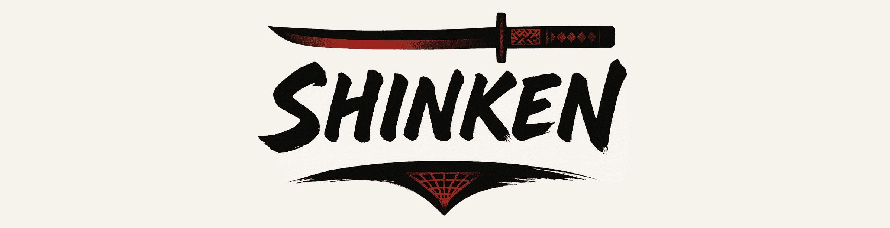
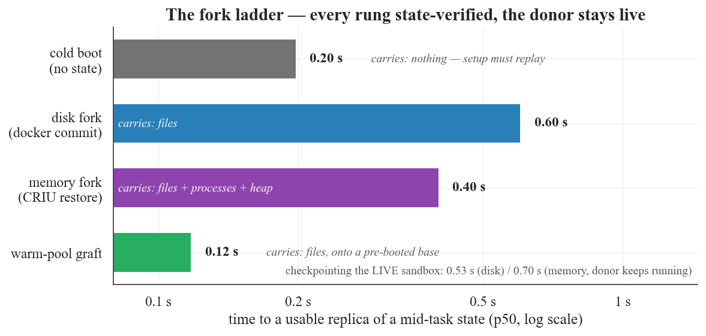
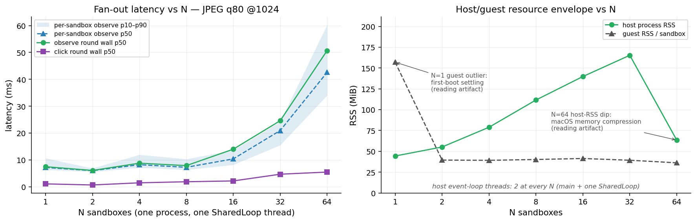
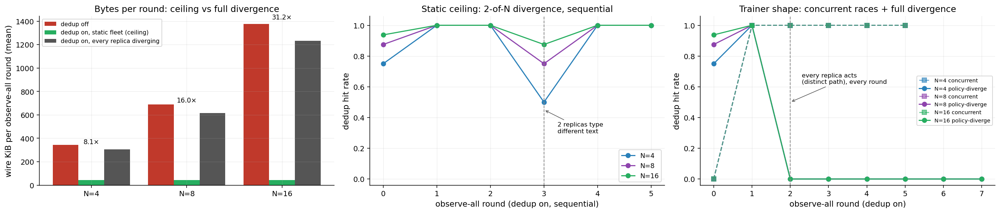
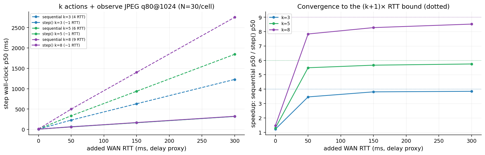
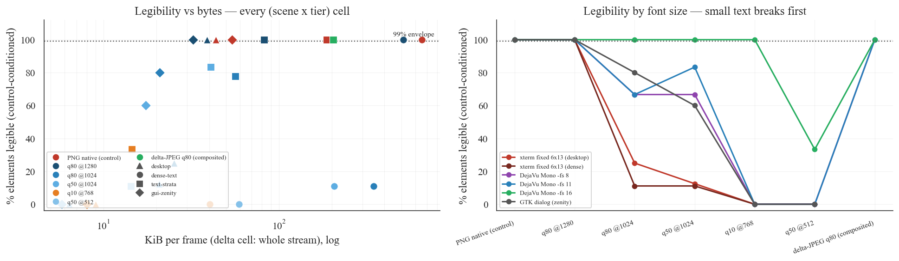

<p align="center">
  
</p>

<p align="center">
  <a href="https://github.com/Meirtz/Shinken/actions/workflows/ci.yml"></a>
  <a href="LICENSE"></a>
</p>

> **Checkpoint a live desktop. Fork it into a fleet. Resume it later.**
> Shinken is an open-source sandbox runtime for computer-use agents: real desktops your agent
> clicks and types on, where the *running state* of the computer is something you can save,
> copy, and hand around like a file.

**Why it exists.** Agents that use real computers are trained and evaluated by the thousand,
and most of that compute is spent rebuilding the same state over and over: boot the desktop,
install the app, log in, navigate to step 7, fail, repeat. Shinken removes the repeat — reach
a state **once**, checkpoint it **live** (the sandbox keeps running), and spawn verified
replicas of that exact moment in **0.1–0.6 s** each.

**Who it's for.**

| you are | Shinken gives you |
|---|---|
| an **RL / agent trainer** | a gym whose `reset()` *is* a fork — **p50 ~60 ms** instead of re-provisioning per episode — plus drop-in adapters for uni-agent/verl, CUA-Gym, Agentix, ProRL-Agent-Server |
| an **eval builder** | `run_eval_forked`: set a task up once, fork N replicas, score them all — on the same runtime production agents run on |
| an **agent product team** | one typed, versioned interface (22 verbs) from keyless local Docker to a fleet: one process drives **128 real desktops**, one event loop holds **1,024 live sessions** |

It is not a benchmark, a cloud browser, a VNC desktop, or a model adapter — **it is the
runtime those plug into**. And it is honest about maturity: what is real today is a
**measured Linux/X11 vertical slice under live CI** — every claim below links to first-party
data you can rerun ([`benchmarks/`](benchmarks)) or audit
([`docs/benchmarks/`](docs/benchmarks/README.md)); design-only parts are marked, here and in
the [status map](docs/engineering/status.md).

<p align="center">
  
</p>

## Quickstart

```bash
# prerequisites: Docker + Python 3.10+
docker build -f images/linux/Dockerfile -t shinken/sandbox-linux .   # the reference sandbox image
cd sdk/python && pip install -e ".[dev]"
```

```python
from shinken import DockerLocalProvider, SandboxSpec

provider = DockerLocalProvider()
with provider.session(SandboxSpec()) as env:         # boots in ~0.2 s; auto-destroyed on exit
    env.click(x=640, y=420)
    env.type_text("real desktops, one typed interface")
    png = env.screenshot()                           # lossless PNG is the default
```

Already have a runtime? The SDK attaches to any running `shinkend` by address — no provider
required:

```python
import shinken

with shinken.connect() as env:                        # connect + ACI handshake
    print(env.platform, env.screen_size())            # 'linux'  {'w': …, 'h': …}
    shot = env.screenshot(format="jpeg", quality=80)  # opt-in bandwidth lever
```

**Runtime state is the product.** Reach a state once, checkpoint it live, spawn replicas that
*prove* they inherited it:

```python
from shinken import DockerLocalProvider, SandboxSpec

provider = DockerLocalProvider()
with provider.session(SandboxSpec()) as env:
    env.exec(["sh", "-c", "echo golden > /tmp/state.txt"])   # reach a state once
    ckpt = env.checkpoint("golden")                  # ~0.53 s; the sandbox stays live

    replica = ckpt.spawn()                           # live replica: ~0.6 s (~0.12 s warm pool)
    try:
        out = replica.exec(["cat", "/tmp/state.txt"])
        assert out["stdout"].strip() == "golden"     # the replica inherited the state
    finally:
        replica.destroy()
    ckpt.delete()
```

**One checkpoint, a whole fleet** — `spawn_many` mints N verified replicas and `fleet.map`
drives them concurrently (for real: one process, one event loop):

```python
from shinken import DockerLocalProvider, SandboxSpec

provider = DockerLocalProvider()
with provider.session(SandboxSpec()) as env:
    ckpt = env.checkpoint("golden")
    fleet = ckpt.spawn_many(8)                       # 8 replicas from ONE checkpoint
    try:
        shots = fleet.map(lambda e: e.screenshot())  # concurrent observe across the fleet
    finally:
        fleet.map(lambda e: e.destroy())
        ckpt.delete()
```

**Drive with a model adapter** — model dialect in, validated ACI action out, result back in
the model's grammar:

```python
from shinken import DockerLocalProvider, SandboxSpec
from shinken.adapters import AnthropicComputerUseAdapter

provider = DockerLocalProvider()
adapter = AnthropicComputerUseAdapter()
tool_call = {"action": "type", "text": "real desktops, one typed interface"}

with provider.session(SandboxSpec()) as env:
    result = env.act_model(adapter, tool_call)       # parse → validate → act → re-encode
```

Every sandbox stays addressable through `env.handle`; `shinken ps` lists what is alive and
`shinken gc` reaps anything leaked.

> **macOS caveat** — the native backend (`shinkend --backend macos`) drives the **real
> desktop** of your Mac: it requires a TCC grant (Screen Recording + Accessibility) and its
> clicks land on your actual screen. Use the Docker provider for isolation; the macOS engine
> is a local-only v1 slice (no mac CI yet).

## Architecture

Solid = built and in CI today. Dashed = designed, not yet built.


Most CUA stacks run `screenshot → model → pixel click → sleep → repeat` and throw the run
away. Shinken's loop is typed at every edge and lands in checkpointable state:

```text
observation (pixels now, hybrid structured designed) → typed action → verified result → checkpointable state
```

## Why "Shinken"?

Most computer-use sandboxes are *mogitō* — training swords: fine for demos and benchmarks,
not built for real side effects, forkable state, or scale. **Shinken (真剣)** means a real
sword — and idiomatically, *doing something in earnest*: a runtime with typed actions,
checkpointable state, and eval on the same substrate production agents run on.

<p align="center">
  
</p>

## Measured results

First-party numbers; **~103k tracked datapoints** across fourteen rerunnable local suites (plus
the agent-quality study harness) and
audited one-off WAN runs, every table labeled with its evidence class (local-rerunnable /
remote-one-off / projection). Full tables, provenance, and labels:
[`docs/benchmarks/`](docs/benchmarks/README.md); methodology:
[`docs/engineering/benchmarks.md`](docs/engineering/benchmarks.md).

**1 — Runtime state: the fork ladder, every rung state-verified.** The differentiating
primitive, measured on the Docker disk tier (a timing row only counts if the replica passed
the `marker` verifier — the golden marker read back out of the fork; the suites also report
the stricter `pixels`/`fs` levels per replica): **checkpoint a live sandbox in 0.53 s**
without disrupting it, **classic fork → usable in 0.60 s**, **warm-pool graft in 0.118 s**
(pre-booted containers + the checkpoint's filesystem delta; p90 0.137 s), and fan-out from
one checkpoint stays sublinear (N=16 in 2.1 s, ~0.13 s/replica, 16/16 verified). The **CRIU
memory tier is built and measured** (S4c): checkpoint = `criu dump --leave-running` + commit
with the donor still running (**0.70 s**), **fork → usable in 0.40 s** carrying *live
process+memory state* — open apps, mid-task processes, in-heap program state, proven per
replica by an in-memory marker no files-only mechanism can fake (privileged containers by
necessity: a latency/state-fidelity tier, not an isolation posture). Cold boot → usable is
~0.2 s after push-based readiness.

<p align="center"></p>

**2 — Fork-native consumption: what the ladder buys when loops run on it.** The gym facade's
`reset()` *is* a fork: task setup runs once into a golden checkpoint and every episode forks a
replica — **reset p50 ~60 ms** on the warm-pool tier (`info["reset_ms"]`, live-gated), where
every other shipped gym re-provisions the sandbox per episode
([`examples/gym_rollout.py`](examples/gym_rollout.py)). `run_eval_forked` is the same loop for
evals — golden → fork-N → score, one setup amortized over N attempts. And the parallel pool is
real: one process drives **128 real Docker desktops** (128/128 booted in 7.3 s, ~57 ms
amortized per replica, observe-all at 142 ms p50, 2 OS threads), and the client plane alone
holds **1,024 live ACI sessions on one event-loop thread** (~884 Mbps sustained decoded
ingest; protocol-faithful synthetic peers).

<p align="center"></p>

**3 — Fleet observation dedup: the fork dividend.** Replicas forked from one checkpoint render
identical pixels *by construction*, so content-negotiated observation (`if_none_match` against
a raw-pixel **XXH3-128** `frame_hash`, one shared `FrameCache` across the fleet) lets the
fleet pay for each distinct screen once. Measured over N ∈ {4, 8, 16} forked fleets: **18.6×
whole-suite wire cut** (14.1 MiB → 0.76 MiB) at a **94.6% hit rate**, with honest curves on
both sides — the 2-of-N divergence event dips the hit rate to (N−2)/N for one round, then
self-heals as each diverged replica re-converges against its own new content; the **~654×
figure is the static-fleet ceiling** (N=16 at steady state, no divergence) and is labeled as
such; the trainer-shaped **concurrent mode** pays one first-touch-race round then matches it;
and **policy-driven full divergence decays the hit rate to zero** (~1× bytes — the measured
floor: dedup's value is bounded by how often screens repeat). A general-purpose sandbox API
cannot offer this: it works because fork makes pixels identical, not approximately similar.

<p align="center"></p>

**4 — The agent step loop: sub-ms actions, ~1 RTT per step.** Input actions land in
**~0.5 ms p50** (full X11 injection, not a queue ack) and a complete act+observe step costs
**13.4 ms p50** loopback — **~14× per step vs the incumbent harness's guest server as shipped
(OSWorld's, including its default 0.1 s pyautogui pause per action)**, measured with both
servers in one sandbox against the same display at verified frame parity (0.0 mean pixel
delta). Over distance the win compounds: the **pipelined `step()`** sends k actions plus a
fused observation before awaiting any reply, so a 5-action step at 150 ms WAN RTT drops from
**937 ms to 165 ms** of runtime overhead (~1 RTT per step; **8.5× at 300 ms**) — the per-step
tax stops scaling with how many actions the policy emits.

<p align="center"></p>

**5 — Structured observation: hybrid, built on identity.** The structured layer's contract is
*identity, not snapshots*: an on-screen control keeps the same element id across observations
within a session, and **an id is never rebound to a different control** (a control that
disappears and returns may get a new id; an id never silently migrates) — where the prevailing
pattern elsewhere is per-snapshot refs that go stale on every observation. On that identity
sit **diff observations** — typing produced a **2.0 KiB tree diff vs a 76.5 KiB screenshot** —
and guest-resolved element targets (`invoke_action`, `set_value`). Coverage is measured and
the verdict is **hybrid** (spike E5): strong for Qt (0.87 addressable) and Chromium-family
*controls* via CDP (1.00 of labeled controls), weak for GTK, absent for terminals, and canvas
is a measured zero with a change-blind diff — so the shipped design is per-window structured +
pixel fallback, and the structured-by-default thesis (D3) stays provisional.

**Transport hygiene.** Supporting engineering, not a contribution — the wire is kept
change-proportional: opt-in JPEG/downscale levers cut content-rich frames ~20–131×
(content-dependent; PNG outright wins on flat UI), negotiated binary WS frames remove the
base64+JSON tax (wire −25%), the lossless dirty-tile delta stream cuts typing traffic 11.3×
and an idle window to ~zero bytes, and XDamage event-driven capture takes an idle streaming
guest to ~0 CPU. The lossy levers are **opt-in, and the legibility envelope is now measured**
(S13, OCR-judged): JPEG q80 at native scale and the composited delta-JPEG stream keep **100%**
of scripted on-screen text legible, while **any downscale breaks small text** (6×13 terminal
text falls to 25% at q80@1024; q50@512 reads nothing on any text stratum) — so PNG/q80-native
stay the defaults and downscale is for layout-level tasks. A real-model pilot confirms the
failure mode is codec-visual, not actuation (Kimi K2.6: 4/4 exact transcriptions on the
lossless control vs 0/4 at q50@1024, lost to single-glyph JPEG misreads). Full ladders and
the fleet egress projections: [`docs/benchmarks/`](docs/benchmarks/README.md).

<p align="center"></p>

**Functional.** Single-task OSWorld gate passed (1 task of the 369-task suite: Kimi K2.6 over
`shinkend`, official evaluator **score 1.0**, 6 steps, 110 s — a conformance sweep has not
been run). 98 Rust + 518 Python tests in a 9-job CI; line coverage measured (**78% Rust / 87%
Python**) with per-verb test traceability; every README snippet is itself executed by the
test suite.

## How it compares

Shinken's wedge is the unclaimed intersection, not winning any single axis. Survey date
2026-06; competitor figures are vendor-published, sources in
[`docs/design/landscape.md`](docs/design/landscape.md).

| | cross-OS desktop | runtime fork | structured + pixel obs | eval on same runtime | streaming |
|---|---|---|---|---|---|
| **Shinken** | designed (Linux built) | **disk tier built + measured, local-first** | hybrid (coverage measured) | **yes — `run_eval_forked` built** | PNG/JPEG/delta built; WebRTC designed |
| trycua/cua | yes | cloud-only — local `snapshot()` raises (measured); local verbs = `docker pause` / stopped-VM clone | a11y trees | recreates env per reset | VNC + polled PNG (measured: 174 ms/step vs our 2.9 ms) |
| E2B desktop | Linux | cloud pause/resume, 1:1 (API-key required — no keyless/local mode, measured) | none | n/a | raw VNC |
| Morph | Linux | **ms-class CoW (vendor-published P99 ~1.3 ms)** | none | n/a | n/a |
| OSWorld | Linux (in practice) | slow revert, no fork | full-XML per step | *is* the benchmark | full-frame PNG poll |
| browser SaaS | no (Chromium only) | no | DOM | no | WebRTC/HLS |

The cua and e2b cells marked *measured* are first-party, rerunnable numbers — both stacks as
shipped, same host, same window, pinned versions
([S12](docs/engineering/benchmarks.md), [`docs/benchmarks/`](docs/benchmarks/README.md) §7).

## Integrations

Adapters that plug Shinken under stacks that already exist (duck-typed protocol shapes, no
hard dependency on the target framework; each ships fixture tests + a runnable example). The
fork-native **gym** facade graduated into the headline results above (`shinken.gym`,
`reset()` = fork); the rest:

- **OSWorld** — a `DesktopEnv`-shaped shim (`shinken.osworld`) + an eval Workload: the
  harness's pyautogui/`computer_13` actions actuate over the typed ACI and its own evaluator
  scores the run (the single-task gate above).
- **uni-agent / verl** — `shinken.integrations.swerex` implements the SWE-ReX deployment/runtime
  protocol [uni-agent](https://github.com/verl-project/uni-agent) drives its sandboxes through, so
  verl-style rollout collection runs on Shinken sandboxes (with fork-from-golden-checkpoint
  `start()`); see [`examples/uniagent_shinken.py`](examples/uniagent_shinken.py) and
  [agent-runtime.md](docs/design/agent-runtime.md).
- **CUA-Gym** ([xlang-ai/CUA-Gym](https://github.com/xlang-ai/CUA-Gym)) —
  `shinken.integrations.cua_gym`: exported task bundles as a `TaskSource` + their VM-env
  method surface, with **fork-native reset** — bundle setup runs once into a golden
  checkpoint and every `reset()` forks a fresh replica from it (sub-second on the Docker disk
  tier) instead of provisioning a fresh cloud VM per environment. 32k oracle-validated RLVR
  tasks, zero authoring. Example: `examples/cua_gym_shinken.py`.
- **Agentix** ([Agentix-Project/Agentix](https://github.com/Agentix-Project/Agentix)) —
  `shinken.integrations.agentix`: a `SandboxProvider`-shaped provider (async
  `create/delete/get` + scoped `session()`) exposing `DockerLocalProvider` + the typed ACI to
  their orchestration, with `golden=<checkpoint>` turning every `create()` into a fork from a
  golden state. Example: `examples/agentix_shinken.py`.
- **ProRL-Agent-Server** ([NVIDIA-NeMo/ProRL-Agent-Server](https://github.com/NVIDIA-NeMo/ProRL-Agent-Server))
  — `shinken.integrations.prorl_agent_server`: a rollout-as-a-service runtime plugin
  (`BaseRuntime` contract — `start/stop/cancel`, `exec`, file up/download) giving each rollout
  session one provider-managed Shinken sandbox, with the INIT stage mapped onto
  **resume-from-golden** instead of a cold boot. Example: `scripts/prorl_runtime_example.py`.

## Status — honest built-vs-designed map

The authoritative map is [`docs/engineering/status.md`](docs/engineering/status.md); the
numbers behind every "measured" are in [`docs/benchmarks/`](docs/benchmarks/README.md).

| area | state | what exists |
|---|---|---|
| Runtime state | ✅ built + measured | Docker disk-tier **checkpoint / spawn (fork) / resume** behind a provider interface; checkpoint ~0.53 s live; fork→usable ~0.6 s classic / **~0.12 s warm-pool graft** (marker-verified; `pixels`/`fs` verifier levels reported); boot→usable ~0.2 s after S9 push-based readiness; **CRIU memory tier built + measured** (privileged-only): donor-live checkpoint ~0.70 s, live process+memory fork→usable ~0.40 s, in-heap-marker-verified |
| Fork-native consumption | ✅ built | `run_eval_forked` (golden → fork-N → score), fork-native gym (`reset()` = fork, p50 ~60 ms warm-pool, HF-datasets exporter, pool), tiny verifier harness, typed exit-reason, subprocess scorer isolation; the single-task functional gate above (1/369; no conformance sweep) |
| Fleet concurrency | ✅ built + measured | async core + fleet fan-out: **128 real sandboxes** on 2 threads (128/128 in 7.3 s); client plane held to **1,024 live ACI sessions on one loop thread** (~884 Mbps sustained ingest, protocol-faithful synthetic peers); fork-aware observation dedup (18.6× suite-wide at the static ceiling, 94.6% hit rate, divergence floor measured); `ping_jitter` fleet decorrelation |
| ACI v0 (typed actions + observation) | ✅ built | handshake/auth, pointer+keyboard via X11/XTEST (incl. `drag` + `mouse_down`/`mouse_up`), screenshot, act-returns-observation (`observe`), pipelined `step()` (~1 RTT per k-action step), real-time screencast (idle-suppress, downscale, reconnect), focused-window capture, `list_windows`, typed in-guest `exec` (argv/shell, buffered + streamed, gateway-audited), desktop verbs (`clipboard_get`/`clipboard_set`, `launch_app`, `activate_window`); **22 verbs**, contract-tested |
| Structured observation (Linux v1) | ✅ built | guest `observe` engine in `shinkend` (AT-SPI): stable **never-rebind** element ids, `tree_text` diff rendering, settle; guest-resolved `element_ref` targets + `invoke_action`/`set_value`; live Docker smoke |
| Observation transport | ✅ built + measured | PNG lossless default; opt-in JPEG/downscale lever **~1–21× content-dependent** (~131× stacked on content-rich frames); **legibility envelope measured (S13)**: q80@native + delta stream 100% legible, any downscale breaks small text; lossless dirty-tile delta ~11× on text; binary WS frames; XDamage idle ~0 CPU |
| SDK + adapters | ✅ built | Python SDK (sync + async), TypeScript SDK, Anthropic/OpenAI/Kimi-VL adapters → canonical ACI (`act_model`) |
| Structured a11y/DOM default (D3) | ⏳ provisional | coverage measured (E5): hybrid per-window structured + pixel fallback, *not* structured-by-default |
| Capability scoping (D6) | ○ mostly designed | a sandbox is granted the resources its task needs; local gateway shim records the envelope; control-plane enforcement designed |
| Sub-ms CoW fork fast tier | ○ designed | the Docker disk tier and the CRIU memory tier (`CriuDockerProvider`, privileged-only) are built + measured; the CoW/microVM fast tier remains designed (D5) |
| macOS engine (D14) | 🟡 v1 slice | native CoreGraphics capture + CGEvent input in `shinkend` (`--backend macos`), TCC-honest readiness; local-only proof — no mac CI; AX tree designed |
| Control plane, WebRTC/GPU, Windows/Wayland, `.skn` replay | ○ designed | reference path collapses these to one local `shinkend` |

## Repository layout

```text
shinken/
├─ schema/         ACI JSON Schema (the wire contract)
├─ shinkend/       Rust Guest Runtime inside the Sandbox
├─ sdk/python/     Python SDK + CLI       sdk/typescript/  TS control-surface SDK
├─ images/linux/   Local Linux Sandbox image
├─ examples/       Runnable interop examples (CUA-Gym, Agentix, uni-agent — scripted, no model API)
├─ benchmarks/     Rerunnable benchmark suites + tracked raw results (local + remote CSVs)
├─ spikes/         a11y-coverage (E5) + CRIU memory-tier spike evidence
├─ docs/           Design canon (ADRs D1–D14), engineering status, benchmark report
└─ notes/          Working notes: per-domain deep dives, open questions, sources
```

- [Benchmark report](docs/benchmarks/README.md) — every headline number with provenance.
- [Implementation status](docs/engineering/status.md) — precise built-vs-designed map.
- [Design canon](docs/design/README.md) — scope, architecture, ADRs, tradeoffs.
