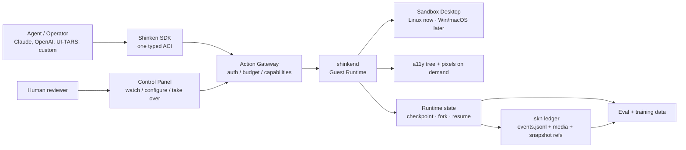
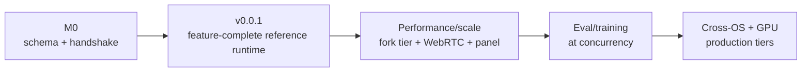

# Shinken

[](https://github.com/Meirtz/Shinken/actions/workflows/ci.yml)
[](LICENSE)

<p align="center">
  
</p>

> The open infrastructure stack for computer-use agents: real computers, one typed interface,
> scoped capabilities, checkpoint/fork/resume of live runtime state, replayable trajectories for
> audit, and eval on the same substrate.

Shinken is an AI-native, cross-platform **runtime + control plane + control panel** for
computer-use agents. It is meant to be the full CUA infrastructure layer: boot real desktops and
browsers, drive them through one Agent-Computer Interface (ACI), grant the sandbox capabilities
they need, stream and supervise sessions live, checkpoint/fork/resume that live runtime state,
record every run as a replay/training ledger, and run evals on the same substrate.

The ambition is deliberately broad. Shinken is not just a benchmark harness, a cloud browser, a
VNC desktop, or a model adapter. It is the foundation those pieces plug into: production agent
runtime, eval environment, trajectory recorder, permission boundary, and future cross-OS fleet
manager.

> **Status (2026-05-31) — early, honest.** The product scope is the full CUA stack above. What
> runs **today** is the first tested Linux/X11 slice:
> typed pointer/keyboard actions, pixel observation (screenshot + **real-time screencast** with
> idle-suppression + resolution downscale), **focused-window capture**, `.skn` recording, and a
> Python SDK — all under live CI. The rest of this README describes the **target design**:
> cross-platform, accessibility-tree observation, the capability/permission panel, replay playback,
> checkpoint/fork, the control plane, and WebRTC/GPU streaming are **designed but not yet built**,
> and the load-bearing a11y-coverage assumption is **not yet validated**. See
> **[`docs/engineering/status.md`](docs/engineering/status.md)** for the precise built-vs-designed map.
>
> **Next priority — runtime-state time-travel.** Shinken's headline differentiator is *instant
> snapshot / checkpoint / fork / resume* of live sandboxes (**D1/D5**) — for high-concurrency eval,
> best-of-N exploration, and counterfactual reruns. `.skn` **replay is the evidence ledger** those
> checkpoints reference (a checkpoint binds a substrate snapshot to a replay event offset), not the
> speed story. A reference implementation of these primitives on the Docker tier is the active
> v0.0.1 work — see [#206](https://github.com/Meirtz/Shinken/issues/206).

## Why "Shinken"?

Most computer-use sandboxes today are **mogitō**: training swords. They are useful for demos,
benchmarks, and learning the motions, but they are not built for real side effects, real
capabilities, real audit, or real scale.

**Shinken (真剣)** means a real sword. The point is not recklessness; it is discipline. A real
agent runtime must be sharp enough to do production work, and safe enough that every boundary
capability is scoped, recorded, replayable, and under operator control.

<p align="center">
  
</p>

That is Shinken's stance: **real desktops, real actions, real capabilities, real checkpoint/fork/resume,
and real replay to audit it all.**

<p align="center">
  
</p>

The product shape follows from that stance: keep the practice-friendly ergonomics, then add the
real-runtime edge that a complete CUA stack needs: sandbox entitlements, replayable runs,
auditable boundary crossings, eval artifacts, and eventually fleet-scale execution.



## What It Lets You Do

- **Drive real computers with one clean API.** Agents call typed actions like `click`,
  `type_text`, and `observe` through one Agent-Computer Interface (ACI), not ad hoc
  `pyautogui` strings. The same ACI is the model-facing contract for desktop apps, browsers,
  OS dialogs, and future mobile targets.
- **Start with screenshots, then add structure.** v0.0.1 must work through the universal GUI-agent
  loop: screenshot observation plus typed mouse/keyboard actions. Accessibility trees, DOM snapshots,
  element refs, Set-of-Marks, and region/zoom are the structured and visual upgrade paths for lower
  cost and more stable actions.
- **Grant real sandbox capabilities.** A Sandbox can be provisioned with network egress,
  credentials, GPU, persistence, privileged installs, clipboard, screenshots, or OS automation
  entitlements.
- **Move files and artifacts as first-class data.** Task fixtures, generated artifacts, logs,
  media, and replay resources need a Sandbox↔client transfer path with checksums, backpressure,
  and replay references.
- **Checkpoint, restore, fork, and resume runtime state.** Name a runnable checkpoint of a live
  sandbox, fork it into N replicas from one golden state, reset instantly, or resume a suspended
  session. This is the primitive behind instant reset, N-run eval replicas, best-of-N /
  counterfactual branches, and long-running or idle-suspended tasks.
- **Keep a replay ledger of every run.** The event stream is the audit log that runtime state
  references: actions, observations, permission decisions, verifier receipts, artifacts, and media
  references become a `.skn` bundle for debugging, eval evidence, and training data. A checkpoint
  binds a substrate snapshot to a replay event offset, so the ledger says *what happened* while the
  checkpoint says *where this can continue from*.
- **Run evals on the runtime, not beside it.** OSWorld-style tasks, browser tasks, mobile tasks,
  and custom enterprise tasks should all become verifier-backed runs over the same ACI and replay
  substrate.
- **Scale beyond one laptop.** The reference runtime grows into a control plane with warm pools,
  fork-from-snapshot reset, policy enforcement, WebRTC media, multi-tenant budgets, and cross-OS
  substrates.

## Why It Is Different

Most computer-use stacks still run a loop like this:

```text
screenshot -> model -> pixel click -> sleep -> screenshot -> throw trace away
```

Shinken is designed around a different loop:

```text
screenshot observation -> typed action -> sandbox capability -> verified result -> checkpointable state (referenced by replay ledger)
```

That difference is the product. v0.0.1 should implement these semantics at local/reference scale;
later milestones make the same semantics faster, denser, multi-tenant, and cross-substrate:

- **Works before instrumentation:** screenshots are universal, so the first GUI loop works even on
  canvas, Electron, games, and custom-rendered apps.
- **Lower bandwidth and token cost over time:** add a11y/DOM diffs and element refs when the UI
  exposes useful structure.
- **Auditable authority:** sandbox capabilities such as network egress, credentials, GPU,
  persistence, host mounts, and OS automation are explicit, scoped, revocable, and recorded.
- **Fast artifacts:** file transfer is a profiled data path, not JSON/base64 bolted onto control RPC.
- **Forkable trajectories:** the same run can be scrubbed, audited, branched, and exported.

## Client / Server Shape

The current implementation starts simple: the Python client talks directly to the Rust Guest
Runtime for the local/reference slice. The target architecture inserts the Control Plane as the
mandatory server-side boundary, without changing the ACI or replay semantics.


The rule of thumb: **clients request, the Control Plane authorizes and records, `shinkend` executes,
the guest OS changes, the Fleet Manager checkpoints/forks/resumes that state, and the `.skn` ledger
preserves the timeline it references.**

## How Agent-Native It Should Feel

The low-level SDK stays available for debugging and tests, but agents should not be hand-written as
`env.click(...)` scripts. A computer-use model emits a constrained action dialect; a Shinken adapter
parses and validates that output, normalizes coordinates, checks the Sandbox capability envelope,
and only then sends canonical ACI actions to `shinkend`.

```python
import shinken
from shinken.adapters import ShinkenXMLAdapter

adapter = ShinkenXMLAdapter()

with shinken.connect(record=True) as env:
    shot = env.screenshot()                     # universal GUI observation

    # The model returns a restricted action dialect, not arbitrary Python.
    model_output = """
    <actions>
      <click x="640" y="420" button="left"/>
      <type_text text="agent sandbox runtime"/>
      <key combo="enter"/>
    </actions>
    """

    for action in adapter.parse(model_output, observation=shot):
        env.act(action.verb, action.target, **action.args)

    env.save_replay("search-demo.skn")          # replay/debug/train later
```

The same adapter boundary can host XML-like tags, JSON/function-call outputs, Anthropic/OpenAI
computer-use grammars, UI-TARS normalized coordinates, or OSWorld `computer_13`. The invariant is
the same: **model dialect in, validated ACI typed actions out**.

Low-level calls such as `env.click(x=...)`, `env.type_text(...)`, and `env.key(...)` remain useful
for smoke tests, scripting, and replay debugging; they are not the primary agent interface.

Boundary-crossing capabilities should be just as explicit:

```python
with shinken.connect() as env:
    env.unlock("net.egress", scope="github.com")  # provisioned capability, recorded in replay
    env.run_task("open the project repo and file a bug")
```

And runtime state should be first-class — name a checkpoint, fork it, or resume it — with replay as
the ledger those operations reference:

```bash
shinken checkpoint search-demo --name golden     # name a runnable checkpoint of live state
shinken fork golden --replicas 5                  # fork N live replicas from one golden state
shinken resume golden                             # resume a suspended session

shinken replay search-demo.skn                    # scrub the audit ledger by action/observation seq
shinken branch search-demo.skn --at 42            # rerun a counterfactual from step 42
```

Those examples are the product target. v0.0.1 should make the semantics real locally/reference
scale; later milestones optimize the substrate, streaming, fork density, and multi-tenant control
plane. See [docs/engineering/v0.0.1-plan.md](docs/engineering/v0.0.1-plan.md).

## What Works Today

**v0.0.1 is underway:** schema scaffold, Rust `shinkend`, Python SDK/CLI, a Linux Docker image
skeleton, pointer/keyboard actions, screenshots, screencast/focused capture, an OSWorld shim, and a
minimal `.skn` recorder exist. The v0.0.1 backlog fills in the rest of the semantic surface:
agent-native dialect/adapters, a11y/CDP/element-ref reference paths, capability envelope and
permission events, artifact transfer, replay scrub/validation, deterministic task fixtures, and a
tiny verifier harness.

```bash
# 1) run the Guest Runtime
cargo run --manifest-path shinkend/Cargo.toml

# 2) install and use the Python SDK
cd sdk/python
pip install -e ".[dev]"
shinken connect
```

```python
import shinken

env = shinken.connect()
print(env.platform)
print(env.screen_size())
print(env.capabilities)
env.close()
```

Expected today: connect, print platform/RTT/screen/capabilities, run basic pointer/keyboard actions,
capture screenshots/focused windows/screencasts, and save a minimal `.skn` replay. Not expected yet:
provider adapters, a11y trees, element refs, file/artifact transfer, capability enforcement, eval,
real checkpoint/restore, or cloud fork.

## Roadmap



v0.0.1 is tracked under the
[v0.0.1 milestone](https://github.com/Meirtz/Shinken/milestone/1). The milestone is
feature-complete at local/reference scale: all core semantics should exist and be tested, even if
later releases make them fast, scalable, multi-tenant, and production-hardened.

## Repository Layout

```text
shinken/
├─ schema/        ACI and .skn JSON Schemas
├─ shinkend/      Rust Guest Runtime inside the Sandbox
├─ sdk/python/    Python SDK and CLI
├─ images/linux/  Local Linux Sandbox image
├─ docs/          Authoritative design docs and Phase-0 plan
├─ notes/         Working notes, open questions, and sources
└─ references/    Public prior-art provenance and re-clone notes
```

Start with:

- [User docs](docs/user/README.md) for runnable behavior and concepts.
- [Design canon](docs/design/README.md) for full scope, architecture, ADRs, and tradeoffs.
- [Engineering docs](docs/engineering/README.md) for v0.0.1 implementation, testing, and release
  gates.
- [Implementation status](docs/engineering/status.md) for what is actually built today.

> The name "Shinken" (真剣 / 神剣) means a real, live blade: sharp by default, safe by design.
