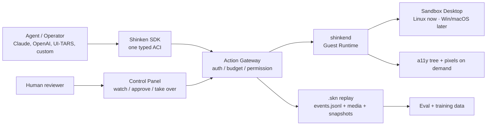
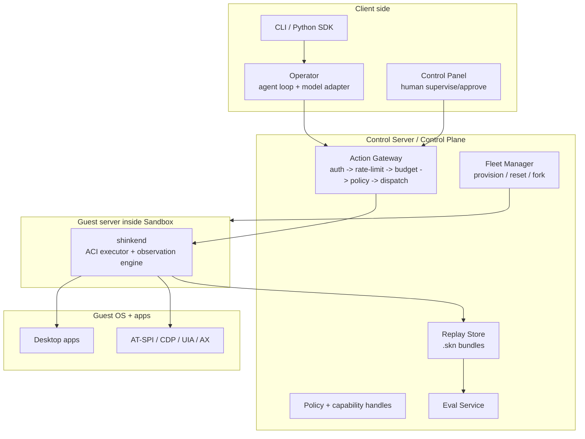
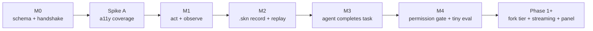

# Shinken

[](https://github.com/Meirtz/Shinken/actions/workflows/ci.yml)
[](LICENSE)

<p align="center">
  
</p>

> An **AI-native computer runtime**: give an agent a safe desktop, stream what it does,
> gate risky actions, and replay the whole run as data.

Shinken (真剣) is a cross-platform sandbox runtime, control plane, and control panel for
computer-use agents. It is the production-grade successor to research harnesses like
[OSWorld](https://github.com/xlang-ai/OSWorld): structured-first instead of screenshot-polling,
replayable instead of write-only, permission-gated instead of all-or-nothing, and built to serve
both production agent deployment and evaluation.

## Why "Shinken"?

Most computer-use sandboxes today are **mogitō**: training swords. They are useful for demos,
benchmarks, and learning the motions, but they are not built for real side effects, real
permissions, real audit, or real scale.

**Shinken (真剣)** means a real sword. The point is not recklessness; it is discipline. A real
agent runtime must be sharp enough to do production work, and safe enough that every dangerous edge
is gated, recorded, replayable, and under human control.

<p align="center">
  
</p>

That is Shinken's stance: **real desktops, real actions, real permissions, real replay.**



## What It Lets You Do

- **Drive a real desktop with a clean API.** Agents call typed actions like `click`,
  `type_text`, and `observe` through one Agent-Computer Interface (ACI), not ad hoc
  `pyautogui` strings.
- **Observe structure first.** The default observation is an accessibility/DOM tree diff with
  stable element refs; screenshots and video are escalation tiers, not the hot path.
- **Watch and approve live.** A human can see the structured stream, request pixels when needed,
  approve privileged capabilities, or take over the session.
- **Replay every run.** The event stream is the replay log: actions, observations, permission
  decisions, and media references become a `.skn` bundle for debugging, eval, and training data.
- **Scale beyond one laptop.** The local PoC grows into a control plane with warm pools,
  fork-from-snapshot reset, policy enforcement, WebRTC media, and cross-OS substrates.

## Why It Is Different

Most computer-use stacks still run a loop like this:

```text
screenshot -> model -> pixel click -> sleep -> screenshot -> throw trace away
```

Shinken is designed around a different loop:

```text
structured observation -> typed action -> permission gate -> verified result -> replay event
```

That difference is the product:

- **Lower bandwidth and token cost:** send a11y/DOM diffs by default; send pixels only when the UI
  is not structurally visible.
- **Stable actions:** click element refs when available, not only raw coordinates.
- **Auditable authority:** risky capabilities such as network egress, credentials, privileged
  installs, GPU, and persistence go through a permission panel.
- **Forkable trajectories:** the same run can be scrubbed, audited, branched, and exported.

## Client / Server Shape

M0 is intentionally simple: the Python client talks directly to the Rust Guest Runtime. The target
architecture inserts the Control Plane as the mandatory server-side boundary.



The rule of thumb: **clients request, the Control Plane authorizes and records, `shinkend` executes,
the guest OS changes, and `.skn` preserves the timeline.**

## How Simple It Should Feel

Today's M0 only supports connect/ping/query. The Phase-0 SDK target is a small blocking API:

```python
import shinken

with shinken.connect() as env:
    obs = env.observe()                         # structured tree by default
    search = obs.find(role="textbox", name="Search")
    env.click(search.ref)                       # stable element ref, not a magic pixel
    env.type_text("agent sandbox runtime")
    env.key("enter")

    run = env.save("search-demo.skn")           # replay/debug/train later
```

Risky work should be just as explicit:

```python
with shinken.connect() as env:
    env.unlock("net.egress", scope="github.com")  # prompts or uses policy
    env.run_task("open the project repo and file a bug")
```

And replay should become a first-class artifact:

```bash
shinken replay search-demo.skn                  # scrub by action/observation seq
shinken branch search-demo.skn --at 42          # rerun a counterfactual from step 42
```

Those examples are the product target. See [docs/10-phase0-plan.md](docs/10-phase0-plan.md) for the
milestones that make them real.

## What Works Today

**M0 is implemented:** schema scaffold, Rust `shinkend`, Python SDK/CLI, and a Linux Docker image
skeleton. M0 proves the ACI v0 handshake and basic query path. Actions, observations, replay,
permission gating, eval, and model adapters are the next Phase-0 milestones.

```bash
# 1) run the Guest Runtime
cargo run --manifest-path shinkend/Cargo.toml

# 2) install and use the Python SDK
cd sdk/python
pip install -e ".[dev]"
shinken connect
```

```python
import shinken

env = shinken.connect()
print(env.platform)
print(env.screen_size())
print(env.capabilities)
env.close()
```

Expected today: connect, print platform/RTT/screen/capabilities. Not expected yet: real clicks,
screenshots, a11y trees, `.skn` replay, or permission approvals.

## Roadmap



Phase 0 is tracked under the
[Phase 0 milestone](https://github.com/Meirtz/Shinken/milestone/1). The load-bearing gate is
**a11y coverage**: Shinken must measure whether real apps expose enough structure for the
structured-first thesis to hold.

## Repository Layout

```text
shinken/
├─ schema/        ACI and .skn JSON Schemas
├─ shinkend/      Rust Guest Runtime inside the Sandbox
├─ sdk/python/    Python SDK and CLI
├─ images/linux/  Local Linux Sandbox image
├─ docs/          Authoritative design docs and Phase-0 plan
├─ notes/         Working notes, open questions, and sources
└─ references/    Public prior-art provenance and re-clone notes
```

Start with [docs/README.md](docs/README.md) for the full design index, especially
[Architecture](docs/02-architecture.md), [Technical decisions](docs/05-tech-decisions.md), and the
[Phase-0 implementation plan](docs/10-phase0-plan.md).

> The name "Shinken" (真剣 / 神剣) means a real, live blade: sharp by default, safe by design.
