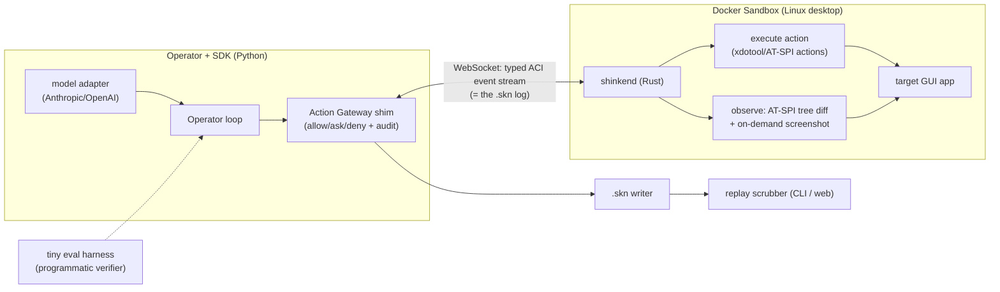
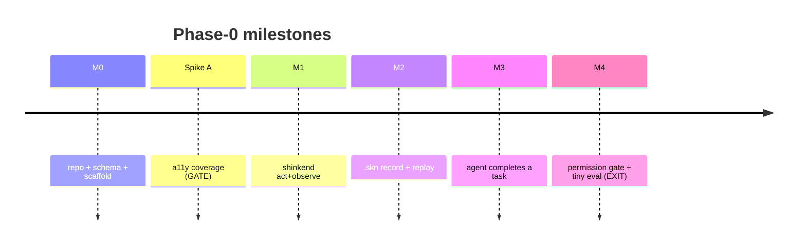

# 10 — Phase-0 Implementation Plan (local single-Sandbox PoC)

> Status: drafted · 2026-05-30 · Sibling docs: [00 Vision](00-vision.md) · [02 Architecture](02-architecture.md) · [05 ADRs (D1–D12)](05-tech-decisions.md) · [06 Roadmap](06-roadmap.md) · [Open questions](../notes/open-questions.md)

This is the concrete build plan for **Phase 0** from the [roadmap](06-roadmap.md): a **local,
single-Sandbox proof-of-concept on Linux** that proves the spine end-to-end — an agent driving a
real desktop app through the **ACI**, observed **structured-first**, recorded as a **`.skn`
replay**, with a **permission gate** in the loop — while empirically de-risking the one assumption
the whole thesis rests on (accessibility-tree coverage, D3). It deliberately builds the *thinnest
vertical slice* of [D1–D12](05-tech-decisions.md) and defers everything that doesn't serve that
proof. No cloud, no fork tier, no GPU, no Windows/macOS, no SFU, no Cedar engine yet.

---

## 1. Goal & exit criteria

**Goal:** one command starts a local Linux Sandbox; a Python script (or an off-the-shelf
Anthropic/OpenAI agent via an adapter) drives a real GUI app to complete a small multi-step task;
every action + observation + permission event is recorded to a `.skn` bundle that can be replayed
and scrubbed; and we have **first-party numbers** for a11y coverage and observation bandwidth.

**Phase-0 is "done" when all of these hold (exit criteria):**

| # | Exit criterion | Proves |
|---|----------------|--------|
| E1 | An agent completes a scripted ≥5-step task in a real Linux GUI app (e.g. a LibreOffice or file-manager task) entirely through the ACI, no direct host access. | The ACI + Guest Runtime spine works. |
| E2 | The session is recorded as a `.skn` v0 bundle and replays in a scrubber (CLI minimum, web stretch) with synchronized action + observation timeline. | Replay (D5) at v0. |
| E3 | Default observation is the **normalized a11y-tree diff**; pixels are fetched only on demand. Measured: per-step observation bytes (structured) and token estimate vs a screenshot baseline. | Structured-first (D3) + bandwidth thesis, with real data. |
| E4 | At least one action is **gated by a permission check** (allow/ask/deny) and the decision is a first-class `.skn` event. | Permission spine (D6) at v0. |
| E5 | **Spike A (a11y coverage)** has run against the target app set and produced a coverage + diff-bandwidth report meeting (or honestly failing) its threshold. | The load-bearing D3 assumption is measured, not assumed. |
| E6 | An off-the-shelf model drives the Sandbox unchanged via one adapter (Anthropic *or* OpenAI computer-use). | The adapter strategy (D2) works against a real provider. |

If **E5** fails (a11y coverage is too low on real apps), that is a *successful* Phase-0 outcome: it
tells us the structured-first default must lean harder on SoM/OmniParser sooner — see [Spike A](#5-spike-a-a11y-coverage-the-gate).

**Explicit non-goals for Phase-0** (deferred to later phases, per [roadmap](06-roadmap.md)):
cloud/control-plane, warm pools, CoW fork tier (Phase 1), WebRTC/SFU streaming + NVENC (Phase 1),
the full Cedar+ocap+OS-enforcement permission stack (Phase 1), Windows/macOS guests (Phase 3), GPU
tier (Phase 4), Android, multi-viewer, multi-tenant. Phase-0 reset = **recreate the container**
(fork comes in Phase 1).

---

## 2. Tech-stack decision (Phase-0)

These are the implementation choices Phase-0 commits to; each is justified and reversible, and the
load-bearing ones should graduate to ADRs (proposed **D13 Guest-Runtime language**, **D14 schema &
transport**) once validated.

| Concern | Phase-0 choice | Rationale | Phase-1+ evolution |
|---|---|---|---|
| **Guest Runtime `shinkend`** | **Rust** (tokio) | Single static (musl) binary trivially dropped into any guest image; low overhead; strong async; good a11y FFI (`atspi`/`zbus`); precedent in the strongest prior art (codex-rs, cua-driver). | Add UIA (Windows) / AX (macOS) backends behind the same handler-factory (D10). |
| **ACI schema (source of truth)** | **JSON Schema** for wire messages + `.skn` events, in `schema/` | Human-debuggable, fast to iterate, validates the `.skn` log directly; one source generates types. | Migrate hot path to **protobuf + gRPC/bidi** when perf demands (D8); keep JSON `.skn`. |
| **Transport (host↔guest)** | **WebSocket** carrying the typed event stream | Browser-native for the viewer, simplest cross-language, the event stream *is* the `.skn` log (D5). | **virtio-vsock** + WebRTC dual-channel (D4) in Phase 1. |
| **SDK / Operator** | **Python** (`sdk/python/`) + thin CLI | The agent/model ecosystem is Python-first; adapters for Anthropic/OpenAI computer-use are easiest here (D2). | Generate **TypeScript** SDK from the same schema (D8); web Operator. |
| **Substrate (Sandbox)** | **Docker** container: Xvfb + a lightweight WM (Openbox/XFCE) + target apps + `shinkend` | Simplest local isolated Linux desktop; mirrors the proven E2B / Anthropic-demo image pattern; runs on the dev machine via Docker. | OSS **`kubernetes-sigs/agent-sandbox`** CRD + Firecracker/QEMU-microvm fork tier (D1) in Phase 1. |
| **Observation** | **AT-SPI** a11y tree → normalized `Element` diff (D3 rung 0) + on-demand screenshot (rung 2/3) | Validates the structured-first default on Linux where AT-SPI is richest. | SoM/OmniParser (rung 1), UIA/AX, CDP for browsers. |
| **Permission** | Minimal: capability flags + allow/ask/deny check at the Action Gateway shim, decisions logged to `.skn` | Proves the *gate + audit* spine without the full engine. | Cedar decision + ocap caretaker + OS enforcement (D6) in Phase 1. |
| **Replay viewer** | CLI scrubber (required) + minimal static web viewer (stretch) | Prove `.skn` is replayable; full Control-Panel UX later. | rrweb-player-style web panel, branching (D5) in Phase 1. |

> Dev environment note: the primary dev machine is macOS, so the Linux Sandbox runs in Docker
> (Docker Desktop / colima). The macOS-AX portion of **Spike A** can run natively on the host to get
> an early cross-OS coverage data point.

---

## 3. Phase-0 architecture slice

The thinnest vertical slice of [02-architecture.md](02-architecture.md). Built (solid) vs stubbed/
deferred (dashed):



What's intentionally **absent** in Phase-0: Fleet Manager / warm pools / fork, Cedar engine, OS
sandbox enforcement, WebRTC media plane + NVENC, SFU, SoM grounding, cross-OS guests, GPU.

---

## 4. Work breakdown (milestones)

Sized in milestones, not calendar dates (rough estimate ~6–8 focused weeks for one engineer).
Each milestone has a **deliverable**, an **acceptance test**, and the **decision it realizes**.



### M0 — Scaffold, schema, stack (foundation)
- **Build:** monorepo code dirs (see [§7](#7-proposed-code-layout)); the **ACI v0 JSON Schema**
  (`schema/aci.schema.json`) and **`.skn` v0 schema** (`schema/skn.schema.json`); generated Python
  types; a `shinkend` skeleton that opens the WebSocket, handshakes (capability negotiation, D2 §2),
  and answers `ping`/`get_screen_size`/`platform`.
- **Acceptance:** `python -m shinken.cli connect` handshakes with a running container `shinkend`;
  schema validates a sample event round-trip.
- **Realizes:** D2 (schema + handshake), D8 (one IDL → SDK).

### Spike A — a11y coverage (THE GATE — see [§5](#5-spike-a-a11y-coverage-the-gate))
- Run before committing to the structured-first default in M1.

### M1 — `shinkend` acts and observes
- **Build:** ACI v0 **action verbs** (subset of D2): `click`, `double_click`, `right_click`,
  `type_text`, `key`, `scroll`, `move`, `screenshot`, `wait` — `target = oneof{point_px |
  element_ref}`. Action execution via AT-SPI actions where possible, else `xdotool`/`xte` at
  pixel coords. **Observation v0:** capture the AT-SPI tree, normalize to the `Element` schema
  (D3), emit a **full tree on connect then diffs** on change; on-demand `screenshot` returns a PNG.
- **Acceptance:** a Python script clicks a specific button *by element ref* and types into a field
  in a real app (e.g. gedit/LibreOffice), and receives a tree diff reflecting the change; observation
  bytes/step logged.
- **Realizes:** D2 (actions), D3 (structured-first observation, element-ref acting).

### M2 — `.skn` record + replay
- **Build:** the **`.skn` v0 writer** — a directory/zip with `manifest.json`, append-only
  `events.jsonl` (envelope `kind ∈ {action, observation, decision, permission, marker, meta}`,
  monotonic `seq` + wall anchor, `action_id` pairing action→observation per D5), and a
  content-addressed `media/` for screenshots. A **CLI scrubber** (`shinken replay <bundle>`:
  step/seek, print the action + observation diff at each step) and a **minimal static web viewer**
  (stretch: timeline + screenshot pane).
- **Acceptance:** record an M1 session; replay re-renders the action timeline + observation states;
  `seq`/`action_id` integrity validated; bundle re-opens after a crash mid-write (append-only).
- **Realizes:** D5 (`.skn`, event-sourced, the event stream *is* the log).

### M3 — an agent completes a task
- **Build:** the **Operator loop** (provider-agnostic) + **one model adapter** (Anthropic
  `computer_2025xxxx` *or* OpenAI `computer_call`) translating the provider's action/observation
  format to/from the ACI (D2 adapters). A small **task fixture** (deterministic start state in the
  image; a clear goal).
- **Acceptance:** the off-the-shelf model, unmodified, drives the Sandbox to complete the task;
  the whole run is a single `.skn` bundle.
- **Realizes:** D2 (adapters), D8 (Operator contract), and E1/E6.

### M4 — permission gate + tiny eval (EXIT)
- **Build:** the **Action Gateway shim** — a deny/ask/allow check in front of dispatch with a small
  capability map (e.g. `net.egress`, `fs.scope`, `install.privileged`); risky verbs trigger `ask`
  (CLI prompt in Phase-0), and every decision is a `permission` `.skn` event. A **tiny eval
  harness** (`eval/`): run the M3 task, then a **programmatic verifier** (inspect real app/file
  state) emits a 0/1 reward; run **N replicas** (sequential in Phase-0; fork in Phase-1) and report
  pass-rate.
- **Acceptance:** a task with a risky step pauses for approval and records the decision; the eval
  prints pass/fail with the verifier's evidence; the run replays with permission markers on the
  timeline.
- **Realizes:** D6 (gate + audit, v0), D7 (verifier-first eval, v0). Hits E2/E3/E4.

---

## 5. Spike A — a11y coverage (the gate)

The structured-first thesis (D3) — and the ~6× token and ~150× bandwidth claims behind it
([09-economics](09-economics-and-build-vs-buy.md)) — assume real apps expose usable accessibility
trees cheaply. [open-questions](../notes/open-questions.md) flags this as the **load-bearing
unverified assumption.** Spike A measures it before we build on it.

- **Method:** in the Linux Sandbox, for each target app, dump the AT-SPI tree and compute: (a)
  **coverage** = fraction of visibly-interactable elements that appear as actionable a11y nodes with
  a usable name + bbox; (b) **diff bandwidth** = bytes/sec of the normalized tree diff during a
  scripted interaction; (c) **token estimate** of the serialized tree vs a screenshot. Repeat the
  macOS-AX variant natively on the host for a cross-OS data point.
- **Target app set:** a browser (Chromium via CDP as the a11y reference), a native GTK/Qt app
  (LibreOffice / a file manager), an Electron app, a canvas/WebGL page, and one game/custom-rendered
  surface (expected worst case).
- **Success threshold (proposed):** ≥ ~85% coverage on standard GTK/Qt/browser apps with tree-diff
  ≤ ~50 kbps; canvas/Electron/games are *expected* to be low → that quantifies exactly when to fall
  back to SoM/OmniParser (rung 1).
- **Output:** `spikes/a11y-coverage/REPORT.md` with the numbers (first-party, replacing the
  vendor-published anchors in the canon), feeding [09-economics](09-economics-and-build-vs-buy.md)
  and a possible D3 amendment.

**Spikes B & C** (scheduled at the Phase-0 → Phase-1 boundary, since they need infra Phase-0 omits):
**B — CoW-fork density** (Firecracker/QEMU snapshot-fork: real concurrent-guests-per-host bounded by
private RSS; target validates D1) and **C — dual-channel WebRTC latency** (structured data channel +
on-demand NVENC video; target glass-to-glass < ~150 ms; validates D4). Listed here for continuity;
specced in the Phase-1 plan.

---

## 6. Interface contracts (v0)

Frozen-enough surfaces so milestones can proceed in parallel. Full schemas live in `schema/`.

- **ACI action (v0):** `{ "v": 0, "verb": "<click|double_click|right_click|type_text|key|scroll|move|screenshot|wait>", "target"?: { "kind": "point_px"|"element_ref", ... }, "args"?: {...}, "call_id": "<uuid>" }`. Verbs are a strict subset of D2; `element_ref` resolves server-side to a centroid.
- **Observation (v0):** `{ "obs_id", "ts", "cause": "<action_id|push>", "display": {w,h,dpr}, "tree": "full" | "diff", "elements"?: [Element], "delta"?: {added,removed,changed}, "image"?: {ref, w, h} }`, `Element = {ref, role, name, value?, states[], bbox[x,y,w,h]}` (D3).
- **`.skn` event (v0):** `{ "seq": int, "dt": float, "kind": "<action|observation|decision|permission|marker|meta>", "src": "<subtype>", "action_id"?: "...", "payload": {...} }`; bundle = `manifest.json` + `events.jsonl` + `media/<sha256>` (D5).
- **Permission decision (v0):** `{ "capability": "<class>", "request": {...}, "decision": "allow|ask|deny", "by": "policy|human", "resolved": "...", "ts" }` — emitted as a `permission` `.skn` event (D6).
- **Operator/adapter contract:** `observe() -> Observation`, `act(Action) -> ack`, `supported() -> {verbs, targets, observation_types}` — the provider-agnostic seam (D8).

---

## 7. Proposed code layout

Added alongside the existing tracked tree; created when M0 starts.

```
shinken/
├── schema/            # ACI + .skn JSON Schemas (source of truth) — M0
├── shinkend/          # Rust guest runtime (act + observe + WS) — M0/M1
├── sdk/python/        # Python SDK, Operator loop, model adapters, CLI — M0/M3
├── panel/             # minimal web replay viewer (TS) — M2 stretch
├── images/linux/      # Dockerfile: Xvfb + WM + target apps + shinkend — M0
├── spikes/
│   ├── a11y-coverage/ # Spike A tool + REPORT.md — before M1
│   ├── cow-fork/      # Spike B (Phase-1 boundary)
│   └── webrtc-latency/# Spike C (Phase-1 boundary)
├── eval/              # tiny eval harness + task fixtures + verifiers — M4
├── docs/  notes/      # (existing) design corpus
└── references/ scratch/ internal/   # (existing) git-ignored
```

A future `CONTRIBUTING.md` + CI (lint/test, schema-validation, `shinkend` build) land with M0.

---

## 8. Risks & dependencies

| Risk | Likelihood | Mitigation |
|---|---|---|
| **a11y coverage too low on real apps** (Spike A fails) | Medium | That's a *result*, not a blocker — pivot the default to SoM/OmniParser earlier; Phase-0 still proves the spine with screenshots+pixel targets. |
| Docker-on-macOS desktop quirks (Xvfb/display, perf) | Medium | Standard Xvfb+WM image (proven by E2B/Anthropic demo); run the Linux container; keep host-AX as a separate native data point. |
| AT-SPI flakiness / apps not exposing the tree at runtime | Medium | Per-app readiness probes (no fixed sleeps, D7); fall back to pixel target; record failures as observations. |
| Provider computer-use API drift (Anthropic/OpenAI) | Low | Version-pin adapters (D2); one provider is enough for E6. |
| Scope creep into Phase-1 features | Medium | The non-goals list is binding; defer fork/Cedar/WebRTC. |

**External dependencies (all public):** Docker; an Xvfb-based Linux desktop image; Rust toolchain;
Python 3.11+; one provider API key (Anthropic or OpenAI) for M3; Chromium (a11y reference for Spike
A). No proprietary or internal dependencies.

---

## 9. Definition of done & handoff to Phase 1

Phase-0 is complete when **E1–E6** ([§1](#1-goal--exit-criteria)) pass and `spikes/a11y-coverage/
REPORT.md` exists. Outputs that feed Phase 1: the validated **ACI v0 + `.skn` v0** schemas (harden
to protobuf/gRPC + virtio-vsock), the first-party **a11y/bandwidth numbers** (replace canon §7
vendor anchors; possibly amend D3), and a working **Sandbox image + Operator** to graft the
**fork tier (Spike B)**, **dual-channel streaming (Spike C)**, and the **Cedar permission engine**
onto. See [06-roadmap.md](06-roadmap.md) for Phase 1.
