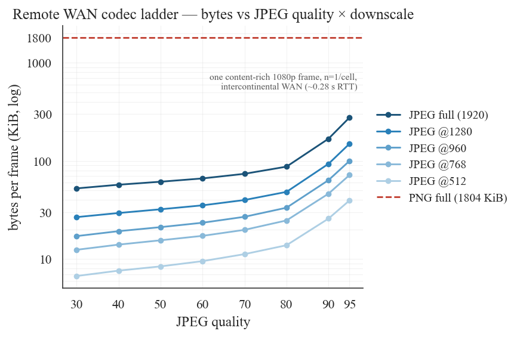
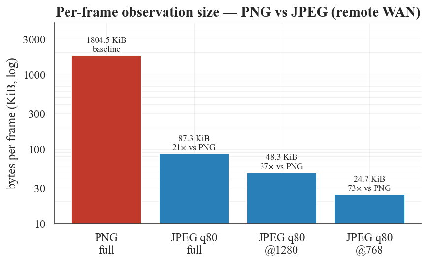
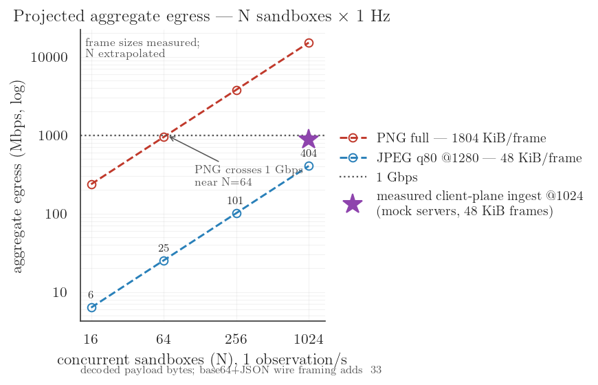
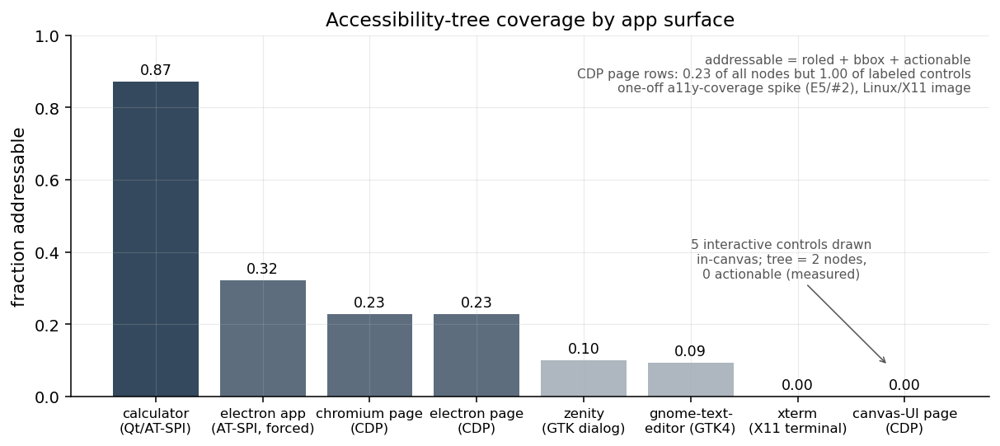

# Shinken benchmarks — first-party measurements

Every number in this report is first-party (this repo's runtime + SDK). Each table is labeled
with one of three **evidence classes**, so a reader always knows what kind of claim they are
looking at:

- **[local — rerunnable]** measured by the tracked suites in [`benchmarks/`](../../benchmarks)
  on a local Docker sandbox; raw datapoints in `benchmarks/results/*.json`; rerun with
  `make benchmarks`. Methodology + caveats: [engineering/benchmarks.md](../engineering/benchmarks.md).
- **[remote WAN — one-off]** measured once against a generic remote Linux sandbox over an
  intercontinental WAN (~0.28 s RTT; substrate not identified — vendor-neutral). The raw data is
  tracked (`benchmarks/results/remote/*.csv`) but the driving harness is not published, so these
  tables are auditable, not rerunnable. Single-shot: **n=1 per cell**, no variance available.
- **[projection]** arithmetic from measured inputs, never presented as a measurement.

Figures live in [`docs/assets/bench/`](../assets/bench) and regenerate from tracked data only:
`python benchmarks/replot.py && python benchmarks/plot_remote.py` (no Docker needed).

| artifact | class | what it holds |
|---|---|---|
| `benchmarks/results/*.json` | local | 13 suites (16 tracked result JSONs), ~102k individual datapoints, each carrying the host/image fingerprint of its run |
| `benchmarks/results/remote/codec_ladder.csv` | remote WAN | 45 cells: format × quality × downscale, one content-rich 1080p frame |
| `benchmarks/results/remote/fanout_remote.csv` | remote WAN | end-to-end fan-out envelope, N = 4/8/16 real remote sandboxes |
| `spikes/a11y-coverage/evidence.json` | local spike | accessibility-tree coverage by app surface (E5) |
| `benchmarks/results/coverage.json` | local | line coverage per module, Rust + Python (§6b) — repro: [testing.md](../engineering/testing.md) |
| `benchmarks/results/baseline_cua.json` | local | head-to-head vs trycua/cua's shipped local paths (§7) — repro: `benchmarks/bench_baseline_cua.py` |

---

## 1. Observation bandwidth

### 1a. Codec ladder, local — the honest lower bound `[local — rerunnable]`

`format` (PNG/JPEG) × quality {10…95} × `max_long_edge` {1280, 1024, 768, 512} × 5 reps ×
three content scenarios = 660 datapoints (S1, `bench_codec_ladder.py`). Condensed (mean KiB):

| scenario | PNG @1280 | JPEG q80 | JPEG q50 | JPEG q50 @512 |
|---|---:|---:|---:|---:|
| dense text (~95% coverage) | 747 | 553 (1.4×) | 339 (2.2×) | 61 (**12.3×**) |
| sparse desktop (~15% coverage) | 65 | 86 (**PNG wins**) | 64 (1.0×) | 11 (5.9×) |
| **photo** (procedural natural image, 100%) | 2258 | 117 (**19.3×**) | 41 (54×) | 9 (**251×**) |


The codec is a **content-dependent lever, not a constant multiplier**: on flat/sparse UI, PNG's
lossless run-length encoding already wins; on dense text JPEG only pays below ~q50; JPEG q95 on
text is *larger* than lossless PNG. This is why PNG is the default and JPEG/downscale are
explicit per-action knobs. Downscale is the strongest single lever on every content type.

### 1b. Codec ladder, remote — the content-rich upper bound `[remote WAN — one-off]`

One live 1920×1080 content-rich browser-desktop frame, 45 single-shot cells
(`results/remote/codec_ladder.csv` — the table below is generated from that CSV):

| codec | KiB | × vs PNG | encode+transfer (s) |
|---|---:|---:|---:|
| PNG (lossless) | 1804.5 | 1.0× | 0.89 |
| JPEG q95 | 276.7 | 6.5× | 0.27 |
| JPEG q80 | 87.3 | **20.7×** | 0.24 |
| JPEG q50 | 61.3 | 29.4× | 0.23 |

JPEG q80, by downscale (longer edge): 1280 → **48.3 KiB (37.4×)**, 960 → 33.3 (54.2×),
768 → 24.7 (**73.1×**), 512 → **13.8 (130.8×)**.



On this frame JPEG q80 is both ~21× smaller and ~3.8× faster end-to-end than PNG (PNG's deflate
dominates its 0.89 s). Taken with §1a: **the JPEG lever spans ~1–21× by content (PNG can win),
and stacking downscale-to-model-input-resolution reaches ~131× vs full-res PNG on content-rich
frames.** Single-shot caveat applies to every cell.



**Local rerunnable confirmation — procedural photo scenario** `[local — rerunnable]`

The ladder above is a one-off remote measurement of a content-rich browser desktop. The local
codec-ladder suite ([`benchmarks/bench_codec_ladder.py`](../../benchmarks/bench_codec_ladder.py))
reproduces its photographic operating point from this repo alone: a **procedurally generated
natural-image frame** (multi-octave noise + gradients + sensor-like grain, byte-identical from
a fixed seed — no binary asset, no photo licensing) painted across 100% of the 1280×800 local
sandbox screen, with the paint verified by screenshot before measuring:

| codec (`photo` scenario, 1280×800 local) | KiB | × vs PNG |
|---|---|---|
| PNG (lossless) | 2258.3 | 1.0× |
| JPEG q80 | 116.7 | **19.3×** |
| JPEG q50 | 41.5 | 54.4× |
| JPEG q50 @512 | 9.0 | 251.0× |

JPEG q80's **19.3×** on the local procedural photo confirms the remote **20.7×** as a property
of natural-image content, not of one particular desktop — and JPEG is again ~2.5× faster than
PNG end-to-end (23.6 → 9.4 ms loopback p50). Full grid (× quality × downscale × 5 reps, plus
two text-content scenarios where PNG wins instead) lands in
[`benchmarks/results/codec_ladder.json`](../../benchmarks/results/codec_ladder.json); the
narrative read is [`../engineering/benchmarks.md`](../engineering/benchmarks.md) §2.

### 1c. Lossless dirty-tile delta — the robust stream win `[local — rerunnable]`

For a *stream*, `shinkend` sends only changed 64-px tiles + periodic keyframes (B2). Typing into
a terminal at ~12.5 chars/s, fps=10, 80 frames/mode, 324 frame-level datapoints (S2):

| mode (typing) | mean KiB/frame | p50 KiB/frame | vs full-PNG | lossless |
|---|---:|---:|---:|---|
| full-PNG | 27.4 | 27.4 | 1.0× | ✓ |
| **delta-PNG** | **2.43** | **1.07** | **11.3×** | ✓ |
| delta-JPEG q80 | 3.55 | 1.87 | 7.7× | ✗ |

Lossless delta-PNG **beats lossy JPEG** on text/UI content, and an idle window delivers exactly
one keyframe then zero bytes — parked sandboxes cost ~nothing to watch.


---

## 2. Concurrency — the measured ladder to 1024

The "manage 1024 sandboxes" question splits into a guest-resource half (how many sandboxes a
host can *run*) and a client-plane half (how many live sessions one process can *drive*). Each
rung below is measured; only the egress chart at the end is a projection, and is labeled as one.

### 2a. Real sandboxes, one process — N ≤ 128 `[local — rerunnable]`

S5 (`bench_fanout.py`): N ∈ {1…64} real Docker sandboxes, all sync sessions multiplexed on one
`SharedLoop`, 10 rounds of {observe JPEG q80 @1024 + click} per tier — 1,347 datapoints:

| N | observe round wall p50 | per-sandbox observe p50 | click round wall p50 | boot wall (8 workers) |
|---:|---:|---:|---:|---:|
| 1 | 7.6 ms | 7.6 ms | 0.7 ms | 0.20 s |
| 16 | 19.7 ms | 14.6 ms | 3.6 ms | 0.75 s |
| 64 | 69.4 ms | 56.9 ms | 9.3 ms | 2.98 s |
| **128** | **141.6 ms** | 120.2 ms | 24.8 ms | **7.26 s** |

128/128 replicas materialized with zero boot infra-failures (255 boots in the run); guest RSS
steady at ~40 MiB/sandbox; per-replica boot ~57 ms amortized at N=128.

One process drives **128 real desktops at ~900 observations/s aggregate on 2 OS threads**
(main + one `SharedLoop`); latency degrades gracefully as 128 Xvfb guests contend for 14
cores. At ~40 MiB/sandbox the binding constraint above N≈128 on this host is guest RAM in the
Docker VM — exactly the boundary the client-plane rung isolates next.


### 2b. Client plane to N=1024, realistic payloads `[local — rerunnable]`

S6 (`bench_client_scale.py`): one client process, N ∈ {16, 64, 256, **1024**} concurrent
sessions (`aconnect` + `asyncio.gather`, one event loop, `ping_jitter` engaged at N≥256),
against **protocol-faithful synthetic ACI peers in separate processes** — real handshake,
real loopback WebSockets, the real SDK; only the frame payloads are synthetic. Frame payloads are synthetic bytes sized to three measured operating
points (13 / 48 / 87 KiB ≈ JPEG q50@512 / q80@1024 / q80@1080p). 88,928 measured observations:

| N | payload | observe p50 / p99 | round wall p50 | aggregate ingest | RSS | threads |
|---:|---|---:|---:|---:|---:|---:|
| 256 | 48 KiB | 130 / 255 ms | 263 ms | 366 Mbps | 353 MiB | 1 |
| 1024 | 13 KiB | 148 / 177 ms | 182 ms | 609 Mbps | 687 MiB | 1 |
| 1024 | 48 KiB | 246 / 412 ms | 374 ms | **997 Mbps** | 1.2 GiB | 1 |
| 1024 | 87 KiB | 395 / 697 ms | 685 ms | 1,015 Mbps | 1.6 GiB | 1 |

**Sustained** (not a burst): 20.4 s of back-to-back rounds at N=1024 × 48 KiB —
**2,356 frames/s ≈ 884 Mbps of decoded frames through one event-loop thread at 0.99 CPU
cores**, observe p99 476 ms, 47 consecutive rounds. The client plane saturates at ~1 Gbps
decoded ingest per core on this host; it is not the scaling bottleneck.

Thread-model contrast, same synthetic peers: the sync facade spends **one OS thread per session**
(N=256 → 256 threads; 1024 was deliberately not run — that thread model is what this design
retires), while `SharedLoop` holds 1024 sync sessions and the async core holds 1024 concurrent
sessions on **one** thread each.


### 2c. Real remote sandboxes over WAN — N ≤ 16 `[remote WAN — one-off]`

One process driving N real remote sandboxes (boot → inject `shinkend` → ws proxy → SDK),
JPEG q80 @1280 observe + click per round (`results/remote/fanout_remote.csv`):

| N | round wall (s) | observe p95 (s) | KiB/sandbox |
|---:|---:|---:|---:|
| 4 | 0.43 | 0.29 | 48.2 |
| 8 | 0.42 | 0.30 | 48.2 |
| 16 | 0.51 | 0.38 | 48.2 |

Round wall stays flat 4→16: WAN-RTT-bound, not contended. Real N>16 was gated by substrate
cost/quota, not the client — which is what §2a/§2b establish independently.

### 2d. Aggregate egress at 1024 `[projection]`

If N sandboxes each emit one 48.3 KiB JPEG q80 @1280 frame per second: **~405 Mbps at
N=1024** — a datacenter NIC. The same workload in full-res PNG (1804.5 KiB) projects to
**~15 Gbps**, infeasible anywhere. These are decoded payload bytes; base64+JSON wire framing
adds ~33% until binary frames land. The chart marks the one *measured* point at N=1024 — the
§2b sustained client-plane ingest — alongside the projected curves. For fleets of **forked
replicas** there is a measured lever beyond the codec: content-negotiated observation dedup
collapses the N near-identical streams to ~one (§3 — 15.2× measured over a 16-replica
fleet's observe rounds, ~725× at steady state).



### 2d. Step pipelining — the RTT lever for WAN rollouts


Where 2b's fan-out hides the WAN RTT *across* sandboxes, `Sandbox.step()` removes it *within*
one sandbox's step: a k-action step + observation is k+1 serial round-trips through the plain
facade but ~1 round-trip pipelined (all k+1 calls sent before any reply is awaited — no
protocol change, and honest per-action failure rows since actions on the wire execute
regardless). Measured against one real sandbox behind a delay proxy
(`benchmarks/bench_step_pipeline.py`, N=30/cell): at **150 ms** WAN RTT a 5-action+observe
step falls from **~0.94 s to ~0.17 s** of runtime overhead (5.7×, vs the 6× bound) — per
sandbox that is ~1.1 → ~6.1 steps/s, so an RL rollout collector at intercontinental distance
pays roughly **one RTT per step instead of six**, and the per-step runtime tax stops scaling
with how many actions the policy emits. Pipelined step wall is ~RTT + 15–20 ms regardless of
k ∈ {3, 5, 8}. Full grid: [engineering/benchmarks.md §11](../engineering/benchmarks.md).

---

## 3. Runtime state — checkpoint / fork / resume `[local — rerunnable]`

The differentiating loop — reach a state once, checkpoint it, mint N live replicas — measured
on the Docker disk tier (S4, `bench_fork.py`), with **every replica verified to inherit the
golden state** (a timing row only counts if the fork was real). Post-readiness-fix numbers (S9, push-based
readiness — see the boot waterfall below; the pre-fix 8.57 s fork p50 is preserved in the
tracked baseline):

| leg | p50 | n |
|---|---:|---:|
| cold boot → usable (create + connect + first obs) | **0.196 s** | 16 |
| checkpoint (`docker commit`, sandbox stays live) | **0.57 s** | 16 |
| fork → usable, classic (boot from the committed image) | **0.70 s** | 62 |
| fork → usable, **warm-pool graft** (S4b, replica available) | **0.100 s** | 32 |

| classic fan-out from ONE checkpoint | wall-clock | wall / replica | verified |
|---:|---:|---:|---|
| N=1 | 0.43 s | 0.43 s | 1/1 |
| N=8 | 1.24 s | 0.155 s | 8/8 |
| N=16 | 2.07 s | **0.129 s** | 16/16 |

Checkpointing a live sandbox is sub-second and non-disruptive. A classic fork is ~0.7 s
(committed-layer instantiation + desktop bring-up — readiness theater no longer hides it),
and the opt-in **warm pool** (pre-booted base containers + the checkpoint's `docker diff`
delta grafted in) brings fork→usable to **~0.1 s** while staying files-only — the same state
tier as `docker commit`, with bursts beyond the pool degrading gracefully to the classic
path (recorded per replica). This is the shape `eval.run_eval_forked` exploits
(golden → fork-N → score). The designed CRIU/CoW fast tiers (D5, not built) add memory/process
state, which no disk-tier mechanism here captures.

**Memory-tier spike (CRIU) — POSITIVE** `[local spike]`
([`spikes/criu-memory-tier/`](../../spikes/criu-memory-tier), rerunnable `run.sh`): the full
desktop process tree (Xvfb + openbox + xterm + `shinkend`, X11 sockets + live TCP listener)
**dumps in ~60 ms (~34 MB) and restores into a fresh container in ~40 ms** on Docker Desktop
arm64 (CRIU 3.17.1, kernel 6.12-linuxkit); n=12 fork-shaped reps, donor kept running
(`--leave-running` = true fork), and a mid-boot dump finished booting after restore
(checkpoint-anywhere). Its measured 300 ms end-to-end fork was taken against the pre-S9
readiness path; with S9 the disk tier itself reaches ~0.7 s / ~0.1 s pooled, so the memory
tier's edge is **what it carries** — live process/memory state (open apps, mid-task
processes), which no files-only mechanism captures — at a ~40–50 ms restore cost. Caveats in
the spike report: privileged-container rig (latency evidence, not an isolation posture); no
SOFT_DIRTY/USERFAULTFD on this kernel.

**Fleet-level observation dedup (S10, `bench_fork_dedup.py`)** `[local — rerunnable]` — the
observation-side payoff of owning fork: N replicas minted from one checkpoint render
near-identical screens *by construction*, so the ACI's content-negotiated screenshot
(`if_none_match` against a runtime `frame_hash` computed over raw pixels — codec-independent)
plus ONE shared `shinken.FrameCache` across the fleet's sessions lets the whole fleet pay for
each distinct screen once: every other observe is answered by a ~120-byte `not_modified`.
Measured over fleets of 4/8/16 with fleet pixel-identity verified per run (4/4, 7/8, 16/16):
**15.2× wire bytes cut** across all dedup rounds (14.4 MiB → 0.94 MiB, hit rate 93.5%),
**~725× at steady state** (N=16: 1,371 KiB → 1.9 KiB per observe-all round), and an honest
divergence curve — when 2 replicas type different text the hit rate dips to (N−2)/N for one
round, then each diverged replica re-converges against its own new content. Old runtimes and
clients are unaffected (capability-negotiated). No general-purpose sandbox API can offer this:
it works because fork makes the replicas' pixels identical, not approximately similar.


**Boot waterfall (S9, `bench_boot_waterfall.py`)** — where the old 8 s went: shinkend used to
be exec'd behind shell poll loops (listener up at ~5.4 s) and the SDK polled readiness at
200 ms with a full-PNG pull + pure-Python decode + `docker stats` per poll. Now shinkend
listens within ~130 ms of `docker run`, answers a guest-side `ready` query from sampled root
pixels in microseconds, and `provider.create()` returns at **~0.17 s p50** (was 7.7 s) —
measured before/after on the same host, both runs tracked.


---

## 4. Accessibility-tree coverage (spike E5) `[local spike]`

What fraction of each app surface is *addressable* (roled + on-screen bbox + actionable) via
the OS accessibility tree — the load-bearing assumption behind a structured-default fast path:

| surface | tree | pct addressable |
|---|---|---|
| Qt calculator | AT-SPI | **0.87** |
| Electron app (renderer, `--force-renderer-accessibility`) | AT-SPI | 0.32 |
| chromium page | CDP | 0.23 of all nodes — but **1.00 of labeled controls** resolved |
| Electron page | CDP | 0.23 of all nodes — same shape as chromium, all labeled controls resolved |
| zenity / gnome-text-editor (GTK) | AT-SPI | 0.10 / 0.09 |
| xterm | AT-SPI | 0.00 (no tree) |
| canvas-UI page (5 controls drawn in one `<canvas>`) | CDP | **0.00 — measured** (tree = 2 inert nodes) |
| games / custom-rendered (non-browser) | — | unmeasured (canvas row is the measured proxy) |

Tree-diff bandwidth while typing: diff **2.0 KiB** vs full tree 10.4 KiB vs screenshot
76.5 KiB. The canvas **blind-spot probe** quantifies the other end: clicking a canvas-drawn
button repaints the screen (PNG hash changes) while the structured diff reports **0 changed
nodes** — on canvas surfaces the tree is not just sparse, it is silent across real state
changes. **Verdict: the data supports a *hybrid* per-window structured + pixel fallback, not
structured-by-default** — strong for Qt and for Chromium-family *controls* via CDP (browser and
Electron), weak for GTK, absent for terminals and canvas — so D3's structured-default stays
Provisional.



---

## 5. Head-to-head: per-step loop cost vs OSWorld's guest server `[local — rerunnable]`

The direct measurement behind "successor to OSWorld's server": S7 (`bench_osworld_loop.py`)
runs **both agent-facing servers in ONE sandbox against the SAME display** — `shinkend`
(typed-WS ACI) and OSWorld's unmodified `desktop_env/server/main.py` (Flask + pyautogui,
fetched at image build time from the public OSWorld repo at pinned commit `705623c`, run as
its VM systemd unit runs it). The OSWorld endpoints are exercised exactly as OSWorld's own
`DesktopEnv` controller calls them (`POST /execute` with the verbatim pyautogui prefix,
`GET /screenshot` raw PNG, fresh TCP connection per call); both interfaces are sampled
sequentially, interleaved, over loopback; a decoded frame-parity check recorded **mean
per-pixel delta 0.0** between the two servers' captures. N=150 per cell:

| per-step cost, same guest & frames | OSWorld HTTP p50 | ACI p50 | speedup |
|---|---:|---:|---:|
| input action (click) | 155.1 ms | 1.21 ms | ~128× |
| observe (full-screen PNG) | 36.3 ms | 4.62 ms | ~7.9× |
| **full agent step (act + observe)** | **193.2 ms** | **13.4 ms** | **~14×** |

That is **~5.2 vs ~186 agent steps/s** of pure runtime overhead: OSWorld spawns a fresh
Python interpreter (re-importing pyautogui, paying its default 0.1 s `PAUSE`) per action and
re-runs a capture→encode→disk→HTTP cycle per observation, where the ACI holds one persistent
typed-WS session to a resident runtime. **Bytes/step is honestly mixed**: at default codecs
OSWorld's harder-compressed PNG is *smaller* on the wire (20.0 vs 90.3 KiB/step — PIL's
denser deflate beats `shinkend`'s speed-tuned encoder, and the ACI pays ~33% base64/JSON
framing); the ACI recovers the wire game via the measured levers in §1 (JPEG/downscale to
~11 KiB, delta stream to ~2.4 KiB/frame), and the default-PNG density gap is documented as an
open `shinkend` item, not hidden. Methodology + full fairness notes:
[engineering/benchmarks.md §9](../engineering/benchmarks.md).


---

## 6. Functional gates

| gate | result |
|---|---|
| **M5 OSWorld alpha gate** | **single-task** end-to-end validation (1 task of the 369-task suite): task `e0df059f` (os/dir-rename), Kimi K2.6 over `shinkend` on a remote sandbox, **official OSWorld evaluator score 1.0**, 6 steps, 110 s. A multi-task conformance sweep has **not** been run |
| E1 scripted real-GUI task | ✓ live (6 ACI actions into xterm, file read back) |
| E6 off-the-shelf model | ✓ live (K2.6 drives a Docker desktop via one adapter) |
| E8 runtime state | ✓ live (Docker disk-tier checkpoint → fork → screenshot) |
| E9 forked eval | ✓ live (3/3 replicas inherit a golden checkpoint) |
| automated tests | 74 Rust + 472 Python, 9-job CI on every PR — line coverage in §6b |
### 6b. Test coverage (line)

Measured 2026-06-11 on the unit/contract suites (macOS arm64 host; all tests green). Full
per-module data: [`benchmarks/results/coverage.json`](../../benchmarks/results/coverage.json);
repro commands: [testing.md](../engineering/testing.md).

| suite | tool | total | best 3 modules | worst 3 modules |
|---|---|---|---|---|
| Rust `shinkend` (74 tests) | `cargo-llvm-cov` 0.8.7 | **78.0%** lines (77.2% regions) | `connection.rs` 92.5 · `protocol.rs` 92.1 · `main.rs` 82.7 | `executor.rs` 63.3 · `pyautogui.rs` 73.7 · `main.rs` 82.7 |
| Python SDK (472 tests) | `pytest-cov` 7.1.0 | **87.1%** statements | `gateway` / `cli` / `runtime/*` 100 · `dialect` 98 · `errors` 98 | `scorer_proc` 65.9 · `a11y` 66.9 · `smoke` 72.8 |

What these numbers do **not** show: the uncovered Rust lines are concentrated in the
real-display backends — the X11/XCB capture+input paths in `executor.rs` and the subprocess
side of `pyautogui.rs` — which only execute in the live Linux Xvfb/Docker CI smokes, and those
smokes run **uninstrumented** (so true exercised-code share is higher than measured, but
unquantified). Same caveat on the Python side for `providers/docker.py` (live Docker branches),
`smoke.py` (the live smoke driver), `a11y.py` (AT-SPI needs Linux), and `scorer_proc.py` (the
scorer child-process body is invisible to in-process coverage). And line coverage says nothing
about assertion strength or cross-language schema drift — that is what the contract tests and
the verb traceability below are for.

### 6c. ACI verb → test traceability

All **11 schema verbs** are pinned by two suite-wide agreement tests —
`protocol.rs::advertised_verbs_match_schema` (runtime advertises exactly the schema enum) and
`tests/test_contract.py` (the SDK's emitted wire vocabulary validates against the schema; the
mock runtime in `tests/conftest.py` rejects any verb the real runtime would not accept) — plus
per-verb evidence in four classes: **contract** (JSON-Schema valid/invalid fixtures), **wire** (SDK↔mock-runtime
round-trip), **rust** (unit test of the runtime's parse/actuation), **live** (Xvfb/Docker
smoke on a real display).

| verb | contract (py) | wire (py) | rust unit | live |
|---|---|---|---|---|
| `click` | `test_verb_contracts.py` | `test_actions.py` | `pyautogui.rs::builds_pointer_argv_from_point_px`, `connection.rs::action_dispatches_only_after_auth` | `scripts/m1_smoke.py` |
| `double_click` | `test_verb_contracts.py` | `test_actions.py` | — (shared pointer arm; no dedicated fixture) | — |
| `right_click` | `test_verb_contracts.py` | — (mapping-only: `test_dialect.py`, adapters) | — (shared pointer arm; no dedicated fixture) | — |
| `move` | `test_verb_contracts.py` | `test_actions.py` | — (shared pointer arm; no dedicated fixture) | `scripts/m1_smoke.py`, Docker smoke benign action |
| `scroll` | `test_verb_contracts.py` | `test_actions.py` | `executor.rs::scroll_steps_is_pixel_denominated_and_bounded`, `pyautogui.rs::builds_type_key_scroll_wait_argv` | — |
| `type_text` | `test_verb_contracts.py` | `test_actions.py` | `pyautogui.rs::builds_type_key_scroll_wait_argv` (+ missing-text rejection) | `scripts/scripted_task_smoke.py` |
| `key` | `test_verb_contracts.py` | `test_actions.py` | `executor.rs::key_keysym_resolves_function_and_named_keys` | `scripts/m1_smoke.py` |
| `screenshot` | `test_verb_contracts.py` | `test_actions.py` (PNG + format/quality) | `executor.rs::screenshot_scope_is_accepted`, `connection.rs::format_and_quality_are_gated_to_capture_verbs` | `scripts/m1_smoke.py`, `scripts/window_smoke.py` |
| `start_screencast` | `test_verb_contracts.py` | `test_screencast.py` (incl. resume/reconnect) | `connection.rs::start_screencast_acks_and_requests_a_stream`, `main.rs::screencast_streams_distinct_frames_then_stops` | `scripts/screencast_smoke.py` |
| `stop_screencast` | `test_verb_contracts.py` | `test_screencast.py::test_screencast_stop_makes_next_frame_end` | `connection.rs::stop_screencast_acks_and_requests_stop` | `scripts/screencast_smoke.py` |
| `wait` | `test_verb_contracts.py` | `test_operator.py::test_drive_stops_at_max_steps` | `connection.rs::wait_action_acks_with_a_bounded_delay`, `pyautogui.rs::builds_type_key_scroll_wait_argv` | — |

**Findings (gaps, stated plainly):** (1) **`right_click` has no SDK↔runtime round-trip test**
— only the schema contract and dialect/adapter *mapping* tests touch it; (2)
`double_click`/`right_click`/`move` have **no dedicated Rust actuation fixture** — they ride
the same parameterized pointer arm that `click`'s fixture exercises, so a verb-specific
regression (e.g. wrong button/click-count argv) would not be caught; (3) `double_click`,
`right_click`, `scroll`, and `wait` appear in **no live smoke**. Python test paths are under
`sdk/python/tests/`, Rust tests in `shinkend/src/`.

---

## 7. Comparison vs other stacks — measured where possible

The closest analog (trycua/cua) measured head-to-head on its **shipped local paths**, plus an
e2b-desktop feasibility check. Every `[local — rerunnable]` cell reruns from
`benchmarks/bench_baseline_cua.py` (pins: `cua-sandbox==0.1.16`, `lume 0.3.10`,
`trycua/cua-xfce@sha256:3bf853…`); both stacks as shipped, sequential, warm-ups discarded,
size-matched at 1024×768, PNG defaults on both sides. Methodology + full table:
[`../engineering/benchmarks.md` §12](../engineering/benchmarks.md).


| cell | Shinken | trycua/cua (local container) | label |
|---|---|---|---|
| boot → usable (p50) | **3.8 s** | 8.5 s | `[local — rerunnable]` |
| act + observe step (p50) | **2.9 ms** | 174 ms (~61×) | `[local — rerunnable]` |
| observation bytes/frame (default PNG, settled desktop) | 22.3 KiB | 92.5 KiB | `[local — rerunnable]` |
| JPEG observation lever | 18.7 KiB (q80) | SDK raises (shipped server ignores `format`) | `[local — rerunnable]` |
| checkpoint live state | **0.56 s**, non-disruptive | not shipped locally (`Sandbox.snapshot()` raises `NotImplementedError`) | `[local — rerunnable]` |
| fork → usable, state verified 8/8 | **3.8 s** | not shipped locally; `docker pause`/`unpause` only (38/64 ms, no copy/fan-out) | `[local — rerunnable]` |
| cua lume (macOS VM): clone of a *stopped* VM | n/a | 32 ms p50 via their API (APFS clonefile; built-in mechanism probe, 12 GiB VM / 4 GiB materialized — the full SDK leg needs a 22.7 GiB macOS-only image and merges in when pulled) | `[local — partial]` |
| cua cloud: snapshot → fork | n/a | "1–5 s typical", "nearly instant" on CoW storage, `stateful` memory flag (VMs) | `[vendor-published]` |
| cua local VM (QEMU): boot | n/a | ~30 s on KVM hosts (their docs; software-emulated on macOS, not measured) | `[vendor-published]` |
| e2b: local / keyless use | n/a | none — `Sandbox.create()` without `E2B_API_KEY` raises `AuthenticationException` against `api.e2b.app` (e2b-desktop 2.4.1 / e2b 2.28.0); self-host = Terraform cluster (GCP; AWS beta), not a laptop path | `[local — measured absence]` |
| e2b: pause / resume | n/a | pause ≈ 4 s per GiB RAM, resume ≈ 1 s, memory+disk preserved indefinitely; 1:1 persistence, no 1:N fork in the public SDK | `[vendor-published]` |

The Shinken boot/fork cells here are the *suite's own* conservative re-measurements taken in
the same run as the cua cells; the faster S9/warm-pool numbers in §3 are the current
operating points. Sources for the vendor-published rows: <https://cua.ai/docs> (snapshots
guide; Linux sandbox table), <https://e2b.dev/docs/sandbox/persistence>,
<https://github.com/e2b-dev/infra>. The strategic complement/compete read lives in
[`../design/landscape.md` §2.17](../design/landscape.md).

## Reproducing

```sh
# build the sandbox image FROM THE CHECKOUT UNDER TEST, then run all local suites
docker build -f images/linux/Dockerfile -t shinken/sandbox-linux .
# optional, enables the §5 head-to-head: same guest + OSWorld's server (fetched at
# build time from the public OSWorld repo at a pinned commit; nothing vendored here)
docker build -f images/linux/Dockerfile.osworld -t shinken/sandbox-linux-osworld .
make benchmarks                       # ~20-30 min; needs Docker + python3 + matplotlib + websockets

# regenerate every figure from the tracked raw data (no Docker)
python3 benchmarks/replot.py && python3 benchmarks/plot_remote.py
```

The remote-WAN tables (§1b, §2c) are one-off measurements: raw CSVs are tracked for audit, but
the harness that drove them is not published, so they are not rerunnable from this repo.
