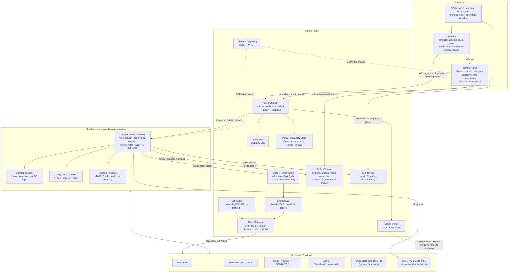
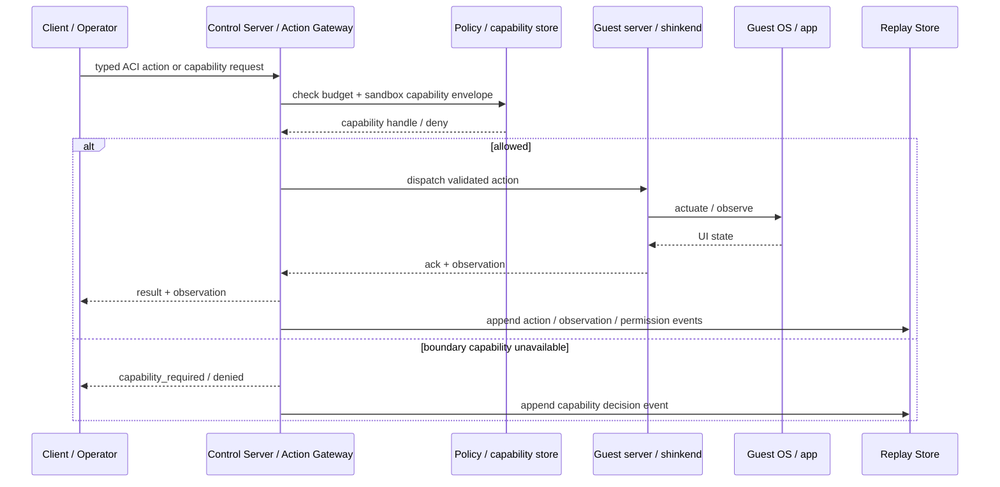
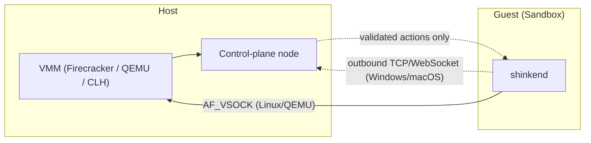
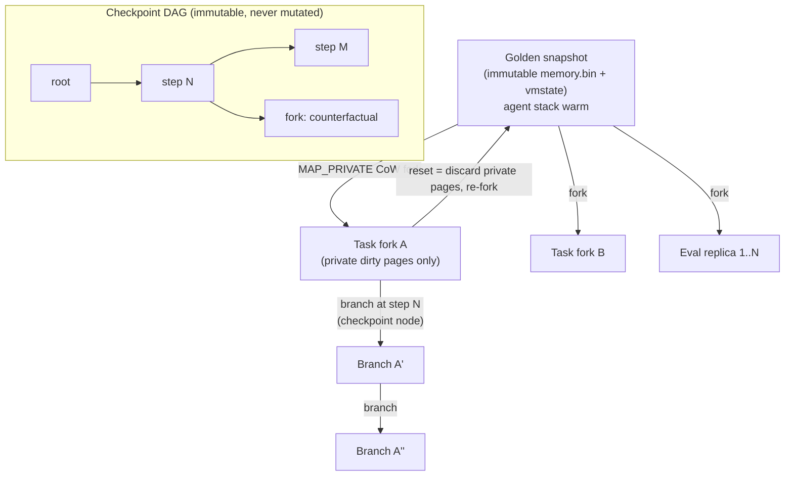
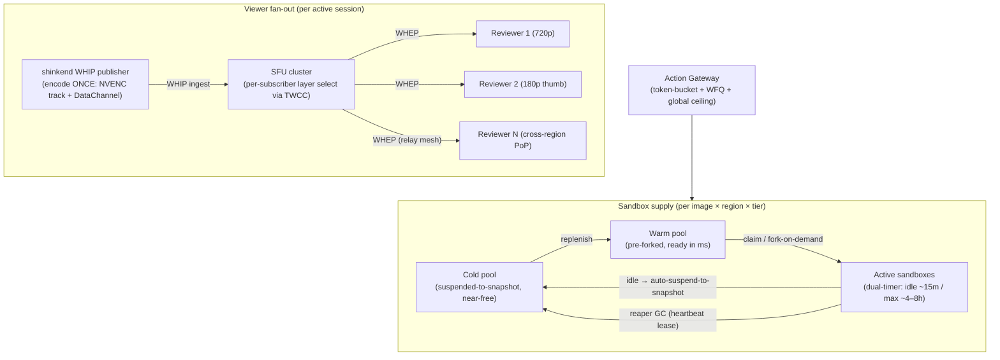

# Shinken — System Architecture

> Status: drafting · Last updated 2026-06-13
> Audience: architecture/design maintainers · Role: full target system specification · Source of
> truth: component boundaries, planes, substrate model, and data flow. Current implementation status
> lives in [`STATUS.md`](../engineering/status.md).
> Sibling docs: [00 Vision](vision.md) · [01 PRD](prd.md) · [03 OSWorld teardown](osworld-analysis.md) · [04 Landscape](landscape.md) · [05 Tech decisions / ADRs](tech-decisions.md) · [06 Roadmap](../engineering/roadmap.md) · [07 Glossary](glossary.md) · [08 Isolation & capability note](threat-model.md) · [09 Economics & build-vs-buy](economics-and-build-vs-buy.md)

Shinken is the open infrastructure stack for computer-use agents: an AI-native, cross-platform
**sandbox runtime + control plane + control panel** that also exposes evaluation and trajectory-data
capture on the same substrate. It is the runtime that benchmarks and harnesses plug into, and the scope is larger
than any benchmark runtime: Shinken defines the full CUA infrastructure layer for real computers,
typed ACI, layered observation, sandbox capabilities, runtime state (checkpoint/fork/resume),
artifact movement, eval evidence, replay/audit data, and fleet-scale execution. This document is the central technical specification. It defines the
**component model**, the **three planes** (control / event / media), the **end-to-end data flow**,
the **substrate matrix** (per-OS × GPU × fast-fork), the **host↔guest transport**, the **reset /
fork-from-snapshot** primitive, and the **scaling topology**.

Every architectural choice reconciles to the design decisions **D1–D15** (full ADRs in [05 Tech decisions](tech-decisions.md)). Shinken builds *on* mature open-source and publicly-available components rather than reinventing them: the OSS Kubernetes [`kubernetes-sigs/agent-sandbox`](https://agent-sandbox.sigs.k8s.io/) CRD for the sandbox control-plane shape, [HashiCorp Vault](https://developer.hashicorp.com/vault) (or any cloud KMS / SPIFFE-SPIRE) for secret brokering, and an *optional* high-fidelity pixel tier that can use a commercial remote-display product (NICE DCV) instead of the in-house WebRTC + NVENC path. NVIDIA GPUs are a **supported, optimized acceleration option** (NVENC streaming, vGPU/MIG, GPU-TEE/confidential computing), **not a dependency** — most agent and browser workloads ride a CPU-only tier.

All third-party speed / density / cost figures are marked **(vendor-published, unverified)**; Shinken's own numbers are now **first-party-measured** — see [docs/benchmarks/README.md](../benchmarks/README.md) — and first-party measurement remains the prerequisite for publishing any number as a Shinken SLO ([09 Economics & build-vs-buy](economics-and-build-vs-buy.md)).

The design borrows the clean `Image → Runtime → Transport → Interfaces → Sandbox` layering pioneered by the closest cross-platform competitor (trycua/cua) and out-engineers its three weak axes: **streaming** (it polls a screenshot per step), **permissions** (binary container-key auth, no policy engine), and **replay** (a screenshot dump plus a side VNC recorder). See [04 Landscape](landscape.md) for the full competitive read.

**Release shape.** v0.0.1 implements the architecture's core semantics at local/reference scale:
ACI, action/observation, the **agent-runtime narrow waist** (Workload × Runtime × Provider — see
[agent-runtime](agent-runtime.md)), a provider registry with **Docker disk-tier
checkpoint/fork/resume**, capability events, artifact refs, model adapters, and a tiny eval harness
(incl. OSWorld-as-a-Workload + a golden→fork-N→score loop). Runtime **replay** / `.skn` was
intentionally deferred (#216) and is **not** a v0.0.1 semantic.
The later phases do not introduce the meaning of Shinken; they optimize and harden the same
semantics for fork density (CRIU memory + CoW fast tiers), WebRTC/SFU/NVENC media, multi-tenant
control-plane operation, cross-substrate scheduling, and cross-OS production tiers.

---

## 1. Component model

Shinken is four cooperating subsystems plus a pluggable substrate. In v0.0.1 these can collapse into
a local reference process/SDK path; in production they become the full distributed control plane:

- **Control Plane** — orchestration: a **Fleet Manager** (warm pools + fork-on-demand), an **Action Gateway** (the single auth → rate-limit → policy choke point), a **scheduler**, a **state store** (named checkpoints + the fork/resume DAG), an **artifact/file-transfer service**, an **eval service**, a **replay store** (the audit/training-data ledger), plus telemetry, a policy/capability store, WebRTC signaling, and an SFU fan-out layer.
- **Sandbox + Guest Runtime** — one isolated guest computer (substrate-pluggable) running the in-guest daemon **`shinkend`**, which executes the Agent-Computer Interface (ACI), produces the structured observation stream, and publishes the optional video track.
- **Operator** — the client-side adapter that drives a Sandbox for a given agent/model and is the human-takeover seam. The agent loop itself is **provider-agnostic** behind the Operator contract.
- **Control Panel** — the human web UI: live structured + video view, Sandbox capability configuration, replay/scrub, cross-session search, takeover.
- **Substrate / Providers** — the pluggable virtualization backends (Firecracker, QEMU-microvm, crosvm, Cloud Hypervisor, Apple Virtualization.framework, or the OSS `agent-sandbox` CRD over gVisor/Kata).

The crisp seam is: the **Control Plane never enters the guest**; the **Guest Runtime never makes a policy decision**; the **Operator never touches a privileged capability without a gateway-issued token**. This is the structural privilege separation that makes the permission model (D6) enforceable rather than advisory.

### 1.1 Component diagram



### 1.1.1 Client / server responsibility split

The component diagram is easier to reason about if read as five lanes. This split is also the
responsibility model: clients request work, the server-side control plane authorizes and records it, and
the guest runtime executes only validated ACI.

| Lane | Owns | Must not own |
|---|---|---|
| **Client side** | SDKs, Operator, model adapters, Control Panel views, optional MCP facade | Direct privileged access to a Sandbox |
| **Control Server / Control Plane** | Action Gateway, sandbox capability policy, budgets, replay store, artifact/file transfer, Fleet Manager, eval orchestration | In-guest actuation or app-specific UI logic |
| **Guest server (`shinkend`)** | ACI execution, observation capture, event emission, media publishing | Authorization, tenant policy, secret decisions |
| **Guest OS / apps** | Desktop state, app processes, a11y/DOM sources, framebuffer | Trust boundary or policy enforcement by itself |
| **Substrate host** | VM/container lifecycle, isolation, reset/fork, egress proxy attachment | Model-facing API semantics |

The request path follows the same boundary every time:



Phase-0 uses a smaller local version of this split: the Python client talks directly to `shinkend`
for the M0 handshake, then a local Gateway shim is introduced for permission and replay. Phase 1
replaces that shim with the real Control Plane without changing the client/guest contract.

### 1.2 Control Plane

The Control Plane is the orchestration brain. It is stateless where it can be (the Action Gateway), stateful where it must be (Fleet Manager pool inventory, Replay Store, policy/capability registry). Its sub-components:

**Fleet Manager (D9).** Owns the sandbox lifecycle: warm pools per `(image, region, tier)`,
snapshot/checkpoint inventory, fork-on-demand from immutable golden checkpoints, resume from
suspended state, and a cheap suspended **cold pool** that replenishes the warm pool. It adopts the
CRD shape of the OSS `kubernetes-sigs/agent-sandbox` project — `Sandbox`, `SandboxTemplate`,
`SandboxClaim`, `SandboxWarmPool` — as its internal API even where Shinken does not run that
controller upstream. Reference numbers to design against: a managed implementation of that CRD
reports ~300 sandboxes/second/cluster with p90 allocation ~200 ms (vendor-published, unverified).
The Fleet Manager handles **dual-timer sessions** — an idle timeout (~15 min, resets on activity)
and an absolute max-lifetime (~4–8 h, does not reset) — with **auto-suspend-to-snapshot** on idle,
because idle wall-clock dominates cost (a mostly-waiting session on a 10–15 min minimum-billing
keep-alive can cost ~5×; vendor-published, unverified). A heartbeat/lease-based **reaper** GCs
orphans from crashed control-plane nodes, not just timer expiries.

**Action Gateway (D9).** The single request-path choke point for session lifecycle, boundary-crossing capabilities, budget, and replay. Routine in-sandbox GUI/input actions are expected to be allowed once the Sandbox has been provisioned; the Gateway is not meant to ask a human before every click or install inside an isolated guest. Its pipeline, in order:

```
tenant-auth  →  per-(tenant,workload,model) token-bucket + WFQ rate-limit
             →  combined budget check (tokens + sandbox-seconds + egress)
             →  Cedar policy decision (sandbox capability / entitlement authorization)
             →  optional HITL confirmation only for boundary-crossing capabilities
             →  dispatch validated typed action to the Guest Runtime
```

Rate limiting is per-`(tenant, workload, model)` token buckets (Redis + Lua, atomic) with weighted-fair-queuing across tiers and a global ceiling above the per-tenant ceilings, with server-enforced jittered backoff to avoid retry synchronization storms. The Gateway is also where budget is enforced *before* a provider call — cost for a computer-use platform is `LLM tokens + sandbox-seconds + egress`, and idle sandbox-seconds, not tokens, often dominate.

**Scheduler.** Routes a `SandboxClaim` to the correct substrate pool by `(OS × needs-GPU × needs-fast-fork)` (D1), and bin-packs on **private/dirty-page RSS**, not snapshot size — the shared-page advantage of CoW forks erodes as a workload writes memory, so density must be measured on what actually costs RAM (see §6).

**State + Replay Store (D5).** Append-only store of `.skn` bundles plus runtime-state metadata:
the canonical `events.jsonl` stream, content-addressed media/resources, substrate snapshot refs,
named Shinken checkpoints, and the immutable **checkpoint DAG**. `.skn` is the evidence ledger;
snapshots/checkpoints/forks/resume are the runnable-state layer it can reference. The same store
backs live streaming, scrubbable replay, branch/fork, resume/restore, and trajectory export for
RL/SFT. The replay log and the live event stream are **the same canonical events** emitted to two
sinks, so "works live, broken on replay" divergence cannot occur (D5).

**Artifact / file-transfer service (D5, D8, D9).** Moves task fixtures, uploaded files, generated
artifacts, logs, screenshots/videos, and `.skn` resources between clients, the Control Plane, and
Sandboxes. This is a hot data path, not a convenience wrapper around JSON RPC: binary payloads avoid
base64 inflation, large transfers are chunked/resumable/checksummed, concurrent transfers have
backpressure and cancellation, and traffic is isolated from latency-sensitive ACI action/observation
messages. Content-addressed storage aligns artifacts with `.skn` media/resources; `fs.scope`,
`persistence`, credentials, and host mounts are enforced through the Capability Manager (D6).

**Eval Service (D7).** Thin orchestration on top of the runtime that inverts OSWorld: a typed **verifier DAG** (not stringly-typed `getattr`), programmatic-primary with a constrained model-verifier fallback, a golden snapshot per task, and `N≥5` CoW-forked replicas producing `pass@k / pass^k` with confidence intervals. It uses readiness probes, not sleeps. It is a *consumer* of the Fleet Manager's fork primitive and the Replay Store's bundle format — eval is the production runtime, layered.

**Telemetry, Policy/Capability Store, Signaling, SFU, Secret broker.** OpenTelemetry-GenAI is the native trace/metering format (one span stream feeds tracing + cost attribution + per-tenant metering). The Policy/Capability Store holds Cedar policies and the live ocap **handle registry** for sandbox capabilities and OS entitlements (D6). WebRTC signaling is WHIP/WHEP. The SFU fans video out encode-once. The Secret broker fronts Vault/KMS so the model never sees plaintext credentials (§5.3, D6).

### 1.3 Sandbox + Guest Runtime (`shinkend`)

A **Sandbox** is one isolated guest computer; a **Session** is a live attach/run against it. Inside every Sandbox runs **`shinkend`**, the Guest Runtime — Shinken's replacement for OSWorld's unauthenticated Flask `main.py`. `shinkend` is the only thing in the guest Shinken trusts to *execute*. It should be powerful inside the Sandbox (install, type, click, capture, run code where enabled), while relying on the Control Plane and OS/substrate layer for boundary authorization.

`shinkend` responsibilities:

- **ACI executor (D2).** Receives validated typed actions (a tagged union discriminated by `verb` — a 22-verb surface as built) and actuates them per-OS through a handler factory (X11/`xdotool`-class on Linux, UIA/SendInput on Windows, CoreGraphics on macOS). Coordinate-space normalization is done once here and recorded, never re-implemented per agent.
- **Observation engine (D3).** Produces the layered observation stack: screenshot/focused/region
  pixels as the universal baseline, normalized cross-OS a11y/DOM trees (AT-SPI / UIA / AX / CDP)
  where available, and explicit escalation to Set-of-Marks/OmniParser, region/zoom pixels, full
  frames, and NVENC video.
- **Event emitter (D5).** Every action, observation, decision, permission event, and snapshot reference is appended to the canonical event stream — this stream *is* the replay log.
- **WebRTC publisher (D4).** On demand, captures the framebuffer, encodes with NVENC (where a GPU is present) or a software encoder, and publishes a single media track plus the reliable-ordered data channel over one PeerConnection.
- **Post-fork uniqueness hook (D1).** On every fork/clone, reseeds RNG/CSPRNG, regenerates MAC/hostname/`boot_id`/machine-id, resyncs the clock, deletes saved random-seed files, and rotates session tokens — then re-registers with the control plane.

`shinkend` is **packaged three ways** so one daemon contract serves all guests: a systemd unit / cloud-init for Linux, a cloudbase-init RunOnce for Windows, and a first-boot LaunchDaemon baked into the Tart/lume image for macOS. The host↔guest control transport is `virtio-vsock` where available (Linux/QEMU); on Windows and macOS, which lack a usable vsock guest path, the portable fallback is a **guest-initiated outbound TCP/WebSocket callback** that works through the per-sandbox egress firewall (§4).

### 1.4 Operator

The **Operator** is the client-side adapter that drives a Sandbox for a given agent/model. It owns the agent loop, but the loop is **provider-agnostic**: behind the Operator contract sit thin, **version-pinned bidirectional adapters** that are the *only* model-facing surface (D2) — Anthropic `computer_20241022 / 20250124 / 20251124` (+ bash + text_editor), OpenAI `computer_call`, UI-TARS DSL, OSWorld `computer_13`. Each adapter translates a vendor grammar into Shinken's canonical typed action *in*, and renders the Shinken observation stack into whatever that vendor expects *out* (e.g. a cropped screenshot for a pixel model, an aria-ref snapshot for a Playwright-MCP host). The native channel preserves both pixels and structure so the runtime works before instrumentation and becomes cheaper/stabler where structure exists.

The Operator is also the **human-takeover seam**. A human reviewer in the Control Panel can request control; the Operator yields the action channel (borrowing the host/controller hand-off model proven by shared-browser tools), and takeover keystrokes are excluded from trajectory capture so secrets typed by a human are never recorded.

### 1.5 Control Panel

The Control Panel is the human web UI and the home of three of Shinken's four headline features. It subscribes to the **event plane** for the live structured view and (on demand) to the **media plane** via WHEP for video. It renders:

- **Live view** — the structured a11y/DOM tree and (optionally) the video track, side by side.
- **Capability Manager (D6)** — the sandbox capability / entitlement UI: grant, narrow, revoke, and audit boundary powers such as egress, credentials, GPU, persistence, host filesystem scopes, and OS automation readiness.
- **Replay / scrub (D5)** — open any `.skn` bundle, scrub frame-accurately to any `seq`, jump to markers (step boundaries, capability grants, fork points), and **branch** from any checkpoint node.
- **Cross-session search** — query across sessions by action, element, decision, or permission event.

### 1.6 Substrate / Providers

The Substrate layer is deliberately pluggable behind a `Runtime` ABC modeled on the cua layering:
`start() → RuntimeInfo`, `stop()`, `is_ready()`, plus optional `suspend / resume`, and the runtime
state primitives `snapshot`, `checkpoint`, `restore`, `fork`, and `ensure_base`. Providers must
advertise which of these are real, provider-managed, or unsupported; Docker recreate, macOS clone,
Windows warm-pool swap, and Firecracker CoW fork are not interchangeable. The scheduler's
`_auto_runtime()`-style selection picks a backend from `(os_type, kind, needs_gpu,
needs_fast_fork)`. The full routing matrix is §3.

Pluggability also runs **sideways at the operation layer (D15)**: third-party computer-control
systems (trycua/cua, an AX MCP server, an external CDP browser, E2B) plug in **under** the typed
ACI as `shinken.backends` providers — a `SandboxProvider` returning a duck-typed Sandbox with
honest capability negotiation (advertise only the verbs/targets/observation tiers actually served;
a missing capability is a typed error, never a silent no-op), and `RoutedSession` composing CU↔BU
surfaces behind one Sandbox-shaped object the Operator loop drives unchanged.

---

## 2. The three planes

Shinken separates concerns into three logical planes. This separation is the architectural expression of decisions D4 (streaming) and D5 (replay), and it is the single biggest differentiator versus competitors who push VNC pixels or poll screenshots for everything.

| Plane | Carries | Transport | Reliability | Bandwidth | Decision |
|-------|---------|-----------|-------------|-----------|----------|
| **Control** | Session lifecycle, provisioning, signaling, permission grant/revoke, capability tokens | gRPC / HTTP to Control Plane; WHIP/WHEP for media signaling | Reliable | Tiny, bursty | D9 |
| **Event** | Typed actions + structured observations + permission events + decisions — **this stream IS the replay log** | WebRTC **reliable-ordered DataChannel** (SCTP/DTLS); `virtio-vsock` host↔guest | Reliable + ordered | ~20 kbps structured (Tier 0) | D3, D4, D5 |
| **Media** | On-demand NVENC video track (screen-content-tuned H.264 / AV1) | WebRTC **SRTP media track**, same PeerConnection; fanned out by the SFU | Lossy real-time (NACK/RTX/FEC) | 0 when idle → Mbps when watching | D4 |

A fourth practical data path sits alongside those planes:

| Path | Carries | Transport shape | Reliability | Design rule | Decision |
|------|---------|-----------------|-------------|-------------|----------|
| **Artifact / file transfer** | Fixtures, directories, generated files, logs, screenshots/videos, `.skn` resources | Dedicated binary stream, range/chunk endpoint, WebRTC DataChannel stream, vsock, or object-store handoff depending on deployment | Reliable, resumable, checksummed | Never block the low-latency ACI/event path; avoid JSON/base64 for binary payloads | D5, D8, D9 |

The key insight (D4): the **event** plane and the **media** plane ride **one PeerConnection** — one ICE/DTLS connection, one NAT traversal, one set of ports — split into a reliable-ordered DataChannel (actions + a11y/DOM diffs) and an SRTP video track (pixels). A second partial-reliability DataChannel sub-stream carries high-rate lossy telemetry (cursor/scroll), where freshness beats completeness; using separate SCTP streams avoids reliable-mode head-of-line blocking stalling an urgent action ack behind a big tree snapshot.

Because most agent wall-clock is spent on a near-static UI, the structured event plane carries the truth and the video track is **event-gated** — paused/near-0fps while the desktop is static, spun to full rate only when a human or the policy explicitly wants pixels. Structured observation is roughly **150×** cheaper than H.264 office video (~20 kbps vs ~3 Mbps; vendor-published, unverified) and an a11y task uses ~25k vs ~150k tokens (~6×; vendor-published, unverified). This is the bandwidth headline.

**Observation rungs (D3)** map onto the planes as an escalation ladder the agent or policy requests explicitly:

```
Rung 0  screenshot / focused / region pixels  → event/media resources (universal baseline)
Rung 1  a11y / DOM tree or diff               → event plane (fast path where coverage is good)
Rung 2  Set-of-Marks / OmniParser marks       → event plane + on-demand worker
Rung 3  full frame / zoom pixels              → media resources
Rung 4  continuous NVENC video                → media plane (explicit live-watch)
```

Each observation carries a **coverage signal** (fraction of visible pixels covered by a11y bounding
boxes) so the policy knows when an app exposes little usable a11y (Electron/canvas/games) and must escalate.
**Measured 2026-06 (spike #2/E5):** that coverage is no longer an assumption — Qt is strong over
AT-SPI (0.87), Chromium-family controls resolve via CDP (1.00 of labeled controls; 0.23 of all
nodes — browser *and* Electron; Electron over forced AT-SPI reaches 0.32), GTK is weak, terminals
are absent, and canvas measured **zero**; a tree diff runs ~2 KiB vs a ~77 KiB screenshot. Verdict:
**hybrid per-window structured + pixel fallback** — D3 stays Provisional, and the escalation
ladder above is the committed posture, not a stopgap
([first-party benchmarks §4](../benchmarks/README.md)).

---

## 3. Substrate matrix (per-OS × GPU × fast-fork)

No single hypervisor covers all three desktop guests plus GPU plus fast-fork; Shinken runs a **federated per-OS fleet behind one control plane** (D1, D10). The decisive design fact, distilled from the substrate deep-dive: **the three microVMMs diverge sharply on graphics and on whether fast-fork composes with GPU.** Firecracker has *no* display/GPU device model at all (its GPU/PCIe initiative was paused in Feb 2026; treat it as vaporware for planning). Cloud Hypervisor has real VFIO GPU passthrough but its snapshot/restore is experimental *and mutually exclusive with VFIO* — so **fast-fork does not extend to the GPU tier**. QEMU (and crosvm) are the only VMMs with a first-class `virtio-gpu`.

The crucial decoupling: **a Linux desktop needs a display surface, not a physical GPU.** Run a headless compositor (Xorg + the `dummy` driver / Xvfb, or a wlroots headless backend) and render with software (Mesa `llvmpipe`/`lavapipe`) or paravirtual `virtio-gpu` (virgl/venus), then pixel-stream the framebuffer out. That keeps desktops snapshot-forkable because there is no VFIO state to lose. Real GPU passthrough is reserved for CUDA/3D workloads, where it is feasible on Cloud Hypervisor/QEMU but forfeits fast-fork.

| OS / tier | Substrate (VMM) | Display / GPU strategy | Fast-fork? | Reset model | Status / caps |
|-----------|-----------------|------------------------|------------|-------------|---------------|
| **Linux — headless code/agent** (default v1) | **Firecracker** | none (headless) | **Yes** (the killer feature) | fork-from-snapshot, target <30 ms VMM restore | Production. ~125 ms boot, <5 MiB overhead, ~28–33 ms restore, thousands/host (vendor-published, unverified) |
| **Linux — desktop** (v1) | **QEMU-microvm** (safe default) or **crosvm** (dark-horse PoC) | headless compositor + software (`llvmpipe`) or `virtio-gpu` virgl/venus | **Yes** (still snapshottable) | fork-from-snapshot | QEMU virtio-gpu in-tree/production; crosvm production at Google scale, less proven as a server fleet |
| **Linux — container fast-path** (v1) | OSS **`agent-sandbox` CRD** pods under **gVisor / Kata** | software framebuffer in pod | partial (pod-snapshot suspend/resume) | pod snapshot or recreate | Early OSS; warm pool mandatory |
| **Linux — GPU-accelerated** | **Cloud Hypervisor / QEMU + VFIO or vGPU/MIG** | VFIO full passthrough or vGPU/MIG slice | **No** (VFIO state not in snapshots) | warm pool + full reboot | Production passthrough; longer-lived, snapshot-light |
| **Windows** (v1, heavier) | **Cloud Hypervisor / QEMU + virtio-win** | software or vGPU; sysprep golden image + cloudbase-init | No (sub-second fork infeasible today) | qcow2 CoW disk + reboot; snapshot-light | Production imaging; **licensing-gated** (Datacenter per-core or BYOL Dedicated Hosts) |
| **macOS** (v1, scarce premium) | **Apple Virtualization.framework** on Apple HW (Tart / lume) | native; APFS CoW clone of base image | clone-based (not microVM fork) | APFS CoW clone | Hard caps: Apple-HW-only, **2 VMs/host** (VZErrorDomain code 6), TCC pre-grant, no iCloud/App Store |
| **GPU trusted variant** | Cloud Hypervisor / QEMU + MIG + **Confidential Containers** | GPU-TEE + **NRAS attestation** | No | warm pool | Public NVIDIA option for isolation-sensitive tenants |
| **Android** (roadmap, not v1) | redroid / Cuttlefish (crosvm) / emulator | virtio-gpu / emulator GPU | quick-boot snapshots | snapshot restore | Roadmap |

Notes that load-bear:

- **Encode-tier GPU selection (D11):** the encode tier **never** runs on A100/H100/H200/B200 — those datacenter parts have **zero NVENC engines** (public NVIDIA fact). The encode tier uses **Ada L4** (density) or **L40S** (premium 4K/AV1 + render). Two GPU pools exist: time-sliced vGPU for light desktops (density) and MIG-backed / Confidential Containers for isolation-sensitive/trusted workloads (GPU-TEE + NRAS). No MIG for the encode tier. Consumer GPUs have an ~8-session NVENC cap; **datacenter GPUs are uncapped** (public NVIDIA fact).
- **The "no fast-fork on GPU" property is surfaced in the API** as a tier attribute, so callers know `pause/resume/branch` is unavailable there.
- **Instant reset and replay-branching are the same primitive** — fork a snapshot node. See §5.

If operational surface must be cut to one VMM, **QEMU with the `microvm` machine type** is the unifier (covers headless Linux, Linux desktop via virtio-gpu, Windows via virtio-win, and GPU via VFIO/vGPU) at the cost of Firecracker-class fork speed — keep Firecracker as the headless fast-path.

---

## 4. Host ↔ guest transport: `virtio-vsock`

Inside the trust boundary, the control plane talks to `shinkend` over the most direct channel each substrate supports, **never HTTP polling** (the OSWorld anti-pattern of an unauthenticated Flask server on `0.0.0.0:5000` is explicitly not reproduced — see [03 OSWorld teardown](osworld-analysis.md)).

- **Linux / QEMU:** `virtio-vsock`. A socket family (`AF_VSOCK`) that gives a guest↔host datagram/stream channel with no guest IP, no NAT, and no exposure on any network. The Guest Runtime listens on a vsock port; the host VMM bridges it to the control plane. This is the low-latency path for the event plane between `shinkend` and the host, before it is multiplexed onto the WebRTC DataChannel toward the Operator.
- **Windows:** no vsock guest driver exists. Fallback to a **guest-initiated outbound TCP/WebSocket callback** to the control plane.
- **macOS (Apple VZ):** no vsock for this use. Same outbound TCP/WebSocket callback.

The callback is **guest-initiated and outbound**, so it traverses the per-sandbox egress firewall cleanly without opening any inbound listener on the guest. After every fork/clone/sysprep, `shinkend` re-registers over this channel as part of the uniqueness hook (§1.3), so a forked clone never inherits a stale identity or a sibling's session token.



Everything the guest sends *to the network* — including this callback when used — flows through the **out-of-VM egress proxy** (deny-by-default, scoped-domain allowlist, optional TLS-terminating mode) that is part of the OS-enforcement layer of D6 (§5.3), so a Sandbox reaches only the network hosts its task was granted. The egress proxy is also where the secret broker injects scoped, short-lived tokens at the network layer so the model never holds plaintext credentials.

---

## 5. End-to-end data flow

The full lifecycle of a session: **provision → observe → act → permission-gate → stream → record → eval**. The sequence below threads one action through every plane and component.

```mermaid
sequenceDiagram
    autonumber
    participant Op as Operator (agent loop)
    participant AG as Action Gateway
    participant FM as Fleet Manager
    participant Sub as Substrate / VMM
    participant SK as shinkend (Guest Runtime)
    participant POL as Policy/Cap store (Cedar+ocap)
    participant SEC as Secret broker (Vault/KMS)
    participant SFU as SFU
    participant CP as Control Panel (human)
    participant RS as Replay Store
    participant EV as Eval Service

    Note over Op,Sub: PROVISION
    Op->>AG: open session (image, OS, needs_gpu, needs_fast_fork)
    AG->>FM: SandboxClaim
    FM->>Sub: fork from golden snapshot (warm pool)
    Sub->>SK: boot + post-fork uniqueness hook (reseed RNG/MAC/boot_id)
    SK-->>FM: ready (vsock / outbound callback)
    FM-->>AG: sandbox handle + capability descriptor
    AG-->>Op: session established (schema_version, supported verbs/targets)

    Note over Op,SK: OBSERVE (layered)
    Op->>AG: request observation (screenshot baseline / structured fast path)
    AG->>SK: get observation
    SK-->>AG: pixels and/or a11y/DOM tree (Element[] + coverage_ratio)
    AG-->>Op: observation (event plane + media refs as needed)

    Note over Op,POL: ACT + PERMISSION-GATE
    Op->>AG: typed action {verb, target, action_id}
    AG->>AG: auth → rate-limit → budget
    AG->>POL: Cedar IsAuthorized(capability, scope, context)
    alt capability auto-grant (Advisory tier)
        POL-->>AG: permit (handle issued)
    else needs boundary capability
        AG->>CP: capability card (Grant / Narrow / Deny)
        CP-->>AG: grant scoped capability — emits capability event
        POL-->>AG: permit (ocap handle issued)
    else forbid-override (hard-deny)
        POL-->>AG: deny (fail-closed)
        AG-->>Op: capability_required / denied
    end
    opt action needs a credential
        AG->>SEC: request scoped short-lived token
        SEC-->>AG: token ref (injected at egress proxy, not returned to model)
    end
    AG->>SK: dispatch validated action
    SK->>SK: actuate (per-OS handler); enforce ocap handle at use-time
    SK-->>AG: result {status, executed_logical_px, state_delta}
    SK-->>AG: post-observation diff (same action_id)

    Note over SK,CP: STREAM (on demand)
    Op->>AG: escalate to video (rung 4)
    SK->>SFU: WHIP publish (NVENC track + DataChannel)
    CP->>SFU: WHEP subscribe (selected SVC/simulcast layer)
    SFU-->>CP: media track (encode-once fan-out)

    Note over SK,RS: RECORD (always)
    SK->>RS: append events.jsonl (action, observation, decision, permission, snapshot_ref)
    SK->>RS: periodic checkpoint (env + agent state) → checkpoint DAG

    Note over RS,EV: EVAL (layered, same runtime)
    EV->>FM: fork N replicas from golden snapshot
    FM->>Sub: N CoW forks
    EV->>RS: read .skn + verifier DAG → pass@k / pass^k + CIs
```

Step-by-step, mapped to decisions:

1. **Provision (D1, D9).** The Operator opens a session declaring `(image, OS, needs_gpu, needs_fast_fork)`. The Gateway turns it into a `SandboxClaim`; the Fleet Manager forks a guest from a warm golden snapshot (sub-millisecond-to-~1 ms fork on the Linux fork tier; vendor-published, unverified). `shinkend` boots and runs the **post-fork uniqueness hook** before accepting any action. A capability descriptor is negotiated at handshake (D2): `{schema_version, supported_verbs[], supported_targets[], coordinate_modes[], max_long_edge, escape_hatch_caps[], observation_types[]}`.

2. **Observe (D3).** The baseline observation is a **screenshot with an explicit `CoordinateSpace`** (screen / focused-window / region — the universal rung-0 path). Where coverage allows, the negotiated upgrade is a **pruned, diffed, normalized a11y/DOM tree** — one `Element{ref, role, name, value, states, bbox, source, backend_id, parent_ref, children_refs}` schema over AT-SPI/UIA/AX/CDP, with stable per-session refs — selected per window via the `coverage_ratio` signal (measured 2026-06, E5: the verdict is hybrid per-window structured + pixel fallback; D3 stays Provisional, §2). When escalating pixels, a region crop is preferred over a full frame.

3. **Act (D2).** The Operator emits a typed action: a tagged union discriminated by `verb`, whose `target` is `oneof{ point_px | point_norm | element_ref }` with an explicit `CoordinateSpace`. The agent acts on **element refs/marks by default**; raw `x,y` only at the pixel rung. Code-as-action (`exec_code` / `run_bash` / `edit_file`) is a **separate, off-by-default capability class** behind the `tool_runner` boundary — never the default actuation path.

4. **Capability management (D6).** The Gateway resolves boundary powers through the **three-layer** model: (1) a **Cedar** declarative decision (`IsAuthorized` over Principal=session/agent, Action=use-capability, Resource=capability/feature, Context=trust-tier/scope/lifecycle/params — formally analyzable, sub-ms); (2) an **ocap caretaker/membrane handle** that is the live, attenuable, O(1)-revocable switch the panel toggles (because Cedar decision caching leaves a stale-revocation window, revoke must be a handle bit-flip checked at use-time, not a policy delete); (3) **OS/substrate enforcement** that ignores model intent. The 8 capability classes are `net.egress, fs.scope, clipboard, gpu, install.privileged/sudo, persistence, credentials, peripheral/OS automation`. Ordinary in-sandbox actions run within the provisioned envelope; boundary grants and denials are first-class replay events.

5. **Secret injection (D6).** If the action needs a credential, the Gateway asks the **secret broker** (Vault/KMS) for a scoped, short-lived token and arranges header injection at the **egress proxy** — the token is never returned to the model or written to the replay. Interactive secrets go through human takeover with keystrokes excluded from capture.

6. **Stream (D4).** When a human (or the policy) wants pixels, `shinkend` publishes via **WHIP** into the SFU (one NVENC video track + the DataChannel), and Control Panel subscribers attach via **WHEP**. The SFU forwards **encode-once** — publisher egress and NVENC session count stay O(1) regardless of viewer count — selecting the affordable simulcast/SVC layer per viewer via TWCC. The receiver jitter buffer is driven near zero and the track is tagged screen-content; same-region glass-to-glass target is ~50–120 ms (vendor-published, unverified). Never P2P for the multi-reviewer panel.

7. **Record (D5).** Every canonical event (`kind ∈ {action, observation, decision, permission, marker, snapshot_ref, meta}`) is appended to `events.jsonl` with a monotonic `seq`, an interval `dt`, and a wall anchor; `action_id` pairs an action with its before/after observation. Periodic **bisected** checkpoints (env half = VM/microVM snapshot; agent half = messages/plan/RNG-seed) form the immutable **checkpoint DAG**. Decisions follow **OTel-GenAI** semconv (`gen_ai.request.seed` + `gen_ai.response.id` make an LLM decision a replayable recorded input). Media is content-addressed (`resources/<sha1>`) and referenced by hash. The whole thing packs into a single self-contained `.skn` ZIP openable by a zero-server viewer.

8. **Eval (D7).** The Eval Service forks `N≥5` replicas from a golden snapshot, runs the typed verifier DAG against each, and reports `pass@k / pass^k` with confidence intervals. It reads the same `.skn` format and uses the same fork primitive — **the eval layer is the production runtime, layered.** The fork-N eval loop is the runtime-state wedge (D12); captured `.skn` trajectories double as RL/SFT training data, a supporting byproduct of those runs.

---

## 6. Fork-from-snapshot reset and branching

Instant reset between tasks and replay-branching of agent state are **the same primitive** (D1, D5): fork a snapshot node. This is the structural advantage over OSWorld's VMware/VirtualBox full snapshot-revert (seconds-to-minutes, I/O-bound on disk-delta size).

**Mechanism.** Boot a golden microVM once with the agent stack warm, pause it to an immutable two-file snapshot (`memory.bin` = the CoW backing source + a small `vmstate` = vCPU regs + device state), then spawn each task/branch as a **new KVM VM whose guest RAM is a `MAP_PRIVATE` mmap of the same shared snapshot file**. Reads hit shared clean pages; writes fault into private anonymous copies (kernel page-level CoW). The CoW mmap itself is ~4 µs; end-to-end fork is dominated by KVM VM creation (~99.5% of cost), giving sub-millisecond-to-~1 ms forks (Morph P99 ~1.3 ms at 1000 concurrent forks; OSS `forkd` ~1 ms/child; both vendor-published, unverified). ~93% of pages stay shared (vendor-published, unverified).



**Reset == discard a fork's private (dirty) pages and re-fork** from the immutable snapshot. **Branch == fork N children from any saved checkpoint node** to explore alternative trajectories (the basis for RL tree-search rollouts and `pass@k`). Both are exposed as first-class SDK/Control-Panel verbs (`snapshot / fork / branch / restore`), and snapshots are stored as a **DAG with parent pointers** so the original timeline is never mutated — forking from checkpoint `C` mints a new `checkpoint_id` with `parent = C`.

**Three production guardrails:**

1. **Restore is page-fault-bound, not VMM-bound.** The VMM-side restore is cheap (<30 ms; vendor-published, unverified) but naive restore then faults thousands of guest pages off disk one-by-one on the critical path. The fix is a **REAP-style working-set record-and-prefetch** layer: record the warm working set once (8–99 MB, ~24 MB avg) and prefetch it in one sequential read before resuming vCPUs, eliminating ~97% of critical-path faults (~3.7× faster restore; vendor-published, unverified). Use `userfaultfd` (with `mincore`+`madvise` concurrent region loading) so off-working-set faults — common when agent inputs vary — are handled gracefully and can be served remotely from a page server for disaggregated pools.

2. **Uniqueness is a correctness property, not a nit.** Forks share PRNG/CSPRNG state, MAC/IP, `boot_id`, clock, saved random-seed files, and TLS/session tokens. The `VMGenID` device reseeds *only* the kernel CSPRNG on Linux ≥5.18 (with a race window). Everything in userspace (numpy/openssl, app tokens) stays identical until the **post-fork uniqueness hook** (§1.3) resets it. Resuming the same state twice without this gives colliding identities and duplicated random streams.

3. **Density is governed by private/dirty RSS, not snapshot size.** The ~93% shared-page advantage erodes as a workload writes memory (~265 KB private pre-execution, ~1.75 MB for numpy, ~27 MB for heavy; ~50 idle agents per 8 GB; all vendor-published, unverified). The scheduler bin-packs on measured private RSS, and forks are recycled on a fixed TTL.

CoW disk follows the same shared-base/per-delta pattern: a shared read-only base rootfs (built from Dockerfiles as artifacts) plus per-sandbox deltas via overlayfs (default), device-mapper-thin / btrfs / ZFS clones (large/random-write guests), or qcow2 backing chains (QEMU/Windows/GPU tier). macOS gets the analogous APFS CoW clone. The GPU and Windows tiers are **snapshot-light by design** and lean on warm pools + reboots instead of sub-second fork.

---

## 7. Scaling topology

Shinken scales along two independent axes: **sandbox supply** (warm pools + fork-on-demand) and **viewer fan-out** (the SFU). Idle is the dominant cost, so the topology is built to keep idle cheap.



**Warm-pool topology (D9).** Per `(image, region, tier)` a warm pool of pre-forked, ready-in-ms sandboxes is fed by a cheap suspended cold pool. The scheduler predictively autoscales the warm pool on arrival rate — too small reintroduces cold-start spikes under burst, too large burns idle cost. Active sandboxes run the dual-timer lifecycle and auto-suspend-to-snapshot on idle. A heartbeat/lease reaper reclaims orphans from crashed nodes. The GPU and macOS tiers get **distinct pools** with honest ceilings: macOS is hard-capped at `2 × number_of_Macs` concurrent VMs and has the worst unit economics (e.g. ~$6.50/hr per Apple-silicon metal host, 24-hour minimum allocation on one public cloud; vendor-published, unverified) — scarce premium capacity, never commodity elasticity.

**SFU fan-out topology (D4).** One desktop, many human reviewers. The publisher (`shinkend`) uploads **once** as simulcast or AV1/VP9 SVC; the SFU forwards the layer each reviewer can afford (TWCC estimates) with **no transcode**, so NVENC session count and egress stay bounded. WHIP for ingest, WHEP for egress; a distributed relay mesh extends one-to-many cross-region (PoP placement; cross-region target <200 ms, bounded by RTT/2 geography; vendor-published, unverified). TURN relay is the hidden cost center (~18–35% of connections relay; vendor-published, unverified) — self-host TURN near PoPs, prefer direct/srflx, keep video event-gated.

**Telemetry & cost (D9).** OTel-GenAI spans are the single source for tracing, cost attribution, and per-tenant metering, stamped with `tenant/session/agent` IDs at creation. Cost is metered across all three lines — LLM tokens, sandbox-seconds, egress — and budgets enforced at the Gateway before a provider call. Sandbox health is a **circuit-breakable dependency**: on hung guest or crashed browser, kill-9 + reconnect or auto-replace from the warm pool.

---

## 8. How Shinken builds on existing components

Shinken composes mature, publicly-available building blocks and adds the four things they lack in combination: runtime-state management (named checkpoint/fork/resume over a branchable snapshot DAG), streaming-first observation, sandbox capability/entitlement management, and an optional GPU-accelerated tier. The event-sourced `.skn` replay is the audit/training-data ledger those runtime-state primitives produce and reference (a checkpoint points at a replay offset), not a peer headline. See [09 Economics & build-vs-buy](economics-and-build-vs-buy.md) for the full analysis.

| Need | Build on (public/OSS) | What Shinken adds |
|------|------------------------|-------------------|
| Sandbox control-plane primitives | OSS **`kubernetes-sigs/agent-sandbox`** CRD (`Sandbox / SandboxTemplate / SandboxClaim / SandboxWarmPool`) over **gVisor / Kata** | Per-OS federated fleet, fork-from-snapshot reset, the substrate router (§3), and the dual-channel ACI on top |
| Isolation substrate | Firecracker / QEMU-microvm / crosvm / Cloud Hypervisor / Apple VZ | The `(OS × GPU × fast-fork)` routing matrix and a uniform Guest Runtime contract across all of them |
| Secret brokering | **HashiCorp Vault** (or cloud KMS / SPIFFE-SPIRE) | Network-layer token injection at the egress proxy so the model never sees plaintext (D6) |
| Policy engine | OSS **Cedar** (analyzable, SMT/Lean-verified) | The 3-layer Cedar + ocap-handle + OS-enforcement model with live O(1) revoke (D6) |
| Telemetry | **OpenTelemetry GenAI** semconv | `gui.*` custom attributes + cost rollups across tokens / sandbox-seconds / egress |
| Replay packaging | Playwright `trace.zip` model, asciicast/rrweb envelope, LangGraph checkpoint DAG, OTel-GenAI decision spans | The `.skn` bundle: env+agent bisected snapshots, branchable DAG, importers for OSWorld/Playwright/rrweb |
| High-fidelity pixel channel (optional) | Build-vs-buy: **NICE DCV** (publicly-available NVENC + QUIC remote display) **vs** a custom WebRTC + NVENC pipeline | The default is the custom dual-channel path (event plane is primary); DCV is a drop-in option for the premium 4K/GPU pixel tier |
| GPU acceleration (optional) | NVENC (Ada L4 / L40S), vGPU/MIG, GPU-TEE / Confidential Computing / NRAS — all **public NVIDIA product facts** | The two-pool GPU model and the "encode never on A100/H100/H200/B200" rule (D11) |
| Model ecosystem | Anthropic / OpenAI / UI-TARS / OSWorld grammars | Version-pinned bidirectional adapters as the only model-facing surface (D2) |

The design principle throughout (D12): an **open, self-hostable core** — reusable Operator, provider-agnostic agent loop, no lock-in — with optional hosted Control Panel / observability / permission-audit / eval as a commercial layer. Vendor-neutral; runs on any Kubernetes/cloud; optimized for NVIDIA GPUs where present, but never requiring them.

---

## 9. Decision reconciliation (D1–D15)

| # | Decision | Where it lives in this architecture |
|---|----------|-------------------------------------|
| **D1** | Tiered, substrate-pluggable isolation routed by `(OS × GPU × fast-fork)`; reset = fork-from-snapshot | §3 substrate matrix; §6 fork primitive; scheduler routing §1.2 |
| **D2** | One canonical typed tagged-union action schema; version-pinned bidirectional adapters; code-as-action off-by-default | §1.4 Operator/adapters; §5 step 3; capability handshake §5 step 1 |
| **D3** | Screenshot-first baseline with structured upgrades; act on element refs where available | §1.3 observation engine; §2 observation rungs; §5 step 2 |
| **D4** | Single-PeerConnection WebRTC, dual-transport (DataChannel + on-demand NVENC track); SFU fan-out; WHIP/WHEP | §2 three planes; §5 step 6; §7 SFU topology |
| **D5** | Event-stream + bisected snapshots = `.skn`; immutable branchable checkpoint DAG; replay = training data | §1.2 Replay Store; §5 step 7; §6 branching |
| **D6** | 3-layer capability scoping: Cedar + ocap caretaker + OS enforcement; 8 classes, 4 scope tiers | §5 step 4–5; §1.2 policy store; §4 egress proxy |
| **D7** | Eval = thin verifier-DAG orchestration on the runtime; `N≥5` CoW forks → pass@k / pass^k | §1.2 Eval Service; §5 step 8; §6 branching |
| **D8** | Native streaming SDK core + optional MCP facade; never route the hot loop through MCP | §1.1 SDK + MCP facade; §1.4 Operator contract |
| **D9** | Control plane = Fleet Manager + Action Gateway + dual-timer sessions + OTel-GenAI; sandbox = circuit-breakable | §1.2 control plane; §7 scaling + telemetry |
| **D10** | Cross-platform: Linux first-class v1; Windows + macOS heavier v1 tiers; Android roadmap; one control plane + one Guest Runtime contract + one ACI | §3 matrix; §1.3 three-way packaging; §4 transport |
| **D11** | GPU is opt-in; encode never on A100/H100/H200/B200 (use Ada L4 / L40S); two pools (vGPU density + MIG/Confidential Containers trusted) | §3 matrix notes; §7 distinct GPU pools; §8 GPU table row |
| **D12** | Open self-hostable core + optional hosted commercial layer; vendor-neutral, NVIDIA-optimized where present | §8 build-on table; throughout |
| **D13** | Operation layer: one observe contract (stable element ids → `~/+/-` diffs, settle-before-observe), act-returns-observation, element verb family — built for Linux/AT-SPI v1 | §1.3 ACI executor + observation engine; §2 observation rungs; §5 step 2 |
| **D14** | macOS engine substrate under TCC: CoreGraphics/CGEvent v1 built (local-only proof, exclusive-desktop tier); AXUIElement observation + the co-use tier designed | §3 matrix macOS row; §1.3 per-OS handlers + three-way packaging |
| **D15** | Operation-layer backends: third-party computer-control systems as `SandboxProvider`s under the typed ACI; honest capability negotiation; `RoutedSession` CU↔BU composition | §1.6 sideways pluggability; §1.4 Operator contract |

---

## 10. Known gaps carried into this architecture

These are not papered over (canon-aligned, also tracked in [open-questions](../../notes/open-questions.md) and the [08 Isolation & capability note](threat-model.md)):

- **a11y coverage on Electron/Qt/canvas/games — MEASURED 2026-06 (spike #2/E5), verdict in.** What was the load-bearing unverified assumption behind the structured observation cost model (§2) is now first-party data: Qt strong (0.87), Chromium-family controls via CDP, GTK weak, terminals absent, canvas measured **zero** with a change-blind diff. Verdict: **hybrid per-window structured + pixel fallback — D3 stays Provisional, not structured-by-default.** Games/native-GL remain unmeasured (canvas is the measured proxy), so the `coverage_ratio` signal and the SoM/OmniParser + pixel fallback rungs stay the safety net.
- **macOS / Windows fast-reset is largely infeasible today.** The matrix (§3) treats both as heavier, snapshot-light, longer-lived tiers; sub-second fork is a Linux-only property in v1.
- **Windows-in-cloud licensing and the macOS 2-VM/host cap** shape cost and roadmap, not just engineering (§7).
- **First-party performance numbers now EXIST (RESOLVED 2026-06)** — Shinken's own speed/density figures are measured across 14 rerunnable suites in [docs/benchmarks/README.md](../benchmarks/README.md): the fork ladder mints a usable replica in 0.60 s (disk) / 0.40 s (CRIU live process+memory) / 0.118 s (warm-pool graft), one event-loop thread holds 3,096 live sessions (2,320 frames/s ≈ 870 Mbps at 0.93 cores), and the act+observe step runs 13.4 ms ≈ 14× vs OSWorld's guest server as shipped. Third-party figures in this document keep their **(vendor-published, unverified)** tags; the still-unmeasured boundaries are the sub-ms CoW fork tier and dual-channel WebRTC latency.
- **Protocol/event-schema versioning + upcasting** must be specified rigorously: `schema_version` on the bundle manifest plus a per-event `v`, with upcasters so old `.skn` recordings stay replayable (D5).
- **Multi-player / non-exclusive computer-use** (more than one controller per Sandbox) is an explicit in/out decision the Operator takeover seam (§1.4) and the SFU shared-control model (§7) are designed to accommodate but do not yet commit to.

---

## Sources

External sources are cited inline by URL above and consolidated in [`../../notes/sources.md`](../../notes/sources.md). Key references for this document:

- Kubernetes Agent Sandbox SIG — <https://agent-sandbox.sigs.k8s.io/>
- Firecracker snapshotting (MAP_PRIVATE CoW, userfaultfd, VMGenID) — <https://github.com/firecracker-microvm/firecracker/blob/main/docs/snapshotting/snapshot-support.md>
- Cloud Hypervisor VFIO + snapshot/restore (mutually exclusive with VFIO) — <https://github.com/cloud-hypervisor/cloud-hypervisor/blob/main/docs/snapshot_restore.md>
- QEMU `microvm` machine type + virtio-gpu — <https://www.qemu.org/docs/master/system/i386/microvm.html> · <https://qemu-project.gitlab.io/qemu/system/devices/virtio-gpu.html>
- crosvm virtio-gpu — <https://crosvm.dev/book/devices/gpu.html>
- REAP working-set restore (ASPLOS'21) — <https://arxiv.org/pdf/2101.09355>
- Restoring Uniqueness in MicroVM Snapshots — <https://arxiv.org/abs/2102.12892>
- WHIP (RFC 9725) — <https://datatracker.ietf.org/doc/rfc9725/> · WHEP draft — <https://datatracker.ietf.org/doc/html/draft-ietf-wish-whep-01>
- WebRTC DataChannels (RFC 8831) — <https://datatracker.ietf.org/doc/html/rfc8831>
- LiveKit SFU internals — <https://docs.livekit.io/reference/internals/livekit-sfu/> · Pion — <https://github.com/pion/webrtc>
- Selkies (GStreamer webrtcbin + NVENC) — <https://github.com/selkies-project/selkies-gstreamer>
- Cedar policy language + Analysis — <https://docs.cedarpolicy.com/> · <https://aws.amazon.com/blogs/opensource/introducing-cedar-analysis-open-source-tools-for-verifying-authorization-policies/>
- Object-capability caretaker/membrane — <https://tersesystems.github.io/ocaps/guide/management.html>
- OpenTelemetry GenAI semantic conventions — <https://opentelemetry.io/docs/specs/semconv/gen-ai/>
- Playwright Trace Viewer / trace.zip model — <https://playwright.dev/docs/trace-viewer>
- LangGraph persistence / checkpoint DAG — <https://docs.langchain.com/oss/python/langgraph/persistence>
- Anthropic computer-use tool (action grammars, zoom) — <https://platform.claude.com/docs/en/docs/agents-and-tools/tool-use/computer-use-tool>
- Apple Virtualization framework + 2-VM cap — <https://developer.apple.com/documentation/virtualization>
- Bedrock AgentCore dual-timer lifecycle — <https://docs.aws.amazon.com/bedrock-agentcore/latest/devguide/runtime-lifecycle-settings.html>
