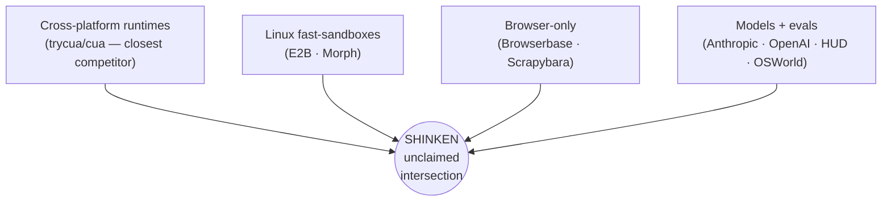

# 00 — Vision & Positioning

> Status: drafted · Last updated 2026-06-13
>
> Audience: design readers and maintainers · Role: product vision / positioning · Source of truth:
> scope and narrative, not current implementation status. Current status lives in
> [`STATUS.md`](../engineering/status.md).
>
> Sibling docs: [01 PRD](prd.md) · [02 Architecture](architecture.md) · [03 OSWorld teardown](osworld-analysis.md) · [04 Landscape](landscape.md) · [05 Tech decisions (ADRs)](tech-decisions.md) · [06 Roadmap](../engineering/roadmap.md) · [07 Glossary](glossary.md) · [08 Isolation & capability note](threat-model.md) · [09 Economics & build-vs-buy](economics-and-build-vs-buy.md) · Sources: [`../../notes/sources.md`](../../notes/sources.md)

**Shinken is the open infrastructure stack for computer-use agents.** It is an AI-native,
cross-platform **sandbox runtime + control plane + control panel** that boots real desktop/browser
Sandboxes (Linux/Windows/macOS; Android on the roadmap), drives them through one typed
**Agent-Computer Interface (ACI)**, layers screenshot observation with structured a11y/DOM/SoM
signals, streams and supervises sessions live, makes every Sandbox **stateful and branchable** —
name a runnable **checkpoint**, **fork** it into N live replicas from one golden state, reset
instantly, and **resume** a suspended run — backed by a **scrubbable, event-sourced replay** that
records every operation as the audit and training ledger, provisions the **sandbox capabilities /
OS entitlements** each run needs, and exposes an **eval layer** (OSWorld-Verified and friends) on
the *same* runtime. The north
star is not a demo sandbox or benchmark harness; it is **one full CUA infrastructure layer serving
production deployment, evaluation, and trajectory-data capture.** Design decisions are referenced
as **D1–D15** and detailed in [05 Tech decisions](tech-decisions.md).

---

## 1. The problem: today's computer-use stacks are research artifacts

In 2026, frontier models can drive a desktop better than a median human on the standard benchmark — the top OSWorld-Verified score has crossed **~83%** versus a **~72.4%** human baseline ([xlang.ai/blog/osworld-verified](https://xlang.ai/blog/osworld-verified); leaderboard figures vendor-published, unverified). The *models* have crossed a threshold. The *infrastructure under them has not.* Every widely used runtime is, structurally, a research demo wearing production clothes:

- **OSWorld** — the de-facto benchmark and the thing Shinken succeeds — drives the guest through a Flask server on port 5000 that the agent **polls for full-frame PNG screenshots**, reverts a whole VM between tasks, and writes a `traj.jsonl` + `recording.mp4` with **no scrub, no fork, no re-run from step N**. OSWorld v1 shipped with **300+ grader/task bugs** later fixed in OSWorld-Verified ([github.com/xlang-ai/OSWorld](https://github.com/xlang-ai/OSWorld)) — the eval layer was stringly-typed and untested.
- **Anthropic's reference container** ([github.com/anthropics/anthropic-quickstarts](https://github.com/anthropics/anthropic-quickstarts)) feeds the model a fresh full PNG per step after a hardcoded settle delay, streams humans via **stock x11vnc + noVNC** on a duplicated pixel path, and has no durable replay or in-loop permission gate.
- **OpenAI Operator / computer-use-preview** re-sends a full-resolution PNG every turn, is explicitly "not for production," and exposes only a `pending_safety_checks` acknowledgement seam ([developers.openai.com/api/docs/guides/tools-computer-use](https://developers.openai.com/api/docs/guides/tools-computer-use)).
- **trycua/cua** — the closest, best-engineered analog — still observes by **pulling a base64 PNG per step over HTTP/SSE**, serializes one command at a time, has no live video streaming, and its permission story is effectively a TODO ([github.com/trycua/cua](https://github.com/trycua/cua)).
- **E2B Desktop** spawns an `xdotool`/`scrot` process **per click/keystroke/screenshot**, streams raw VNC over WebSocket, and has no action/observation replay ([github.com/e2b-dev/desktop](https://github.com/e2b-dev/desktop)).

The pattern is consistent: **poll a screenshot, click a pixel, throw the trace away, and trust the sandbox boundary to be the entire product story.** That is fine for a paper. It is not fine for running thousands of concurrent agents, handing one a real desktop with `sudo`, credentials, network, or GPU, or generating defensible training data and eval scores. The bandwidth is wasteful, the observation is brittle (pixel coordinates drift with resolution and DPI), the capability model is binary, and the trajectory is unforkable.

Shinken's thesis: **the bottleneck has moved from the model to the CUA infrastructure layer, and
that layer needs to be rebuilt end-to-end** — stateful runtime (checkpoint/fork/resume),
capabilities, eval, streaming, replay, artifacts, fleet management, and supervision — not just
replaced with a better polling loop.

## 2. Why now (2026)

Three curves crossed in the last ~18 months that make this the right moment:

1. **Models are good enough that infra is the limiter.** Above-human OSWorld-Verified scores (vendor-published, unverified) mean the marginal task is now bottlenecked by reset speed, observation fidelity, bandwidth cost, and safety gating — all infrastructure concerns, not model concerns.
2. **The enabling primitives have matured.** Sub-millisecond copy-on-write VM fork is real (Morph Infinibranch reports fork P99 ~1.3 ms and ~93% shared pages — vendor-published, unverified; [cloud.morph.so/docs](https://cloud.morph.so/docs/documentation/instances/branch)). Firecracker snapshot-restore is 5–30 ms VMM-side ([firecracker-microvm.github.io](https://firecracker-microvm.github.io/); vendor-published, unverified). Data-center NVENC on Ada GPUs (L4/L40S) is uncapped versus the consumer 8-session limit, with AV1 saving ~40% bitrate vs H.264 ([developer.nvidia.com — AV1 and Ada Lovelace](https://developer.nvidia.com/blog/improving-video-quality-and-performance-with-av1-and-nvidia-ada-lovelace-architecture/); vendor-published, unverified). WebRTC SFU fan-out, Set-of-Marks/OmniParser grounding ([github.com/microsoft/OmniParser](https://github.com/microsoft/OmniParser)), and Cedar policy evaluation ([docs.cedarpolicy.com](https://docs.cedarpolicy.com/policies/syntax-policy.html)) are all production-ready.
3. **The standard agent-sandbox pattern is now public and converging.** The community has codified the warm-pool + fork-on-demand shape as an open Kubernetes CRD — `kubernetes-sigs/agent-sandbox` (`Sandbox` / `SandboxTemplate` / `SandboxClaim` / `SandboxWarmPool`) — so the orchestration layer no longer has to be invented from scratch. Meanwhile the market has voted on what *not* to build: browser-only single-modality players are under pressure (Scrapybara sunset), open self-hostable cores win (E2B, cua, OSWorld, HUD), and DOM-based (rrweb) replay was largely abandoned for video — yet pixel-polling remains the universal incumbent nobody has displaced. That displaceable incumbent is the opening.

## 3. What Shinken is (one crisp definition)

> **Shinken is the operating system for computer-use agents:** a complete CUA infrastructure stack
> with one typed interface, one replay ledger, one capability boundary, and one substrate model for
> real computers. Any model should be able to drive an isolated desktop/browser/mobile target, get
> the capabilities that target needs, leave behind a forkable timeline, and run the same way whether
> you are deploying it in production, collecting training trajectories, or scoring it on a benchmark.

Concretely, Shinken is **three layers**:

```
┌──────────────────────────────────────────────────────────────────────┐
│  CONTROL PANEL  (human web UI)                                         │
│  live structured + on-demand video · capability configuration ·        │
│  replay scrub / fork · cross-session search · human takeover           │
├──────────────────────────────────────────────────────────────────────┤
│  CONTROL PLANE                                                         │
│  Fleet Manager (warm pools + fork-on-demand) · Action Gateway          │
│  (auth → rate-limit → policy choke point) · scheduler ·                │
│  replay store · EVAL SERVICE · telemetry (OTel-GenAI)                  │
├──────────────────────────────────────────────────────────────────────┤
│  SANDBOX  (one isolated guest computer; substrate-pluggable)           │
│  Guest Runtime `shinkend` → executes the ACI, emits the event stream   │
│   ▲ control plane (lifecycle) │ event plane (actions/obs/permissions = │
│     the replay log) │ media plane (on-demand NVENC video)              │
└──────────────────────────────────────────────────────────────────────┘
        ▲ Operator (client-side adapter; the seam for human takeover;
          provider-agnostic agent loop behind it)
```

The vocabulary (full definitions in [07 Glossary](glossary.md)): a **Sandbox** is one isolated guest computer (substrate-pluggable); a **Session** is a live attach/run; the **Guest Runtime** (`shinkend`) is the in-Sandbox daemon that executes the ACI and emits the event stream (a typed, resident replacement for the ad-hoc guest servers benchmark harnesses ship); the **ACI** is the versioned protocol plus the typed action/observation schema; the **Operator** is the client-side adapter that drives a Sandbox and is the human-takeover seam, with a provider-agnostic agent loop behind it. The **three planes** are *control* (lifecycle/signaling), *event* (actions + observations + permissions — the reliable data channel that **is** the replay log), and *media* (an on-demand video track).

What makes it AI-native rather than a remote desktop: the first reference runtime starts with the
universal **screenshot-based GUI loop** every computer-use model understands, then layers in
normalized cross-OS accessibility/DOM observations, Set-of-Marks, region/zoom pixels, and video
(D3); the agent can act on raw pixels first and stable element refs where available; screenshots,
structure, video, capability decisions, artifacts, and verifier receipts all feed the same event
stream that becomes the replay (D4, D5). It is deliberately the inversion of OSWorld: typed
actions, event-sourced replay, capability-managed Sandboxes, and structured observation as the fast
path where it works.

### Scope versus status

The scope is intentionally the whole CUA stack. **v0.0.1 is not a narrowed product; it is the
semantic-complete local/reference implementation**: ACI, agent-native dialect/adapters, GUI
act/observe, screenshot/region/focused capture, screencast, a11y/CDP/element-ref reference paths,
**runtime state (checkpoint/fork/resume — already built at local scale on the Docker disk tier
plus the privileged-only CRIU memory tier)**,
capability events, artifact transfer, deterministic tasks, and a tiny verifier harness should all
exist and be tested at local scale. The **`.skn` recording ledger was deferred (#216/#217)** and
returns as the supporting audit ledger that runtime-state checkpoints branch from — runtime state
leads, replay follows. Later milestones are not where the core meaning appears; they are where the
same semantics become fast, forkable, multi-tenant, cross-substrate, cross-OS, and
production-hardened.

## 4. The five headline outcomes (as user value)

These map to the design decisions; the *value* framing is what a user actually gets. The headline
is the **stateful, branchable runtime** — checkpoint/fork/resume — with replay as the supporting
audit and training ledger it branches from.

| Outcome | What the user gets | Backed by |
|---|---|---|
| **1. Stateful, branchable sandboxes** | "Name a runnable checkpoint of any agent run, fork it into N live replicas from one golden state, reset instantly, and resume a suspended session — without re-running the whole task." This is the primitive behind instant reset, N-run eval replicas, best-of-N / counterfactual branches, and long-running or idle-suspended tasks; as of 2026-06 no shipped stack wires fork into its harness — the one published fork primitive is cloud-only and unused by its own bench (see [04 Landscape](landscape.md) §2.1/§3). | **D1** (CoW fork-from-snapshot) + **D5** — immutable checkpoint DAG; a checkpoint references a replay offset (snapshot + event_seq + agent state); instant-reset and branching are the *same* CoW-fork primitive (D7, N≥5 forked eval replicas). |
| **2. Replay ledger** | "Scrub any agent run like a video and re-run from step N off a checkpoint, with a complete record of what happened." A `.skn` bundle is the event-sourced audit and training ledger — actions, observations, permission decisions, verifier receipts, media refs — that the checkpoint DAG branches from; the same bundle harvests as RL/SFT training data. | **D5** — `.skn` (Playwright-trace model), append-only event log referenced *by* the runtime-state checkpoints, not the reverse (D1). |
| **3. Sandbox capability manager** | "Give this Sandbox network egress, credentials, GPU, persistence, privileged installs, clipboard, screen capture, or OS automation — and keep those powers scoped, revocable, replayed, and isolated." Sandbox-internal dangerous work is allowed by design; crossing the boundary is explicit. | **D6** — capability/entitlement policy + object-capability handles + OS enforcement; secrets brokered via Vault/KMS + egress proxy so plaintext never reaches the model. |
| **4. Bandwidth optimization** | "Start with screenshots so every GUI agent works, then pay less when structure exists." Structured a11y/DOM observation is the intended fast path for tree-rich apps; measured 2026-06 (E5): the verdict is a **hybrid** per-window structured + pixel fallback (Qt strong, Chromium-family via CDP, GTK weak, canvas zero — D3 stays Provisional), with the tree-diff at ~2 KiB vs a ~77 KiB screenshot and the pixel-side codec lever first-party-measured at ~1–21× content-dependent ([benchmarks](../benchmarks/README.md)). Published anchors are **~150× cheaper** than H.264 office video (~20 kbps vs ~3 Mbps) and **~6× cheaper** in tokens (~25k vs ~150k/task), both vendor-published and unverified. | **D3** (screenshot baseline + structured upgrade) + **D4** (dual-channel, NVENC-on-demand). |
| **5. Real-time streaming** | "Watch and take over a live agent with sub-second, glass-to-glass lag — over a single WebRTC connection in the browser, no native client." Reliable data channel for the event stream + on-demand media track; host↔guest over virtio-vsock, never HTTP polling; target ~50–120 ms same-region. | **D4** — single-PeerConnection WebRTC dual-transport, SFU fan-out, WHIP/WHEP. |

Every competitor leaks on at least three of these. The precise unclaimed ground (2026-06) is
**harness-integrated, local-first, vendor-neutral fork** — one stack ships a cloud-only fork primitive
its own benchmark never uses, another roadmaps fork with no substrate, and every trainer-side harness
cold-boots per rollout; sandbox capability management remains **greenfield**; streaming/bandwidth is
the clear **beat** axis where every competitor is screenshot-poll or VNC/pixel. See
[04 Landscape](landscape.md) for the per-axis comparison.

## 5. Who it's for

| Audience | What they need | How Shinken serves them |
|---|---|---|
| **Agent developers** | A clean SDK to drive a real desktop with their existing model loop, without writing virtualization or streaming glue. | Native streaming py/ts SDK + optional MCP facade (D8); version-pinned adapters for the Anthropic, OpenAI, UI-TARS, and OSWorld schemas (D2) so an off-the-shelf agent drives Shinken unchanged. Open, self-hostable core (D12) — no lock-in. |
| **Eval engineers & CUA researchers** | Reproducible, massively parallel, *defensible* evaluation — plus trajectory data to train on. | Eval is thin orchestration on the same runtime (D7): a typed verifier DAG, N≥5 CoW-forked replicas → pass@k / pass^k with confidence intervals, task+grader+env versioned together — the runtime-state wedge (D12). `.skn` replay doubles as RL/SFT training data, a supporting byproduct of those runs, never the headline (D5). |
| **Platform admins** | Fleet operability, cost control, multi-tenant safety, audit. | A control plane with warm pools + fork-on-demand, an Action Gateway choke point, dual-timer auto-suspend (idle dominates cost), circuit-breakable Sandbox health, and OTel-GenAI telemetry (D9). Permission grants/denials are first-class, auditable replay events. |
| **Human supervisors** | To watch, configure sandbox capabilities, and take over mid-run. | The Control Panel: live structured + on-demand pixel view, capability configuration, replay scrubbing, cross-session search, and takeover via the Operator seam (D6, D8). |

These four roles share one runtime: the developer's agent, the researcher's eval, the admin's fleet, and the supervisor's panel all see the same Sandboxes, the same ACI, and the same `.skn` replays.

## 6. Positioning: the four-camp intersection

The field is **four largely non-overlapping camps, and Shinken sits at their unclaimed intersection.** See [04 Landscape](landscape.md) for the full survey.



Shinken's stance toward each axis is **match the leaders, then exceed their scope**:

- **MATCH:** Morph-class sub-ms CoW fork/reset on the Linux tier; the model ecosystem via thin version-pinned adapters; the OSWorld-Verified eval bar; cua's clean `Image → Runtime → Transport → Interfaces → Sandbox` layering and developer experience.
- **BEAT:** streaming and bandwidth — everyone else polls screenshots or pushes VNC/full pixels; Shinken's dual-channel ACI is the literal thing it is built to win.
- **DIFFERENTIATE:** event-sourced replay/branching; sandbox capability and OS-entitlement management; first-class file/artifact movement; eval evidence and trajectory export; an optional GPU-accelerated tier no Firecracker-based competitor can hold (Firecracker has *zero* GPU passthrough by design); and full cross-platform *desktop* (not browser-only).

The unclaimed center is **"full-spectrum CUA infrastructure: real computers, typed ACI, layered
observation, replay/data, capabilities, eval, and fleet scale."** cua pressures the breadth story
("one API, any OS, cloud or local"); Shinken's claim is the complete infrastructure union and the
seams: **streaming, replay, permissions, eval evidence, artifact movement, and GPU/trusted tiers**.

## 7. Ecosystem & build-vs-buy

Shinken is **composed, not monolithic.** Each layer is pluggable, and for each there is a public OSS-or-product build-vs-buy option so a self-hoster can stand the whole thing up without proprietary dependencies. The reconciliation table is in [09 Economics & build-vs-buy](economics-and-build-vs-buy.md); the substrate matrix is in [02 Architecture](architecture.md).

| Layer | Build-vs-buy options (public OSS / public product) | Shinken's stance |
|---|---|---|
| **Container substrate (Linux)** | The OSS **`kubernetes-sigs/agent-sandbox`** CRD under **gVisor / Kata** with pre-warmed pools — the standard K8s agent-sandbox pattern. Alternatives: **E2B**, **Morph**, **Daytona**, **trycua/cua**, **Kata + Firecracker**, or an in-house Cloud-Hypervisor/Firecracker fleet. | **Buy/adopt** the CRD shape as the Fleet Manager's default fast-path; pluggable so any of the above can back a tier (D1, D9). |
| **VM substrate (desktop / GPU / Windows)** | **Cloud Hypervisor / QEMU-microvm / crosvm** (display + virtio-gpu + VFIO that Firecracker lacks); **Apple Virtualization.framework** for macOS (Apple-HW-only, ~2 VMs/host). | **Build thin** on these per-OS; one Guest Runtime contract across all (D1, D10). |
| **Secret broker** | **HashiCorp Vault**, any **cloud KMS**, or **SPIFFE/SPIRE**. | **Integrate.** The model never sees plaintext; secrets are header-injected at the egress proxy (D6). |
| **Policy boundary** | A generic **`tool_runner` pattern**: the agent loop runs *outside* the Sandbox; tool calls route through a controlled API enforcing a deny-by-default egress allowlist. | **Build** the boundary; computer-use verbs and the off-by-default code-as-action class both route through it (D2, D6). |
| **High-fidelity pixel channel** | **NICE DCV** (public remote-display product: NVENC + QUIC + browser client; [docs.aws.amazon.com/dcv](https://docs.aws.amazon.com/dcv/latest/adminguide/what-is-dcv.html)) **vs** a custom WebRTC + NVENC pipeline (GStreamer `nvcodec` → `webrtcbin`, the neko/Selkies pattern). | **Buy-or-build** per deployment; the media plane is an interface, not a hard dependency (D4). |
| **Optional GPU acceleration tier** | NVIDIA **vGPU/MIG** for density and isolation; **NVENC** on data-center Ada GPUs (**L4** density, **L40S** 4K/AV1 + render) for the encode tier; **GPU-TEE + Confidential Computing + remote attestation (NRAS)** for trusted multi-tenant workloads ([MIG](https://docs.nvidia.com/datacenter/tesla/mig-user-guide/supported-mig-profiles.html), [vGPU](https://docs.nvidia.com/vgpu/knowledge-base/latest/vgpu-features.html)). | **Opt-in.** Most tasks ride the CPU-only Linux fork tier; GPU is a gated capability the panel hands out (D11). |

Two opinionated constraints carry into the GPU tier (D11): the **encode tier never runs on A100/H100/H200/B200** (those data-center accelerators ship with **zero NVENC engines**, a public NVIDIA fact — [en.wikipedia.org/wiki/Nvidia_NVENC](https://en.wikipedia.org/wiki/Nvidia_NVENC)); it uses Ada L4/L40S instead. And the consumer **8-session NVENC cap does not apply to qualified data-center GPUs** (vendor-published, unverified). All speed/density/cost numbers in this section are vendor-published and **unverified** — the GPU/encode tier is still unmeasured first-party, unlike the runtime numbers in [docs/benchmarks](../benchmarks/README.md); see [09 Economics & build-vs-buy](economics-and-build-vs-buy.md).

The posture is deliberate: **Shinken's value is the union and the seams — the ACI, the dual-channel streaming, the event-sourced replay, and the Sandbox Capability Manager — not the virtualization itself.** Where a mature OSS substrate or public product already exists, Shinken integrates it behind a pluggable interface rather than re-implementing it.

## 8. The north star: one platform, production + eval, layered

The single organizing principle: **production agent deployment and evaluation run on the same runtime, layered.** Eval is not a separate codebase — it is thin orchestration over the production Sandbox/ACI/replay stack (D7). The same CoW-fork that gives a production agent an instant clean desktop gives an eval N≥5 replicas for pass@k; the same `.skn` event log a supervisor scrubs is the training trajectory a model team ingests; the same Cedar policy that gates a production `sudo` is the deterministic setup/teardown contract a benchmark relies on.

```
              ┌─────────────────────────┐
              │      EVAL LAYER         │  verifier DAG · pass@k / pass^k ·
              │  (thin orchestration)   │  conformance suites · trajectory capture
              └───────────┬─────────────┘
                          │  (same contract)
   ┌──────────────────────┴──────────────────────┐
   │      PRODUCTION RUNTIME + CONTROL PLANE      │  Sandbox · ACI · dual-channel
   │   ONE Guest Runtime · ONE ACI · ONE plane    │  streaming · .skn replay ·
   └──────────────────────────────────────────────┘  capability manager
```

This inverts the OSWorld world, where the benchmark *was* the platform and production was an afterthought. Built-in conformance ships task + grader + environment **versioned together** — OSWorld-Verified, WindowsAgentArena ([arxiv.org/abs/2409.08264](https://arxiv.org/abs/2409.08264)), AndroidWorld ([arxiv.org/abs/2405.14573](https://arxiv.org/abs/2405.14573)), WebArena/VisualWebArena/WebVoyager — because graders are tested artifacts, not stringly-typed afterthoughts (the lesson of OSWorld's 300+ grader bugs). Phasing (see [06 Roadmap](../engineering/roadmap.md)): **local single-VM v0 → Linux fast-fork cloud tier → eval layer at concurrency → Windows/macOS heavier tiers → GPU/trusted tiers.** Linux is first-class v1; Windows and macOS ship v1 as heavier, longer-lived tiers; Android is roadmap (D10).

## 9. Explicit non-goals

Being opinionated means saying no. As of 2026-06-02:

- **Not a new foundation model.** Shinken is provider-agnostic infrastructure (D2); the agent loop lives behind the Operator contract. We ship adapters, not a model — we serve model teams, not compete with them.
- **Not browser-only, and not Android-in-v1.** Full *desktop* cross-platform is the point (D10); Android is explicitly roadmap, not v1.
- **Not bit-deterministic replay.** Full-desktop record/replay via tools like rr or Hermit is impractical for cross-OS GUI; Shinken does pragmatic **state-snapshot + event-log + observation-log**, not cycle-accurate determinism (D5). Re-running side-effecting tool calls on a branch is a known concern, not a solved guarantee.
- **Not a re-implementation of the substrate.** Where a mature OSS substrate or public product already exists — the agent-sandbox CRD, Vault/KMS, NICE DCV — Shinken integrates it behind a pluggable interface (D12, §7).
- **Not OPA/Rego for policy.** The decision layer is **Cedar** (formally verifiable, sub-ms), deliberately not OPA/Rego (D6).
- **Not MCP for the hot loop.** MCP is a facade at two altitudes; the high-frequency action/observation/video loop and media **never** route through MCP (D8).
- **Not a stealth/anti-bot scraping tool.** We target legitimate desktop automation and eval, not anti-detection scraping — the legal/reputational trap the browser cohort fell into.
- **GPU is opt-in, not default** (D11), and the encode tier never runs on accelerators with no NVENC engines (§7).
- **Not (yet) decided: multi-player / non-exclusive computer-use.** Whether one desktop can host separate human and agent cursors simultaneously is an explicit open in/out decision, not a committed feature. (Update 2026-06: **D14** designs a macOS **co-use tier** — per-app input plus a software cursor overlay — alongside the built exclusive-desktop v1 engine; the co-use tier remains designed-only.)

### Open questions carried forward (do not paper over)

The **a11y-tree coverage** assumption on Electron/Qt/canvas/games was the load-bearing unverified bet behind the bandwidth and replay-stability claims — **measured 2026-06 (E5)**: the verdict is a **hybrid** per-window structured + pixel fallback (Qt strong at 0.87; Chromium-family controls via CDP — 1.00 of labeled controls, 0.23 of all nodes, browser and Electron alike, with Electron at 0.32 over forced AT-SPI; GTK weak; terminals absent; **canvas measured at zero**), so **D3 stays Provisional** and the open remainder is games/native-GL coverage plus the Windows-UIA/macOS-AX tiers; macOS/Windows fast-reset is largely infeasible today; Windows-in-cloud licensing and the macOS ~2-VM/host cap shape cost and roadmap; **vendor speed/density/cost numbers in this document remain vendor-published and unverified, but Shinken's own runtime numbers are now first-party-measured** ([docs/benchmarks](../benchmarks/README.md): fork ladder, boot, codec, fan-out, step latency); and the isolation & capability boundaries and the multi-player in/out decision are still open (the macOS co-use tier is designed under D14, not built). These flow into [01 PRD](prd.md), [05 Tech decisions](tech-decisions.md), the [08 Isolation & capability note](threat-model.md), and [09 Economics & build-vs-buy](economics-and-build-vs-buy.md).
