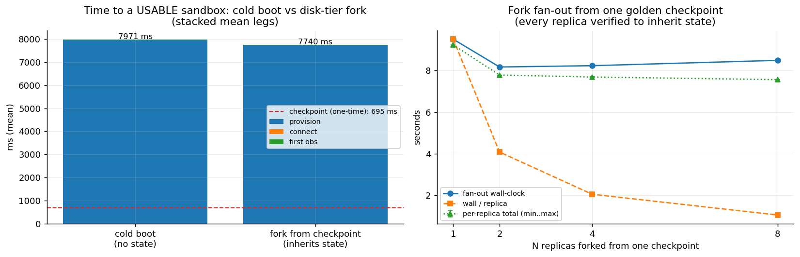
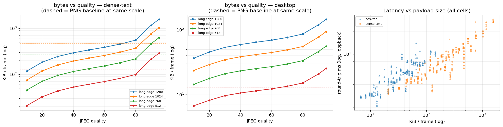
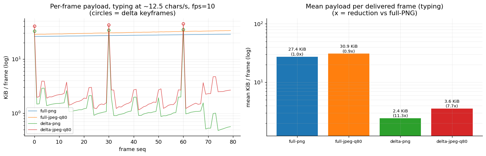
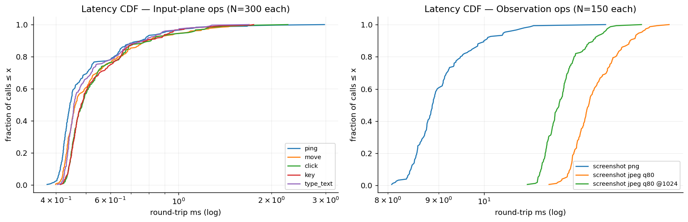
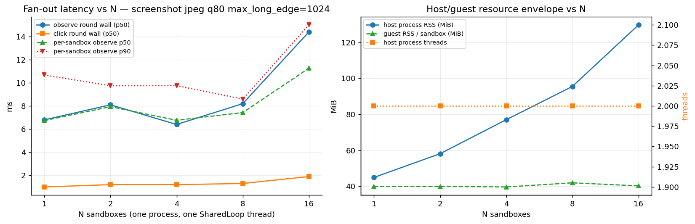

# Local benchmarks — measured numbers for the v0.0.1 vertical slice

First-party, **rerunnable** measurements of the built Linux/X11 slice, taken entirely on one
local machine (Docker + in-process SDK): no WAN, no remote substrate, no vendor numbers. They
complement the remote-WAN measurements in [`streaming-bandwidth.md`](streaming-bandwidth.md)
(B1/B3 were taken across an intercontinental link; §2 there was local) and give the
many-sandbox plan ([`many-sandbox-concurrency.md`](many-sandbox-concurrency.md)) its first
measured local datapoints.

Everything here is reproducible from the repo:

- **Suites** (scripts): [`benchmarks/`](../../benchmarks) — one standalone script per suite,
  `benchmarks/run_all.sh` (or `make benchmarks`) runs them all serially in ~15–25 min.
- **Raw datapoints** (tracked): [`benchmarks/results/*.json`](../../benchmarks/results) —
  **~3,100 individual datapoints** across the five suites, each JSON carrying the full
  environment fingerprint. No image payloads are stored, only numbers.
- **Figures** (tracked, embedded below): `assets/benchmarks/*.png`, regenerated by the same
  scripts.

## 0. Methodology

| | |
|---|---|
| Host | Apple M4 Pro (14 cores), 48 GiB RAM, macOS 26.5 |
| Container runtime | Docker Engine 29.4.3 (Docker Desktop Linux VM) |
| Sandbox image | `shinken/sandbox-linux` built from this commit, **linux/arm64 native** (no emulation) |
| Guest | Xvfb 1280×800×24 + openbox + xterm, `shinkend` release build (X11 backend) |
| Transport | loopback WebSocket (published container port), synchronous Python SDK facade |
| Date | 2026-06-11 |

Latency numbers are end-to-end through the sync SDK: guest capture/injection + `shinkend`
encode + base64/JSON wire framing + the SDK background-loop hop — i.e. what a sync caller (an
eval loop, a trainer step) actually pays per call. Byte counts are decoded payload bytes
(base64+JSON framing adds ~33% on the wire). Each suite boots fresh sandboxes through
`DockerLocalProvider`; suites run serially so they never contend for the Docker daemon.

**Honest caveats.** (1) This is a laptop-class host and Docker Desktop interposes a Linux VM —
treat absolute numbers as one well-specified operating point, not a fleet projection.
(2) Loopback removes the network: WAN adds its RTT on top of every round-trip number here
(measured ~0.28 s in B1/B3). (3) The runtime-state suite exercises the **disk tier only**
(`docker commit`); the memory (CRIU) and sub-ms CoW fork fast tiers are designed, not built
(D5 — see [`status.md`](status.md)). (4) The desktop is xterm-only: the "dense-text" scenario
bounds text-heavy UI content, and nothing here measures photographic/video content (B1's
remote browser desktop is the closest measured point for that).

## 1. Runtime-state checkpoint / fork / resume (S4 — `bench_fork.py`)

The differentiating loop — reach a state once, checkpoint it, mint N live replicas — measured
on the Docker disk tier, with **every replica verified to inherit the golden state** (the
verifier reads a marker file back out of each fork; a timing row only counts if the fork was
real). 8 cold boots, 8 checkpoints, 15 verified forks across fan-outs N ∈ {1, 2, 4, 8}.

| leg | p50 | mean | n |
|---|---:|---:|---:|
| cold boot → usable (create + connect + first obs) | 7.81 s | 7.97 s | 8 |
| — of which container run + desktop readiness | | 7.95 s | |
| — of which SDK connect + handshake | | 5.0 ms | |
| — of which first observation (JPEG q80) | | 18.0 ms | |
| checkpoint (`docker commit`, sandbox stays live) | 0.56 s | 0.70 s¹ | 8 |
| fork → usable (resume + connect + first obs) | 7.57 s | 7.74 s | 15 |

¹ the first commit of a container is slower (1.71 s); subsequent commits settle at ~0.55 s.

| fan-out from ONE checkpoint | wall-clock | wall / replica | state verified |
|---:|---:|---:|---|
| N=1 | 9.51 s | 9.51 s | 1/1 |
| N=2 | 8.17 s | 4.09 s | 2/2 |
| N=4 | 8.24 s | 2.06 s | 4/4 |
| N=8 | 8.49 s | **1.06 s** | 8/8 |



**Reads:**
- **Checkpointing a live sandbox is sub-second (~0.56 s) and non-disruptive** — cheap enough
  to take per task-step in an eval/RL loop.
- **On the disk tier, one fork costs the same as one cold boot (~7.6 s vs ~7.8 s)** — both are
  dominated by `docker run` + desktop readiness, not by the state copy. The fork's value at
  this tier is **state inheritance** (skipping the minutes of setup/replay needed to re-reach
  a mid-task state), not boot-time savings. Cutting the boot itself is exactly what the
  designed CRIU/CoW fast tiers are for (D5, not built).
- **Fan-out is where the disk tier already wins: the wall-clock is FLAT in N.** Minting 8
  verified replicas of one mid-task state costs the same ~8.5 s as minting one — ~9× cheaper
  per replica (9.51 → 1.06 s), because all replicas boot off one committed layer in parallel.
  This is the shape `eval.run_eval_forked` exploits (golden → fork-N → score).

## 2. Observation codec ladder (S1 — `bench_codec_ladder.py`)

Dense local sweep — `format` (PNG/JPEG) × JPEG quality {10…95} × `max_long_edge`
{1280 native, 1024, 768, 512} × 5 repetitions × **two content scenarios** = 440 datapoints.
`desktop` is the image's default desktop (one 80×24 xterm of text on a flat background, ~15%
content coverage); `dense-text` is a near-fullscreen xterm of ANSI-colored text (~95%
coverage). Condensed table (mean bytes, p50 loopback round-trip; full grid in the JSON):

| scenario | codec | native 1280 | @1024 | @768 | @512 |
|---|---|---:|---:|---:|---:|
| dense-text | PNG (lossless) | 747 KiB / 16.7 ms | 468 / 7.8 | 265 / 5.2 | 126 / 3.4 |
| dense-text | JPEG q80 | 553 KiB / 15.9 ms | 370 / 10.8 | 218 / 6.8 | 99 / 4.8 |
| dense-text | JPEG q50 | 339 KiB / 11.5 ms | 225 / 8.7 | 133 / 6.4 | 61 / 4.6 |
| dense-text | JPEG q10 | 117 KiB / 8.5 ms | 75 / 6.3 | 45 / 4.5 | 21 / 3.2 |
| desktop | PNG (lossless) | 65 KiB / 7.9 ms | 43 / 3.3 | 26 / 3.5 | 13 / 2.3 |
| desktop | JPEG q80 | 86 KiB / 7.3 ms | 55 / 5.8 | 33 / 4.7 | 15 / 2.8 |
| desktop | JPEG q50 | 64 KiB / 7.6 ms | 42 / 5.7 | 25 / 4.3 | 11 / 3.2 |
| desktop | JPEG q10 | 36 KiB / 9.1 ms | 24 / 6.0 | 14 / 4.4 | 7 / 2.7 |



**Reads:**
- **The JPEG advantage is content-dependent, and the local data bounds it from below.** On
  dense text, JPEG q50 is only **2.2×** smaller than PNG (339 vs 747 KiB); on the sparse
  desktop **PNG outright wins** below ~q50 (65 KiB PNG vs 86 KiB q80) — flat-color UI
  compresses losslessly extremely well. The ~20× of the remote B1 ladder came from a
  content-rich browser desktop; both are real, the lever's payoff spans **~1–20×** depending
  on pixels. `format` is per-action, so an Operator can choose per frame.
- **JPEG q95 is a trap on text: 1.57 MiB — 2.1× LARGER than lossless PNG** (and 26.6 ms).
  High-quality JPEG on sharp edges is the worst of both worlds; if near-lossless is needed,
  use PNG.
- **Downscale is the strongest single lever and it compounds:** dense-text PNG 747 → 126 KiB
  at @512 (5.9×); stacking JPEG q50@512 reaches 61 KiB — **12.3×** vs native PNG with a
  ~3.4× faster round-trip (16.7 → 4.6 ms). Matching `max_long_edge` to the model's real input
  resolution is free money on any content.
- **Latency tracks bytes** (right panel): everything stays in the 2–27 ms loopback envelope,
  so at local/colo distance the observation is never the step bottleneck — see §4.

## 3. Dirty-tile delta screencast (S2 — `bench_delta_screencast.py`)

Per-frame trace of `screencast(delta=True)` (B2) under a controlled workload: typing into the
xterm at ~12.5 chars/s, fps=10, 80 frames per mode, plus a 3 s idle window per mode. 324
frame-level datapoints. This independently replicates the B2 table from
[`streaming-bandwidth.md`](streaming-bandwidth.md) §2 (which measured 12.1× / 9.5×) on a fresh
run with full traces:

| mode (typing) | frames | keyframes | mean KiB/frame | p50 KiB/frame | vs full-PNG |
|---|---:|---:|---:|---:|---:|
| full-PNG | 80 | 80 | 27.4 | 27.4 | 1.0× |
| full-JPEG q80 | 80 | 80 | 30.9 | 31.1 | 0.9× |
| delta-PNG | 80 | 3 | **2.43** | **1.07** | **11.3×** |
| delta-JPEG q80 | 80 | 3 | 3.55 | 1.87 | 7.7× |

| mode (3 s idle window) | frames delivered | bytes |
|---|---:|---:|
| all four modes | 1 (the initial keyframe) | 30–48 KiB once, then **0** |



**Reads:**
- **The lossless lever replicates: 11.3× under live typing, zero quality loss.** The trace
  (left panel) shows the mechanism: keyframes only at seq 0/30/60 (the periodic-keyframe
  bound), and tile frames at ~1 KiB — a keystroke dirties ~2.2 64px tiles (median tile frame
  1.07 KiB). The mean is keyframe-dominated; the steady-state cost is the p50.
- **delta-PNG > delta-JPEG and even full-JPEG > full-PNG on this content** — the same
  text-content effect as §2, measured from a second angle. Delta-PNG is the right default
  lever for UI work.
- **Idle is actually free.** Across a 3 s idle window every mode delivered exactly the one
  initial keyframe and nothing else — idle suppression works as specified, so parked or
  waiting sandboxes cost ~zero observation bandwidth.

## 4. ACI action / observation latency (S3 — `bench_action_latency.py`)

Per-call round-trip distributions through the sync SDK on one sandbox: N=300 per input-plane
op, N=150 per observation op — 1,950 datapoints.

| op | p50 | p90 | p99 | max | n |
|---|---:|---:|---:|---:|---:|
| `ping` | 0.44 ms | 0.75 | 1.67 | 2.97 | 300 |
| `move` | 0.46 ms | 0.79 | 1.47 | 1.69 | 300 |
| `click` | 0.49 ms | 0.81 | 1.39 | 2.26 | 300 |
| `key` | 0.48 ms | 0.79 | 1.32 | 1.75 | 300 |
| `type_text` (1 char) | 0.46 ms | 0.77 | 1.26 | 1.69 | 300 |
| `screenshot` PNG 1280×800 | 8.87 ms | 9.99 | 11.21 | 13.24 | 150 |
| `screenshot` JPEG q80 | 12.73 ms | 14.00 | 14.91 | 15.33 | 150 |
| `screenshot` JPEG q80 @1024 | 11.89 ms | 12.86 | 13.57 | 14.38 | 150 |



**Reads:**
- **The ACI itself is sub-millisecond.** Input actions land at ~0.45–0.49 ms p50 with p99
  under 1.7 ms — full X11 injection included. Action dispatch is never the step bottleneck;
  sequentially that is ~2,000 input actions/s on one sandbox.
- **A full observation is ~9–13 ms** — i.e. an act-then-observe agent step costs ~10–14 ms of
  runtime overhead at local distance. Against the ~0.28 s WAN RTT of the B-bucket
  measurements, a local-first loop (the harness-integrated fork/eval pattern) runs **~25×
  more steps per unit time** before model inference enters the picture.
- **PNG encodes FASTER than JPEG here** (8.9 vs 12.7 ms p50) — on this mostly-flat desktop
  frame PNG is both smaller (§2) and faster; JPEG's fixed DCT cost only pays for itself on
  dense content or after downscale (q80@1024 < q80 native).

## 5. Local many-sandbox fan-out (S5 — `bench_fanout.py`)

One process drives N ∈ {1, 2, 4, 8, 16} local sandboxes with ALL sync sessions multiplexed on
**one `SharedLoop`** (the §3-B3 recommendation, here measured), running 10 synchronized rounds
of {observe JPEG q80 @1024 + click} per tier. 365 datapoints (310 individual observations + 50
round walls + 5 tier resource rows).

| N | observe round wall p50 | per-sandbox observe p50 / p90 | click round wall p50 | host process RSS | host threads | guest RSS / sandbox | boot wall (4 workers) |
|---:|---:|---:|---:|---:|---:|---:|---:|
| 1 | 6.8 ms | 6.7 / 10.7 ms | 1.0 ms | 44.9 MiB | 2 | 39.9 MiB | 9.2 s |
| 2 | 8.1 ms | 7.9 / 9.8 ms | 1.2 ms | 58.1 MiB | 2 | 39.9 MiB | 7.8 s |
| 4 | 6.4 ms | 6.8 / 9.8 ms | 1.2 ms | 77.0 MiB | 2 | 39.6 MiB | 7.7 s |
| 8 | 8.2 ms | 7.4 / 8.6 ms | 1.3 ms | 95.5 MiB | 2 | 41.9 MiB | 15.6 s |
| 16 | 14.4 ms | 11.3 / 15.0 ms | 1.9 ms | 129.7 MiB | 2 | 40.2 MiB | 33.6 s |



**Reads:**
- **`SharedLoop` does what it was designed to do: the process holds 2 threads at EVERY N**
  (main + one shared event loop) where the default one-loop-per-session model would hold
  N+1. The B3 fan-out measured ~7 MB and one thread of marginal cost per sandbox; here the
  marginal RSS is **~5.7 MiB/sandbox with zero marginal threads** (44.9 → 129.7 MiB over 15
  sandboxes — frame buffers and base64 churn, not threads).
- **Fan-out latency degrades gracefully:** observing all 16 sandboxes takes 14.4 ms p50 —
  ~1,100 observations/s aggregate from one process at this payload (~14.5 KiB/observation,
  i.e. ~130 Mbps of decoded pixels at saturation). Per-sandbox p50 creeps from 6.7 → 11.3 ms
  as the shared loop and the 16 Xvfb guests contend for the same 14 cores.
- **Naive extrapolation to the N=1024 design point:** ~6 GiB host-process RSS (fits) and
  ~40 GiB of guest RSS on this image (a real fleet budget), with per-round wall growing
  super-linearly past the core count — consistent with the
  [`many-sandbox-concurrency.md`](many-sandbox-concurrency.md) position that the local model's
  ceiling is memory governance + scheduling, not bandwidth. The N=64/256/1024 gates remain to
  be run; this suite is the N≤16 anchor for them.
- **Boot remains the expensive verb** (~2.1 s/sandbox amortized at 16 with 4 parallel boots,
  vs ~10 ms to observe) — reinforcing §1: amortize boots via checkpoint/fork, not by booting
  cold per task.

## Reproducing

```sh
# 1. build the sandbox image FROM THE CHECKOUT UNDER TEST (an older image may
#    lack runtime features the suites measure: jpeg codec, delta screencast)
docker build -f images/linux/Dockerfile -t shinken/sandbox-linux .

# 2. run everything (serial, ~15-25 min), or any single suite
make benchmarks                    # == bash benchmarks/run_all.sh
python3 benchmarks/bench_fork.py   # one suite

# outputs land in benchmarks/results/*.json (raw datapoints)
# and docs/engineering/assets/benchmarks/*.png (the figures above)
```

Suites need only `matplotlib` on the host Python and a running Docker daemon; the in-repo SDK
is bootstrapped automatically. Each JSON embeds the host/image fingerprint of the run that
produced it, so divergent reruns are diagnosable. Containers, snapshot images, and checkpoint
registries are cleaned up by each suite on exit (`name_prefix="shinken-bench"`).
