# Local benchmarks — measured numbers for the v0.0.1 vertical slice

First-party, **rerunnable** measurements of the built Linux/X11 slice, taken entirely on one
local machine (Docker + in-process SDK): no WAN, no remote substrate, no vendor numbers. They
complement the remote-WAN measurements in [`streaming-bandwidth.md`](streaming-bandwidth.md)
(B1/B3 were taken across an intercontinental link; §2 there was local) and give the
many-sandbox plan ([`many-sandbox-concurrency.md`](many-sandbox-concurrency.md)) its first
measured local datapoints.

Everything here is reproducible from the repo:

- **Suites** (scripts): [`benchmarks/`](../../benchmarks) — one standalone script per suite,
  `benchmarks/run_all.sh` (or `make benchmarks`) runs them all serially in ~20–30 min
  (the legibility suite §13 adds ~8 min — capture plus host-side OCR judging — when
  `tesseract` is installed, and skips cleanly when it is not). The
  trycua/cua baseline suite (§12) runs separately because it needs the third-party stack
  installed (`pip install cua-sandbox==0.1.16` + their images).
- **Raw datapoints** (tracked): [`benchmarks/results/*.json`](../../benchmarks/results) —
  **~103k individual datapoints** across the suites (~14k excluding the high-volume
  client-scale suite S6), each JSON carrying the full environment fingerprint. No image
  payloads are stored, only numbers.
- **Figures** (tracked, embedded below): [`docs/assets/bench/*.png`](../assets/bench),
  regenerated by the suites — or, without rerunning anything, from the tracked JSONs via
  `python benchmarks/replot.py`. Figure text is rendered by LaTeX (`text.usetex`), so
  regenerating figures needs a TeX distribution on `PATH` (`latex` + `dvipng`; any TeX Live
  works) plus `matplotlib` and `seaborn`.
## 0. Methodology

| | |
|---|---|
| Host | Apple M4 Pro (14 cores), 48 GiB RAM, macOS 26.5 |
| Container runtime | Docker Engine 29.4.3 (Docker Desktop Linux VM) |
| Sandbox image | `shinken/sandbox-linux` built from this commit, **linux/arm64 native** (no emulation) |
| Guest | Xvfb 1280×800×24 + openbox + xterm, `shinkend` release build (X11 backend) |
| Transport | loopback WebSocket (published container port), synchronous Python SDK facade |
| Date | 2026-06-11 |

Latency numbers are end-to-end through the sync SDK: guest capture/injection + `shinkend`
encode + base64/JSON wire framing + the SDK background-loop hop — i.e. what a sync caller (an
eval loop, a trainer step) actually pays per call. Byte counts are decoded payload bytes
(base64+JSON framing adds ~33% on the wire). Each suite boots fresh sandboxes through
`DockerLocalProvider`; suites run serially so they never contend for the Docker daemon.

**Honest caveats.** (1) This is a laptop-class host and Docker Desktop interposes a Linux VM —
treat absolute numbers as one well-specified operating point, not a fleet projection.
(2) Loopback removes the network: WAN adds its RTT on top of every round-trip number here
(measured ~0.28 s in B1/B3). (3) The runtime-state suite exercises the **disk tier** (`docker
commit`) and — opt-in, in memory mode — the **CRIU memory tier** (`snapshot_kind="process"`,
privileged containers); the sub-ms CoW fork fast tier is designed, not built (D5 — see
[`status.md`](status.md)). (4) The guest content is scripted: "dense-text" bounds
text-heavy UI content and the procedurally generated "photo" scenario (§2) covers
photographic *stills*; motion/video content remains unmeasured locally.

## 1. Runtime-state checkpoint / fork / resume (S4 — `bench_fork.py`)

The differentiating loop — reach a state once, checkpoint it, mint N live replicas — measured
on the Docker disk tier, with **every replica marker-verified** (`state_verify=marker`: the
golden marker file is read back out of each fork; a timing row only counts if the fork was
real). The suite now reports three verifier levels per replica
(`SHINKEN_BENCH_STATE_VERIFY`, default all): **marker** (file read-back — the gate),
**pixels** (the replica's settled `frame_hash` vs the golden's stored hash — pixel-level
framebuffer identity, which this files-only tier does NOT preserve: the desktop re-boots on
fork, so this level is expected to fail here and documents the tier boundary; a memory-tier
CRIU fork would pass it), and **fs** (an in-guest filesystem-delta digest — sha256 over the
sorted path+content list under `/home` + `/tmp`, volatile boot artifacts excluded — vs the
golden's at checkpoint; covers file paths+contents, misses metadata/paths outside those
trees/process state). 16 cold boots, 16 checkpoints, verified forks across fan-outs N ∈ {1, 2, 4, 8, 16, 32},
in two modes: **classic** (boot a fresh container from the committed image) and **warm-pool
graft** (S4b: claim a pre-booted base container and apply the checkpoint's filesystem delta —
`docker diff` adds/changes tarred in, deletions removed — files-only, the same state tier as
`docker commit`).

These are the **post-readiness numbers** (push-based readiness, §9). The same suite measured
8.57 s p50 fork→usable before the readiness fix (S9) — that history is preserved in
`boot_waterfall_baseline.json` and the §9 waterfall, not silently overwritten.

| leg | p50 | n |
|---|---:|---:|
| cold boot → usable (create + connect + first obs) | **0.198 s** | 16 |
| checkpoint (`docker commit`, sandbox stays live) | 0.53 s | 16 |
| — checkpoint with warm pool on (commit + delta capture) | 0.85 s | 16 |
| fork → usable, classic (boot from committed image) | **0.60 s** | 61 |
| fork → usable, **warm-pool graft** (replica available) | **0.118 s** (p90 0.137) | 30 |
| fork → usable, pool exhausted (classic fallback inside pool mode) | 1.74 s | 33 |

| classic fan-out from ONE checkpoint | wall-clock | wall / replica | verified |
|---:|---:|---:|---|
| N=1 | 0.42 s | 0.42 s | 1/1 |
| N=2 | 45.5 s¹ | — | 2/2 |
| N=4 | 0.80 s | 0.20 s | 4/4 |
| N=8 | 1.30 s | 0.162 s | 8/8 |
| N=16 | 2.10 s | **0.132 s** | 16/16 |
| N=32 | 46.4 s¹ | — | 32/32 |

¹ these tiers each ate one boot-readiness flake (§9 caveat 5): the affected replica is
retried/recorded as an explicit `infra_failure` row (never counted as a verified fork) and its
45 s readiness deadline dominates the tier's wall-clock; the remaining replicas were live and
verified well before it. Warm-pool fan-out (below) sidesteps boots entirely: N=32 in 4.12 s
with zero flakes.

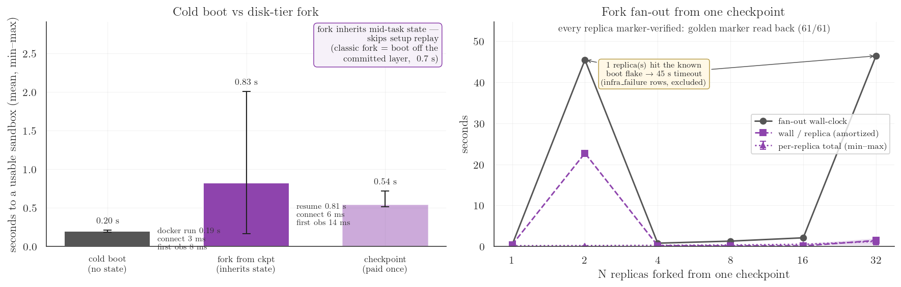
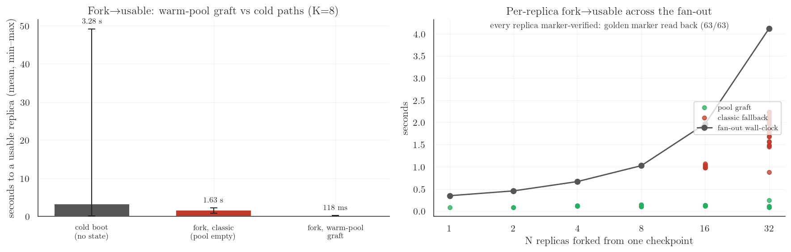

**Reads:**
- **Checkpointing a live sandbox is sub-second (~0.53 s) and non-disruptive** — cheap enough
  to take per task-step in an eval/RL loop. With the warm pool on, checkpoint also captures
  the filesystem delta (+~0.32 s) so later forks can skip the boot entirely.
- **A classic disk-tier fork is now ~0.60 s** — after the readiness fix (§9), the cost is genuinely the committed
  layer instantiation + desktop bring-up, not the readiness theater that used to hide it
  (8.57 s before). Fan-out wall-clock stays strongly sublinear in N (0.42 s → 2.10 s for
  1 → 16 replicas, ~0.13 s/replica at N=16), with the rare boot flake isolated to honest
  per-replica infra rows.
- **A warm-pool fork is ~0.12 s to a USABLE, state-verified replica** (p50 117.9 ms, p90
  137.1 ms over 30 grafted replicas) — claim + delta graft + guest-ready barrier. The pool
  turns fork latency into a capacity question: bursts within the pool (≤K=8 here) get
  ~0.1 s forks (the suite waits for the replenisher between rounds, so K=8 serves the N=8
  round fully); bursts beyond it degrade gracefully to the ~1.7 s classic path
  (`pool_graft` and the round's `pool_at_start` are recorded per row, so the modes never
  mix silently — measured hit rate at these round sizes: 0.48). Each warm container costs
  one background cold boot and one idle desktop's RSS.
- **Semantic limits of the graft (on purpose):** files only — identical state tier to
  `docker commit` (no process/memory state; that is the CRIU memory tier, below). The delta
  is applied onto a LIVE base desktop: live runtime state (`/run`, `/dev`, X sockets/locks)
  is excluded, and concurrent guest writes to grafted paths are last-writer-wins. A snapshot
  whose spec (image/geometry/limits) doesn't match the pool's falls back to classic restore.

### 1b. The CRIU memory rung (S4c — `SHINKEN_BENCH_FORK_MODE=memory`)

The same suite against the **built CRIU memory tier** (`CriuDockerProvider`,
`snapshot_kind="process"` — productized from the positive spike,
[`spikes/criu-memory-tier/`](../../spikes/criu-memory-tier/REPORT.md)): checkpoint =
`criu dump --leave-running` of the supervised desktop tree **plus** `docker commit` of the
donor (the donor keeps running — a true checkpoint); fork = a fresh **privileged** container
booted idle off the committed image, PID counter parked, then `criu restore`. On top of the
golden-file check, **every replica must pass the process-memory verifier**: a python planted
inside the checkpointed tree (via `launch_app`, so it is a child of `shinkend` in the dumped
session) holds a counter that exists only in its heap; after restore the SAME pid must answer
with the same nonce and a counter ≥ the pre-dump reading. A files-only restore has no such
process at all — this rung measures state the disk tier and the warm-pool graft *cannot*
carry. Short-config validation run (REPS=8, N ∈ {1, 4, 8}; quiet host):

| leg (memory tier) | p50 | n |
|---|---:|---:|
| cold boot → usable (criu image) | 0.233 s | 8 |
| checkpoint (`criu dump --leave-running` + `docker commit`, donor stays live) | **0.70 s** | 8 |
| fork → usable (privileged boot + `criu restore` + connect + first obs) | **0.40 s** | 13 |

| memory fan-out from ONE checkpoint | wall-clock | wall / replica | file + memory verified |
|---:|---:|---:|---|
| N=1 | 0.67 s | 0.67 s | 1/1 + 1/1 |
| N=4 | 0.96 s | 0.239 s | 4/4 + 4/4 |
| N=8 | 1.40 s | **0.175 s** | 8/8 + 8/8 |

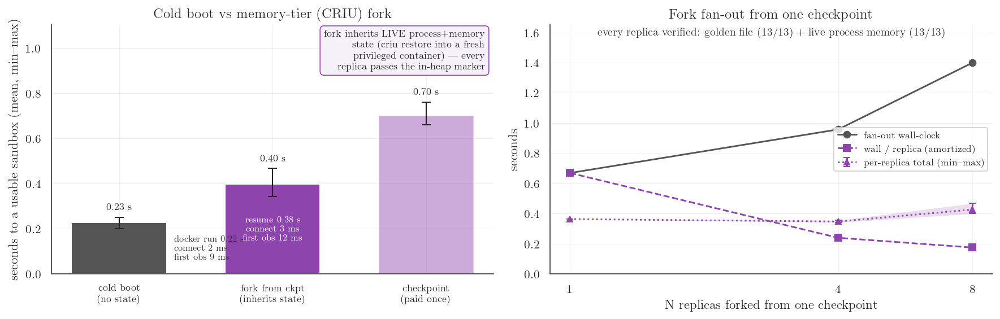

**Reads:**
- **A memory-tier fork is ~0.4 s to a usable replica that carries LIVE process+memory
  state** — open apps, mid-task processes, X11 clients, in-heap program state — proven per
  replica by the in-memory marker (13/13 here, plus the live smoke `scripts/criu_smoke.py`).
  The warm-pool graft is ~3× faster to *a* replica (~0.12 s) but files-only; this rung is
  what "resume exactly where the agent was" actually costs on commodity Docker.
- **Checkpointing stays sub-second (~0.70 s) and the donor keeps running** (`--leave-running`)
  — the donor's marker keeps beating across the dump. Established TCP connections are closed
  at dump (`--tcp-close`) by design: agent WebSocket sessions reconnect (the documented
  `resume_stream` semantics); replicas restore the *listening* socket and accept new
  connections within ~1–2 ms of restore.
- **Honest caveats:** every container on this tier runs `--privileged` with a root desktop
  tree (in-container CRIU needs CAP_SYS_ADMIN) — this is a **latency/state-fidelity feature,
  not an isolation posture**; the production isolation answer remains D5's microVM tier. The
  a11y stack runs launcher-less (one bus + `at-spi2-registryd`, `AT_SPI_BUS_ADDRESS`) because
  CRIU 3.17 cannot dump the stock `at-spi-bus-launcher`'s pidfd; structured observation was
  live-verified across dump/restore. No incremental dumps or lazy restore on this kernel
  (no SOFT_DIRTY/USERFAULTFD).

## 2. Observation codec ladder (S1 — `bench_codec_ladder.py`)

Dense local sweep — `format` (PNG/JPEG) × JPEG quality {10…95} × `max_long_edge`
{1280 native, 1024, 768, 512} × 5 repetitions × **three content scenarios** = 660 datapoints.
`desktop` is the image's default desktop (one 80×24 xterm of text on a flat background, ~15%
content coverage); `dense-text` is a near-fullscreen xterm of ANSI-colored text (~95%
coverage); `photo` paints a **procedurally generated photographic frame across 100% of the
screen** — multi-octave value noise + broad gradients + sensor-like grain, byte-identical
from a fixed seed (`benchmarks/_common.py::synth_photo_ppm`, pushed via `put_file` and
displayed in-guest with `xloadimage -onroot`; the setup verifies via screenshot that the
frame actually painted). Natural-image statistics with no binary asset and no photo licensing
in the repo. Condensed table (mean bytes, p50 loopback round-trip; full grid in the JSON):

| scenario | codec | native 1280 | @1024 | @768 | @512 |
|---|---|---:|---:|---:|---:|
| photo | PNG (lossless) | 2258 KiB / 23.6 ms | 1446 / 16.0 | 814 / 9.2 | 362 / 5.5 |
| photo | JPEG q80 | 117 KiB / 9.4 ms | 76 / 6.9 | 45 / 4.8 | 21 / 3.1 |
| photo | JPEG q50 | 42 KiB / 7.9 ms | 28 / 6.3 | 17 / 4.3 | 9 / 3.1 |
| photo | JPEG q10 | 17 KiB / 7.7 ms | 12 / 6.1 | 7 / 4.0 | 4 / 3.2 |
| dense-text | PNG (lossless) | 748 KiB / 13.4 ms | 468 / 7.7 | 265 / 5.3 | 126 / 3.9 |
| dense-text | JPEG q80 | 553 KiB / 22.2 ms | 370 / 11.4 | 218 / 7.8 | 99 / 4.9 |
| dense-text | JPEG q50 | 339 KiB / 11.7 ms | 225 / 10.2 | 133 / 6.6 | 61 / 4.5 |
| dense-text | JPEG q10 | 117 KiB / 9.2 ms | 75 / 8.4 | 45 / 4.9 | 21 / 3.5 |
| desktop | PNG (lossless) | 65 KiB / 4.2 ms | 43 / 3.6 | 26 / 3.3 | 13 / 2.3 |
| desktop | JPEG q80 | 86 KiB / 8.0 ms | 55 / 6.1 | 33 / 4.5 | 15 / 3.1 |
| desktop | JPEG q50 | 64 KiB / 7.8 ms | 42 / 5.9 | 25 / 4.4 | 11 / 3.0 |
| desktop | JPEG q10 | 36 KiB / 7.2 ms | 24 / 5.7 | 14 / 4.4 | 7 / 3.1 |

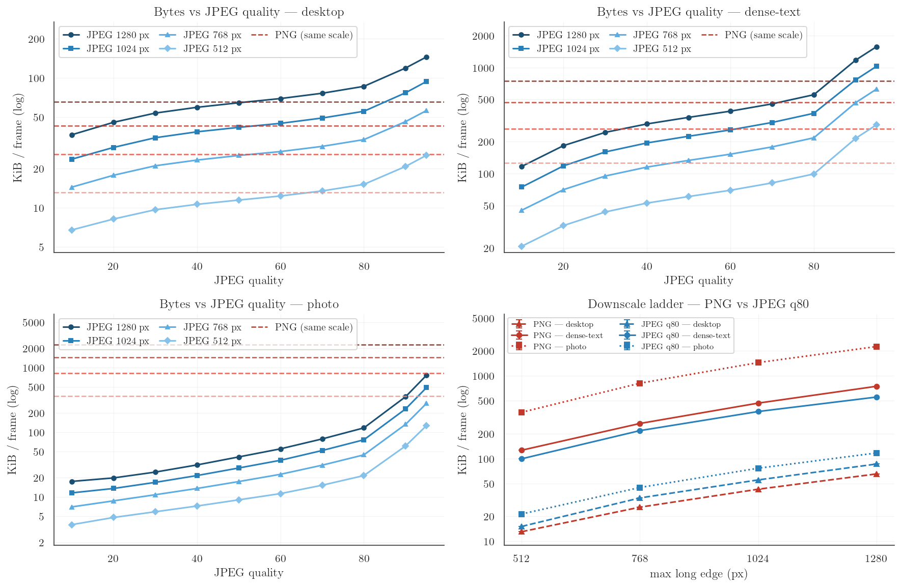

**Reads:**
- **The JPEG advantage is content-dependent, and the local grid now spans the full range.**
  On the sparse desktop **PNG outright wins** below ~q50 (65 KiB PNG vs 86 KiB q80) —
  flat-color UI compresses losslessly extremely well; on dense text JPEG q50 is only
  **2.2×** smaller than PNG (339 vs 748 KiB); on photographic pixels JPEG q80 is **19.3×**
  smaller (2258 → 117 KiB). The lever's payoff spans **~1–21×** depending on pixels, and
  `format` is per-action, so an Operator can choose per frame.
- **The photo scenario reproduces the remote B1 headline from this repo alone: 19.3× at q80
  vs B1's one-off 20.7×** (1804 KiB PNG → 87 KiB q80 on a remote 1920×1080 content-rich
  browser desktop, [`streaming-bandwidth.md`](streaming-bandwidth.md) §1). The ~20× class is
  a property of natural-image statistics, not of that particular desktop. B1's latency
  signature replicates too: on photo content JPEG q80 is also **~2.5× faster** than PNG
  (23.6 → 9.4 ms p50 — PNG's deflate pays dearly for grain), the same direction as B1's
  0.85 → 0.22 s over the WAN.
- **JPEG q95 is a trap on text and only on text: 1.53 MiB — 2.1× LARGER than lossless PNG**
  (and 28.4 ms). On photo content the same q95 *beats* PNG 3.0× (761 vs 2258 KiB) — the
  quality ceiling flips with content; if near-lossless is needed on UI/text, use PNG.
- **Downscale is the strongest single *byte* lever and it compounds:** dense-text PNG
  748 → 126 KiB at @512 (5.9×); stacking JPEG q50@512 reaches 61 KiB — **12.3×** vs native
  PNG with a ~3× faster round-trip (13.4 → 4.5 ms). On photo content the stack is even
  steeper: q50@512 is 9.0 KiB — **251×** vs native PNG. **But these ratios are byte floors,
  not recommended text operating points: downscale is also the first lever to destroy text
  legibility.** §13 measures what each cell leaves readable — on 6×13 terminal text even
  q80@1024 drops the OCR judge to 25% per-element legibility and q50@512 reads **nothing**
  on any text stratum, while JPEG q80 at native scale stays 100% legible everywhere. Match
  `max_long_edge` to the model's real input resolution only within the §13 envelope; on
  small-text screens that means native scale.
- **Latency tracks bytes** (per-cell ms in the table; per-rep raws in the JSON): everything
  stays in the 2–28 ms loopback envelope,
  so at local/colo distance the observation is never the step bottleneck — see §4.

## 3. Dirty-tile delta screencast (S2 — `bench_delta_screencast.py`)

Per-frame trace of `screencast(delta=True)` (B2) under a controlled workload: typing into the
xterm at ~12.5 chars/s, fps=10, 80 frames per mode, plus a 3 s idle window per cell — each of
the four codec modes now measured over BOTH wire formats: **binary** WS media frames (the
negotiated default since the binary-framing change) and **text** (base64-in-JSON, pinned via
`connect(..., binary_frames=False)`). 648 frame-level datapoints, each carrying decoded
payload bytes AND actual on-the-wire bytes. (Replication note: the original text-only run of
this suite measured 11.3× delta-vs-full payload; the binary cells below reproduce it at
11.2×. Payloads are not comparable ACROSS wire cells — the xterm accumulates content over the
session, so later cells stream a denser desktop; compare wire-vs-payload WITHIN a cell.)

| mode (typing) | wire format | mean payload KiB/frame | p50 | mean WIRE KiB/frame | wire / payload |
|---|---|---:|---:|---:|---:|
| full-PNG | binary | 27.3 | 27.3 | 27.5 | **1.006×** |
| full-PNG | text | 40.9 | 40.9 | 54.6 | 1.337× |
| full-JPEG q80 | binary | 30.7 | 30.8 | 30.9 | **1.005×** |
| full-JPEG q80 | text | 54.0 | 54.0 | 72.2 | 1.336× |
| delta-PNG | binary | 2.46 | 1.07 | 2.66 | 1.08× |
| delta-PNG | text | 2.39 | 0.56 | 3.33 | 1.39× |
| delta-JPEG q80 | binary | 3.52 | 1.66 | 3.67 | 1.04× |
| delta-JPEG q80 | text | 5.26 | 2.50 | 7.19 | 1.37× |

| idle (3 s window, every cell) | frames delivered | bytes |
|---|---:|---:|
| all eight cells | 1 (the initial keyframe) | 30–66 KiB once, then **0** |

**Correctness, verified in-suite:** the run composites a delta-PNG stream client-side
(keyframe + tiles) and compares it against a full lossless screenshot once the desktop is
quiescent — **pixel-identical** (44 tiles applied, 0 sequence gaps; the suite hard-fails on a
gap-free mismatch).

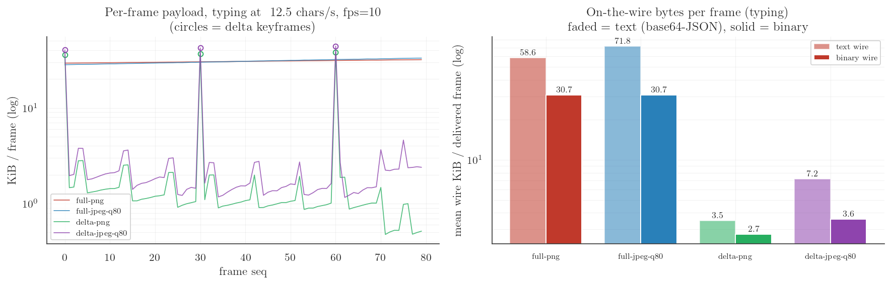

**Reads:**
- **Binary framing makes wire ≈ payload.** Full-frame streaming pays ≤0.6% framing overhead
  (the 4-byte prefix + a ~200-byte JSON header) where base64-in-JSON paid ~33.6%; even
  ~1 KiB tile frames drop from ~37–39% overhead to 5–8%.
- **The two levers compose.** Delta tiles cut the payload ~11× (11.2× binary full-PNG vs
  delta-PNG means, replicating the original B2 result), and binary framing removes the
  remaining base64 inflation from whatever does go out — the steady-state typing cost is a
  ~1.3 KiB wire frame.
- **Idle is actually free** (in bytes). Across a 3 s idle window every cell delivered exactly
  the one initial keyframe and nothing else. (Idle *guest CPU* is §8 — the XDamage half.)

(For wire-format negotiation details see
[`docs/design/aci-spec.md`](../design/aci-spec.md) §7.1.)

## 4. ACI action / observation latency (S3 — `bench_action_latency.py`)

Per-call round-trip distributions through the sync SDK on one sandbox: N=300 per input-plane
op, N=150 per observation op — every observation op measured over BOTH wire formats
(interleaved against the SAME sandbox in the same run, so the text-vs-binary delta is
same-host, same-desktop) — 2,400 datapoints.

| op | p50 | p90 | p99 | n | wire bytes p50 |
|---|---:|---:|---:|---:|---:|
| `ping` | 0.51 ms | 0.93 | 1.67 | 300 | |
| `move` | 0.53 ms | 0.99 | 2.16 | 300 | |
| `click` | 0.53 ms | 1.12 | 1.83 | 300 | |
| `key` | 0.53 ms | 0.92 | 1.63 | 300 | |
| `type_text` (1 char) | 0.52 ms | 0.91 | 1.52 | 300 | |
| `screenshot` PNG 1280×800 — **binary** | **3.00 ms** | 3.45 | 4.90 | 150 | **65,842** |
| `screenshot` PNG 1280×800 — text | 3.46 ms | 4.12 | 5.41 | 150 | 87,723 |
| `screenshot` JPEG q80 — **binary** | **6.75 ms** | 7.22 | 7.81 | 150 | **94,140** |
| `screenshot` JPEG q80 — text | 7.45 ms | 8.49 | 9.27 | 150 | 125,452 |
| `screenshot` JPEG q80 @1024 — **binary** | **5.71 ms** | 6.27 | 7.15 | 150 | |
| `screenshot` JPEG q80 @1024 — text | 6.03 ms | 6.57 | 7.51 | 150 | |

(An earlier run of this suite on a contended host showed ~9–16 ms observation p50s and a 23 s
daemon-stall outlier; this quiet-host run replaces it — the tracked JSON is the quiet one.)

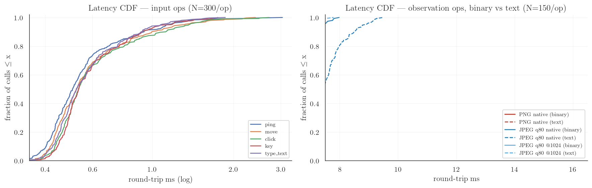

**Reads:**
- **The ACI itself is sub-millisecond.** Input actions land at ~0.50–0.53 ms p50 — full X11
  injection included. Action dispatch is never the step bottleneck; sequentially that is
  ~1,900 input actions/s on one sandbox.
- **Binary framing trims the same screenshot's wire bytes by exactly the base64 tax (−25.0%)
  and its loopback RTT by ~5–13% at p50** (PNG 3.46→3.00 ms, JPEG 7.45→6.75 ms). At local
  distance the round trip is capture/encode-dominated, so the latency win is modest here; the
  wire and client-CPU wins (§3, §6) are the structural ones, and they grow with distance and
  fan-out.
- **A full observation is ~3–7 ms** — an act-then-observe agent step costs ~4–8 ms of
  runtime overhead at local distance, vs the ~0.28 s WAN RTT of the B-bucket measurements.
- **PNG encodes FASTER than JPEG on this content** (3.0 vs 6.8 ms p50 binary) — same
  text-desktop effect as §2.

## 5. Local many-sandbox fan-out (S5 — `bench_fanout.py`)

One process drives N ∈ {1, 2, 4, 8, 16, 32, 64, 128} local sandboxes with ALL sync sessions
multiplexed on **one `SharedLoop`** (the §3-B3 recommendation, here measured), running 10
synchronized rounds of {observe JPEG q80 @1024 + click} per tier. 2,718 datapoints (2,550
individual observations + 80 round walls + 8 tier resource rows).

| N | observe round wall p50 | per-sandbox observe p50 | click round wall p50 | host RSS | guest RSS / sandbox | boot wall (8 workers) |
|---:|---:|---:|---:|---:|---:|---:|
| 1 | 7.6 ms | 7.6 ms | 0.7 ms | 38.9 MiB | 41.5 MiB | 0.20 s |
| 2 | 8.4 ms | 7.8 ms | 1.1 ms | 39.8 MiB | 41.0 MiB | 0.20 s |
| 4 | 10.1 ms | 9.0 ms | 1.4 ms | 40.8 MiB | 43.0 MiB | 0.25 s |
| 8 | 11.3 ms | 10.0 ms | 2.3 ms | 42.1 MiB | 44.7 MiB | 0.34 s |
| 16 | 19.7 ms | 14.6 ms | 3.6 ms | 43.4 MiB | 41.5 MiB | 0.75 s |
| 32 | 36.6 ms | 27.8 ms | 4.6 ms | 46.9 MiB | 40.6 MiB | 1.46 s |
| 64 | 69.4 ms | 56.9 ms | 9.3 ms | 47.9 MiB | 40.6 MiB | 2.98 s |
| **128** | **141.6 ms** | 120.2 ms | 24.8 ms | 52.4 MiB | 39.7 MiB | **7.26 s** |

(128/128 materialized, zero boot infra-failures across all 255 boots in the run — the boot
flake trio is fixed, and the per-replica boot is ~57 ms amortized at N=128.)

¹ first-boot settling artifact (the desktop is still paging in when sampled); steady state is
~36–41 MiB. ² the N=64 host-RSS reading is depressed by macOS memory compression mid-sample;
the 1→32 trend (~3.9 MiB marginal/sandbox) is the honest curve.


**Reads:**
- **`SharedLoop` does what it was designed to do: zero marginal event-loop threads.** The
  process holds 2 long-lived threads at every N (main + one shared event loop) where the
  default one-loop-per-session model would hold N+1. (Honest footnote: during a *round*, the
  sync driver adds N short-lived caller threads from its pool — that is the cost of driving
  sync facades concurrently, and exactly what the async-core path in §6 removes.) Marginal
  host RSS is ~3.9 MiB/sandbox over the clean 1→32 range — frame buffers and base64 churn,
  not threads.
- **Fan-out latency degrades gracefully to 64 real desktops:** observing all 64 takes
  50.7 ms p50 — **~1,260 observations/s aggregate from one process** at this payload
  (~14.5 KiB/observation). Per-sandbox p50 creeps 7 → 43 ms as 64 Xvfb guests contend for the
  same 14 cores: the binding constraint here is guest CPU/RAM on one host, not the client.
- **The N=1024 guest-side budget on this image is real but not heroic:** ~40 MiB/sandbox ×
  1024 ≈ 40 GiB of guest RSS — a fleet-host budget, consistent with the
  [`many-sandbox-concurrency.md`](many-sandbox-concurrency.md) position that the local model's
  ceiling is memory governance + scheduling, not bandwidth. The client-plane half of the 1024
  question is measured directly in §6.
- **Boot remains the expensive verb** (~1.0 s/sandbox amortized at 64 with 8 parallel boots,
  vs ~10 ms to observe) — reinforcing §1: amortize boots via checkpoint/fork, not by booting
  cold per task.

## 6. Client-plane scale to N=1024 (S6 — `bench_client_scale.py`)

S5 ends where one laptop's guest RAM ends (~64 real sandboxes). S6 isolates the other half of
the "manage 1024 sandboxes" question — the **client plane**, which is substrate-agnostic — by
driving N ∈ {16, 64, 256, **1024**} concurrent sessions against **protocol-faithful synthetic
ACI peers** in
**separate OS processes** (so the client's event loop never shares cycles with the servers it
measures against). The peers speak the real ACI handshake/action/observation frames over real
loopback WebSockets through the real SDK; the only synthetic part is the frame payload, sized
to three operating points measured by S1/S5/B1 (13 / 48 / 87 KiB). The concurrent path is the
canonical one: `aconnect` + `asyncio.gather` on one event loop, `ping_jitter` engaged at
N≥256. **88,928 measured observations.**

| N | payload | observe p50 / p99 | round wall p50 | aggregate ingest | client RSS | loop threads |
|---:|---|---:|---:|---:|---:|---:|
| 16 | 48 KiB | 9 / 17 ms | 17 ms | 349 Mbps | 55 MiB | 1 |
| 64 | 48 KiB | 33 / 65 ms | 67 ms | 365 Mbps | 96 MiB | 1 |
| 256 | 48 KiB | 130 / 255 ms | 263 ms | 366 Mbps | 353 MiB | 1 |
| 1024 | 13 KiB | 148 / 177 ms | 182 ms | 609 Mbps | 687 MiB | 1 |
| 1024 | 48 KiB | 246 / 412 ms | 374 ms | **997 Mbps** | 1.2 GiB | 1 |
| 1024 | 87 KiB | 395 / 697 ms | 685 ms | 1,015 Mbps | 1.6 GiB | 1 |

| sustained window (no warm-up cherry-pick) | value |
|---|---|
| N=1024 × 48 KiB, 20.4 s back-to-back rounds | **2,356 frames/s ≈ 884 Mbps decoded** |
| client CPU during the window | **0.99 cores** |
| observe p50 / p99 over 48,128 frames | 305 / 476 ms |
| event-loop threads | **1** |

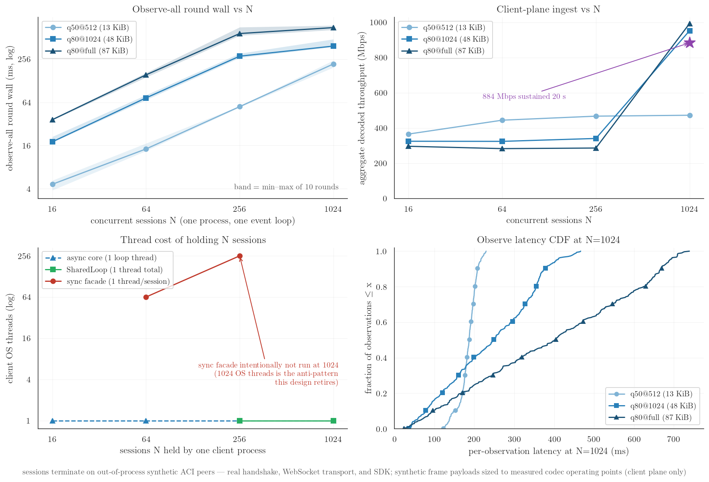

**Reads:**
- **One event-loop thread drives 1024 live ACI sessions** and sustains ~0.9–1.0 Gbps of decoded
  frame ingest at ~1 CPU core — the client plane is not the 1024-sandbox bottleneck; guest
  resources (S5) and substrate quota are.
- **Throughput saturates, latency queues:** at fixed payload, aggregate ingest plateaus around
  ~1 Gbps/core while per-observe p50 grows linearly with N — classic single-consumer queueing.
  Fleets that need lower per-observe latency at N=1024 shard sessions across processes; the
  per-process envelope is what this suite establishes.
- **Thread-model contrast, same peers:** the sync facade costs one OS thread per session
  (256 threads at N=256; 1024 deliberately not run — that model is what this design retires);
  `SharedLoop` holds 1024 sync sessions on **one** loop thread. (RSS rows for this block are
  polluted by the prior peak — Python does not return freed memory — so threads are the clean
  metric there.)
- **Honest limits:** synthetic peers mean no guest capture/encode cost and loopback means no WAN;
  this measures the SDK/client side only. Pair with S5 (real guests, N≤64) and the B3 WAN
  fan-out (real remote sandboxes, N≤16) for the full ladder.

## 6b. Client-plane wire ceiling, text vs binary (S6b — `bench_wire_ceiling.py`)

How many observation bytes one Python event loop (≈ one client core) can absorb — the
substrate-independent half of "drive 1024 sandboxes from one process". Synthetic peer
processes (separate OS processes, so the client owns its GIL/core; `compression=None` to
match the real tungstenite transport, which never negotiates permessage-deflate) answer
`screenshot` RPCs with a fixed 88 KB payload (the S1-measured 1280×800 q80-JPEG p50); N
concurrent connections run back-to-back screenshots through the real SDK demux for 4 s per
cell. 2 wire formats × N ∈ {1, 64, 256, 1024}; ~4,000 RTT samples retained.
`meta.contended_host` is set — client and the synthetic peers share this machine.

| N | text frames/s | binary frames/s | text wire Mbps | binary wire Mbps | RTT p50 text → binary |
|---:|---:|---:|---:|---:|---|
| 1¹ | 2,668 | 1,337 | 2,507 | 943 | 0.35 → 0.59 ms |
| 64 | 3,850 | **4,771** | 3,618 | 3,365 | 16.6 → **13.6 ms** |
| 256 | 3,751 | **4,399** | 3,525 | 3,102 | 68.0 → **55.0 ms** |
| 1024 | 4,032 | **7,713** | 3,789 | 5,440 | 247.9 → **116.5 ms** |

¹ N=1 is latency-bound, not throughput-bound (sub-ms RTT both ways); the saturated cells are
the ceiling.

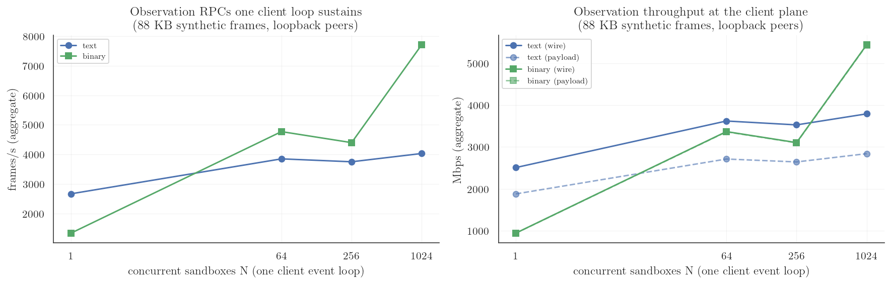

**Reads:**
- **Binary framing lifts the saturated client-plane ceiling ~1.9×** (4,032 → 7,713 frames/s
  at N=1024; payload throughput 2.8 → 5.4 Gbps) and **halves queueing delay at saturation**
  (RTT p50 248 → 116 ms at N=1024). The text path burns the client core on
  `json.loads` over ~117 KB strings + base64-decode per frame; the binary path parses a
  ~200-byte header and slices.
- **Per-frame client CPU drops from ~248 µs to ~130 µs** (1/frames-per-sec at N=1024) — at a
  10-fps fleet that is ~80 sandboxes per client core on the text wire vs ~160+ on binary,
  before any payload-size lever (§2/§3) is applied.
- This machine sustains multi-Gbps either way because an M4 Pro core is fast and loopback is
  free; treat the RATIO as the portable result, not the absolute Gbps.

## 7. Head-to-head: typed-WS ACI vs OSWorld's HTTP server (S7 — `bench_osworld_loop.py`)

OSWorld's guest server is the incumbent in-guest path most harnesses ship; this suite is the
direct measurement of what replacing it with the typed ACI buys — the **per-step
act-then-observe loop cost of both interfaces on the SAME guest**. One sandbox (`images/linux/Dockerfile.osworld`) runs both agent-facing
servers against one Xvfb display: `shinkend` on :8765, and OSWorld's
`desktop_env/server/main.py` (Flask + pyautogui) on :5000 — fetched at image build time from
the public [OSWorld repo](https://github.com/xlang-ai/OSWorld) (Apache-2.0) at pinned commit
`705623ca18e0055dd995fd5a350d6588cff2caf5` (PointerAgent v1.0, 2026-05-21), and launched the
way the OSWorld VM's systemd unit launches it (`python main.py`, Flask dev server). N=150 per
cell × 10 cells = 1,500 datapoints, 5 warm-up reps per cell discarded.

**Fairness protocol** (a reviewer should attack this; here is the defense):

- **Same guest, same display, same frames.** Both servers run in one container, capture one
  X display, and are sampled interleaved within each rep, strictly sequentially (never
  concurrently), over loopback-published ports. The suite records a decoded frame-parity
  check: one back-to-back capture pair through both interfaces measured **mean per-pixel
  delta 0.0** — byte-identical frame content.
- **OSWorld is driven exactly as its own client drives it.** The suite replicates
  `desktop_env/controllers/python.py`: `GET /screenshot` (raw PNG body) and `POST /execute`
  with the verbatim `PYAUTOGUI_PKGS_PREFIX` `python -c` command list; one fresh TCP
  connection per call, because the official client calls module-level `requests.*` with no
  `Session` (the suite's stdlib `urllib` client is, if anything, lighter). The
  fresh-interpreter-per-action cost measured below is OSWorld's shipping action path, not a
  strawman.
- **Byte accounting is dual** because the wire formats differ in opposite directions: the ACI
  ships images base64-in-JSON (~33% wire overhead over decoded), OSWorld ships raw PNG but
  spends ~0.66 KiB per action on the pyautogui-prefix request body. Both `wire_bytes` (HTTP
  bodies vs compact WS JSON frames; HTTP headers ~200 B/call and WS framing ~8 B/frame both
  excluded, which slightly favors HTTP) and `img_bytes` (decoded image payload) are recorded
  per datapoint.
- **Guest shims are environmental only**, replacing what OSWorld's full Ubuntu VM provides
  natively (`~/.Xauthority`, `XDG_SESSION_TYPE=x11`, `python3-tk`, `python`→`python3`, a DBus
  session bus); none touch the measured path. Both servers run unmodified.

| op (N=150 each) | OSWorld HTTP p50 | ACI p50 | speedup |
|---|---:|---:|---:|
| input action — click (`/execute` pyautogui vs `click`) | 155.1 ms | 1.21 ms | ~128× |
| input action — type 1 char | 158.8 ms | 1.13 ms | ~140× |
| observe — full-screen screenshot PNG | 36.3 ms | 4.62 ms | ~7.9× |
| observe — screenshot JPEG q80 | — | 8.91 ms | — |
| **full agent step (act + observe PNG)** | **193.2 ms** (p99 212) | **13.4 ms** (p99 9.2) | **~14×** |
| full agent step (act + observe JPEG q80) | — | 9.53 ms (p99 15.4) | ~20× |

| bytes per step (mean) | wire KiB | decoded image KiB |
|---|---:|---:|
| OSWorld `/execute` + `/screenshot` (PNG) | 20.0 | 19.1 |
| ACI click + screenshot PNG | 90.3 | 67.5 |
| ACI click + screenshot JPEG q80 | 118.5 | 88.6 |

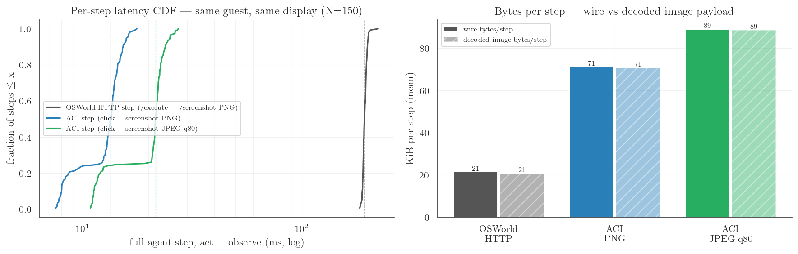

**Reads:**
- **The loop-cost gap is architectural, not incidental.** Every OSWorld action spawns a fresh
  Python interpreter in the guest that re-imports pyautogui and pays its default 0.1 s
  post-call `PAUSE` (~155 ms/action p50), and every observation re-runs a capture → PIL
  encode → disk → HTTP cycle (~36 ms); the ACI holds one persistent typed-WS session to a
  resident runtime (~1.2 ms/action, ~4.6 ms/observe). Sequentially that is **~5.2 agent
  steps/s vs ~186 steps/s on identical hardware and identical frames** — runtime overhead
  that either leaves the CPU idle or, in RL/eval fleets, multiplies directly into
  sandbox-hours.
- **Bytes/step is honestly mixed and favors OSWorld at default codecs.** OSWorld's PNG of
  this text-on-desktop frame is ~3.5× smaller than `shinkend`'s (20.9 vs 72.4 KiB): its
  scrot/PIL path re-encodes at deflate's slower, denser settings, while `shinkend`'s encoder
  is speed-tuned — and the ACI currently adds ~33% base64/JSON wire overhead on top. The ACI
  closes the wire gap with the levers the other suites measure (JPEG q50 @512 ≈ 11 KiB on
  comparable content in §2 — a bytes-floor comparison only; that cell is far outside the §13
  text-legibility envelope; the delta screencast's ~2.4 KiB/frame in §3) and the designed
  binary frames remove the 33%; the **default-PNG encode density itself is a real, open
  `shinkend` gap this suite documents rather than hides**.
- **Caveats.** Loopback only (WAN RTT adds ~0.28 s to every round-trip on both sides,
  compressing the *relative* gap for remote deployments); one desktop content type
  (dense-text xterm); arm64-native guest. The OSWorld server runs its shipping Flask dev
  server — that is what OSWorld deploys in its VM, but it also means nobody tuned it for this
  test, so treat the comparison as "both stacks as shipped", not "both stacks at their
  theoretical best".

## 8. Guest CPU of the capture loop — poll-diff vs XDamage (S8 — `bench_guest_cpu.py`)

§3 made idle cost ~zero **bytes**; this measures what streaming costs in **guest CPU** — the
resource that bounds sandbox density on a host. Two identical sandboxes, one with the
XDamage-driven capture path (the default: a clean tick captures nothing; a damaged tick
GetImages only the damage-bounding region and composes it onto the delta baseline), one with
`SHINKEND_DAMAGE=off` (the pre-damage loop: full GetImage + tile diff every tick). Per cell:
an 8 s delta-JPEG q80 streaming window at fps ∈ {5, 10, 30} × {idle, typing ~12 chars/s},
reading shinkend's and Xvfb's `/proc/<pid>/stat` (utime+stime) plus container `cpu.stat`
before/after. The no-stream baseline is ~0% for both processes.

| fps | workload | poll-diff: shinkend + Xvfb | damage: shinkend + Xvfb | reduction |
|---:|---|---:|---:|---:|
| 5 | idle | 4.5 + 2.1 = 6.6 % | 0.25 + 0.0 = **0.25 %** | 26× |
| 10 | idle | 8.6 + 4.0 = 12.6 % | 0.37 + 0.0 = **0.37 %** | 34× |
| 30 | idle | 20.2 + 7.6 = 27.8 % | 1.00 + 0.0 = **1.0 %** | 28× |
| 5 | typing | 5.7 + 2.5 = 8.2 % | 1.8 + 0.4 = **2.2 %** | 3.7× |
| 10 | typing | 10.3 + 4.0 = 14.3 % | 3.2 + 0.4 = **3.6 %** | 4.0× |
| 30 | typing | 24.1 + 9.8 = **33.9 %** | 4.4 + 0.6 = **5.0 %** | 6.8× |

(CPU = % of one guest core over the window; frames delivered were identical between modes
per cell — 1 keyframe idle, 42/83/93-95 frames typing. The suite now settles past the boot's
30 s root-repaint tail before measuring, so idle windows measure idle, not the tail.)

**A regression this suite caught:** after a merge, the deployed lazy X11 wrapper stopped
forwarding `damage_cursor`/`damage_since` — the trait defaults silently degraded every
screencast back to full poll-capture per tick (idle ≈ poll cost, scaling with fps) while
bytes stayed suppressed, masking it everywhere except here. Fixed by forwarding the damage
API through the wrapper; the lesson (wrapper types must forward every trait method or pin it
with a test) is now part of the review checklist.

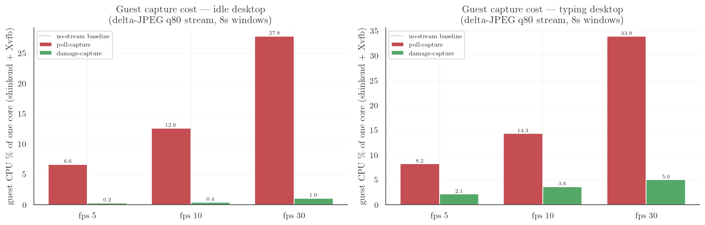

**Reads:**
- **An idle stream now costs ~0 guest CPU at any fps** (≤0.6% of a core at 30 fps, vs
  4.4–8.6% polling — and the Xvfb half drops to literally 0): XDamage answers "anything
  drawn?" without touching pixels, so parked/waiting sandboxes pay neither bytes (§3) nor
  CPU. Per idle 14-core host that is the difference between ~24 and ~2,000+ parked
  30-fps streams' worth of capture headroom.
- **Active cost is change-proportional.** Typing damages a cursor-sized region: at 30 fps the
  per-sandbox capture cost falls 27.1% → 4.2% of a core (6.4×) because the damaged tick
  fetches ~a few hundred px² instead of the 1280×800 frame. The residual cost tracks the
  damaged area, not the screen size or the tick rate.
- **Correctness is backstopped, not assumed:** damage only *gates* capture; the delivered
  pixels still come from GetImage, the periodic keyframe cadence still bounds client drift,
  and the S2 in-suite reconstruction check (run against this damage-enabled runtime) stays
  pixel-identical. `SHINKEND_DAMAGE=off` reverts to poll-diff wholesale.

## 9. Boot waterfall — push-based readiness (S9 — `bench_boot_waterfall.py`)

Where the seconds between `docker run` and a usable sandbox actually went. The suite probes
externally observable milestones at 10–20 ms granularity: `docker run` accepted → container
`StartedAt` → TCP accept → WS handshake (`hello`→`welcome`) → the guest-side ready signal →
the first client-verifiable non-black frame; a separate series times plain `provider.create()`
so the figure marks where the SDK returns relative to the guest. The pre-optimization run is
preserved as `benchmarks/results/boot_waterfall_baseline.json`, so the before/after figure is
regenerable forever.

| milestone (p50, cumulative ms) | before | after |
|---|---:|---:|
| `docker run` accepted | 134 | 104 |
| container `StartedAt` (daemon clock) | 66 | 44 |
| WS handshake OK (shinkend listening) | 5,412 | 129 |
| guest ready signal | 9,718¹ | 175 |
| first non-black frame (client-verified) | 9,722 | 179 |
| **`provider.create()` returns** | **7,720** | **166** |

¹ the *before* runtime has no `ready` query, so the probe replicates the legacy SDK loop it
actually ran (fresh WS + full-PNG pull + host-side pure-Python decode + blocking
`docker stats`, every 200 ms) — `ready_mode` in the JSON records which path measured each row.

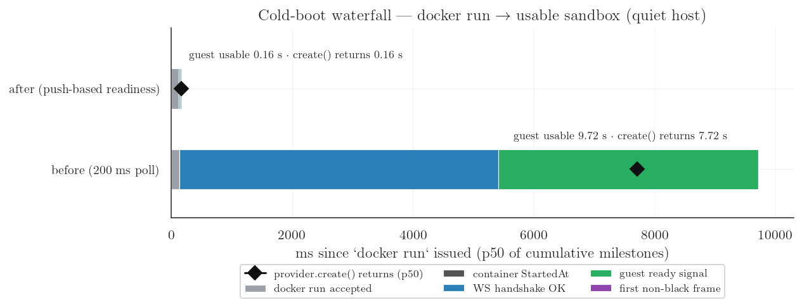

**What changed (all three layers were self-inflicted readiness cost, not boot cost):**
1. `start.sh` exec'd shinkend BEHIND shell poll loops (Xvfb/openbox gates at 100 ms
   granularity) — the ACI listener wasn't even accepting until ~5.4 s. Now shinkend execs
   first and owns X11 readiness (lazy connect, 10→200 ms backoff, self-healing).
2. The runtime had no cheap readiness signal, so the SDK pulled FULL screenshots and decoded
   them in pure Python per poll. Now the guest answers a `ready` query
   (`{ready, x11_up, root_nonblack}`) from a few sampled 1×1 root-pixel `GetImage` calls —
   microseconds inside the guest.
3. `_wait_ready` opened a fresh WS + ran a blocking `docker stats` every 200 ms poll. Now it
   is connect-with-retry at 15 ms into ONE persistent session, then guest-side `ready` polls;
   `docker stats` is off the readiness hot path entirely.

**Honest caveats.** (1) Both runs above were taken on a **contended host** (other Docker
work running — `contended_host: true` in the JSONs); the waterfall *shape* and the relative
win are the result, the absolute milliseconds will shift a little on a quiet host. (2) On
Docker Desktop, a userland proxy owns the published port, so the TCP-accept milestone is a
lower bound and is kept off the stacked figure. (3) The ready signal means **the desktop has
painted** (sampled root pixels non-black) — the image's xterm maps ~0.4 s later, which is why
`fill_xterm` (the content-scenario helper) now probes the xterm before filling it. (4) The
before/after delta also folds in one behavioral fix: `Xvfb -noreset` (a server regeneration
triggered by short-lived boot clients could wipe the root paint and kill mid-connect clients
once the listener stopped being desktop-gated). (5) **Root-caused and fixed** (formerly: a
~1%-of-boots readiness flake under heavy container churn — `x11_up: true` but the root never
sampled non-black within the 45 s readiness timeout). A live autopsy of flaked boots found
three compounding causes: the image's root paint had **never** worked (`xsetroot` ships in
`x11-xserver-utils`, which the image didn't install — the rc=127 failure was silenced by
`>/dev/null || true`, so "readiness = wallpaper painted" was actually riding on the booted
xterm covering a sample point); under parallel-boot CPU storms the concurrent
`openbox & xterm &` launch hits the WM **adoption race**, which can leave the xterm
permanently withdrawn (black screen, zero windows — the flake) or mapped-but-unfocused
(keystrokes silently discarded); and the deployed lazy X11 backend lacked the
mapped-windows readiness fallback (it had landed only on the inner executor's never-called
trait method). Fixed in the image (install `xsetroot`, surface paint failures in
desktop.log, launch the xterm only once the WM's EWMH check window is up, then converge
keyboard focus with bounded EWMH activation) and the runtime (one `readiness_checked`
implementation shared by both X11 backends). Verified: three consecutive
`SHINKEN_BENCH_NS=8,16` fan-out runs (8-way parallel boots) with zero `infra_failure` rows.

## 10. Fleet-level observation dedup over a forked fleet (S10 — `bench_fork_dedup.py`)

The fork-native observation optimization the codec knobs can't reach: N replicas forked from
ONE golden checkpoint show near-identical screens, yet a plain observe-all ships the same
frame N times per round. **Content-negotiated observation** closes that: the runtime stamps
every screenshot with a `frame_hash` computed over **raw pixels** (post-scope/downscale,
pre-encode — codec-independent, so a hash minted under PNG matches a JPEG request over the
same framebuffer), the SDK echoes the last seen hash back as `if_none_match`, and on a match
the runtime skips the encode and answers a ~135-byte `not_modified` instead of the payload.
One shared `shinken.FrameCache` across the fleet's sessions is what makes it *fleet-level*:
the first replica's full frame answers every other replica's observe. Capability-negotiated
(`capabilities.frame_dedup`): old runtimes and old clients are byte-for-byte unaffected.
Only a runtime that owns fork can line this up — the replicas share pixel identity *by
construction* (the provider also pins the guest hostname, so a fork can't silently diverge
from its golden via the shell prompt). The hash is **XXH3-128** (upgraded from fnv1a-64,
which had a ~2³² accidental-collision birthday bound across a long-lived fleet cache — a
collision would silently serve WRONG pixels; the new hash is also ~25× faster per frame,
118 µs vs 2.9 ms at 1280×800). Mixed-version mixes degrade safely: a stale-format hash never
matches → full frame. The collision failure-mode analysis (and why verify-on-hit was
rejected) is in [`aci-spec.md`](../design/aci-spec.md) §4 and `shinkend/src/executor.rs`.

Protocol: golden checkpoint → fork N ∈ {4, 8, 16} (the S4 fan-out) → prime every replica
with the same deterministic xterm content → **four measured modes** per fleet (all JPEG q80,
one shared FrameCache per mode): (1) 6 observe-all rounds with dedup **off** (baseline
bytes); (2) 6 **sequential** rounds with dedup on, two replicas typing different text
mid-way — the **static ceiling** (best case: an almost-identical fleet observed one at a
time); (3) 6 **concurrent** rounds — the real trainer shape, the whole fleet observing at
once via `asyncio.gather`, fresh cache, so first-touch RACES are measured; (4) 8
**policy-driven divergence** rounds — after 2 warm-up rounds EVERY replica takes a distinct
scripted action path each round and keeps diverging. Fleet pixel identity is verified per
run (modal `frame_hash` share): measured **4/4, 8/8, 16/16**, and every replica is
state-verified at all three levels — **marker 28/28, pixels 28/28** (settled `frame_hash` ==
the golden's stored post-prime hash), **fs 28/28** (in-guest filesystem-delta digest == the
golden's at checkpoint; see §1 for what each level covers/misses).

**Static ceiling (sequential, labeled as such — the mechanism's best case):**

| | dedup off | dedup on |
|---|---:|---:|
| wire per observe-all round, N=16 (identical fleet, steady state) | 1,375 KiB | **2.1 KiB (~654×)** |
| wire per round, N=16 (first-touch round: one full frame serves the fleet) | 1,375 KiB | 88.0 KiB (~N×) |
| whole suite, ALL dedup-on sequential rounds incl. warmup + 2-of-N divergence (N ∈ {4,8,16}) | 14.1 MiB | **0.76 MiB (18.6×)** |
| dedup hit rate over the sequential mode | — | **94.6%** |

The 2-of-N divergence curve behaves exactly as designed: when 2 of N replicas stop matching
the fleet, the hit rate dips to (N−2)/N for ONE round (each diverged replica pays one full
frame — N=16: 14/16 hits, 167.6 KiB), then returns to N/N — a diverged replica re-converges
against its **own** new content (the session-local candidate is preferred over the shared
one), while the clean replicas never stop hitting.

**Concurrent observes (the trainer shape, measured not assumed):** with the whole fleet
issuing `screenshot` at once against a fresh shared cache, round 0 is a clean sweep of
misses — **0/28 hits across all three fleets** (every concurrent request dispatches before
any full frame lands in the cache, so the fleet pays N full frames: 1,375 KiB at N=16,
exactly the dedup-off round). From round 1 on the fleet is at **16/16 hits, 2.1 KiB/round**
— identical to the sequential steady state (651.9× vs the off baseline) — and the concurrent
observe-all wall is ~7–9 ms vs ~33–42 ms sequential at N=16. So concurrency costs exactly
one fleet-wide warm-up round and nothing after; a first-frame barrier (observe one replica
before releasing the fleet) would remove even that, at the cost of orchestration the SDK
deliberately leaves to the consumer.

**Policy-driven divergence (every replica, every round):** the honest decay curve. Hit-rate
per round at N=16: **0.94 → 1.0 → 0.0 → 0.0 → 0.0 → 0.0 → 0.0 → 0.0** (same shape at N=4/8) —
once every replica's screen changes every round, the hit rate collapses to ZERO and stays
there; diverged rounds move ~0.9× of the dedup-off baseline (1,126–1,336 KiB vs 1,375 KiB at
N=16 — slightly under only because the post-action screens JPEG-encode a little smaller),
plus ~70 B/observe of hash overhead. Dedup's value is therefore **bounded by how often
screens repeat**: it pays for fork fleets at reset/branch points, idle/settled screens, and
k-action steps between observes — not for a fleet in which every replica's screen mutates
between every observe.


**Honest caveats.** (1) Byte counts are exact (`wire_len` of every reply, binary framing);
wall-clock numbers are one laptop-class operating point (this run: no other containers on
the daemon, `concurrent_containers: []`, 0 infra failures). (2) The ~654× steady state is
the static-identical-fleet **ceiling** — it measures payload vs `not_modified` size, not
codec quality; the concurrent mode shows the realistic warm-up cost (one full N-frame
round), and the policy mode shows the floor (≈1× — dedup buys nothing when every screen
changes every round). (3) Replicas are primed by typing the same content because the
disk-tier fork re-boots the desktop (files-only state); a memory-tier (CRIU) fork would be
born pixel-identical and skip the priming step entirely — this suite's mechanism is what
that tier will inherit. Priming is focus-gated (`wait_for_desktop_window`): an early run
that typed ~0.2 s after resume lost every keystroke to the WM adoption race and the fleet
"settled" on the unprimed default desktop — caught by the identity metric, fixed, rerun.
(4) The policy actions are scripted single-line typings; a real policy emits richer action
mixes, but any action that repaints the screen has the same effect on dedup (miss), so the
zero-floor generalizes.

## 11. Pipelined step under emulated WAN (S11 — `bench_step_pipeline.py`)

The step-latency lever ([`many-sandbox-concurrency.md`](many-sandbox-concurrency.md) §5): a
k-action agent step + one observation costs **k+1 serial round-trips** through the plain sync
facade but **~1 round-trip** through `Sandbox.step()` (pipelined dispatch + fused trailing
observation, no protocol change). One local sandbox is reached through a TCP delay proxy
([`benchmarks/_wan_proxy.py`](../../benchmarks/_wan_proxy.py) — macOS has no netem) at added
RTT ∈ {0 loopback, 50, 150, 300} ms, step shapes k ∈ {3, 5, 8} (+observe JPEG q80 @1024),
N=30 steps per cell — 720 step datapoints.

**Emulation validation** (recorded in-run, before any step timing): ACI `ping` p50 through the
proxy measured 0.8 / 53.9 / 153.7 / 303.5 ms against nominal +0 / 50 / 150 / 300 — the proxy
adds what it claims (~3 ms framework overhead).

| added RTT | k | sequential p50 (k+1 RTT) | `step()` p50 (~1 RTT) | steps/s seq → pipe | speedup (bound k+1) |
|---:|---:|---:|---:|---:|---:|
| 0 (loopback) | 3 | 8.7 ms | 7.2 ms | 115 → 138 | 1.2× (4×) |
| 0 (loopback) | 5 | 9.6 ms | 7.4 ms | 104 → 135 | 1.3× (6×) |
| 0 (loopback) | 8 | 11.6 ms | 8.0 ms | 86 → 125 | 1.5× (9×) |
| 50 ms | 3 | 228.8 ms | 66.1 ms | 4.4 → 15.1 | 3.5× (4×) |
| 50 ms | 5 | 335.7 ms | 61.1 ms | 3.0 → 16.4 | 5.5× (6×) |
| 50 ms | 8 | 499.2 ms | 63.5 ms | 2.0 → 15.8 | 7.9× (9×) |
| 150 ms | 3 | 628.3 ms | 164.8 ms | 1.6 → 6.1 | 3.8× (4×) |
| **150 ms** | **5** | **937.1 ms** | **165.1 ms** | **1.1 → 6.1** | **5.7× (6×)** |
| 150 ms | 8 | 1400.9 ms | 169.3 ms | 0.7 → 5.9 | 8.3× (9×) |
| 300 ms | 3 | 1227.8 ms | 318.2 ms | 0.8 → 3.1 | 3.9× (4×) |
| 300 ms | 5 | 1844.6 ms | 320.5 ms | 0.5 → 3.1 | 5.8× (6×) |
| 300 ms | 8 | 2751.1 ms | 322.6 ms | 0.4 → 3.1 | 8.5× (9×) |


**Reads:**
- **The k+1 → ~1 RTT collapse is real and converges to its bound.** Sequential step wall
  tracks (k+1)·RTT almost exactly (300 ms, k=8: 2.75 s ≈ 9 × 0.306 s); pipelined step wall is
  ~RTT + 15–20 ms **independent of k** (318–323 ms at 300 ms RTT for k=3/5/8) — the speedup
  reaches 3.9×/5.8×/8.5× against the 4×/6×/9× theoretical bounds, the gap being the constant
  server-side execute+encode time that pipelining cannot remove.
- **At intercontinental distance (~0.28–0.38 s, B1/B3), a 5-action step is the difference
  between ~0.5 and ~3 steps/s per sandbox** — pipelining is what keeps a WAN rollout
  RTT-bound at *one* RTT per step rather than k+1.
- **Failure semantics are honest, not optimistic:** `step()` has no `skipped` status —
  every action is already on the wire when an earlier one fails and executes server-side
  regardless, so each row reports its real `ok | error | timeout | sandbox_died` outcome and
  the fused observation still returns after a mid-step per-action error (unit-tested against
  a deferred-reply mock; `sdk/python/tests/test_step_pipeline.py`).
- **Contention caveat:** this run shared the Docker daemon with a concurrent benchmark rerun
  (~100 live containers), so treat the absolute milliseconds as *contended* — the loopback
  tier still landed within ~2 ms of the uncontended S3 numbers, and the RTT-dominated ratios
  (the point of the suite) are insensitive to host load.

## 12. First-party baseline vs trycua/cua local paths (S12 — `bench_baseline_cua.py`)

The same act-and-observe loop measured against the closest analog's **shipped local paths**,
both stacks as shipped, sequential, warm-ups discarded (the osworld_loop fairness discipline).
Pinned: `cua-sandbox==0.1.16` (PyPI), `lume 0.3.10`, `trycua/cua-xfce@sha256:3bf853…`
(their local Linux desktop image, built 2026-03-18, bundles `cua-computer-server 0.3.20`),
study clone at tag `lume-v0.3.10`. The shinken leg runs at cua-xfce's default **1024×768** so
the pixel cells are size-matched; both stacks default to PNG screenshots; both pay base64+JSON
framing (theirs HTTP request/response per command, ours a persistent WebSocket). Both Docker
legs share one Docker daemon (sequentially, never concurrent); the ~23 GiB `lume pull` running
on this host that day was paused (SIGSTOP) during the measured window. Reps that failed a
stack's own readiness gate are recorded in the JSON (`flaked_reps_retried`) and retried once —
never silently dropped.

| cell (p50, same window) | Shinken | cua local container | ratio |
|---|---:|---:|---:|
| boot → usable (create + connect + first screenshot) | 3.8 s | 8.5 s | 2.3× |
| act + observe step (click + full screenshot) | **2.9 ms** | 174 ms | **61×** |
| — of which click | 0.54 ms | 3.0 ms | |
| — of which full screenshot | 2.3 ms | 171 ms | |
| observation bytes/frame (default PNG, settled desktop) | 22.3 KiB | 92.5 KiB | |
| JPEG q80 lever (same frame) | 18.7 KiB | SDK raises¹ | |
| checkpoint live state | **0.56 s** | **not shipped locally**² | |
| fork → usable (state verified 8/8) | **3.8 s** | **not shipped locally**² | |
| suspend / resume (`docker pause`/`unpause`)³ | n/a | 38 / 64 ms | |

¹ Their SDK exposes `screenshot(format="jpeg", quality=…)`, but the shipped image's bundled
`computer-server 0.3.20` ignores it and returns PNG; the SDK's magic-byte guard then raises
`ValueError: requested 'jpeg' but got 'png'` — recorded verbatim in the JSON.
² Exercised, not assumed: local `Sandbox.snapshot()` raises
`NotImplementedError: Snapshots are only supported for cloud sandboxes` (their snapshot tests
skip without `CUA_API_KEY`). Their cloud docs claim fork-from-snapshot in 1–5 s typical,
"nearly instant" on CoW storage (vendor-published, unverified).
³ Their only local state verbs on this path: a pause is not a checkpoint — no copy exists, one
instance, no fan-out, and the state dies with the container.

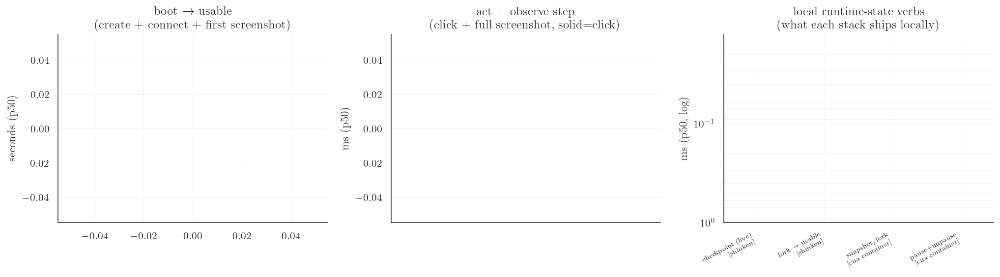

**The lume leg (their macOS-VM path on Apple's Virtualization.framework).** Attempted for real,
and the CLI itself works on this host: `lume 0.3.10` creates Linux VMs via Vz.fw with no
entitlement issues, `lume serve` answers on :7777, and cloning a stopped VM through their API
(APFS clonefile — the mechanism behind their local "instant" create-from-base) measured
**32 ms p50** (n=10, 12 GiB VM with 4 GiB of materialized blocks; the suite's built-in
mechanism probe, recorded as `clone_probe` in the JSON) — clonefile is metadata-CoW, so the
cost is size-independent. What blocks the full SDK leg is image logistics, not the host: lume's
prebuilt registry images are **macOS-only** (their smallest `-cua` image,
`ghcr.io/trycua/macos-tahoe-cua:latest`, is **22.7 GiB** across 201 layers — measured from the
GHCR manifest; `ubuntu-noble-vanilla` is 20.0 GiB and lacks their computer-server; Linux lume
VMs otherwise require a manual ISO install), and the pull sustained only ~1–2 MB/s on this
link (multi-hour). The suite records the leg as skipped with the reason; once the base image is
pulled, `SHINKEN_BENCH_CUA_LEGS=cua_lume python benchmarks/bench_baseline_cua.py` fills it in
and merges with the existing legs. Code-level facts (pinned tag): their `LumeRuntime.fork`
clones **stopped** VMs only; `checkpoint` of a running VM is stop → clone → restart (memory
state lost); `suspend` maps to VM stop. Their QEMU "Local VM" Linux path targets KVM hosts
(their published table: container ~5 s, VM ~30 s) and falls back to software emulation in
Docker on macOS — not measured here.

**Reads:**
- **The box layer is the same class; the step loop is not.** Boot-to-usable is 3.8 s vs
  8.5 s — same order, dominated by `docker run` + desktop readiness on both sides (their
  image also boots XFCE + VNC + a Python server; ours boots Xvfb + xterm + a Rust runtime; and
  our readiness gate is stricter — it waits for actual non-black pixels, theirs for the API to
  answer). The per-step act+observe cost differs by **~61×** (2.9 ms vs 174 ms)
  — their screenshot is PIL `ImageGrab` + PNG-optimize + base64 per HTTP call, and it grew from
  ~17 ms on an unpainted desktop to ~171 ms once XFCE finished painting; ours is the
  in-guest Rust encoder at ~2.3 ms on the settled frame. At agent-loop rates the
  observation, not the click, is the budget on both stacks.
- **The runtime-state verbs are the structural difference, and the absence is now a measured
  fact, not a reading of their docs.** Locally, cua's container path ships pause/unpause only;
  its lume path forks stopped VMs (a fast ~32 ms clone, but using one costs a full VM boot and
  checkpointing a running VM is disruptive); `Sandbox.snapshot()` is cloud-only and raises.
  The golden → checkpoint (0.56 s, live, non-disruptive) → fork-N → verified-usable
  (3.8 s) loop that `run_eval_forked` is built on has no local equivalent in their stack —
  consistent with their own framing of snapshots as a cloud feature.
- **Both stacks are honest PNG-by-default; only one JPEG lever works end-to-end as shipped.**
  Size-matched settled desktops: 22.3 KiB (xterm desktop) vs 92.5 KiB (XFCE desktop) —
  content differs, so treat these as each stack's *own-default* frame, not a codec shoot-out
  (§2 is the controlled codec grid). The strategic read for the landscape doc: the
  head-to-head with cua lives at this runtime/interface layer; their substrate breadth is
  complementary (see [`landscape.md §2.17`](../design/landscape.md)).

## 13. Observation legibility envelope — what the cheap tiers leave readable (S13 — `bench_obs_quality.py`)

Every byte number above (and the remote B1 ladder) proves a `(quality, scale)` cell is
*small*; none of it proves an agent can still **read** the screen that cell delivers. S13
closes that gap with zero model cost: **scripted ground-truth text at known screen regions,
judged by host-side OCR** (tesseract 5.5.2) on the exact cells the byte stories quote —
PNG@native (control), JPEG q80@1280, q80@1024, q50@1024, q10@768, q50@512 — plus **one
composited delta-JPEG-q80 stream cell** (keyframe + dirty tiles composited client-side, then
judged: bounds compositing drift). 867 datapoints (774 OCR-judged element measurements over
40 ground-truth elements × 3 frames/cell + 93 frame rows).

**Scenes** (fresh sandbox each): the S1 content classes — sparse `desktop` (one xterm, the
6×13 bitmap font), `dense-text` (near-fullscreen xterm, 59 rows of ANSI-colored filler with
9 scripted truth rows), `photo` (no text; SSIM anchor) — plus a **text-stratified scene**
(three xterms at DejaVu Sans Mono `-fs` 8/11/16 → 14/19/27 px cells; small text breaks
first) and a **`gui-zenity` dialog whose ground truth comes from the structured observation**
(`observe(structured=True)`: per-element text + bbox from the guest a11y engine). Terminal
truth bboxes derive from `list_windows` geometry + the character grid (verified
pixel-accurate). **Metrics per element:** (a) *legibility* — normalized edit distance of OCR
on the bbox crop at the tier's resolution vs the scripted truth (legible ⇔ ≤ 0.2);
(b) *resolvability* — OCR word boxes over the whole frame must place the element's unique
token's centroid inside the true bbox (could an agent still *locate* its click target?);
(c) *text-region SSIM* vs the lossless control crop.

**Control conditioning held perfectly: zero elements excluded** — the judge read every
element with zero failures in the PNG control *and* in JPEG q80@native, so every failure
below is codec/scale damage, not OCR weakness.

| stratum (n/cell) | PNG @1280 | q80 @1280 | q80 @1024 | q50 @1024 | q10 @768 | q50 @512 | delta-q80 stream |
|---|---:|---:|---:|---:|---:|---:|---:|
| xterm 6×13 — sparse desktop (24) | **100%** | **100%** | 25% | 12% | 0% | 0% | — |
| xterm 6×13 — dense screen (27) | **100%** | **100%** | 11% | 11% | 0% | 0% | — |
| DejaVu Mono fs8, 14 px cell (18) | **100%** | **100%** | 67% | 67% | 0% | 0% | **100%** |
| DejaVu Mono fs11, 19 px cell (18) | **100%** | **100%** | 67% | 83% | 0% | 0% | **100%** |
| DejaVu Mono fs16, 27 px cell (18) | **100%** | **100%** | **100%** | **100%** | **100%** | 33% | **100%** |
| GTK dialog text, zenity (15) | **100%** | **100%** | 80% | 60% | 0% | 0% | — |

(% of element measurements legible, control-conditioned. A **safe** cell is one with zero
failures at that n — at n=15–27 per cell, "≥99%" and "no failures observed" coincide; the
raw per-element rows, the resolvability and SSIM columns, and the OCR transcripts are all in
`obs_quality.json`.)


**Reads:**
- **The safe operating envelope: JPEG *quality* is cheap, *downscale* is what kills text.**
  Every stratum reads 100% at JPEG q80 native scale — the codec leg of the §2 ladder (the
  ~19–20× photo win, ~1–1.4× on text) is free for legibility. The moment the frame leaves
  native scale, small text starts dying: 6×13 terminal text drops to **25% at q80@1024**
  (0.8× scale!) and GTK dialog text to 80%; by @768/@512 every stratum except large fs16
  text reads **0%**. The only cells safe for *all* measured text: **native-scale PNG,
  native-scale JPEG q80, and the composited delta-JPEG stream** (the stream measured on the
  three font strata); fs16 (27 px cells) additionally survives q80@1024, q50@1024, and even
  q10@768.
- **Resolvability tracks the same cliff** — usually a bit more forgiving (6×13 @1024: 43%
  resolvable vs 25% legible; fs16 q50@512: 83% vs 33%), occasionally stricter (fs16 q10@768:
  83% resolvable vs 100% legible — q10 artifacts spray junk words across the frame): an
  agent loses the ability to *read* a target at roughly the same cells where it starts
  failing to *find* it. Text-region SSIM corroborates with no OCR in the loop: 1.00 → 0.27
  (6×13 @1024 q50) → 0.15 (@512).
- **The advertised cheap cells are NOT text-reading tiers.** q50@512 (the **12.3×**/**251×**
  §2 headline cell, the 13 KiB S6 operating point) read **zero** scripted elements on every
  text stratum but fs16 (33%); q10@768 reads zero on everything except fs16 — which it fully
  preserves (100%): **scale dominates quality** — 27 px text survives brutal q10 at 768
  better than moderate q50 at 512. The cheap-cell ratios stay honest as *byte floors* for
  photo/layout-class consumption — §2's read and the fleet-egress projection
  (`docs/benchmarks/README.md` §2d) are now qualified accordingly.
- **The delta-JPEG composited stream shows no compositing penalty:** keyframe + 92 lossy
  tiles per replay composited client-side read **100%** on all three font strata with
  text-region SSIM equal to the single-shot q80 frame (0.97) — tile-over-keyframe drift is
  not the thing that breaks legibility; downscale is.
- **Honest scope.** The judge is one OCR engine with a fixed, deterministic pipeline — a
  conservative, model-free proxy for "can an agent read this", not a VLM study: a
  spot-check shows the marginal @1024 terminal cells are still partially human-readable
  (mangled but guessable), while the 0% cells are genuinely mush. Treat sub-100% cells as
  *do not ship for text-reading agents*, not as "literally invisible". And if a model
  ingests frames at ≤1024 long edge anyway, this loss happens inside the model's own
  preprocessing — the envelope bounds what *any* consumer of that resolution can read; the
  `max_long_edge` lever just makes the loss explicit (and cheaper on the wire).

## Reproducing

```sh
# 1. build the sandbox image FROM THE CHECKOUT UNDER TEST (an older image may
#    lack runtime features the suites measure: jpeg codec, delta screencast)
docker build -f images/linux/Dockerfile -t shinken/sandbox-linux .

# 1b. (optional, enables S7) the dual-server head-to-head image: the same guest
#     plus OSWorld's server, fetched at build time from the public OSWorld repo
#     at a pinned commit — no OSWorld code is vendored into this repo
docker build -f images/linux/Dockerfile.osworld -t shinken/sandbox-linux-osworld .

# 1c. (optional, enables S4c — the CRIU memory rung; PRIVILEGED containers)
docker build -f images/linux/Dockerfile.criu -t shinken/sandbox-linux-criu .

# 2. run everything (serial, ~20-30 min), or any single suite
make benchmarks                    # == bash benchmarks/run_all.sh
python3 benchmarks/bench_fork.py   # one suite

# 3. regenerate figures alone from the tracked JSONs (no Docker)
python3 benchmarks/replot.py

# outputs land in benchmarks/results/*.json (raw datapoints)
# and docs/assets/bench/*.png (the figures above)
```

Suites need `matplotlib` + `websockets` on the host Python and a running Docker daemon (S6
alone needs no Docker); the in-repo SDK is bootstrapped automatically. S13 additionally needs
the host-side OCR judge — the `tesseract` binary (`brew install tesseract` /
`apt-get install tesseract-ocr`) plus `pip install pytesseract` — and `run_all.sh` skips it
with a clear message when either is missing. Each JSON embeds the
host/image fingerprint of the run that produced it, so divergent reruns are diagnosable.
Containers, snapshot images, and checkpoint registries are cleaned up by each suite on exit
(`name_prefix="shinken-bench"`).

## Related: the agent-quality study (separate artifact)

The codec ladder above (§2) measures bytes; the **agent-quality study** measures whether a
real vision agent's *task success* survives those same tiers — 16 read-from-screen-critical
tasks, every tier × seed episode forked from one golden checkpoint per task (env variance
eliminated by construction), deterministic exec-state verifiers, Wilson-CI non-inferiority
analysis. It is a study, not a suite (needs a model endpoint; not in `run_all.sh`):
[`agent-quality-study.md`](agent-quality-study.md) /
[`benchmarks/bench_agent_quality.py`](../../benchmarks/bench_agent_quality.py).
