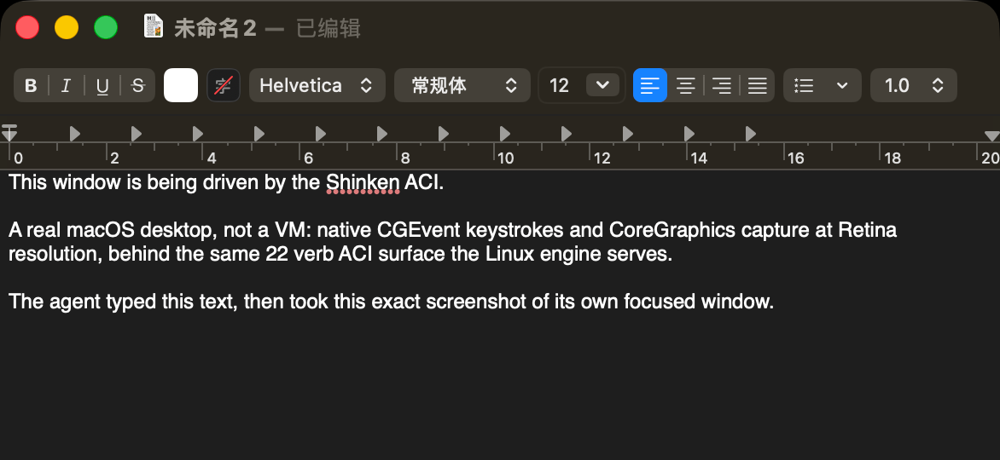

# macOS engine v1 — native `shinkend` backend (capture + input)

> Status: **built, local-only proof** (no macOS CI runner yet) · Scope: full-screen +
> per-window pixel capture and pointer/keyboard input synthesis behind the same
> [`Executor`] trait the Linux/X11 backend implements. The structured/AX-tree
> observation engine is **out of v1 scope** (see [Seams](#seams--whats-deliberately-not-in-v1)).
> Built-vs-designed map: [status.md](status.md).

<p align="center"></p>
<p align="center"><sub>Live proof: the agent typed this text over CGEvent and captured its own focused window
(<code>screenshot(scope="active_window")</code>, CoreGraphics, Retina) through the same ACI the Linux engine serves.</sub></p>

The macOS backend lives in `shinkend/src/executor_macos.rs`, gated by
`cfg(target_os = "macos")` + the `macos-native` cargo feature (default-on; it compiles
to nothing on non-macOS targets, so the Linux build is untouched). It reuses the entire
existing pipeline above the capture/input boundary: raw RGB8 feeds the shared
downscale/PNG/JPEG encoders, the dirty-tile delta screencast works via the poll-diff
fallback (`damage_cursor()` returns `None` on macOS — there is no XDamage analogue in
v1), and the wire contract is unchanged.

## Selecting the backend

```sh
shinkend --backend macos          # explicit (also: SHINKEND_EXECUTOR=macos)
shinkend                          # auto: on macOS with no $DISPLAY → native backend
```

`auto` keeps X11 priority when `$DISPLAY` is set (XQuartz), then falls back to the
native backend, then to `virtual`. The `--backend` flag overrides `$SHINKEND_EXECUTOR`.

## Binding choice (v1): CoreGraphics, with the ScreenCaptureKit upgrade path

v1 uses the CoreGraphics C API via the maintained `core-graphics` crate:

- **Full screen**: `CGDisplayCreateImage` (`CGDisplay::image()`).
- **Per-window** (`scope: window:<id>` and `active_window`): `CGWindowListCreateImage`
  with `kCGWindowImageBoundsIgnoreFraming | kCGWindowImageBestResolution`; the
  `active_window` scope resolves the frontmost layer-0 window from
  `CGWindowListCopyWindowInfo` (front-to-back order) — a permissionless heuristic that
  matches EWMH `_NET_ACTIVE_WINDOW` semantics closely enough for capture.
- Captured `CGImage`s are normalized by one blit into an owned RGBX bitmap context
  (robust to whatever pixel format/stride the OS returns), then stripped to RGB8 for
  the shared encode pipeline.

Both capture calls are **deprecated since macOS 14** in favor of ScreenCaptureKit but
remain functional (verified live on macOS 26/arm64). The upgrade path, when the
deprecation bites or when screencast capture should stop paying per-frame blit costs:

- `SCShareableContent` / `SCContentFilter` / `SCScreenshotManager` for one-shot capture,
  `SCStream` for the screencast loop (delta-friendly: SCK delivers dirty rects, which
  would replace the poll-diff path the same way XDamage did on Linux),
- via the `objc2` + `objc2-screen-capture-kit` crates (block-based completion handlers
  bridged with `block2`) — judged a deeper binding fight than v1 warranted (async
  completion plumbing for a synchronous `Executor` call, for zero contract change);
  the `Executor` seam is unchanged by the swap.

Input synthesis is **not** deprecated and stays: `CGEventCreateMouseEvent` /
`CGEventCreateKeyboardEvent` / `CGEventCreateScrollWheelEvent`, posted at the HID tap
(`CGEventTapLocation::HID`), with an 8 ms settle after each event.

## Coordinate space: capture pixels, Retina-scaled at the boundary

The ACI speaks in **capture pixels** (what the agent sees in the screenshot), exactly
like Linux. On Retina displays CGEvent coordinates are global display **points**
(typically half the pixels), so the backend reads the live display mode each call and
scales pixel→point at the posting boundary. Verified live: `move(x=600, y=400)` on a
2× display lands the real cursor at point (300.0, 200.0). `screen_size` reports capture
pixels (e.g. 3456×2234 on a 2× 1728×1117 display) so screenshot dims == click space.

## Permissions (TCC) — the grant flow

macOS gates both halves of the engine behind user-granted permissions, attached to the
**responsible app** — the terminal (or other host process) that launched `shinkend`:

| Grant | Gates | Failure mode without it |
|---|---|---|
| **Screen Recording** (System Settings → Privacy & Security → Screen & System Audio Recording) | capture | `CGDisplayCreateImage` "succeeds" but returns a wallpaper-only frame — useless and misleading |
| **Accessibility** (System Settings → Privacy & Security → Accessibility) | input | posted CGEvents are **silently dropped** |

The backend is honest about both, instead of crashing or lying:

- `readiness()` (the `ready` query) reports `display_up` (the cross-platform alias of
  `x11_up`: a display is online) and **`permissions_pending`** (true while either grant
  is missing); `ready` is true only when a display exists **and** Screen Recording is
  granted. `root_nonblack` is `null` on macOS (nothing sampled).
- A capture attempted without Screen Recording, or an input action without
  Accessibility, fails with a **typed `permission_pending: …` error** naming the grant
  and the settings pane — it never returns a wallpaper-only frame and never posts
  events into the void.
- At startup with grants missing, `shinkend` prints one clear guidance block and calls
  `CGRequestScreenCaptureAccess()` once, which registers the responsible app in the
  Screen Recording pane and triggers the system prompt.

**Grant flow**: launch `shinkend` once → grant Screen Recording *and* Accessibility to
your terminal in System Settings → restart the terminal (macOS applies Screen Recording
on relaunch of the responsible app) → rerun. `scripts/macos_smoke.py` exits 2 with the
same guidance while grants are pending.

Permission state is re-probed per call, so the `ready` query flips as soon as macOS
honors the grant — clients poll `ready` exactly like they do during Linux desktop boot
(`display_up` plays the role of `x11_up`).

## Interaction model: v1 is exclusive-desktop; the co-use tier is designed, not built

v1 posts input **globally** (`CGEventPost` to the HID tap): clicks move the *real* cursor
and keystrokes go to whatever is frontmost. That is **exclusive-desktop semantics** — correct
when the Mac is the agent's machine for the duration, wrong for *co-use* (a human keeps
working while the agent operates one app). The co-use reference implementation in the field
([open-codex-computer-use](https://github.com/iFurySt/open-codex-computer-use)) does three
things v1 does not:

- **per-app background input** — `CGEvent.postToPid(pid)` delivers clicks/keys into the
  target app's event queue without moving the shared cursor or stealing focus
  (`InputSimulation.swift`), with an AX-action fallback (`kAXRaiseAction` etc.);
- **a software cursor for the human** — a click-through overlay panel
  (`SoftwareCursorOverlay.swift`: `ignoresMouseEvents`, joins all Spaces, level tracks the
  target window) animated by a motion model, so the user *sees* the agent act;
- **cursor-free observations** — its SCK capture sets `showsCursor = false`
  (`AccessibilitySnapshot.swift:416`); the model grounds on the element-indexed AX tree, the
  human on the overlay.

Shinken's captures are already cursor-free on both engines (CoreGraphics and X11
`XGetImage` never composite the hardware cursor — load-bearing for fork-fleet frame-hash
dedup and idle suppression). The missing co-use pieces are per-pid posting and the overlay —
the **D14 co-use tier, designed-only**. Until it lands, the co-use answer on macOS is the
**`mcp-computer` operation-layer backend** (D15): a codex-style AX server drives apps in the
background under the same ACI.

## Input verbs and keymap coverage

All shared coordinate-tier verbs are implemented: `move`, `click`, `double_click`
(proper `kCGMouseEventClickState=2` on the second pair), `right_click`, `scroll`
(pixel-denominated `dx`/`dy`, sign-mapped to CG wheel axes), `type_text`, `key`,
plus the schema gesture verbs — **`drag`** (left-down at `target`, 8 interpolated
drag moves, up at the `to` target; `duration_ms` accepted, fixed per-event pacing in
v1; CG has only a LeftMouseDragged event type, so a non-left `button` is an honest
nack) and the decomposed **`mouse_down`**/**`mouse_up`** halves (left/right; an
omitted `target` acts at the live cursor position, resolved at post time). The
structured-observation family (`observe`, `invoke_action`, `set_value`) is
**Linux-only in v1**: on macOS no tree source is attached, so those verbs answer the
typed `structured_observation_unavailable` error (the AXUIElement tier is the D14
follow-up).

Keyboard model, mirroring the X11 backend's xdotool-style names:

- **`type_text` is layout-independent**: the text travels as a unicode string on the
  keyboard event (`CGEventKeyboardSetUnicodeString`), chunked at 20 UTF-16 units
  (surrogate-safe) — any character types correctly regardless of keyboard layout.
- **`key` combos resolve against a static US-ANSI table** (`kVK_ANSI_*`): all printable
  ASCII (both shift levels), `enter`/`return`, `tab`, `escape`, `space`, `backspace`,
  `delete` (forward delete, matching X11's `XK_Delete`), arrows, `home`/`end`,
  `pageup`/`pagedown`, `capslock`, `f1`–`f12`. Modifiers: `ctrl`, `shift`,
  `alt`/`option`, and **`super`/`meta`/`cmd`/`command`/`win` → Command (⌘)**. Modifier
  key events are posted around the key with cumulative `CGEventFlags`, and a key whose
  US-ANSI level needs Shift gets an implicit Shift press (so `ctrl+A` ≡ ctrl+shift+a),
  like X11. Names with no mac equivalent (`insert`, `numlock`, `printscreen`, `menu`)
  fail honestly instead of pressing a wrong key.
- **Known limitation**: combo keycodes assume the US physical layout; a non-US layout
  types combos against the wrong physical keys. The follow-up is layout-aware mapping
  via `UCKeyTranslate`/`TISCopyCurrentKeyboardInputSource`.

## Running the live smoke

```sh
# terminal 1
export SHINKEND_TOKEN="$(python3 -c 'import secrets; print(secrets.token_hex(32))')"
echo "$SHINKEND_TOKEN"  # copy this value
cargo run --manifest-path shinkend/Cargo.toml -- --backend macos

# terminal 2
export SHK_TOKEN="<copied token>"
python scripts/macos_smoke.py            # non-destructive: ready/screen_size/screenshot/hover
python scripts/macos_smoke.py --unsafe   # adds click + type_text + key on the LIVE desktop
```

The smoke is deliberately non-destructive by default (it runs against your real
desktop): it asserts the platform, the `ready` payload, plausible `screen_size`, a PNG
screenshot whose dimensions equal `screen_size`, and a pointer hover at screen center.
Exit 2 = runtime healthy but TCC grants pending (with the typed refusal asserted).

## Tests

14 cfg-gated unit tests (`cargo test` on a mac host; Linux CI never compiles them):
keycode/modifier mapping, verb dispatch via the pure planner (`plan_action` — the mock
seam: actions are planned as typed event sequences and asserted without posting),
text chunking, target validation parity with X11, the capture blit's color/row order
(synthesized `CGImage`, TCC-free), plus live-host probes for geometry and readiness
honesty. The Linux build is cross-checked (`cargo check --target
aarch64-unknown-linux-musl`) to stay untouched.

## Seams — what's deliberately NOT in v1

- **AX tree (`AXUIElement`) observation**: out of scope. The Linux a11y engine (#2/D3)
  defines the structured-observation contract; the macOS implementation follows it.
  `element_ref` targets bail on macOS native v1; Linux/AT-SPI is the built reference
  implementation for guest-side ref resolution.
- **ScreenCaptureKit**: the capture upgrade path above (also unlocks dirty-rect
  screencasts and cursor-change events).
- **Event-driven capture**: `damage_cursor()` is `None` → screencast loops poll-capture
  and the delta path diffs frames (the same correctness, more guest CPU than XDamage
  on Linux).
- **CI**: local-only. A macOS runner job (unit tests + the non-destructive smoke under
  a pre-granted runner image, or unit tests only) is the follow-up.
