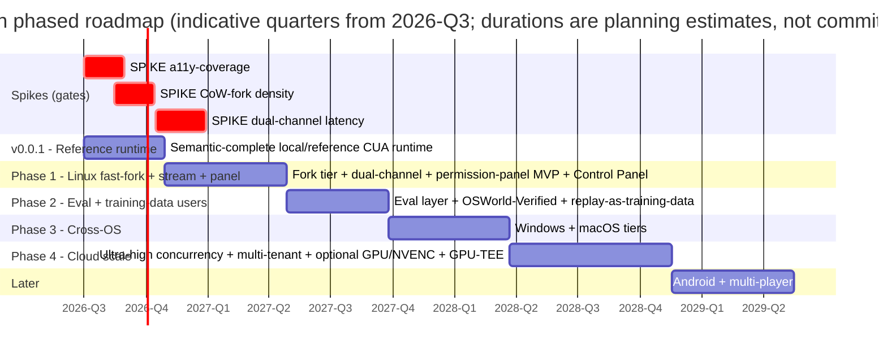

# Shinken — Roadmap

> Status: drafting · Date: 2026-06-02
> Audience: maintainers and implementers · Role: phase sequencing and milestone strategy. Current
> implementation status lives in [`STATUS.md`](status.md); detailed v0.0.1 implementation scope lives
> in [`10-phase0-plan.md`](v0.0.1-plan.md).
> Sibling docs: [00 Vision](../design/vision.md) · [01 PRD](../design/prd.md) · [02 Architecture](../design/architecture.md) · [03 OSWorld teardown](../design/osworld-analysis.md) · [04 Landscape](../design/landscape.md) · [05 Tech decisions / ADRs](../design/tech-decisions.md) · [07 Glossary](../design/glossary.md) · [08 Isolation & capability note](../design/threat-model.md) · [09 Economics & build-vs-buy](../design/economics-and-build-vs-buy.md)

> **What's actually built so far → [`STATUS.md`](status.md).** Phase 0's pixel slice (actions +
> screenshot + real-time screencast + bandwidth levers + focused-window capture, Linux/X11) is
> implemented and under live CI; the **a11y-coverage spike below has been measured (E5 — verdict:
> hybrid per-window structured + pixel fallback; D3's structured-default stays Provisional)**, and
> the operation layer that consumes it ([D13](../design/tech-decisions.md),
> [operation-layer.md](../design/operation-layer.md)) is designed-only. This roadmap is the *plan*,
> not the current state.

Shinken's roadmap is deliberately **semantic-complete first, then optimize as we scale**. The
scope is the full CUA infrastructure stack, not a narrow local demo. The first release,
**v0.0.1**, must implement the core product semantics at local/reference scale: ACI, agent-native
dialects/adapters, GUI act/observe, layered observation, runtime state (checkpoint/fork/resume),
capabilities, artifact movement, and tiny eval evidence. (Runtime **replay** / `.skn` was
intentionally deferred — see #216 — and is not a v0.0.1 semantic.) Later phases make those same semantics fast, forkable, multi-tenant,
cross-substrate, and production-hardened. The completeness review behind the broader design is
still blunt: the scale/cost assumptions — that a normalized accessibility (a11y) tree covers enough
real applications to become the structured fast path, that copy-on-write (CoW) fork density is
economically real, and that the dual-channel WebRTC latency budget actually closes — are **all
vendor-quoted and unverified** as of 2026-06-02. So v0.0.1 proves the semantics; the spikes gate
performance and cloud-scale commitments.

Every phase reconciles to the fifteen authoritative decisions **D1–D15** in [`05-tech-decisions.md`](../design/tech-decisions.md), and the plan reuses generally-available building blocks — the OSS `kubernetes-sigs/agent-sandbox` CRD, [HashiCorp Vault](https://www.hashicorp.com/en/blog/vault-enterprise-1-21-spiffe-auth-with-spire-cross-namespace-secret-import), and (for the optional pixel channel) [NICE DCV](https://docs.aws.amazon.com/dcv/latest/adminguide/what-is-dcv.html) or a custom WebRTC + hardware-encode pipeline — rather than rebuilding undifferentiated infrastructure. **Every speed/density/cost figure below is tagged (vendor-published, unverified)** unless a spike has produced a first-party number; see [`09-economics-and-build-vs-buy.md`](../design/economics-and-build-vs-buy.md) for the measurement plan that retires those tags.

---

## Phasing philosophy

Three rules govern the sequence.

1. **v0.0.1 is semantic-complete at reference scale.** All core surfaces must exist and be tested
   locally even if they are not fast or cloud-hardened yet: ACI, adapters, action execution,
   screenshot/region/screencast/a11y/CDP observation, runtime state (checkpoint/fork/resume),
   capabilities, artifact transfer, and tiny eval. (The `.skn` recording ledger was deferred, #216.)
2. **Spikes de-risk the expensive optimizations.** A *spike* is a throwaway measurement built to
   confirm or kill an assumption, with a pass/fail metric attached. Three spikes recur as gates or
   de-riskers: **a11y-coverage** (decides where structured observation becomes the fast path,
   [D3](../design/tech-decisions.md)), **CoW-fork density** (kills or confirms the Linux fork-tier
   economics, [D1](../design/tech-decisions.md)/[D9](../design/tech-decisions.md)), and **dual-channel latency**
   (kills or confirms the WebRTC streaming budget, [D4](../design/tech-decisions.md)). Screenshot-first
   v0.0.1 does not wait for a11y coverage; cloud scale does wait for first-party numbers.
3. **Buy the substrate, build the CUA semantics and seams.** Per [D12](../design/tech-decisions.md),
   reuse the OSS `kubernetes-sigs/agent-sandbox` CRD, Vault/KMS/SPIFFE-SPIRE, NICE DCV, and
   commodity VMM/browser substrates where they fit. Build the ACI, layered observation, dual-channel
   streaming, `.skn`, capability manager, artifact path, and eval evidence layer — the semantics none
   of those building blocks deliver as one system.
4. **Land the eval/training users first without narrowing the product.** Per
   [D12](../design/tech-decisions.md), the first users are teams building and evaluating computer-use
   agents — model labs, researchers, RPA builders — who already buy or build OSWorld-style datasets.
   That go-to-market focus does not reduce the product scope; it gives the full stack a concrete
   first adoption path.

| Phase | Theme | Primary decisions exercised | External dependency | Gating spike(s) |
|-------|-------|-----------------------------|---------------------|-----------------|
| **0 / v0.0.1** | Feature-complete local/reference CUA runtime | D2, D3, D6, D7, D8, D13 | none (local Docker/QEMU) | runtime-state support (checkpoint/fork/resume) advertised + Docker disk-tier reference impl; contract tests; a11y coverage measured, not a pixel-loop blocker (`.skn` audit ledger deferred to Phase 1+, #216) |
| **1** | Performance and productionization: Linux fast-fork + streaming + panel | D1, D3, D4, D6, D9 | `agent-sandbox` CRD, Vault, NICE DCV or WebRTC+NVENC | a11y-coverage, CoW-fork density, dual-channel latency |
| **2** | Eval + OSWorld-Verified + first eval/training users | D5, D7, D8 | `agent-sandbox` CRD (parallel replicas) | reuses Phase 1 spikes |
| **3** | Cross-OS (Windows + macOS) | D1, D10, D14 | Apple hardware pool; Windows licensing | macOS-reset feasibility, Windows-licensing |
| **4** | Cloud ultra-high-concurrency + optional GPU/TEE | D4, D9, D11 | NICE DCV, GPU-TEE/NRAS/Confidential Containers, vGPU/MIG | NVENC-density, GPU-TEE-attestation |
| **Later** | Android + multi-player | D10 (Android), scope decision | redroid/Cuttlefish | touch-schema; multi-cursor |

---

## Phase 0 / v0.0.1 — Feature-complete local/reference runtime

**Objective:** Implement the complete Shinken product semantics at local/reference scale. This is
not the whole production platform yet, but it is not a narrow demo either. v0.0.1 should make the
full CUA contract concrete and tested: ACI, agent-native dialects/adapters, real GUI action and
observation, screenshot/focused/region capture, screencast, a11y/CDP/element-ref reference paths,
runtime-state descriptors (with the Docker disk-tier checkpoint/fork/resume reference impl),
capability envelope and permission events, file/artifact transfer, deterministic task fixtures, and
a tiny verifier harness. (The `.skn` recording ledger was deferred to Phase 1+, #216/#217.) Later
phases optimize performance, fork density, streaming quality, multi-tenancy, and cross-substrate
scale.

Per [D1](../design/tech-decisions.md), dev/test starts **local, small concurrency**. The substrate is
whatever boots on a laptop: a local **Docker** Linux desktop (the
[E2B-desktop](https://github.com/e2b-dev/desktop) pattern) or a **QEMU-microvm** with virtio-gpu.
No cluster substrate dependency yet. The limit is scale, not scope.

### Goals

- One **Guest Runtime** (`shinkend`) inside one Linux Sandbox, replacing OSWorld's Flask `main.py`
  full-screenshot polling model ([D2](../design/tech-decisions.md); see the OSWorld teardown in
  [03](../design/osworld-analysis.md)).
- **ACI v0:** the canonical typed tagged-union action schema ([D2](../design/tech-decisions.md)), with
  strict verb-specific payloads, ordered action batches, `target = oneof{point_px | point_norm |
  element_ref}`, and explicit `CoordinateSpace` on every observation.
- **Agent-native dialects and adapters:** at least one Shinken-native action dialect plus
  version-pinned Anthropic and/or OpenAI fixtures, so low-level SDK sugar is not the only path.
- **Observation = screenshot baseline + structured reference paths** ([D3](../design/tech-decisions.md)):
  full-frame/focused/region screenshots, screencast, AT-SPI and CDP normalized `Element` output,
  and `element_ref` resolution. Efficient diffs and SoM/OmniParser can improve later; the reference
  semantics must exist now.
- **The deep operation layer is the designed v0.0.1 act/observe target**
  ([D13](../design/tech-decisions.md), spec: [operation-layer.md](../design/operation-layer.md)):
  one dual-tier `observe` (screenshot + element tree + focus pointer; the model picks the tier per
  step, pixels the universal fallback), the **stable-id/diff observation engine**
  (session-stable element ids, `~/+/-` diffs under a line budget, typed stale-ref + re-observe
  hint, settle-before-observe), **act-returns-observation**, per-app/key-window scoping, and the
  element verb family (`drag`, `invoke_element_action`, `set_element_value`, `set_text_selection`,
  `scroll_element`, the `apps`/`windows` queries). The built reference paths above are its first
  slice; the engine itself is **designed-only today** ([status](status.md)) and is the headline
  token/correctness optimization this phase still owes.
- **Runtime-state descriptors (the headline, built)** ([D1](../design/tech-decisions.md)): the
  stateful, branchable runtime — provider-advertised `snapshot`, `checkpoint`, `fork`, `restore`,
  and `resume` capabilities (so unsupported providers fail honestly) **plus a Docker disk-tier
  reference implementation of them** (`docker commit` snapshot → restore/resume/fork + a
  `checkpoint`, #206/#209), with `eval.run_eval_forked` driving golden→fork-N→score (#231). The
  **memory** (CRIU) and **sub-second CoW fork-from-snapshot fast** substrate tiers remain later
  Phase-1 primitives. The `.skn` **audit/recording ledger** ([D5](../design/tech-decisions.md)) —
  `manifest.json` + append-only `events.jsonl`, content-addressed media/artifact refs,
  action-observation pairing, capability/permission events, verifier receipts, and a CLI scrubber —
  was **deferred (#216/#217)** and returns as a Phase-1+ supporting ledger. When it returns, runtime
  state must not be conflated with replay — a checkpoint *references* a replay event offset, not the
  reverse (#42).
- **File/artifact transfer:** move fixtures into the Sandbox and artifacts out with checksums and
  replay refs. High throughput and resumability can improve later; the semantic API must exist in
  v0.0.1.
- **Capability envelope and local gateway seam:** ordinary in-sandbox GUI actions run inside the
  declared resource envelope; boundary decisions are recorded as `.skn` permission events. The full
  Cedar/ocap/OS-level resource-scoping layer comes later.
- **Tiny eval harness:** deterministic GUI tasks, programmatic verifiers, N-run summaries, and
  replay-linked verifier receipts.
- Transport: local **WebSocket** for v0.0.1; virtio-vsock and WebRTC dual-channel optimize the same
  event semantics in later phases.

### Deliverables

- `shinkend` daemon (Linux) emitting the event stream.
- ACI v0 schema, strict fixtures, Python SDK, and contract tests across schema/Rust/Python.
- Agent-native parser plus Anthropic/OpenAI adapter fixtures.
- Pixel, focused/region, screencast, AT-SPI/CDP, and `element_ref` reference observation paths.
- The operation-layer contract ([D13](../design/tech-decisions.md)): unified `observe`,
  stable-id/diff engine, settle-before-observe, observe-after-act, app/window scoping, and the
  element verb family (designed in [operation-layer.md](../design/operation-layer.md); built
  incrementally on the reference paths).
- Runtime-state descriptors + the Docker disk-tier checkpoint/fork/resume reference impl + `run_eval_forked`.
- Capability envelope + local gateway shim + permission events.
- File/artifact transfer API with checksums and content-addressed refs.
- Deterministic GUI task fixtures + tiny eval harness.
- The **a11y-coverage harness** (below) and its first dataset.
- *(Deferred, #216/#217:)* the `.skn` writer + validator + CLI scrubber returns as a Phase-1+ supporting ledger.

### 🔬 SPIKE — a11y-coverage *(the load-bearing assumption)*

The long-term structured observation thesis ([D3](../design/tech-decisions.md), headline feature #3) rests
on cross-platform a11y trees being **reliably populated, cheap to diff, and unifiable** into one
schema. v0.0.1 still works through screenshots if a tree is absent; the spike determines where
structured observation becomes the default optimization. The known failure modes are Electron, Qt,
canvas/WebGL surfaces, and games, which can yield empty or shallow trees.

- **Method:** instrument a representative application set — Firefox/Chromium (CDP + AT-SPI), an Electron app (e.g. VS Code), a Qt native app, a canvas/WebGL page, and a 2D game — and measure, per application: (a) the fraction of *actionable* elements exposed in the tree, (b) serialized tree size and diff CPU at 1080p and 4K, and (c) bytes/step and tokens/step for structured-vs-pixel observation **net of pixel fallback**.
- **Pass/fail:** PASS if, across the set, structured observation delivers a *net* token reduction approaching the published anchor (~6×, roughly 25k vs 150k tokens/task — vendor-published, unverified) **after** accounting for applications that fall back to pixels. A low result is not a v0.0.1 failure; it scopes where screenshot/region/SoM stays primary and revises D3 cost claims. Background on the structured-vs-pixel token economics is summarized in [`../../notes/streaming-bandwidth.md`](../../notes/streaming-bandwidth.md).

### Success criteria

- A screenshot-based agent completes 3–5 scripted Linux desktop tasks through ACI v0 and one provider/native adapter path.
- The run surfaces actions, observations, media refs, artifacts, capability envelope, permission events, and verifier receipts through the runtime.
- Runtime state works end-to-end on the Docker disk tier: checkpoint/fork/resume round-trips and `run_eval_forked` runs golden→fork-N→score ([D1](../design/tech-decisions.md)/[D7](../design/tech-decisions.md)).
- AT-SPI/CDP/element-ref reference paths exist and are tested, even if measured coverage later scopes their default use.
- First-party a11y-coverage numbers exist and the structured fast-path is explicitly **CONFIRMED** or scoped to the apps where it works (this output feeds [D3](../design/tech-decisions.md)).
- v0.0.1 contract tests prevent schema/Rust/Python/adapter drift.
- *(Deferred, #216/#217:)* the `.skn` CLI-scrubber round-trip returns with the Phase-1+ recording ledger ([D5](../design/tech-decisions.md)).

### Dependencies & exit gate

- Dependencies: none external; local Docker/QEMU only.
- **Exit gate:** the core CUA semantics work end-to-end at local/reference scale. If a11y coverage is weak, keep screenshot/region/SoM primary and revise D3 cost claims before Phase 1 scale work.

---

## Phase 1 — Linux fast-fork tier + dual-channel streaming + permission-panel MVP + Control Panel

**Objective:** Make the v0.0.1 semantics fast, durable, and operable on a real cluster substrate.
This phase does not invent the core product meaning; it productionizes it with the default Linux
fast-fork tier, dual-channel streaming, the Sandbox Capability Manager (control-plane
resource-scoping), and the Control Panel human UI.

### Goals

- **Linux fast-fork tier ([D1](../design/tech-decisions.md)):** a container fast-path on the OSS `kubernetes-sigs/agent-sandbox` CRD (gVisor/Kata runtime classes, warm pools via the `SandboxWarmPool` CRD shape — see [Agent Sandbox on Kubernetes](https://northflank.com/blog/agent-sandbox-on-kubernetes) and the [GKE Agent Sandbox blog](https://cloud.google.com/blog/products/containers-kubernetes/bringing-you-agent-sandbox-on-gke-and-agent-substrate)), plus a VM tier on **Firecracker** (headless) and **QEMU-microvm/crosvm** (desktop, virtio-gpu, since Firecracker exposes no display or GPU device — [D1](../design/tech-decisions.md)). Reset = **fork-from-snapshot**: MAP_PRIVATE CoW + userfaultfd + a warm parent pool ([Firecracker snapshot docs](https://github.com/firecracker-microvm/firecracker/blob/main/docs/snapshotting/snapshot-support.md)), with the **post-fork uniqueness hook** that reseeds RNG/MAC/hostname/boot-id — the documented ["Restoring Uniqueness in MicroVM Snapshots"](https://ar5iv.labs.arxiv.org/html/2102.12892) pitfall.
- **Dual-channel streaming ([D4](../design/tech-decisions.md)):** a single-PeerConnection WebRTC session — a reliable-ordered **data channel** carrying the structured action/observation/permission event stream (this *is* the replay log, [D5](../design/tech-decisions.md)), plus an **on-demand hardware-encoded media track** (H.264/AV1; NVENC on the optional GPU tier). WHIP/WHEP signaling ([RFC 9725](https://datatracker.ietf.org/doc/html/rfc9725), [WebRTC DataChannel/SCTP RFC 8831](https://datatracker.ietf.org/doc/html/rfc8831)). At Phase 1 a single-tenant SFU is fine; encode-once fan-out is a Phase 4 concern. The open-source [neko](https://github.com/m1k1o/neko) GStreamer→`webrtcbin` design and the [Selkies-GStreamer](https://github.com/selkies-project/selkies-gstreamer) `ximagesrc → nvcodec → webrtcbin` pattern are the starting references.
- **Capability Manager MVP ([D6](../design/tech-decisions.md)) — control-plane resource-scoping:** the 3-layer model in minimum form, scoping which resources a session can reach — a [Cedar](https://docs.cedarpolicy.com/policies/syntax-policy.html) declarative decision layer (sub-ms, formally verifiable; deliberately **not** OPA/Rego), an object-capability caretaker/membrane handle layer for O(1) instant revoke, and **OS-level scoping** on Linux only (bubblewrap + seccomp network-gate + [Landlock](https://docs.kernel.org/userspace-api/landlock.html) + cgroups + an **out-of-VM egress proxy**, default-deny and scoped-domain). Implement capability descriptors for egress, credentials, host filesystem scopes, GPU, persistence, clipboard, privileged installs, and OS automation; broker secrets via proxy header-injection so the model never sees plaintext. Ordinary in-sandbox actions should not prompt. This is runtime plumbing, not a headline.
- **Control Panel (headline #1/#2):** a web UI with a live structured + on-demand video view, capability configuration cards, `.skn` replay/scrubbing, and basic cross-session search. Human takeover routes through the **Operator** seam.
- **Action Gateway ([D9](../design/tech-decisions.md)):** the single request-path choke point doing tenant-auth → token-bucket rate-limit → Cedar policy → dispatch, wired in even at low concurrency so nothing ever bypasses it.

### Deliverables

- Fleet Manager v1 (warm pool per image/tier on the `agent-sandbox` CRD; fork-on-demand; cold-pool replenish).
- WebRTC dual-transport stack (data channel + hardware-encoded media track) over virtio-vsock host↔guest.
- Cedar policy engine + ocap membrane + Linux OS-level resource scoping + egress proxy + Vault broker.
- Control Panel (live view, capability config, replay scrub, search).
- Branchable `.skn` ([D5](../design/tech-decisions.md)): a checkpoint DAG with CoW-fork branching — branch and instant-reset are the **same primitive** ([D1](../design/tech-decisions.md)).

### 🔬 SPIKE — CoW-fork density

- **Method:** on Firecracker and Cloud Hypervisor/QEMU, fork N children from one warm parent and measure **private-RSS-bound concurrent guests per host** (the real density metric, not total image size), fork P99, time-to-first-action, and correctness of the uniqueness reseed (RNG/MAC/clock/TLS). Compare against the published anchors: [Morph Infinibranch](https://cloud.morph.so/docs/documentation/instances/branch) fork P99 ~1.3 ms with ~93% shared pages; Firecracker VMM-side restore 5–30 ms; the OSS [forkd](https://github.com/deeplethe/forkd) reference ~1 ms/child and ~150 ms live branch — **all vendor-published, unverified**. Additionally measure **fork-N vs cold-boot-N amortization** on (i) an OSWorld-class desktop image and (ii) a SWE-bench-class task image — the wedge's economics number against named 2026 baselines: uni-agent's GRPO pays n_resp_per_prompt=8 independent cold boots per prompt (https://github.com/verl-project/uni-agent); CUA-Gym pays 2 fresh cloud VMs × ~10 min provisioning per generated task (https://github.com/xlang-ai/CUA-Gym); Agentix scores each instance in a second fresh sandbox (https://github.com/Agentix-Project/Agentix); cua publishes 1–5 s cloud fork (vendor-published, unverified) that its own bench does not use (https://github.com/trycua/cua).
- **Pass/fail:** PASS if first-party fork P99 and density land within ~2× of the published anchors *and* the uniqueness hook is correct (no cross-fork RNG/MAC collisions). FAIL → the impact is cross-cutting, matching the canon's own cross-cutting section: (a) the Linux fork-tier economics and the Phase 4 cost model in [`09-economics-and-build-vs-buy.md`](../design/economics-and-build-vs-buy.md) need rework ([D1](../design/tech-decisions.md)); (b) **[D5](../design/tech-decisions.md) replay-branching latency** degrades — "branch from step N" stops being the same sub-ms primitive as instant-reset and falls back to slow snapshot-restore; (c) **[D7](../design/tech-decisions.md) N≥5 pass@k/pass^k eval replica cost** rises, since cheap forked replicas are what make statistical eval economical; (d) the **[D12](../design/tech-decisions.md) "can't get this elsewhere" adoption wedge** weakens, because cheap fork/resume is the concrete reason eval/training teams adopt over acquiring OSWorld-style datasets. **What survives in a snapshot-restore-only world:** deterministic reset, checkpoint/resume, and the layered ACI/observation/capability/eval stack still differentiate — Shinken stays a complete CUA infrastructure layer, but the headline narrows from *sub-ms branchable* runtime to *snapshot-restore* runtime, and the cost/eval-density claims must be re-derived from restore latency, not fork density.

### 🔬 SPIKE — dual-channel latency PoC

- **Method:** a thin PoC of the WebRTC dual-channel: a structured event on the data channel + an on-demand NVENC track on an **Ada L4** (the encode tier — never A100/H100/H200/B200, which carry zero NVENC engines, [D11](../design/tech-decisions.md)). Measure glass-to-glass latency same-region for (a) structured-only Tier 0 and (b) Tier 2 video, decomposed by stage (capture → encode → SFU → decode → render). NVENC capability is documented in the [NVIDIA Video Codec SDK application note](https://docs.nvidia.com/video-technologies/video-codec-sdk/13.0/nvenc-application-note/index.html).
- **Pass/fail:** PASS if same-region glass-to-glass lands in the ~50–120 ms target (vendor-published target) for video and structured Tier 0 stays in the ~20 kbps class. FAIL → revisit codec/transport choices in [D4](../design/tech-decisions.md) before committing the Control Panel UX.

### Success criteria

- A deployed equivalence-safe warm/CoW pool serves Linux Sandboxes with sub-second
  time-to-first-action and a first-party parity/latency result; the disabled historical
  live-filesystem graft does not satisfy this criterion.
- An agent runs a task while a human watches live in the Control Panel, approves an `install.privileged` unlock via the HITL card, and the approval is recorded as a first-class `permission` replay event ([D6](../design/tech-decisions.md)/[D5](../design/tech-decisions.md)).
- A `.skn` can be **branched** from step N and re-run (counterfactual), proving instant-reset == branch ([D1](../design/tech-decisions.md)/[D5](../design/tech-decisions.md)).
- All three Phase-1 spikes have first-party verdicts feeding the ADRs in [05](../design/tech-decisions.md).

### Dependencies

- The OSS `kubernetes-sigs/agent-sandbox` CRD (gVisor/Kata + warm pools) — Linux substrate. Note that, as of mid-2026, this SIG project is in active development and not yet production-hardened for every workload; the warm pool is mandatory, not optional, especially for the Kata runtime class.
- **Vault** (or any cloud KMS / SPIFFE-SPIRE) — the secret broker.
- **NICE DCV** — evaluated as the build-vs-buy option for the high-fidelity pixel channel ([D11](../design/tech-decisions.md)); Phase 1 may ship a self-built NVENC track and defer the DCV decision to Phase 4.
- A generic `tool_runner` policy boundary — the egress-allowlist seam the permission model aligns with.

---

## Phase 2 — Eval layer + OSWorld-Verified conformance + first CUA eval/model-training users

**Objective:** Layer the **eval service** on the same runtime (the north-star inversion of OSWorld, [D7](../design/tech-decisions.md)) and **land the first users** — CUA eval and model-training teams — on the **runtime fork tier**: cheap **N≥5 CoW-forked replicas** and deterministic resets are what make pass@k eval economical ([D1](../design/tech-decisions.md)/[D7](../design/tech-decisions.md)), and the `.skn` ledger then turns every one of those runs into versioned, branchable training data ([D12](../design/tech-decisions.md)). This is where Shinken proves the "one platform, eval layered on production" thesis and earns its first real adoption.

### Goals

- **Eval layer = thin orchestration on the runtime ([D7](../design/tech-decisions.md)):** a typed **verifier DAG** (not OSWorld's stringly-typed `getattr` evaluators — see the teardown in [03](../design/osworld-analysis.md)); **programmatic-primary verification + a constrained model-verifier fallback**; a **golden snapshot per task**; **N≥5 CoW-forked replicas → pass@k / pass^k with confidence intervals** (cheap *because* Phase 1's fork works); and **readiness probes, not sleeps** (verify-then-retry and explicit wait-for-actionability over fixed sleeps, the production-ops reliability pattern documented for [Playwright auto-wait](https://www.qabash.com/playwright-auto-waits-selenium-flake-killer/)).
- **OSWorld-Verified conformance ([D7](../design/tech-decisions.md)):** ship it as a built-in suite with **task + grader + environment versioned together**, treating the grader as a *tested artifact* — explicitly heeding the 300+ grader/task bugs that [OSWorld-Verified](https://xlang.ai/blog/osworld-verified) fixed over 15 months. SOTA anchor for calibration: the leaderboard reports a top score of ~83% on OSWorld-Verified, above the ~72.4% human baseline (vendor/leaderboard, unverified). Add an independent-verification policy so Shinken does not republish unreproduced vendor scores.
- **Replay-as-training-data ([D5](../design/tech-decisions.md)/[D7](../design/tech-decisions.md)/[D12](../design/tech-decisions.md)):** a `.skn` capture pipeline producing RL/SFT trajectories. The adoption wedge is the runtime fork tier — fork/resume economics give eval/model-training teams cheap N-run replicas and deterministic resets they cannot get elsewhere; the `.skn` ledger is the byproduct that then turns every eval run *and* every production session into versioned, branchable training data on the same substrate — the synchronized screen+input+a11y → state-action-CoT recording pattern proven by [OpenCUA](https://github.com/xlang-ai/OpenCUA). Together this is the concrete adoption argument for the first eval/model-training users, who otherwise pay to acquire OSWorld-style datasets and have no fork/resume at all.
- **Interop-first landing path (2026-06):** the trainer-side stacks Shinken lands on already exist — do not rebuild them. Deliverables: (i) a swerex-protocol shim (run `swerex.server` inside the Linux image so verl/uni-agent's attach deployment drives a Shinken sandbox unmodified, or a ~300-line ShinkenDeployment whose `start()` forks from a golden checkpoint — https://github.com/verl-project/uni-agent); (ii) an HTTP gym facade (`/reset`, `/step`, `/evaluate`) over the train Workload — the integration shape verl/TRL-class trainers actually consume; (iii) CUA-Gym bundle support in the eval Workload (OSWorld-shape `config.json` + in-guest python evaluator printing `REWARD: X.X`). CUA-Gym reports 32k generated tasks, while the released bundle currently consumed here contains 10,910 and still needs image/probe compatibility filtering (https://github.com/xlang-ai/CUA-Gym). Explicit non-goals: a Shinken trainer, a task-synthesis pipeline, agent-loop breadth.
- **MCP facade ([D8](../design/tech-decisions.md)):** the optional MCP facade at two altitudes (granular `create_session/act/observe/snapshot/grant_permission`; agent-task `run_task`) for model-agnostic hosts, with OAuth 2.1 ([MCP authorization spec](https://modelcontextprotocol.io/specification/draft/basic/authorization)) — but **never** routing the high-frequency action/observation/video loop or media through MCP. This is what lets MCP-native agent hosts and toolkits drive Shinken without taking on the hot loop. Evidence check (2026-06): trycua/cua now exposes four MCP surfaces and its fastest-growing product (cua-driver) is MCP-native, including a compatibility shim that renames only the screenshot tool to match the tool name agent hosts key on (https://github.com/trycua/cua) — demand for the facade is confirmed, so a thin `shinken mcp` stdio wrapper over the Python SDK is a candidate to pull forward to the Phase-1 boundary (still never the hot loop, per [D8](../design/tech-decisions.md)); recorded as a re-sequencing candidate, not a commitment.

### Deliverables

- Eval service (verifier DAG, golden snapshots, pass@k/pass^k harness, CI runner on warm pools).
- The OSWorld-Verified suite, versioned task+grader+env, with the independent-verification policy.
- A `.skn` → training-data exporter (RL trajectory + SFT formats).
- The MCP facade (granular + agent-task altitudes) + py/ts SDKs over the streaming transport ([D8](../design/tech-decisions.md)).

### Success criteria

- OSWorld-Verified runs end-to-end on Shinken with N≥5 forked replicas per task and reports pass@k/pass^k with confidence intervals, reproducibly.
- At least one grader bug is caught by the "grader-as-tested-artifact" gate before it corrupts a score (proving the OSWorld-Verified lesson is internalized).
- At least one external CUA eval or model-training user consumes Shinken `.skn` output as eval results and/or training data — the concrete "land the first users" milestone from [D12](../design/tech-decisions.md). Eval-benchmark background lives in [`../../notes/eval-benchmarks.md`](../../notes/eval-benchmarks.md).

### Dependencies

- Warm pools (parallel eval replicas) on the `agent-sandbox` CRD substrate from Phase 1.
- Reuses all Phase-1 spikes; no new gating spike.

---

## Phase 3 — Cross-OS (Windows + macOS tiers)

**Objective:** Deliver the cross-platform desktop promise ([D10](../design/tech-decisions.md)) by adding the **heavier, longer-lived** Windows and macOS tiers behind the *same* control plane, the *same* Guest Runtime contract, and the *same* ACI ([D10](../design/tech-decisions.md)). These tiers come after the eval layer because they are licensing-gated and low-density, and the earliest users (Linux/OSWorld-first) do not need them on day one.

### Goals

- **Windows tier ([D1](../design/tech-decisions.md), heavier):** Cloud Hypervisor/QEMU + virtio-win + the Guest Runtime (UIA → the unified `Element` schema, [D3](../design/tech-decisions.md)). Longer-lived and snapshot-light. **Licensing-gated** — resolve the open question of whether commodity multi-tenant Windows is even permissible (no commodity multi-tenant desktop Windows exists without specific licensing programs; the realistic options are per-core Datacenter licensing for density vs customer-supplied/BYOL). This is a *gate*, not an assumption. The Windows golden-image pipeline (cloudbase-init + sysprep) follows the [Cloud Hypervisor Windows guide](https://github.com/cloud-hypervisor/cloud-hypervisor/blob/main/docs/windows.md).
- **macOS tier ([D1](../design/tech-decisions.md), scarce premium):** **Apple Virtualization.framework on Apple hardware** (the tart/lume pattern). Hard caps acknowledged: Apple-hardware-only, **2 VMs per host** (Apple EULA, [confirmed by the Apple containerization issue tracker](https://github.com/apple/containerization/issues/737)), TCC pre-grant. Plan as **low-density standing pools**, not a fork tier — macOS/Windows fast-reset is largely infeasible with today's tooling. The in-guest engine is fixed by [D14](../design/tech-decisions.md): ScreenCaptureKit one-shot capture, the AXUIElement tree (incl. the Chromium/Electron accessibility-enable attributes), CGEvent input synthesis, and the TCC posture where a permissions-pending `observe` returns a typed keep-alive rather than failing ([operation-layer.md §9.1](../design/operation-layer.md)).
- **Per-OS handler-factory beneath one ACI ([D10](../design/tech-decisions.md)):** AT-SPI (Linux) / UIA (Windows) / AX (macOS) / CDP (browser) all normalize into the one `Element` schema; the action schema and event stream are unchanged. macOS resource scoping = Seatbelt + TCC; Windows = restricted token + per-workspace capability-SID ([D6](../design/tech-decisions.md)).

### 🔬 SPIKE — macOS-reset feasibility & Windows-licensing

- **macOS:** measure whether Apple Virtualization.framework supports any usefully-fast snapshot/restore (the expectation is that it largely does not). PASS = a standing-pool model with acceptable warm-attach latency; FAIL-as-expected = document macOS as a *managed bare-metal standing pool only*, with no fork. Note the standing-pool economics: a leased Apple host carries a long minimum-billing window (e.g. cloud Mac dedicated hosts bill a 24-hour minimum, ~$0.65/hr → ~$4,700/mo, vendor-published, unverified).
- **Windows-licensing:** a legal/procurement spike producing a yes/no on commodity multi-tenant Windows and the per-core-vs-BYOL cost shape. This gate decides whether Windows ships as a hosted tier or as customer-licensed-only.

### Deliverables

- A Windows Guest Runtime (UIA handler) + Cloud Hypervisor/QEMU + a virtio-win image pipeline.
- A macOS Guest Runtime (AX handler) + a Virtualization.framework standing pool on Apple hardware.
- Per-OS resource scoping (Seatbelt/TCC; restricted token/capability-SID) wired into the [D6](../design/tech-decisions.md) capability model.
- A [WindowsAgentArena](https://arxiv.org/abs/2409.08264) conformance suite added to the eval layer ([D7](../design/tech-decisions.md)).

### Success criteria

- The same agent + same ACI drives a task on Linux, Windows, and macOS with no client-side branching ([D10](../design/tech-decisions.md) proven: one ACI, per-OS factory beneath).
- The macOS-reset and Windows-licensing spikes have explicit verdicts in [05](../design/tech-decisions.md); the roadmap and cost model are updated for whatever they return.
- WindowsAgentArena runs on the Shinken eval layer.

### Dependencies

- An Apple hardware pool (macOS); a Windows licensing resolution (legal/procurement).
- Reuses the `agent-sandbox` substrate, Vault, the Control Panel, and the eval layer from Phases 1–2.

---

## Phase 4 — Cloud ultra-high-concurrency + multi-tenant + optional GPU/NVENC + GPU-TEE

**Objective:** Scale from "works in one region for one team" to the **ultra-high-concurrency, multi-tenant cloud platform** the scope promises, and light up the **optional NVIDIA GPU tier** ([D11](../design/tech-decisions.md)) — including the trusted-multi-tenant GPU-TEE substrate that no competitor holds.

### Goals

- **Multi-tenant control plane hardening ([D9](../design/tech-decisions.md)):** per-(tenant, workload, model) **token-bucket + weighted-fair-queuing + a global ceiling** in Redis/Lua at the Action Gateway ([rate-limiting pattern](https://www.truefoundry.com/blog/rate-limiting-ai-agents-preventing-llm-api-exhaustion)); **dual-timer sessions** (idle ~15 min reset-on-activity; max-lifetime ~4–8 h) with **auto-suspend-to-snapshot on idle** — *idle is the dominant cost line* (naive minimum-billing keep-alives inflate compute up to ~5×, vendor-published, unverified; the dual-timer defaults of 900 s idle / 28,800 s max come from [Bedrock AgentCore lifecycle settings](https://docs.aws.amazon.com/bedrock-agentcore/latest/devguide/runtime-lifecycle-settings.html)). A heartbeat-based **reaper** GCs orphans; sandbox health is a **circuit-breakable dependency** (kill + replace from the warm pool).
- **OTel-GenAI telemetry, native ([D9](../design/tech-decisions.md)):** one span stream (`invoke_agent` / `chat` / `execute_tool`, per the [OpenTelemetry GenAI semantic conventions](https://opentelemetry.io/docs/specs/semconv/gen-ai/gen-ai-agent-spans/)) with `gen_ai.conversation.id` = session, plus custom `gui.*` and tenant-id attributes, driving tracing + cost attribution + per-tenant metering from a single source. Meter **tokens + sandbox-seconds + egress** separately (the three real cost lines), and gate full prompt/screenshot capture behind a per-tenant PII flag.
- **SFU fan-out streaming at scale ([D4](../design/tech-decisions.md)):** an encode-once SFU ([LiveKit-style](https://docs.livekit.io/reference/internals/livekit-sfu/)). Egress/TURN — not codec — dominates cost: at 100k concurrent, roughly ~$0.8M/mo (AV1 with screen-content tuning) vs ~$4.9M/mo (H.264 office video) vs negligible for the structured channel (vendor-derived from public egress tiers, unverified). The screenshot baseline proves usability; structured observation ([D3](../design/tech-decisions.md)) is what makes ultra-high concurrency affordable where coverage is strong; see [`09-economics-and-build-vs-buy.md`](../design/economics-and-build-vs-buy.md).
- **GPU encode + accel tiers ([D11](../design/tech-decisions.md)):** the encode tier on **Ada L4** (density) / **L40S** (premium 4K, AV1 + render) — **never** on A100/H100/H200/B200, which carry zero NVENC engines (public NVIDIA fact). Two GPU pools: **time-sliced vGPU** (light desktops, density) + **MIG-backed / Confidential Containers** (isolation-sensitive). GPU is **opt-in** — most agent and browser tasks ride the CPU-only Linux fork tier from Phase 1. AV1 on Ada saves ~40% bitrate vs H.264 at equal quality (vendor-measured, unverified), and the consumer 8-session encode cap does not apply to qualified datacenter GPUs.
- **GPU-TEE trusted tier ([D11](../design/tech-decisions.md)):** **GPU-TEE + remote attestation ([NVIDIA NRAS](https://docs.nvidia.com/attestation/index.html)) + Confidential Containers** for confidential multi-tenant GPU agents, building on publicly-available NVIDIA Confidential Computing (Hopper H100 CC, Blackwell TEE-I/O). The Capability Manager ([D6](../design/tech-decisions.md)) provisions **MIG-backed GPU** as the per-session capability for isolation-sensitive workloads, with an attestation verified *before* the `gpu` capability is granted.

### 🔬 SPIKE — NVENC-density & GPU-TEE-attestation

- **NVENC-density:** measure concurrent NVENC streams per **L4/L40S** at agent resolutions (1080p/1440p) — the consumer "8-session cap" does **not** apply to datacenter GPUs, but the real number is unverified. PASS = a density that makes the ~$0.8M/mo AV1 anchor plausible.
- **GPU-TEE-attestation:** confirm an end-to-end NRAS attestation + Confidential-Containers flow for one GPU agent session on B200/H100. PASS = a verifiable attestation handed to the Capability Manager before a `gpu` capability is granted.

### Deliverables

- A hardened multi-tenant Action Gateway (rate-limit, WFQ, combined budget, Cedar policy) + reaper + circuit breakers.
- An OTel-GenAI pipeline with three-axis cost metering.
- SFU fan-out streaming; the NICE-DCV-vs-custom-WebRTC build-vs-buy decision finalized for the pixel channel.
- vGPU/MIG GPU pools + the NVENC encode tier; the GPU-TEE / NRAS / Confidential-Containers trusted tier.
- Multi-region warm-pool autoscaling on arrival rate.

### Success criteria

- Sustained multi-tenant load with per-tenant fairness (noisy-neighbor contained), and first-party $/sandbox-hour and NVENC-streams/GPU numbers replacing the vendor anchors.
- A confidential GPU agent session runs with NRAS attestation gating the `gpu` capability unlock ([D6](../design/tech-decisions.md) + [D11](../design/tech-decisions.md)).
- The cost model is validated: idle-suspend + structured-default paths where coverage is strong
  deliver the projected concurrency economics ([`09-economics-and-build-vs-buy.md`](../design/economics-and-build-vs-buy.md)).

### Dependencies

- **NICE DCV** (the pixel-channel build-vs-buy, finalized), **NRAS** + **Confidential Containers** + **GPU-TEE** (trusted tier), **vGPU/MIG** (density/isolation), the `agent-sandbox` substrate, and Vault.
- The consolidated [isolation & capability note](../design/threat-model.md) must be GA-ready before multi-tenant launch (multi-tenant noisy-neighbor isolation, CoW page-dedup isolation, and shared-GPU/NVENC isolation are Phase-4-blocking robustness items).

---

## Later — Android, multi-player

These are **explicitly post-v1** (Android is roadmap, not v1; multi-player is an open scope decision).

- **Android ([D10](../design/tech-decisions.md) roadmap):** redroid/Cuttlefish/emulator quick-boot snapshots. The hard problem is reconciling the **touch/gesture action space** with the desktop-pointer ACI under one schema. Gate: a touch-schema spike deciding whether touch extends the [D2](../design/tech-decisions.md) tagged-union or needs a sibling verb set. An [AndroidWorld](https://arxiv.org/abs/2405.14573) conformance suite is added to the eval layer.
- **Multi-player / non-exclusive computer-use (open scope decision):** separate human + agent cursors/focus on one desktop (the per-window-streaming and multi-participant-WebRTC patterns from tools like Xpra and neko). This **breaks the single-cursor assumption baked into the current ACI**, so it is a deliberate in/out decision, not a feature backlog item. Recommendation: document as a **non-goal for v1** and revisit only if a user demands it (e.g. a collaborative-annotation workflow), because it changes the input/streaming architecture. Tracked in [`../../notes/open-questions.md`](../../notes/open-questions.md).

---

## Cross-phase: the three recurring de-risking spikes

| Spike | What it kills/confirms | Phase | Pass metric (vs vendor anchor) | Reconciles to |
|-------|------------------------|-------|--------------------------------|---------------|
| **a11y-coverage** | Structured observation fast path (bandwidth/cost differentiator) | 0 (parallel de-risker; scale gate) | Net ~6× token reduction *after* screenshot/SoM fallback (~25k vs ~150k tok/task, unverified) | D3 |
| **CoW-fork density** | Linux fork-tier economics + the cost model + replay-branching latency + eval-replica cost + the adoption wedge | 1 | Fork P99 and private-RSS density within ~2× of the Morph/Firecracker anchors; uniqueness reseed correct | D1, D5, D7, D9, D12 |
| **dual-channel latency** | The WebRTC streaming budget + Control Panel UX | 1 | Same-region glass-to-glass ~50–120 ms (video); Tier 0 ~20 kbps | D4 |
| macOS-reset feasibility | macOS tier shape (standing pool vs fork) | 3 | Acceptable warm-attach latency, or documented bare-metal-pool-only | D1, D10 |
| Windows-licensing | Whether Windows is a hosted tier at all | 3 | Legal yes/no + per-core-vs-BYOL cost | D1, D10 |
| NVENC-density | The cloud streaming cost model | 4 | Concurrent streams/L4-L40S making the ~$0.8M/mo AV1 anchor plausible | D11, D4 |
| GPU-TEE-attestation | The trusted multi-tenant GPU tier | 4 | End-to-end NRAS + Confidential-Containers attestation gating a `gpu` unlock | D11, D6 |

Every spike has a **kill condition**. If a11y-coverage fails, D3 flips to pixels-first before Phase 1 builds on it. If CoW-fork density fails, the impact is cross-cutting — the Phase 4 cost model and Linux-default-tier positioning (D1), D5 replay-branching latency, D7 N≥5 eval-replica cost, and the D12 adoption wedge all revise to a snapshot-restore-only story (see the spike's kill condition above). This is the entire point of the phasing: the architecture's load-bearing bets are tested *before* the platform leans on them.

---

## Open questions carried into the roadmap (do not paper over)

These remain unresolved and are tracked as roadmap risks rather than hidden; details and tracking live in [`../../notes/open-questions.md`](../../notes/open-questions.md).

- **a11y coverage on Electron/Qt/canvas/games** — the load-bearing unverified assumption; the Phase 0 spike resolves it.
- **macOS/Windows fast-reset** — largely infeasible with today's tooling; the Phase 3 spike sets expectations.
- **No first-party perf numbers yet** — every speed/density/cost figure in this document is **vendor-published, unverified** until the Phase 0/1/4 spikes replace them; see the measurement plan in [`09-economics-and-build-vs-buy.md`](../design/economics-and-build-vs-buy.md).
- **Consolidated isolation & capability note** — multi-tenant noisy-neighbor isolation, CoW page-dedup isolation, and shared-GPU/NVENC isolation; needed before Phase 4 multi-tenant GA. The capability/resource-scoping layer ([D6](../design/tech-decisions.md)) — scoped egress, secret brokering, and per-session resource scopes — is the runtime plumbing this builds on, but the multi-tenant isolation properties still need first-party validation at ultra-high concurrency. Full analysis in the [isolation & capability note](../design/threat-model.md).
- **Windows-in-cloud licensing & macOS 2-VM/host economics** — these shape cost and the Phase 3 roadmap; resolved by the Phase 3 spikes.
- **Protocol/event-schema versioning + upcasting** — must be specified before `.skn` files outlive a single ACI version ([D5](../design/tech-decisions.md)).
- **Multi-player / non-exclusive computer-use** — an explicit in/out scope decision, defaulted to non-goal for v1 above.
