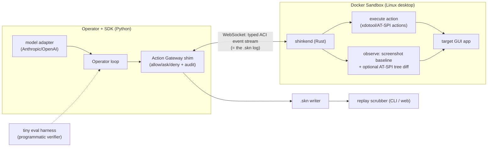
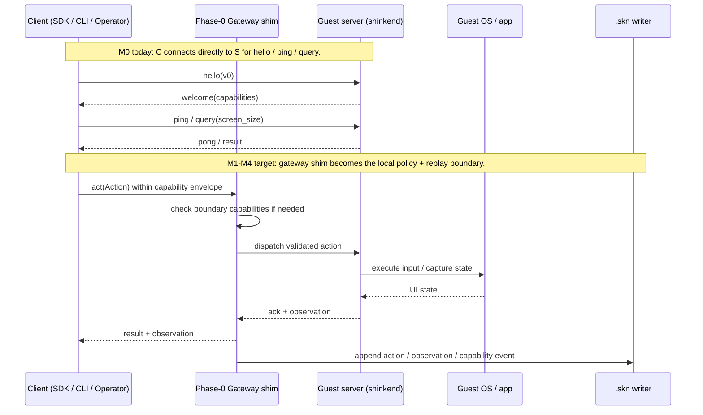
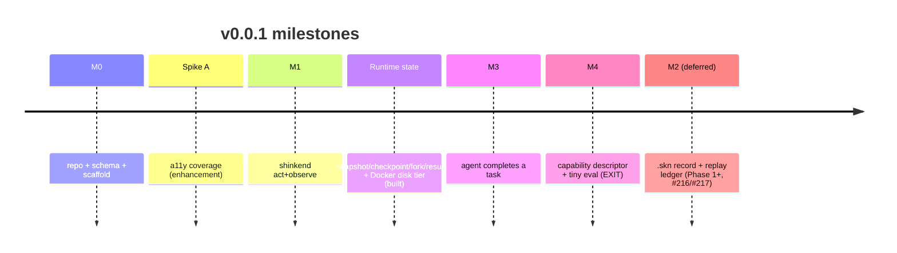

# 10 — v0.0.1 Implementation Plan (feature-complete local/reference runtime)

> Status: drafted · 2026-06-02 · Sibling docs: [00 Vision](../design/vision.md) · [02 Architecture](../design/architecture.md) · [05 ADRs (D1–D12)](../design/tech-decisions.md) · [06 Roadmap](roadmap.md) · [Open questions](../../notes/open-questions.md)
>
> Audience: implementers · Role: current v0.0.1 engineering plan and exit criteria. This is the
> milestone implementation source of truth, alongside the GitHub `v0.0.1 — feature-complete
> local/reference runtime` milestone. Current built status lives in [`STATUS.md`](status.md).

This is the concrete build plan for **v0.0.1 / Phase 0** from the [roadmap](roadmap.md): a
**feature-complete local/reference runtime** for Shinken's core CUA semantics. It runs on a local
Linux Sandbox first, but the scope is not a narrow demo. v0.0.1 must prove that an agent can drive a
real desktop app through the **ACI**, observe through screenshots and reference structured paths,
expose provider runtime-state support (snapshot/checkpoint/fork/restore/resume) — with a **Docker
disk-tier reference implementation already built** (#206–#233) — move task artifacts, declare and
record sandbox capabilities, and produce verifier-backed eval evidence. The runtime-state surface
leads; the **`.skn` replay/recording surface was removed and deferred (#216/#217)**, so its clauses
below are marked deferred and return as a Phase-1+ supporting ledger. Accessibility-tree coverage is
measured in Phase 0, but it is a structured-observation optimization gate, not the blocker for the
first usable GUI-agent runtime.

The line is: **complete semantics locally, optimized substrate later**. No cloud fleet, no CoW fork
tier, no GPU tier, no Windows/macOS guests, no SFU, and no full Cedar+ocap+OS enforcement in
v0.0.1; those later milestones make the same semantics fast, multi-tenant, cross-substrate, and
production-hardened.

---

## 1. Goal & exit criteria

**Goal:** one command starts a local Linux Sandbox; a Python script or off-the-shelf provider adapter
drives a real GUI app through the universal `screenshot -> action -> screenshot` loop and the
canonical ACI; the run can checkpoint/fork/resume against the built Docker disk tier; every action,
observation, media ref, artifact ref, capability envelope, permission decision, and verifier receipt
is captured through the runtime; and we have first-party numbers for a11y/CDP coverage as a
structured enhancement path. (A durable `.skn` recording/scrub surface was deferred with #216/#217
and returns later as the supporting audit ledger.)

**Phase-0 is "done" when all of these hold (exit criteria):**

| # | Exit criterion | Proves |
|---|----------------|--------|
| E1 | An agent completes scripted ≥5-step tasks in real Linux GUI apps entirely through the ACI, no direct host access. | The ACI + Guest Runtime spine works. |
| E2 | *(Deferred, #216/#217.)* The `.skn` recording/replay surface was removed; durable bundle recording + a scrubber return as a Phase-1+ supporting ledger. v0.0.1 surfaces the timeline through the live runtime, not a persisted `.skn` bundle. | Replay (D5) — deferred. |
| E3 | Default v0.0.1 observation is a **screenshot** with dimensions and coordinate space; AT-SPI/CDP a11y/DOM and `element_ref` are implemented as reference structured tracks where available. | Screenshot-first GUI baseline + structured enhancement (D3). |
| E4 | The run declares its sandbox capability envelope and records grants/denials/narrowing as first-class capability/permission events through the local gateway shim. | Capability/entitlement spine (D6) at v0. |
| E5 | **Spike A (a11y coverage)** has run against the target app set and produced a coverage + diff-bandwidth report. | The D3 optimization path is measured, not assumed. |
| E6 | An off-the-shelf model drives the Sandbox unchanged via one adapter (Anthropic *or* OpenAI computer-use), with adapter version and coordinate/image transforms recorded. | The adapter strategy (D2) works against a real provider. |
| E7 | File/artifact transfer exists with checksums and content-addressed resource references. | Artifact/data movement is a core runtime surface, not an afterthought. |
| E8 | Providers advertise runtime-state support (`snapshot`, `checkpoint`, `fork`, `restore`, `resume`, reset strategy) honestly — the v0.0.1 Docker reference implements a **disk tier** (`docker commit`, #209), while leaner providers report unsupported/recreate. | Runtime lifecycle semantics are explicit before performance substrate work begins. |
| E9 | A tiny eval harness runs deterministic tasks repeatedly (including `run_eval_forked` over the Docker disk tier) and emits verifier receipts. | Eval evidence (D7) exists before cloud-scale eval service. |
| E10 | Contract tests cover ACI schema, Rust protocol, Python SDK, adapters, capability events, runtime-state descriptors, and verifier receipts. (`.skn` event contracts return with the deferred recording surface.) | v0.0.1 cannot regress into schema/runtime drift. |

If **E5** fails (a11y coverage is too low on real apps), that is a *successful* Phase-0 outcome: it
tells us which apps stay on the screenshot/SoM path longer. It does **not** block the first
screenshot-based GUI loop — see [Spike A](#5-spike-a-a11y-coverage-structured-enhancement).

**Explicit non-goals for v0.0.1** (deferred to later phases, per [roadmap](roadmap.md)):
cloud fleet/control-plane deployment, warm pools, CoW fork density, WebRTC/SFU + NVENC production
streaming, full Cedar+ocap+OS enforcement, Windows/macOS guests, GPU tier, Android, multi-viewer,
and multi-tenant operations. v0.0.1 reset = **recreate the container**; fork comes later. These are
performance, substrate, and productionization layers, not missing product semantics.

---

## 2. Tech-stack decision (v0.0.1)

These are the implementation choices v0.0.1 commits to; each is justified and reversible, and the
load-bearing ones should graduate to ADRs (proposed **D13 Guest-Runtime language**, **D14 schema &
transport**) once validated.

| Concern | v0.0.1 choice | Rationale | Later evolution |
|---|---|---|---|
| **Guest Runtime `shinkend`** | **Rust** (tokio) | Single static (musl) binary trivially dropped into any guest image; low overhead; strong async; good a11y FFI (`atspi`/`zbus`); precedent in the strongest prior art (codex-rs, cua-driver). | Add UIA (Windows) / AX (macOS) backends behind the same handler-factory (D10). |
| **ACI schema (source of truth)** | **JSON Schema** for wire messages + `.skn` events, in `schema/` | Human-debuggable, fast to iterate, validates the `.skn` log directly; one source generates types. | Migrate hot path to **protobuf + gRPC/bidi** when perf demands (D8); keep JSON `.skn`. |
| **Transport (host↔guest)** | **WebSocket** carrying the typed event stream | Browser-native for the viewer, simplest cross-language, the event stream *is* the `.skn` log (D5). | **virtio-vsock** + WebRTC dual-channel (D4) in Phase 1. |
| **SDK / Operator** | **Python** (`sdk/python/`) + thin CLI | The agent/model ecosystem is Python-first; adapters for Anthropic/OpenAI computer-use are easiest here (D2). | Generate **TypeScript** SDK from the same schema (D8); web Operator. |
| **Control surfaces** | **TypeScript** (`sdk/typescript/`, later `panel/`, TUI, browser adapters) | Browser/WebRTC/CDP, dashboards, replay inspection, and terminal/web UI state are TypeScript-native control-plane concerns, not Guest Runtime concerns. | Shared TS models for the Control Panel, TUI, browser/CDP adapter, and MCP facade. |
| **File transfer** | Explicit artifact/file-transfer API with checksums and `.skn` refs | GUI agents and evals need fixture upload and artifact download as core semantics. v0.0.1 correctness matters more than throughput. | Dedicated binary stream, resumable directory sync, object-store handoff. |
| **Substrate (Sandbox)** | **Docker** container: Xvfb + a lightweight WM (Openbox/XFCE) + target apps + `shinkend`, plus provider state descriptors | Simplest local isolated Linux desktop; mirrors the proven E2B / Anthropic-demo image pattern; runs on the dev machine via Docker. Docker reset defaults to recreate; disk-tier snapshot/fork/checkpoint/resume land via `docker commit` (#209), with the fast CoW fork tier in Phase 1. | OSS **`kubernetes-sigs/agent-sandbox`** CRD + Firecracker/QEMU-microvm fork tier (D1) in Phase 1. |
| **Observation** | **Screenshot-first** baseline plus AT-SPI/CDP reference structured paths and `element_ref` resolution | Proves universal GUI control and the structured contract at local scale; efficient diffs and coverage-driven defaults come later. | SoM/OmniParser, UIA/AX, hardware video pipeline, optimized structured-default paths. |
| **Capabilities** | Capability envelope + local gateway shim + boundary grant/deny events logged to `.skn` | Proves the *capability + audit* spine without turning every in-sandbox action into an approval. | Cedar decision + ocap caretaker + OS/TCC entitlement enforcement (D6) in Phase 1. |
| **Replay viewer** | CLI scrubber/validator (required) + minimal static web viewer (stretch) | Prove `.skn` is replayable, inspectable, and schema-valid; full Control-Panel UX later. | rrweb-player-style web panel, branching (D5) in Phase 1. |

> Dev environment note: the primary dev machine is macOS, so the Linux Sandbox runs in Docker
> (Docker Desktop / colima). The macOS-AX portion of **Spike A** can run natively on the host to get
> an early cross-OS coverage data point.

---

## 3. v0.0.1 architecture slice

The local/reference slice of [02-architecture.md](../design/architecture.md). It keeps the full product
semantics but runs them without the production fleet:



What's intentionally **absent** in v0.0.1: Fleet Manager / warm pools / fork, Cedar engine, OS
sandbox enforcement, WebRTC media plane + NVENC, SFU, SoM grounding, cross-OS guests, GPU.

### 3.1 Client / server split

For v0.0.1, keep the mental model simple and explicit:

- **Client side:** Python SDK, CLI, Operator loop, and the one model adapter. The client asks to
  observe and act; it does not own privileged authority.
- **v0.0.1 control shim:** a local Action Gateway shim that records the Sandbox capability envelope
  and any boundary grant/deny events into the `.skn` event stream. This is deliberately small, but it
  preserves the future control plane boundary.
- **Guest server:** `shinkend`, running inside the Linux Sandbox. It executes ACI actions and
  captures observations. It does not make policy decisions.
- **Guest OS / apps:** the desktop session, target GUI apps, AT-SPI/CDP sources, and screenshots.
- **Substrate host:** Docker in v0.0.1; later replaced by the routed substrate pool (agent-sandbox,
  Firecracker, QEMU/crosvm, and other per-OS backends).

M0 is only the first link in that split: the Python SDK talks directly to `shinkend` over a
WebSocket to prove the handshake and query shape. M1-M4 add the v0.0.1 control shim, real
act/observe, `.skn` recording, capability descriptors, and eval.



This split is intentionally the same split used later by the full architecture: the future Control
Plane replaces the local Gateway shim, but the client still requests, the server still provisions
capabilities and records, and `shinkend` still only executes validated ACI.

---

## 4. Work breakdown (milestones)

Sized in milestones, not calendar dates (rough estimate ~6–8 focused weeks for one engineer).
Each milestone has a **deliverable**, an **acceptance test**, and the **decision it realizes**.



### M0 — Scaffold, schema, stack (foundation)
- **Build:** monorepo code dirs (see [§8](#8-phase-0-code-layout)); the **ACI v0 JSON Schema**
  (`schema/aci.schema.json`); generated Python types; a `shinkend` skeleton that opens the
  WebSocket, handshakes (capability negotiation, D2 §2), and answers
  `ping`/`get_screen_size`/`platform`. (The `.skn` v0 schema was deferred with the recording surface,
  #216/#217; `schema/` holds only `aci.schema.json` today.)
- **Acceptance:** `python -m shinken.cli connect` handshakes with a running container `shinkend`;
  schema validates a sample event round-trip.
- **Realizes:** D2 (schema + handshake), D8 (one IDL → SDK).

### Spike A — a11y coverage (structured enhancement — see [§5](#5-spike-a-a11y-coverage-structured-enhancement))
- Run alongside the screenshot-first loop so we know where structure can reduce cost and improve stability.

### M1 — `shinkend` acts and observes (pixel + reference structure)
- **Build:** ACI v0 **action verbs** (subset of D2): `click`, `double_click`, `right_click`,
  `type_text`, `key`, `scroll`, `move`, `screenshot`, `wait`, `start_screencast`,
  `stop_screencast` — `target = oneof{point_px | point_norm | element_ref}`. Action execution via
  backend-pluggable synthetic input and, where available, semantic AT-SPI/CDP routing. **Observation
  v0:** screenshots/focused/region capture, conservative screencast, AT-SPI/CDP normalized
  `Element` output, and `element_ref` resolution.
- **Acceptance:** a Python script observes a screenshot, clicks/types/scrolls by pixel coordinates
  and by `element_ref` where available in a real app, then observes a new screenshot or structured
  state reflecting the change. Schema/Rust/Python contract fixtures cover every wire shape.
- **Realizes:** D2 (actions), D3 (screenshot baseline + structured enhancement).

### M2 — `.skn` record + replay (the audit/training ledger) — **DEFERRED (#216/#217)**
The durable `.skn` recording/playback surface was removed and deferred to Phase 1+; it is **not** a
v0.0.1 deliverable. When it returns it lands *after* runtime state (below) as the supporting audit
ledger a checkpoint references, not the reverse. The design intent — a directory/zip with
`manifest.json`, append-only `events.jsonl` (envelope `kind ∈ {action, observation, decision,
permission, marker, meta}`, monotonic `seq` + wall anchor, `action_id` pairing action→observation
per D5), a content-addressed `media/`, plus a **CLI scrubber** (`shinken replay <bundle>`) and a
minimal static web viewer — is retained as Phase-1+ design context (D5).

### M2c — runtime state: snapshot/checkpoint/fork/resume (the differentiator) — **BUILT**
- **Build (done):** provider capability descriptors for `snapshot`, `checkpoint`, `fork`, `restore`,
  `resume`, `reset_strategy`, and `snapshot_kind`, **plus a Docker disk-tier reference
  implementation** of them — `docker commit` snapshot → restore/resume/fork and a `checkpoint`
  (`snapshot_kind="disk"`, #206/#209), with `eval.run_eval_forked` driving the golden→fork-N→score
  loop (#231). External providers report provider-managed behavior; no provider may imply
  Firecracker-class **memory** fork unless code and tests prove it. This is the headline runtime
  primitive — a checkpoint says *where this can continue from*. (Binding a checkpoint to a `.skn`
  event offset waits on the deferred recording surface, #216/#217.)
- **Acceptance:** SDK/provider contract tests verify unsupported operations fail explicitly *and*
  that the Docker disk tier round-trips snapshot/restore/fork/resume; docs/user runtime-state
  explains the terms and tiers honestly.
- **Realizes:** D1 (CoW fork-from-snapshot, disk tier), D7 (N≥5 forked eval replicas), D9 (scheduler
  inputs). The D5 `.skn` checkpoint-offset link returns with the deferred recording surface.

### M2b — file transfer / artifacts
- **Build:** SDK + Guest Runtime primitives for `put_file`, `get_file`, and artifact references.
  v0.0.1 requires checksums, scopes, errors, and content-addressed refs; high-throughput chunking and
  resumability can evolve after the semantics are correct.
- **Acceptance:** transfer a fixture file and an output artifact; detect hash mismatch; record
  content hashes / artifact refs (the `.skn` resource link returns with the deferred ledger).
- **Realizes:** D5 (content-addressed resources), D8 (SDK surface), D9 (resource accounting), D6
  (`fs.scope` / artifact export capability).

### M3 — agent-native dialect + provider adapter completes tasks
- **Build:** the **Operator loop** (provider-agnostic), one Shinken-native action dialect parser,
  and at least one model adapter (Anthropic `computer_2025xxxx` *or* OpenAI `computer_call`)
  translating the provider's action/observation format to/from the ACI (D2 adapters). Add
  deterministic **task fixtures** (start state, goal, verifier).
- **Acceptance:** the off-the-shelf screenshot-based model or adapter fixture drives the Sandbox to
  complete a task; the whole run emits action + observation + capability + verifier events through
  the runtime (durable `.skn` bundling returns with the deferred ledger).
- **Realizes:** D2 (adapters), D8 (Operator contract), and E1/E6.

### M4 — capability envelope + tiny eval (EXIT)
- **Build:** the **local Action Gateway shim** — a small capability map (e.g. `net.egress`,
  `fs.scope`, `install.privileged`, `screenshot`, `input.automation`, `artifact.export`) recorded at
  session start; boundary grants or denials become `permission` / `capability` `.skn` events.
  Ordinary in-sandbox GUI actions do not require a prompt. A **tiny eval harness** (`eval/`): run the
  M3 task, then a **programmatic verifier** (inspect real app/file state) emits a 0/1 reward; run
  **N replicas** (sequential in v0.0.1; fork in Phase 1) and report pass-rate, steps, wall-clock, and
  replay paths.
- **Acceptance:** every run records the capability envelope and at least one boundary grant/deny
  event; eval prints pass/fail with verifier evidence; the run replays with capability/verifier
  markers on the timeline.
- **Realizes:** D6 (capability + audit, v0), D7 (verifier-first eval, v0). Hits E2/E3/E4/E9.

### M5 — OSWorld single-task bring-up
- **Build:** an OSWorld injection path that starts from the official OSWorld image/snapshot, installs
  or launches `shinkend` inside the guest, connects the Shinken SDK from the host, drives actions
  through typed ACI, and calls the official OSWorld evaluator for one task. Details live in
  [`osworld-eval.md`](osworld-eval.md).
- **Acceptance:** one real OSWorld task from the upstream corpus runs end to end: official setup,
  Shinken observe/act, official verifier score, and JSON result with task id, steps, wall time,
  score, and failure reason. Then expand to the upstream small manifest before any full-suite claim.
- **Realizes:** D7 (eval on the runtime), D2 (typed ACI adapters), and D1 (future fork-from-golden
  eval replicas).

---

## 5. Spike A — a11y coverage (structured enhancement)

The structured observation thesis (D3) — and the ~6× token and ~150× bandwidth claims behind it
([09-economics](../design/economics-and-build-vs-buy.md)) — assume real apps expose usable accessibility
trees cheaply. v0.0.1 does **not** wait for that assumption to run a GUI agent; it measures the
assumption while the screenshot baseline provides universal coverage.

- **Method:** in the Linux Sandbox, for each target app, dump the AT-SPI tree and compute: (a)
  **coverage** = fraction of visibly-interactable elements that appear as actionable a11y nodes with
  a usable name + bbox; (b) **diff bandwidth** = bytes/sec of the normalized tree diff during a
  scripted interaction; (c) **token estimate** of the serialized tree vs a screenshot. Repeat the
  macOS-AX variant natively on the host for a cross-OS data point. Before running, read trycua/cua's
  cua-driver tool-output docs/get_window_state and xlang-ai/CUA-Gym's reward-generation approach as
  field priors, and include a guest-state-probe measurement (bytes + determinism of file/app-state
  reads) alongside tree coverage — two production systems independently suggest "per-window hybrid
  for acting + guest-state for verifying" (https://github.com/trycua/cua,
  https://github.com/xlang-ai/CUA-Gym).
- **Target app set:** a browser (Chromium via CDP as the a11y reference), a native GTK/Qt app
  (LibreOffice / a file manager), an Electron app, a canvas/WebGL page, and one game/custom-rendered
  surface (expected worst case).
- **Success threshold (proposed):** ≥ ~85% coverage on standard GTK/Qt/browser apps with tree-diff
  ≤ ~50 kbps; canvas/Electron/games are *expected* to be low → that quantifies exactly when the
  screenshot/SoM path remains primary.
- **Output:** `spikes/a11y-coverage/REPORT.md` with the numbers (first-party, replacing the
  vendor-published anchors in the canon), feeding [09-economics](../design/economics-and-build-vs-buy.md)
  and a possible D3 amendment.

**Spikes B & C** (scheduled at the v0.0.1 → Phase-1 boundary, since they need infra v0.0.1 omits):
**B — CoW-fork density** (Firecracker/QEMU snapshot-fork: real concurrent-guests-per-host bounded by
private RSS; target validates D1) and **C — dual-channel WebRTC latency** (structured data channel +
on-demand NVENC video; target glass-to-glass < ~150 ms; validates D4). Listed here for continuity;
specced in the Phase-1 plan.

---

## 6. Interface contracts (v0)

Frozen-enough surfaces so milestones can proceed in parallel. Full schemas live in `schema/`.

- **ACI action (v0):** `{ "v": 0, "verb": "<click|double_click|right_click|type_text|key|scroll|move|screenshot|wait>", "target"?: { "kind": "point_px"|"element_ref", ... }, "args"?: {...}, "call_id": "<uuid>" }`. Verbs are a strict subset of D2; `element_ref` resolves server-side to a centroid.
- **Observation (v0):** `{ "obs_id", "ts", "cause": "<action_id|push>", "display": {w,h,dpr}, "tree": "full" | "diff", "elements"?: [Element], "delta"?: {added,removed,changed}, "image"?: {ref, w, h} }`, `Element = {ref, role, name, value?, states[], bbox[x,y,w,h]}` (D3).
- **`.skn` event (v0):** `{ "seq": int, "dt": float, "kind": "<action|observation|decision|permission|marker|meta>", "src": "<subtype>", "action_id"?: "...", "payload": {...} }`; bundle = `manifest.json` + `events.jsonl` + `media/<sha256>` (D5).
- **Capability decision (v0):** `{ "capability": "<class>", "request": {...}, "decision": "grant|narrow|deny", "by": "policy|human", "resolved": "...", "ts" }` — emitted as a `permission` or `capability` `.skn` event (D6).
- **Operator/adapter contract:** `observe() -> Observation`, `act(Action) -> ack`, `supported() -> {verbs, targets, observation_types}` — the provider-agnostic seam (D8).
- **Error taxonomy (v0, #56) — IMPLEMENTED.** Infrastructure death is distinguished from agent/task failure: a `SandboxDied` error class (`shinken.errors`) carries substrate exit/signal detail (the -9 SIGKILL/OOM idiom); `act_batch` rows carry a typed per-action `status` (`ok | error | timeout | skipped | sandbox_died`) plus a batch-level `failure_kind`, and a stop-on-error batch marks the un-run actions `skipped` so every requested action is accounted for; the eval harness tags each `RunResult` with a `kind` (`pass | fail | setup | sandbox_died | error`) and an `infra_failure` flag. Failures yield structurally valid records — a failed step never crashes the batch or the eval loop. (Prior art: three-level tool-status/exit-reason/masked-trajectory taxonomies and worker-returncode errors in public RL/orchestration stacks — https://github.com/verl-project/uni-agent, https://github.com/Agentix-Project/Agentix.) *Remaining:* a trajectory-level exit-reason field with documented precedence, once the train Workload (#223) lands.
- **Infra-vs-task failure split (eval) — IMPLEMENTED.** `run_eval`/`_score_replica`/`run_eval_forked` classify an exception by where it occurred: a setup/connect failure or a dropped connection is `sandbox_died`/`setup` (infrastructure — retry on a fresh sandbox/fork, counted in `EvalSummary.infra_errors`), while a completed run with a failing verdict is `fail` (score 0 that must NOT be retried). `run_eval_forked` upgrades a coarse drop to `SandboxDied` with provider-confirmed exit detail via `provider.check_alive()`.
- **Screencast delivery semantics (#56) — REMAINING.** Alongside frame-queue bounding (done), specify reconnect behavior for `stream`/`seq`: client emits a resume with pending ids on reconnect, server replays unacked events, client acks — at-least-once for the event stream, freshest-wins (drop-stale) for frames. (Working reference: resume/ack reliable-stream designs in public orchestration stacks — https://github.com/Agentix-Project/Agentix.)
- **Scorer isolation (eval, #206/#231) — REMAINING (external-evaluator lane).** When the scorer is *external* code (e.g. the OSWorld evaluator, which talks over files/HTTP rather than the live session), run it in a fresh subprocess, pass params as JSON on stdin, and write the verdict to a result file via atomic write+fsync+rename, treating a written result as authoritative even on a non-zero/timeout exit. The in-process reference verifier (which reads the live `env`) does not need this; it applies when the OSWorld Workload's scorer lands.

---

## 7. Outer orchestration primitives

The hot action loop stays on the ACI: model adapter → typed action → gateway shim → `shinkend`.
Around that loop, Shinken still needs lightweight orchestration so evals, demos, and training-data
runs are repeatable without turning the runtime into a benchmark-specific harness.

v0.0.1 should define these outer primitives as thin SDK-side concepts:

- **Task** — declares setup inputs, the instruction/goal, verifier entrypoint, artifact expectations,
  and the replay bundle produced by the run. A task does not own the GUI backend.
- **Agent adapter** — translates a model/provider grammar into ACI actions and renders observations
  into that provider's expected shape. It owns prompt/message formatting, not Sandbox authority.
- **Tool adapter** — exposes non-GUI capabilities such as command execution, file editing, or browser
  semantic helpers through the policy boundary. It is optional for GUI-only agents.
- **Batch runner** — expands a run matrix, leases Sandboxes, retries infrastructure failures,
  resumes completed work, and writes summaries that point at `.skn` bundles and artifacts.
- **Trace processor** — consumes the canonical event stream for token/cost accounting,
  OpenTelemetry export, redaction reports, and replay-derived summaries.

These primitives are deliberately outside `shinkend`. The Guest Runtime should remain a small,
backend-pluggable ACI executor and observation engine; orchestration belongs in SDK/control-plane
code where policy, retries, batching, and model adapters can evolve without changing the in-guest
daemon.

---

## 8. v0.0.1 code layout

M0 creates the first implementation directories; later milestones fill in the currently planned
`spikes/`, `panel/`, and `eval/` surfaces.

```
shinken/
├── schema/            # ACI JSON Schema (source of truth) — M0 (.skn schema deferred, #216/#217)
├── shinkend/          # Rust guest runtime (act + observe + WS) — M0/M1
├── sdk/python/        # Python SDK, Operator loop, model adapters, CLI — M0/M3
├── sdk/typescript/    # TS SDK + replay/control-surface models — M0/M2+
├── tasks/             # Shinken-native task specs + verifiers — M4+
├── batch/             # run matrix, retry/resume, replay/artifact summaries — M4+
├── panel/             # minimal web replay viewer (TS) — M2 stretch
├── images/linux/      # Dockerfile: Xvfb + WM + target apps + shinkend — M0
├── spikes/
│   ├── a11y-coverage/ # Spike A tool + REPORT.md — before M1
│   ├── cow-fork/      # Spike B (Phase-1 boundary)
│   └── webrtc-latency/# Spike C (Phase-1 boundary)
├── eval/              # tiny eval harness + task fixtures + verifiers — M4
├── docs/  notes/      # (existing) design corpus
└── references/        # public prior-art provenance + re-clone notes
```

A future `CONTRIBUTING.md` + CI (lint/test, schema-validation, `shinkend` build) land with M0.

---

## 9. Risks & dependencies

| Risk | Likelihood | Mitigation |
|---|---|---|
| **a11y coverage too low on real apps** (Spike A fails) | Medium | That's a *result*, not a blocker — pivot the default to SoM/OmniParser earlier; v0.0.1 still proves the spine with screenshots+pixel targets. |
| Docker-on-macOS desktop quirks (Xvfb/display, perf) | Medium | Standard Xvfb+WM image (proven by E2B/Anthropic demo); run the Linux container; keep host-AX as a separate native data point. |
| AT-SPI flakiness / apps not exposing the tree at runtime | Medium | Per-app readiness probes (no fixed sleeps, D7); fall back to pixel target; record failures as observations. |
| Provider computer-use API drift (Anthropic/OpenAI) | Low | Version-pin adapters (D2); one provider is enough for E6. |
| Scope creep into performance/scale work | Medium | The non-goals list is binding; v0.0.1 implements semantics, but defers fork-density, full Cedar/OS enforcement, WebRTC/SFU/NVENC, and multi-tenant scale. |

**External dependencies (all public):** Docker; an Xvfb-based Linux desktop image; Rust toolchain;
Python 3.11+; one provider API key (Anthropic or OpenAI) for M3; Chromium (a11y reference for Spike
A). No proprietary or internal dependencies.

---

## 10. Definition of done & handoff to Phase 1

v0.0.1 is complete when the non-deferred exit criteria ([§1](#1-goal--exit-criteria); E2 is deferred
with #216/#217) pass and `spikes/a11y-coverage/REPORT.md` exists. Outputs that feed Phase 1: the
validated **ACI v0** schema (harden later to protobuf/gRPC + virtio-vsock/WebRTC), the **Docker
disk-tier runtime-state** reference impl, first-party **a11y/bandwidth numbers** (replace vendor
anchors; possibly amend D3), a working **Sandbox image + Operator + adapter path**,
capability/eval semantics at local scale, and a test matrix that prevents contract drift. Phase 1
then grafts on the **fork fast tier (Spike B)**, **dual-channel streaming (Spike C)**, the
production **Control Panel**, the full **Cedar/ocap/OS capability engine**, and the returning
**`.skn` recording/replay ledger**. See [06-roadmap.md](roadmap.md).
