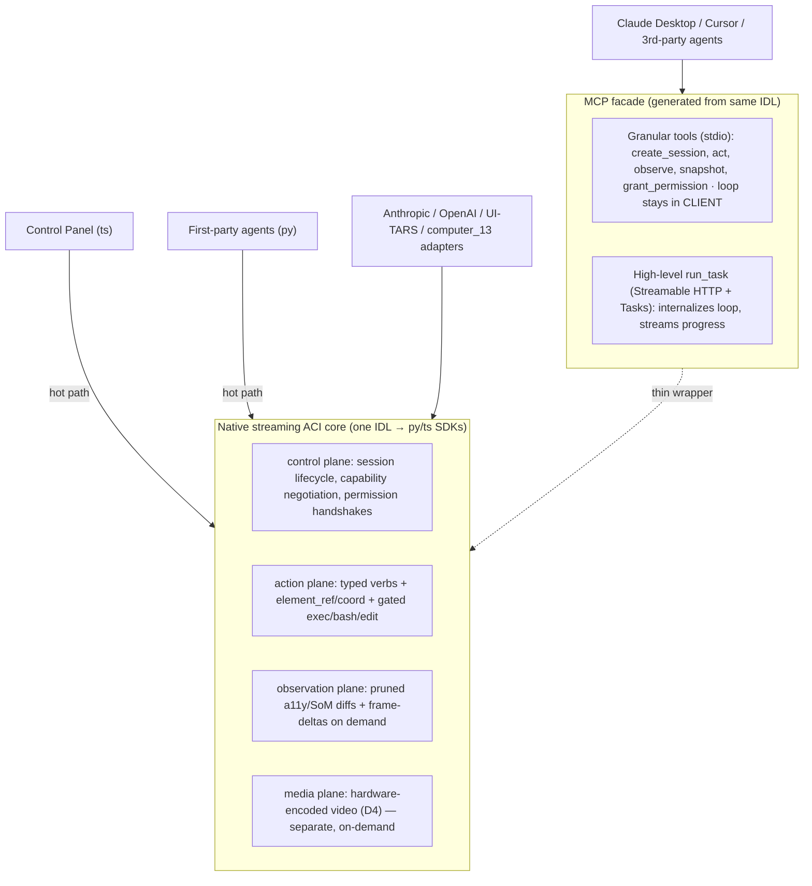

# AI-Native Interface (ACI) — Design Note

> **Status:** design note (2026-05-30) · **Owner:** ACI workstream · **Reconciles to:** [D2](../docs/design/tech-decisions.md) (action schema), [D3](../docs/design/tech-decisions.md) (observation), [D8](../docs/design/tech-decisions.md) (interfaces).
> This note expands the *how* behind D2/D3/D8; the ADRs in [`docs/design/tech-decisions.md`](../docs/design/tech-decisions.md) are the canonical decision record. Every speed/density/cost figure sourced from a vendor is tagged **(vendor-published, unverified)**; the load-bearing assumptions still need a first-party measurement plan.

Shinken's **Agent-Computer Interface (ACI)** is the versioned protocol and typed action/observation schema every Sandbox speaks. Its thesis is three sentences. **One canonical typed action grammar** — a tagged union of ~16 verbs whose spatial target is a `oneof{point_px | point_norm | element_ref}` — adapts to every model vendor (Anthropic, OpenAI, UI-TARS, and the OSWorld `computer_13` JSON grammar) through version-pinned, bidirectional adapters, so an off-the-shelf Claude or OpenAI computer-use agent drives Shinken unmodified ([D2](../docs/design/tech-decisions.md)). **Observation is screenshot-first and layered**: screenshots are the universal baseline, normalized cross-OS accessibility/DOM tree diffs become the fast path where coverage is strong, Set-of-Marks / OmniParser is the grounding bridge for accessibility-empty surfaces, and pixels/video escalate on demand — the ~6× token win only holds after measuring the blended fallback rate ([D3](../docs/design/tech-decisions.md)). And **the surface is dual**: a native streaming SDK is the hot-path core (control panel + first-party agents), with a Model Context Protocol (MCP) facade at two altitudes as the model-agnostic on-ramp — but never the action/observation/video loop ([D8](../docs/design/tech-decisions.md)). The whole design is "closed and safe by default, open and gated by exception": typed actions are an enumerable, lintable, replayable closed set; code-as-action is a separate, off-by-default capability class. This is the opposite of OSWorld, whose every grammar collapses to an unauthenticated `python -c` RCE-by-design.

Cross-links: sandbox/substrate in [`docs/design/architecture.md`](../docs/design/architecture.md) · streaming transport in [`docs/design/tech-decisions.md` D4](../docs/design/tech-decisions.md) · permission model in [`docs/design/threat-model.md`](../docs/design/threat-model.md) and [`notes/permissions.md`](permissions.md) · economics in [`docs/design/economics-and-build-vs-buy.md`](../docs/design/economics-and-build-vs-buy.md) · replay in [`notes/replay.md`](replay.md).

---

## 1. The unified typed action schema (D2)

### 1.1 Why one schema at all

Every model-vendor action grammar we surveyed reduces to the same screenshot-in / discrete-action-out loop, differing only in (a) coordinate space, (b) verb granularity, and (c) how modifiers/buttons/scroll are expressed. OSWorld proves this empirically: it accepts **five** incompatible representations — Anthropic, OpenAI computer-use, the UI-TARS DSL, its own `computer_13` JSON, and raw pyautogui — and string-translates *all* of them down to one execution primitive: a pyautogui code string run via `python -c` over plain HTTP, `FAILSAFE` force-disabled, the sudo password embedded in the system prompt. That in-VM server's own docstring reads "It can be used to execute the pyautogui commands, or ... any other python command. who knows?" — remote code execution by design ([OSWorld](https://github.com/xlang-ai/OSWorld)).

The right lesson is not "translate to code"; it is "translate to **one typed closed verb set**." A closed schema is statically validatable (verb ∈ enum, params in range, target resolvable), individually permission-gateable, and deterministically replayable; a code blob is none of those — you cannot allowlist what you cannot enumerate. Shinken adopts a single canonical grammar and treats the four vendor grammars as *adapters over it*, reusing the field's existing translation tables (OSWorld's per-agent converters) as the reference ontology but **emitting typed actions, never code strings**. The reference implementation closest to this idea — trycua's cross-platform driver — already ships the same instinct in production: a single typed dispatch table over a persistent connection instead of "ship arbitrary pyautogui source to `/execute`" ([trycua/cua](https://github.com/trycua/cua)).

### 1.2 Verbs

The canonical verb set is a near-superset of Anthropic's `computer_20250124` plus `zoom`, modeled with OpenAI computer-use's *orthogonality* rather than Anthropic's `text`-field overloading:

| Class | Verbs |
|---|---|
| Pointer | `move`, `click`, `double_click`, `triple_click`, `mouse_down`, `mouse_up`, `drag(path[])`, `scroll(direction, amount)` |
| Keyboard | `type(text, mode=keystroke\|paste)`, `key_press(keys[])`, `key_down`, `key_up`, `hold_key(keys[], duration_s)` |
| Observation control | `screenshot`, `zoom(region)` |
| Control sentinels | `done(result?)`, `fail(reason)`, `call_user(message?)`, `needs_approval(capability, token)` |
| **Gated escape hatch (separate class, off by default)** | `exec_code`, `run_bash`, `edit_file` |

Three deliberate modeling choices, all flagged as cross-grammar footguns in the research:

- **Modifiers live in a dedicated `modifiers:[ctrl\|alt\|shift\|meta]` array**, never in `text`. Anthropic overloads its `text` field to mean "text to type" (for `type`), "key combo" (for `key`), *and* "modifier to hold" (for click/scroll) — non-orthogonal and error-prone to adapt. OpenAI's `keys[]` array is the clean reference ([OpenAI computer use](https://developers.openai.com/api/docs/guides/tools-computer-use)).
- **`scroll` is canonical `{direction, amount}`** with adapters converting OpenAI's `scroll_x/scroll_y` deltas, `computer_13`'s raw `dx/dy`, and UI-TARS's `direction`. Four scroll encodings, one normalization.
- **Stateful verbs are explicit.** `mouse_down/up`, `key_down/up`, and `hold_key` span actions; a batch (Anthropic/OpenAI `actions[]`) is an ordered, atomic-ish sequence recorded under one correlation id, so down/up pairs and drags compose and replay correctly.

Units are fixed once: **`duration_s` in seconds** (OpenAI's `wait` is in milliseconds — the adapter converts), **`scroll.amount` in clicks**. Keys validate against a centralized W3C [`KeyboardEvent` key/code](https://www.w3.org/TR/uievents-key/) allowlist (the `computer_13` `KEYBOARD_KEYS` table, centralized and tested), with `meta → Cmd/Win/Super` per OS. Every action returns typed feedback `{status, executed_target_logical_px, state_delta, error?}` with *teaching* errors ("coordinate [1200,900] outside bounds [1024,768]", "element_ref stale, re-observe") — the SWE-agent ACI rubric ([Yang et al., NeurIPS 2024](https://arxiv.org/abs/2405.15793)), the opposite of OSWorld returning a hardcoded reward 0 and an empty string on failure.

### 1.3 The target `oneof` — the core unification

The single most important schema decision: **every spatial verb takes a discriminated target, not bare `x,y`.**

```
target = oneof {
  point_px   { x:int,   y:int }                        // pixel models: Anthropic, OpenAI, computer_13
  point_norm { x:0..1,  y:0..1 }                        // normalized models: UI-TARS 0-1000 → /1000
  element_ref{ handle:string, source: a11y|aria-ref|som-mark|uia|ax|cdp }
}
```

This is the crux: **one `click` verb, three ways to say where.** It unifies pixel models (Anthropic/OpenAI/`computer_13`), normalized models (UI-TARS's 0–1000 box space → `point_norm`), and structured models ([Playwright `aria-ref`](https://playwright.dev/docs/aria-snapshots), AT-SPI/UIA/AX nodes, [OmniParser](https://github.com/microsoft/OmniParser) marks → `element_ref`) under the same verb. It is exactly the duality the trycua driver already ships: every manipulation verb accepts *either* an `element_index` (resolved via AT-SPI on Linux, UIA on Windows, AX on macOS, and CDP for Electron/browser content) *or* `x,y` pixels, and its own click tool description literally says "Prefer `element_index` over pixel coordinates ... reach for x,y only when the target is a canvas/custom-drawn surface that doesn't appear in the AT-SPI tree." Shinken makes the hybrid a property of the **action grammar**, not two parallel APIs.

Per [D3](../docs/design/tech-decisions.md), `element_ref` is the **default**; raw `point_px` is reserved for the pixel rung. A stale ref returns a teaching error (`"element_ref e57 stale — re-observe"`), never a wrong click (§3.4).

### 1.4 CoordinateSpace — math done once, in the protocol

Coordinate-space drift is the #1 correctness bug in the field, and it has four independent causes:

1. Older Anthropic models downsample to **1568 px** long edge / ~1.15 MP and return coordinates in *that* space; Opus 4.7/4.8 are 1:1 up to **2576 px** ([Anthropic vision docs](https://platform.claude.com/docs/en/build-with-claude/vision); [Anthropic computer-use tool](https://platform.claude.com/docs/en/docs/agents-and-tools/tool-use/computer-use-tool)).
2. macOS Retina screenshots are **2× logical** (device-pixel-ratio = 2).
3. UI-TARS coordinates are **0–1000 normalized** ([UI-TARS](https://github.com/bytedance/UI-TARS)).
4. OSWorld hardcodes a **1280×720** `resize_factor` — a concrete instance of the bug.

Shinken kills the whole class by carrying an explicit descriptor on **every** observation and doing the math **once** in the protocol's normalization layer:

```
CoordinateSpace {
  origin: "top-left",
  logical_width, logical_height,        // true window/display coords (the actuation space)
  device_pixel_ratio,                   // 2 on Retina/HiDPI
  image_width, image_height,            // what the model actually saw
  scale_factor,                         // min(1, MAX_LONG_EDGE/long_edge, sqrt(MAX_TOTAL_PX/total_px))
  normalization: "pixels" | "unit" | "per-mille"
}
```

The runtime computes the scale for pixel backends, applies the DPR, and converts UI-TARS per-mille — **no agent ever does scaling math.** The replay event stores *both* the image-space coordinates and the actuated logical-pixel coordinates (`image_coord / scale ÷ DPR`), so replay is exact. This generalizes the trycua driver's resize-ratio + zoom-translation registries: a `zoom`-image click is never the window coordinate, and a `from_zoom=true` flag translates it back to window space. Anthropic's own best-practices reference ports the API's 28×28-patch / 1568-tile resize math because getting it wrong causes **~14% click drift** (vendor-published, unverified) — a correctness must-have, not an optimization ([anthropic-quickstarts](https://github.com/anthropics/anthropic-quickstarts/tree/main/computer-use-demo)).

### 1.5 Adapters — the only model-facing surface

Shinken ships **version-pinned, bidirectional** adapters as the sole surface models touch. Each translates IN (vendor grammar → canonical typed action) and OUT (canonical observation → the screenshot/accessibility shape that vendor expects).

| Adapter | Wire shape | Coords | Modifiers | Scroll | Notes for the adapter |
|---|---|---|---|---|---|
| **Anthropic** `computer_20241022` | `{action, coordinate, text}` | abs px (1568/1.15MP downsample) | in `text` | n/a (no scroll verb) | 6 basic verbs; tool `type` + beta `computer-use-2024-10-22` |
| **Anthropic** `computer_20250124` | same | abs px | in `text` | `scroll_direction` + `scroll_amount` | adds scroll, `left_click_drag`, right/middle, double/triple, `mouse_down/up`, `hold_key`, `wait`; beta `2025-01-24`; reused for Claude 4 as `computer_20250429` |
| **Anthropic** `computer_20251124` | same + `zoom` | 1:1 to 2576 px | in `text` | same | adds `zoom(region)` gated by `enable_zoom`; beta `2025-11-24`; Opus 4.5–4.8, Sonnet 4.6 |
| **OpenAI computer-use** | `computer_call.actions[]` / `computer_call_output` | abs px from top-left | `keys[]` array | `scroll_x/scroll_y` deltas | `call_id` correlation; `pending_safety_checks → acknowledged_safety_checks`; `wait` in **ms**; button enum wider (`wheel/back/forward`); `environment: browser\|mac\|windows\|ubuntu` |
| **UI-TARS DSL** | `Action: fn(args)` text | **0–1000** normalized | `hotkey` (space-joined) | `direction` | parse DSL → typed; `0-1000 → point_norm`; `type` via clipboard-paste; `finished/call_user` sentinels |
| **OSWorld `computer_13`** | JSON dict | abs float px | `HOTKEY keys[]` | `dx/dy` raw | 16 action_types incl. `WAIT/FAIL/DONE`; `KEYBOARD_KEYS` allowlist; `MOUSE_DOWN/UP` primitives |

Anthropic's grammar is *schema-less* — the caller supplies no input schema; the grammar is trained into the model and selected via the tool `type` string plus a dated beta header ([anthropic-quickstarts](https://github.com/anthropics/anthropic-quickstarts/tree/main/computer-use-demo)). That tiny wire format (`{action, coordinate, text}`) compresses well and is the single grammar Shinken **must** accept verbatim so an off-the-shelf Claude drives it with zero changes. It pairs natively with sibling [`bash`](https://platform.claude.com/docs/en/docs/agents-and-tools/tool-use/bash-tool) and [`str_replace_based_edit_tool`](https://platform.claude.com/docs/en/docs/agents-and-tools/tool-use/text-editor-tool) tools — the precedent for Shinken's gated escape hatch (§1.7).

Three vendor borrowings map 1:1 onto Shinken primitives:

- **OpenAI `pending_safety_checks → acknowledged_safety_checks`** is a ready-made human-in-the-loop gate. Shinken adopts it as the action `needs_approval{capability, token}` state, wired to the Permission Panel ([D6](../docs/design/tech-decisions.md)). Note OpenAI's *own* sample app errors out with `unsupported_safety_acknowledgement` when a check fires — Shinken must actually implement the operator-approval flow OpenAI left as a stub ([openai-cua-sample-app](https://github.com/openai/openai-cua-sample-app)).
- **OpenAI `call_id`** gives clean causal threading (action-batch → resulting observation) for the replay log ([D5](../docs/design/tech-decisions.md)).
- **Anthropic's strict-superset versioning** (1022 ⊂ 0124 ⊂ 1124) is the model for Shinken's capability negotiation: a newer model simply has more verbs.

**Version pinning is mandatory.** Anthropic gates each grammar behind both a dated beta header *and* an exact tool `type` string; OpenAI evolved from a single `action` (legacy `type:'computer_use_preview'`) to batched `actions[]` (current `type:'computer'`); the UI-TARS DSL varies by checkpoint. Adapters are generated-from-schema, capability-negotiated, and regression-tested against an OSWorld-style replay eval (same task, each adapter, identical typed event log) — adapters are *tested artifacts*, not hand-waved as "the computer-use schema."

### 1.6 Capability negotiation at handshake

`schema_version` (semver) is exchanged at session init. The server advertises a capability descriptor and the adapter negotiates to the intersection — mirroring Anthropic's superset chain and [MCP's `initialize`](https://modelcontextprotocol.io/specification/2025-06-18/basic/transports) negotiation:

```
ServerCapabilities {
  schema_version, supported_verbs[], supported_targets[],
  coordinate_modes[], max_long_edge, observation_types[],
  escape_hatch_caps[]              // empty unless explicitly granted
}
```

A `computer_20241022`-only model sees exactly the 5 basic verbs; a `computer_20251124` model sees the full set + `zoom`. New verbs are **additive**; a verb name is never repurposed (versioning/upcasting is an open spec item — §4.2). UI-TARS validates this pattern at the operator level too: each Operator advertises its own action space (`MANUAL.ACTION_SPACES` / `supportedActions()`) into the prompt, so capability negotiation between operator and model is explicit and per-target ([UI-TARS-desktop](https://github.com/bytedance/UI-TARS-desktop)).

### 1.7 Code-as-action: the security boundary

The escape hatch (`exec_code` / `run_bash` / `edit_file`) is **valuable** — Anthropic's `bash` + `str_replace_based_edit_tool` precedent and OpenAI's `exec_js` "code mode" both prove a closed verb set cannot cover the long tail (complex multi-point drags, app scripting, batch file edits). But it is a **separate capability class** that:

1. is **not** in the default actuation path;
2. requires an explicit per-session capability grant — the agent loop runs *outside* the Sandbox and these calls route through a controlled `tool_runner`-style policy boundary that enforces the egress/FS allowlist before executing;
3. routes through the Permission Panel per call (`needs_approval{token}` before execution);
4. runs only inside the Sandbox, egress- and filesystem-allowlisted, fail-closed ([D6](../docs/design/tech-decisions.md)).

This is the explicit inverse of OSWorld's unauthenticated `/execute` + `FAILSAFE`-off + sudo-in-prompt + SSRF-on-sibling-endpoints surface, where a prompt-injected screenshot can pivot to host compromise. The whole design tension, stated once: **closed + safe by default, open + gated by exception.**

---

## 2. The layered observation model (D3)

### 2.1 The four modalities are complementary, not competing

The observation channel — not the action grammar — is the bandwidth/cost/latency crux. The empirical pattern from OSWorld and UFO2 is decisive: **screenshot + accessibility *fusion* beats either alone** ([UFO2](https://arxiv.org/abs/2504.14603)), and pure-vision agents now beat DOM agents on WebVoyager precisely where structure breaks (Magnitude ~94% vs browser-use ~89%, vendor-published, unverified). So the schema must let the policy *combine and escalate*, never hard-pick one modality globally.

| Modality | Token cost / 10-step task | Strength | Blind spot |
|---|---|---|---|
| **a11y/DOM tree** (AT-SPI/UIA/AX/CDP) | ~25K (vendor-published, unverified) | exact role/name/value/state + stable identity; deterministic acts; cross-OS native apps | Electron/Qt/canvas/custom-drawn yield flat/empty trees; chatty cross-process reads |
| **SoM / OmniParser** | compact element list; full SOM frame still sent | grounding where a11y is empty; turns coord-guessing into ID selection | GPU model in loop (~0.6 s/A100, ~0.8 s/RTX 4090, vendor-published, unverified); marks unstable across frames |
| **Region zoom / crop** | one cropped frame | high signal, low bandwidth for fine detail | still pixels; needs a target to crop around |
| **Full frame / video** | ~150K (vendor-published, unverified); ~4,700 tokens/2576px frame | universal, zero-instrumentation; only signal for canvas/games | most expensive on every axis; probabilistic grounding |

The token formula `tokens ≈ w*h/750` and the long-edge cap jump (1568→2576 px in Opus 4.7) make a dense full-res screenshot ~3× more expensive than a year ago ([images cost 3x more in Opus 4.7](https://www.claudecodecamp.com/p/images-cost-3x-more-tokens-in-claude-opus-4-7)). That ~6× gap (accessibility vs pixels over a 10-step task — ~25K vs ~150K tokens, vendor-published, unverified) **is** the bandwidth headline ([benchmarked AI browser tools](https://fazm.ai/blog/benchmarked-ai-browser-tools-token-efficiency-native-apis)).

### 2.2 The escalation ladder

```
┌──────────────────────────────────────────────────────────────────────┐
│ Rung 0 (DEFAULT): pruned, diffed, normalized a11y/DOM tree            │  ~3,500 tok/obs
│   AT-SPI (Linux) · UIA (Windows) · AX (macOS) · CDP (in-browser)      │  ← act on element_ref
├──────────────────────────────────────────────────────────────────────┤
│ Rung 1: Set-of-Marks / OmniParser  (a11y empty / low coverage)        │  GPU microservice, on-demand
│   numbered marks fused with partial a11y tree (UFO2 IoU>10% dedup)    │  ← act on som-mark ref
├──────────────────────────────────────────────────────────────────────┤
│ Rung 2: region zoom / crop pixels   (fine detail)                     │  Anthropic zoom(region)
├──────────────────────────────────────────────────────────────────────┤
│ Rung 3: full frame                                                     │  pixel rung → raw x,y allowed
├──────────────────────────────────────────────────────────────────────┤
│ Rung 4: hardware-encoded video track (explicit live-watch only)       │  media plane (D4), never default
└──────────────────────────────────────────────────────────────────────┘
```

Each rung is opt-in (agent or policy requests it). The observation carries a **`coverage_ratio`** signal — the fraction of visible pixels covered by accessibility bounding boxes — so the policy can escalate *automatically* when an app is accessibility-hostile, and so humans/evals can see when the system is paying the pixel/OmniParser tax. The A11y-Compressor result frames the Rung 0 budget: a compressed tree capped at **~3,500 tokens/observation** retains 22% of the raw linearized size while *raising* average task success by ~5.1 points (vendor-published, unverified — [A11y-Compressor](https://arxiv.org/html/2605.00551v1)).

### 2.3 One normalized Element model

AT-SPI2, UIA, AX, CDP, and OmniParser all map into a single schema, so the agent and the replay log see one ontology regardless of OS or modality. Roles use the [W3C Core-AAM](https://w3c.github.io/core-aam/) vocabulary (the canonical mapping across AX/UIA/AT-SPI) so platform differences don't leak:

```
Element {
  ref,                              // Shinken-owned opaque, stable per-session
  role,                             // ARIA / Core-AAM canonical
  name, value, states[],
  bbox: [x, y, w, h],               // always display coords; protocol records the transform
  source: atspi|uia|ax|cdp|som,
  backend_id,                       // UIA RuntimeId+HWND · CDP backendDOMNodeId · AX path · AT-SPI path
  parent_ref, children_refs[]
}
```

For browser targets the structured path is the cleanest that exists: CDP [`Accessibility.getFullAXTree`](https://chromedevtools.github.io/devtools-protocol/tot/Accessibility/) is **80–90% smaller than raw DOM** (Stagehand, vendor-published, unverified — [Stagehand v3](https://www.browserbase.com/changelog/stagehand-v3)), and `backendDOMNodeId` is the stable anchor. **Critical detail:** `backendDOMNodeId` is *not* unique across iframes — Shinken namespaces browser handles by frame (Stagehand's `EncodedId = frameOrdinal + backendNodeId`, [taming iframes](https://www.browserbase.com/blog/taming-iframes-a-stagehand-update)) or it will click the wrong element on multi-iframe pages. For native targets, semantic invoke/setValue ([AXPress](https://developer.apple.com/documentation/applicationservices/axuielement_h) / UIA `InvokePattern` / AT-SPI `doAction` / `setTextContents`) is the **default action path** — background-safe, no focus steal, no coordinate guessing — with `getExtents`/`boxModel` bounds kept for the pixel fallback.

A node's *label* follows the browser-use enhanced-text priority chain (`aria-label > title > alt > innerText > placeholder > value > href`), and pruning includes native interactives (button/a/input/select) **and** custom ones (click handlers, ARIA roles, `cursor:pointer`) — a ready-made recipe that keeps a structured snapshot token-cheap ([browser-use DOM engine](https://deepwiki.com/browser-use/browser-use/2.4-dom-processing-engine)).

### 2.4 Diff-based stream = the replay log

Send the full tree once (a keyframe), then only added/removed/changed nodes, driven by native change events ([`AXObserver`](https://developer.apple.com/documentation/applicationservices/axuielement_h), UIA events, AT-SPI signals, CDP `MutationObserver`). This eliminates idle re-transmission and **is** the replay timeline ([D5](../docs/design/tech-decisions.md)) — pixels piggyback as opaque blobs referenced by event id. Periodically resend a full keyframe (like a video I-frame) to resync, since a diff stream can desync if a change event is missed.

The observation event:

```
Observation {
  obs_id, ts, session_id, cause(action_id | push),
  display: { w, h, dpr, scale },
  tree_mode: full | diff,
  elements: [Element...]  | delta: { added[], removed[], changed[] },
  marks?:  [{ mark_id, ref, bbox, label, confidence, source }],
  pixels?: { rung, region:[x,y,w,h], encoding, blob_ref, image_w, image_h },
  coverage_ratio, truncated, verbosity(concise|detailed)
}
```

### 2.5 Per-OS capture strategy — beating the cross-process round-trip

The "low-bandwidth" structured path becomes the *high-latency* path if read naively: per-node UIA/AX/AT-SPI calls are each a cross-process round-trip ("a network request just to read a variable"); AT-SPI2 over D-Bus has been measured at peaks of **~699 calls/100 ms** in GNOME ([GNOME AT-SPI2 investigation](https://wiki.gnome.org/Accessibility/Documentation/GNOME2/ATSPI2-Investigation/DetailedDesign)). The mitigation is bulk-fetch + caching + diffing per platform:

| OS | Backend | Hot-path discipline |
|---|---|---|
| **Linux** | [AT-SPI2](https://github.com/GNOME/at-spi2-core) (D-Bus / ATK) | Private/dedicated a11y bus + direct app↔AT connections; tree-batching + caching; prune via an OSWorld-style `judge_node` heuristic; subscribe to AT-SPI change signals for diffs |
| **Windows** | [UI Automation](https://learn.microsoft.com/en-us/windows/win32/winauto/uiauto-cachingforclients) (COM) | `CacheRequest` bulk-fetch (many props of many elements in one call) + `TreeScope_Children` stepwise walks; a [shadow-DOM element cache](https://automata.visioncortex.org/blog/introducing-ui-automata/) locked to RuntimeId/HWND with liveness re-resolution; fuse OmniParser detections UFO2-style (discard visual detections with IoU > 10% vs a real UIA control) |
| **macOS** | [AX API](https://developer.apple.com/documentation/applicationservices/axuielement_h) (AXUIElement / HIServices) | On-demand subtree fetch (focused window first) + `AXObserver`-driven diffs + `AXUIElementCopyElementAtPosition` hit-test fallback; TCC Accessibility pre-granted in the image |
| **In-browser** (any OS) | [CDP Accessibility](https://chromedevtools.github.io/devtools-protocol/tot/Accessibility/) (+ DOM mutations) | `getFullAXTree` + `MutationObserver` diffs; launch with `--force-renderer-accessibility`; expose `aria-ref`-style frame-namespaced handles; drive CDP directly (Stagehand v3 dropped Playwright for a **44% speedup** on complex DOM, vendor-published, unverified) and track [WebDriver BiDi](https://www.w3.org/TR/webdriver-bidi/) as the portable successor |

### 2.6 Grounding — never raw coordinate regression for structured targets

Grounding is the bridge between "the model knows what it wants to click" and "an actuated pixel." Three approaches, unified under one verb:

1. **a11y/DOM ref** — deterministic; the ref *is* the grounding. No model coordinate prediction at all.
2. **Set-of-Marks** — overlay numbered boxes on detected interactables; the model emits "element N," resolved server-side to bbox→centroid. This **fixes the VLM coordinate-regression weakness**: OmniParser v2 + GPT-4o hits 39.6 on ScreenSpot-Pro vs 0.8 raw GPT-4o (vendor-published, unverified — [OmniParser V2](https://www.microsoft.com/en-us/research/articles/omniparser-v2-turning-any-llm-into-a-computer-use-agent/)). OmniParser emits a structured element list `{id, type, bbox(normalized), interactivity, content, source}` so even a text-only reasoning model can act by ID. Marks unify across modalities: whether they come from accessibility bounds, DOM rects, or OmniParser detections, the agent always emits "act on element N/ref," never raw `x,y`.
3. **Description→coordinate** (a production composed-grounding path) — a "thinking model" emits natural-language element descriptions, a separate grounding model's `predict_click(image, instruction)` converts each to `(x,y)`, and a `desc2xy` map rewrites the calls. This is routed via a registry so the grounding model is swappable ([trycua/cua](https://github.com/trycua/cua)).

Operational rules from the research:

- **Run OmniParser server-side, on-demand, never per-frame.** It is a stateless GPU microservice (a `/parse` shape) that scales horizontally — the same separate-GPU-pool pattern as the SoM rung. Trigger only when `coverage_ratio` is low or the agent requests marks; keep one warm GPU worker per N sessions; add cross-frame mark tracking (IoU + label match) so mark IDs stay stable. **Avoid OmniParser's AGPL detector in the critical path** — pick a permissive or in-house detector ([OmniParser-v2.0 model card](https://huggingface.co/microsoft/OmniParser-v2.0)).
- **`type` via clipboard-paste** (UI-TARS, trycua) for long/Unicode text — better than OSWorld's "100 backspaces to clear a field." Exposed as `type(mode=paste|keystroke)`.
- **Force-enable accessibility in the guest image.** The #1 silent blind spot is *not* genuinely accessibility-hostile UIs — it is unprovisioned images: Chromium/Electron build the tree only with `--force-renderer-accessibility` or an AT detected ([Chromium accessibility overview](https://chromium.googlesource.com/chromium/src/+/main/docs/accessibility/overview.md)); macOS gates on `AXEnhancedUserInterface` and an all-or-nothing TCC grant (a still-unfixed 2025→2026 trust-cache bug, [macOS a11y failure modes](https://fazm.ai/t/macos-accessibility-automation)); the Linux AT-SPI bus must be running. Pre-grant all at image-build time, or Shinken pays the pixel tax for apps that have a perfectly good tree (the screenpipe ["empty Electron tree → expensive OCR"](https://github.com/screenpipe/screenpipe/issues/3002) failure).

### 2.7 The load-bearing unverified assumption

**Accessibility coverage on Electron/Qt/canvas/games is the load-bearing unverified assumption** of the structured fast-path thesis (carried into [`notes/open-questions.md`](open-questions.md)). The escalation ladder and `coverage_ratio` are the *mitigation* — when structure is absent, we escalate and we *measure* that we did — but the design still needs a measurement spike: instrument per-observation token count, bytes, capture latency, `coverage_ratio`, and escalation rung as first-class metrics, and eval observation variants OSWorld-style. Do not ship accessibility-only; vision+SoM is a first-class fallback because structured agents go blind on exactly the hard cases ([Electron empty-tree](https://github.com/electron/electron/issues/37465); pure-vision SOTA on WebVoyager, [HN discussion](https://news.ycombinator.com/item?id=44493081)).

---

## 3. MCP dual-facade vs native SDK (D8)

### 3.1 The decision, in one line

**Build both, layered, with a streaming-native core**: a native py/ts SDK over a purpose-built bidirectional streaming transport is the hot-path surface (control panel + first-party agents); an MCP server is the model-agnostic *facade* derived from the same schema; the Anthropic/OpenAI/UI-TARS adapters are thin translators over the same core; and **the high-frequency action/observation loop and the media plane never traverse MCP**.

This is exactly trycua's three-layer stratification — Computer SDK → Agent SDK → dual-altitude MCP — *upgraded* from its HTTP `computer-server` (a request/response control channel on port 8000, per-action round-trips) to a true streaming channel ([trycua/cua](https://github.com/trycua/cua)). trycua is the single closest external analog and the strongest evidence that both should be built; it even keeps its live H.265 desktop visualization on a separate media plane, off MCP — validating the thesis in a shipping product.



### 3.2 Why MCP cannot carry the hot path

This is over-determined by the [MCP 2025-11-25 transports spec](https://modelcontextprotocol.io/specification/2025-11-25/basic/transports), not a judgment call:

- MCP has exactly **two** standard transports — stdio and Streamable HTTP/SSE — and **no WebSocket / bidirectional / binary-media transport.** JSON-RPC must be UTF-8, so screenshots/video are base64-in-JSON (~33% inflation).
- The server **MAY drop the SSE connection at any time** and force reconnect/poll — unacceptable jitter for a real-time loop.
- Progress notifications are spec'd as **"NOT suitable for high-frequency data where every update matters"** and should be rate-limited — disqualifying for the observation hot path ([MCP progress utility](https://modelcontextprotocol.io/specification/2025-11-25/basic/utilities/progress)).
- The async **Tasks primitive** (SEP-1686, experimental) is poll/subscribe, *not* streaming ([MCP 2025-11-25 update](https://workos.com/blog/mcp-2025-11-25-spec-update)).
- The transport roadmap (~Q1 2026 spec, ~June 2026 release) is deliberately heading toward **stateless, horizontally-scalable** request/response — the *opposite* of a frame-delta hot path. Betting the hot path on MCP fights the protocol's own direction ([MCP transport future](https://blog.modelcontextprotocol.io/posts/2025-12-19-mcp-transport-future/)).

The cost is also empirical: Playwright MCP injects a full accessibility snapshot into context every step at **~114K tokens/task vs ~27K for a CLI approach** (vendor-published, unverified). Granular-tools-over-MCP *works* (Claude Code's built-in `computer-use` MCP server and CursorTouch's [Windows-MCP](https://github.com/CursorTouch/Windows-MCP) both ship it) but pays a per-step round-trip + context-injection tax; Windows-MCP needs a `screenshot-scale` env var (e.g. 0.5) to keep a high-res snapshot inside the context budget, with ~0.2–0.5 s/action (vendor-published, unverified).

### 3.3 The two MCP altitudes

| Altitude | Transport | Tools | Loop lives in | Use case |
|---|---|---|---|---|
| **Granular** | stdio (local) | `create_session`, `act` (typed verbs + ref/coord), `observe` (a11y/SoM, verbosity enum), `snapshot`, `grant_permission`, `list_sessions`; Resources = current screenshot, a11y snapshot, replay timeline | **the client** | Claude Desktop / Cursor — per-step reasoning + permission gating stays with the host |
| **High-level** | Streamable HTTP + Tasks (remote) | `run_task` — internalizes an agent loop, streams progress + final screenshots | the server | fire-and-forget autonomous runs |

Keeping the agent loop **out** of the granular tools is the deliberate departure from the high-level-only MCP pattern that buries the whole loop server-side — fine for autonomy, *wrong* for Shinken's human-in-the-loop Control Panel, which needs per-step reasoning and permissioning. trycua itself demonstrates both postures: its `cuabot` server exposes raw primitives (screenshot/click/type/scroll/key/drag) for coding agents that ground themselves, while its high-level MCP server exposes the whole agent as one `run_task` tool ([trycua/cua](https://github.com/trycua/cua)).

### 3.4 Observation, safety, and staleness on the facade

- Default the granular `observe` to a **pruned accessibility tree with stable element IDs** (the Windows-MCP / Playwright-MCP pattern), with screenshots as on-demand Resources, a `screenshot-scale` parameter, a `verbosity` enum, and a hard token budget (~25K) — because granular tools inject the observation into context every step. Never accessibility-only; SoM/screenshot fallback for canvas/Electron.
- **Staleness contract:** element handles are **per-turn, not durable.** The trycua driver invalidates its `element_index` cache each `get_window_state`; browser-use recomputes `highlightIndex` every frame. A stale ref returns a teaching error and triggers re-observe + re-ground — never a silent wrong click. Log the original handle, the heal decision, and the new handle so a human/eval can audit self-heal divergences (the Stagehand observe→cache→replay→self-heal pattern, [Stagehand](https://github.com/browserbase/stagehand)).
- **Graft Claude Code's safety UX onto both surfaces, scoped PER SANDBOX not per machine:** per-capability session approval with sentinel warnings by reach (shell-equivalent / file / system-settings), terminal-excluded-from-screenshot anti-injection, global Esc/abort, and a per-*Sandbox* single-controller lock. Claude Code's machine-wide single-session lock is incompatible with high concurrency — the lock must be per-Sandbox or concurrency dies ([Claude Code computer use](https://code.claude.com/docs/en/computer-use)).

### 3.5 Auth

The MCP facade adopts MCP auth **wholesale** (it is well-specified and mature enough): OAuth 2.1 Resource Server + [RFC 9728 Protected Resource Metadata](https://modelcontextprotocol.io/specification/draft/basic/authorization) + PKCE + Bearer-on-every-request + 403/`WWW-Authenticate` on insufficient scope + Origin validation + 127.0.0.1 bind for stdio. Add **machine-to-machine (M2M) client-credentials** for headless agents and **Cross-App-Access (XAA)** for enterprise IdP governance ([MCP 2025-11-25 update](https://workos.com/blog/mcp-2025-11-25-spec-update)). The native SDK/stream instead carries Shinken's own session token + per-session capability grants ([D6](../docs/design/tech-decisions.md)) — avoiding per-request Bearer overhead on the hot path, which is another reason auth-sensitive high-frequency traffic belongs on the native channel.

### 3.6 One IDL, no drift

The single biggest implementation risk is the native SDK, the MCP facade, and the vendor adapters drifting apart. **Generate the facade tool definitions and the Anthropic/OpenAI/UI-TARS adapters from one IDL/schema**, with automated conformance tests pinned to MCP spec versions and vendor beta headers. Build the native SDK first (control panel + first-party agents bind to it), then derive everything else on top. Choose the native transport for browser reach: raw WebSocket is browser-native for the ts Control Panel (you control framing/typing via the generated schema), with gRPC bidi-streaming + grpc-web as the alternative when stronger server-side typing/backpressure is wanted — the choice is deferred to [D4](../docs/design/tech-decisions.md)/architecture, but the ACI schema is transport-agnostic by design.

---

## 4. How this reconciles to the canon

| Decision | This note expands |
|---|---|
| **[D2](../docs/design/tech-decisions.md)** — one canonical typed tagged-union | §1: ~16 verbs; `target = oneof{point_px\|point_norm\|element_ref}`; explicit `CoordinateSpace`; semver + capability negotiation; pinned bidirectional adapters for Anthropic `1022/0124/1124` + bash + text_editor, OpenAI `computer_call`, UI-TARS, `computer_13`; code-as-action as a separate off-by-default class behind a `tool_runner` policy boundary. |
| **[D3](../docs/design/tech-decisions.md)** — screenshot-first baseline, structured upgrade | §2: screenshot/focused-region baseline; normalized a11y/DOM diff (AT-SPI/UIA/AX/CDP) → one `Element` schema where coverage is strong; SoM/OmniParser GPU microservice for low-structure surfaces; region/zoom; full frame; video; act on refs/marks where available, raw `x,y` as universal fallback; ~6× token savings is a measured target, not an assumption. |
| **[D8](../docs/design/tech-decisions.md)** — native streaming SDK core + optional MCP facade | §3: one IDL → py/ts SDKs over the bidirectional transport; MCP facade at two altitudes (granular vs `run_task`); never route the hot path or media through MCP; OAuth 2.1 + M2M + XAA for the facade. |
| **[D4](../docs/design/tech-decisions.md)** (referenced) | observation diff stream rides the reliable data channel; hardware-encoded video is Rung 4 on the media track; host↔guest is virtio-vsock, never HTTP polling — beating OSWorld's full-PNG poll, trycua's pull-screenshots, and Anthropic's screenshot-per-step + 2.0 s settle delay. |
| **[D5](../docs/design/tech-decisions.md)** (referenced) | the diff-based observation stream and the action stream ARE the append-only replay log; `call_id`/`action_id` correlation pairs action→observation; both image-space and actuated logical coords stored for exact replay. |
| **[D6](../docs/design/tech-decisions.md)** (referenced) | `needs_approval{capability, token}` (OpenAI `pending_safety_checks` pattern) is the live HITL gate; the code-as-action class is capability-gated, sandboxed, allowlisted; per-Sandbox single-controller lock. |

### 4.1 The competitive line

**MATCH** the model ecosystem via thin adapters and trycua's clean layering/DX. **BEAT** everyone on streaming/bandwidth where structured coverage is strong — every competitor polls screenshots (OSWorld full-PNG poll), pulls base64 frames (trycua), or pushes raw VNC pixels (E2B noVNC, Anthropic's stock `x11vnc`), while Shinken's structured diff stream is the ~6× / ~150× target after fallback measurement. **DIFFERENTIATE** with the typed-vs-code security boundary, the capability-unlock Permission Panel wired into `needs_approval`, and the per-Sandbox concurrency model that Claude Code's machine-wide lock and trycua's per-host single-tenancy cannot match.

### 4.2 Open questions carried forward (do not paper over)

1. **Accessibility-coverage measurement spike** — the load-bearing unverified assumption (§2.7); needs first-party numbers on Electron/Qt/canvas/games before the structured bandwidth claim is defensible. See [`notes/open-questions.md`](open-questions.md).
2. **Protocol/event-schema versioning + upcasting** — additive-only is the rule, but the concrete upcaster for old `.skn`/event streams when verbs evolve is unspecified.
3. **Adapter conformance methodology** — the OSWorld-style replay eval (same task, each adapter, identical typed event log) needs building so adapters are tested artifacts, not hand-waved as "the computer-use schema."
4. **Native transport pick** — WebSocket (browser-native for the ts Control Panel) vs gRPC bidi + grpc-web; tradeoffs deferred to [D4](../docs/design/tech-decisions.md)/architecture, but the ACI schema is transport-agnostic by design.
5. **Multi-player / non-exclusive computer-use** — separate human + agent cursors on one desktop is an explicit in/out scope decision still open; the per-Sandbox single-controller lock assumes exclusive control today.

### 4.3 Sources

The external references cited inline above (model grammars, observation/grounding, MCP) are consolidated with one-line annotations in [`notes/sources.md`](sources.md) §6 (ACI — action schema, observation model & MCP).
