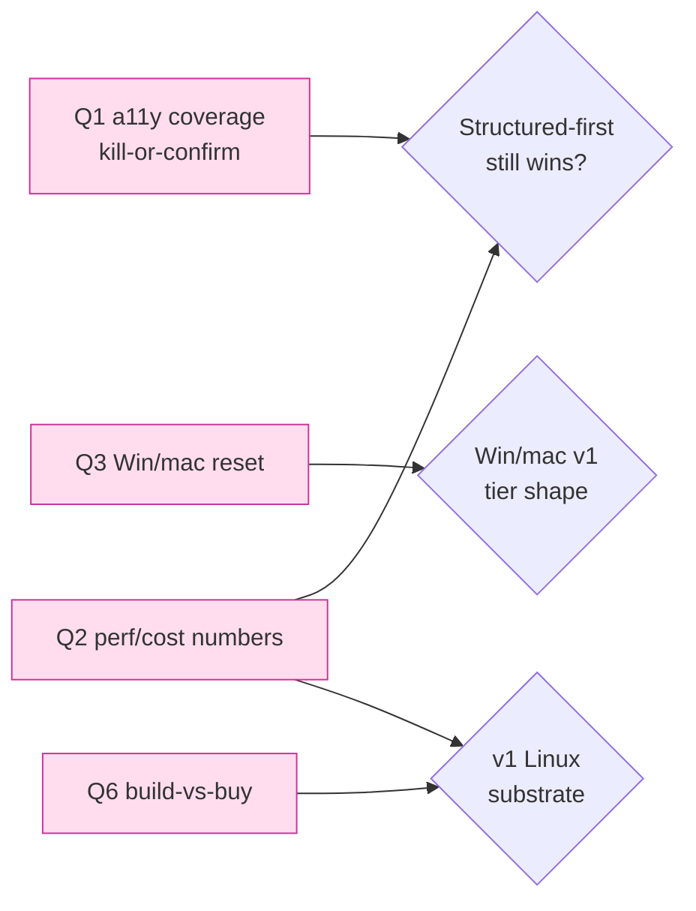

# Shinken — Open Questions, Risks & Spikes

> **Status:** living risk register · **Last updated:** 2026-05-30
> This note is the canonical "what could kill us / what must we prove" list. It reconciles every item
> to the authoritative decisions **D1–D12** (see [`05-tech-decisions`](../docs/05-tech-decisions.md))
> and feeds the risk sections of the docs. Cross-links:
> [00-vision](../docs/00-vision.md) · [01-prd](../docs/01-prd.md) · [02-architecture](../docs/02-architecture.md) ·
> [05-tech-decisions](../docs/05-tech-decisions.md) · [06-roadmap](../docs/06-roadmap.md) ·
> [08-threat-model](../docs/08-threat-model.md) · [09-economics-and-build-vs-buy](../docs/09-economics-and-build-vs-buy.md) ·
> sources in [`sources.md`](sources.md).

The research produced a strong *qualitative* landscape and a defensible thesis — structured-first
dual-channel ACI (D3/D4), Morph-class CoW fork (D1), event-sourced replay (D5), a layered capability panel
(D6). What is *not yet proven* is the engineering and business substance to commit. Every speed/density/cost
figure cited in the docs is **vendor-published and unverified** unless marked first-party; the load-bearing
thesis rests on an *unmeasured* accessibility-tree coverage assumption; and scope questions (multi-player,
build-vs-buy among public substrates) remain open. This note prioritizes those risks **HIGH / MED / LOW**;
for each it gives the question, why it matters, and a concrete resolution — a **spike with pass/fail
criteria** or a research/decision. Spikes are sequenced so the cheapest architecture-killing experiments run
first.

## Risk register at a glance

| ID | Risk / question | Priority | Reconciles to | Resolution type |
|----|-----------------|----------|---------------|-----------------|
| Q1 | a11y coverage on Electron/Qt/canvas/games | **HIGH** | D3 | Spike (kill-or-confirm) |
| Q2 | First-party perf / density / cost numbers | **HIGH** | D1, D4, D11 | Measurement plan + spikes |
| Q3 | Windows/macOS fast-reset feasibility | **HIGH** | D1, D10 | Spike + decision |
| Q4 | Windows/macOS licensing economics | **HIGH** | D1, D12 | Research + legal review |
| Q5 | Consolidated threat-model validation | **HIGH** | D6 | Red-team spikes |
| Q6 | Build-vs-buy among public substrates | **HIGH** | D1, D9, D12 | Decision + integration spike |
| Q7 | Multi-player / non-exclusive computer-use | **MED** | D2, D4 | Scope decision |
| Q8 | Event-schema versioning + upcasting | **MED** | D2, D5 | Spec + spike |
| Q9 | Eval-grader reliability | **MED** | D7 | Process + spike |
| Q10 | Determinism & side-effect-safe fork | **MED** | D5 | Spec + spike |
| Q11 | SRE / cost-of-failure at ultra-high concurrency | **LOW** | D9 | Design + load test |



---

## HIGH priority

### Q1 — a11y coverage on Electron / Qt / canvas / games (the load-bearing bet)

**Question.** What fraction of *real target apps* expose a usable accessibility/DOM tree, and what is
the true bandwidth/token win of structured-first observation **net of the pixel fallback**? If most
in-scope apps need pixels anyway, the D3 differentiator collapses into "just another screenshot agent
with extra latency."

**Why it matters (load-bearing).** This is the single load-bearing unverified assumption in the design. The
"structured-first, pixels-on-demand" thesis (D3) and the ~150× streaming win (D4, headline feature #3)
depend on the a11y tree being reliably populated, cheap to diff, and normalizable into one
`Element{ref,role,name,value,states,bbox,source}` schema. The failure surface is concrete:

- **Empty-tree-by-default trap.** Chromium/Electron build the tree *only* when an assistive technology is
  detected or `--force-renderer-accessibility` is set; macOS gates on `AXEnhancedUserInterface`
  ([Chrome DevTools `Accessibility`](https://chromedevtools.github.io/devtools-protocol/tot/Accessibility/),
  [full-accessibility-tree](https://developer.chrome.com/blog/full-accessibility-tree)). An image not
  provisioned to force accessibility on mislabels a good Electron tree as "a11y-hostile" and wastes tokens
  on pixels — a silent, self-inflicted regression.
- **Canvas / WebGL / games have no tree.** Figma-class canvas, 3D/WebGL, and games render to one canvas
  node — the genuine Rung-1/Rung-2 (Set-of-Marks / parser → pixels) cases, which must be costed as such.
- **Cross-process round-trip blowup.** Naive per-node UIA/AX/AT-SPI reads are O(nodes) IPC; without
  bulk-fetch + caching + diffing the "low-bandwidth" path becomes the **high-latency** path — slower than a
  screenshot ([AT-SPI2](https://github.com/GNOME/at-spi2-core)).

Upside, if it holds: structured observation ≈25k vs ~150k tokens/task (≈6×), and tree-compression can cap
obs at a few thousand tokens while *improving* success on tree-rich apps (vendor/literature, unverified).
The benchmark lesson is **fusion beats either modality alone and varies by model** — so D3's layered
escalation is the right shape; we just have not measured the per-rung fraction for our app mix. Browser
automation gives a strong floor: CDP `Accessibility.getFullAXTree` is ~80–90% smaller than raw DOM.

**Resolution — SPIKE S1 (a11y-coverage, run first; it can kill the architecture).**
A thin in-Sandbox Guest Runtime probe walks AT-SPI (Linux), UIA (Windows), AX (macOS), and CDP
`getFullAXTree` (browser), normalizing to the `Element{...}` schema (D3). Per app, record % nodes with
non-empty role+name, serialized size, walk latency (cold + diff), and whether forcing accessibility on
changes the picture.

| App class | Examples | Expected rung | What we're proving |
|-----------|----------|---------------|--------------------|
| Browser (CDP) | Chrome on web-agent benchmark sites | Rung 0 | `backendDOMNodeId` as stable ref; tree completeness |
| Electron | VS Code, Slack, Discord | Rung 0 *if* forced-a11y | Empty-tree trap is provisioning-fixable |
| Native toolkit | LibreOffice (AT-SPI), Win32/WinForms (UIA), Cocoa (AX) | Rung 0 | Cross-OS normalization actually unifies |
| Qt / custom-draw | Qt apps, some IDEs | Rung 0–1 | Partial trees → Set-of-Marks top-up |
| Canvas / WebGL | Figma, web maps, 3D | Rung 1–2 | Marks parser cost, mark stability |
| Games / video | a 2D + a 3D game | Rung 3 | Honest worst-case pixel cost |

**Success criteria (kill-or-confirm gate G1):**
- *Confirm* if **≥70%** of a traffic-representative task mix lands on Rung 0/1 with a usable tree, the
  *blended* bytes/step (structured + amortized pixel fallback) beats the H.264 baseline by **≥10×**, and
  a11y walk+diff latency stays **<150 ms p95** at 1080p (structured is not slower than a screenshot).
- *Kill / re-plan* if <50% land on Rung 0/1 or the blended win is <3×: D3 demotes from "default" to
  "opportunistic optimization on a pixel-primary loop," weakening the BEAT claim (reflect in 00/01/04). The
  provisioning fix (force-a11y in every guest image) is mandatory either way.
- Output: a per-app coverage table that replaces the vendor "≈6×" figure with first-party data.

### Q2 — First-party performance / density / cost numbers

**Question.** What are Shinken's *own* numbers for fork/reset time, concurrent-guest density per host
(bounded by **private RSS**, not image size), end-to-end action RTT decomposed by stage, $/sandbox-hour,
$/1000-task-eval, replay GB/agent-hour by layer, and NVENC streams/GPU at agent resolutions on
qualified data-center GPUs (Ada L4 / L40S per D11)?

**Why it matters.** **Every** headline figure in the docs is vendor- or blog-sourced and unverified:
Morph fork P99 ~1.3 ms / ~93% shared pages ([Morph](https://cloud.morph.so/docs/documentation/instances/branch)),
Firecracker 5–30 ms VMM restore / ~125 ms boot ([Firecracker](https://firecracker-microvm.github.io/)),
E2B ~28–150 ms restore ([E2B](https://e2b.dev/docs/sandbox/persistence)), Daytona ~90 ms create
([Daytona](https://www.daytona.io/docs/en/sandboxes/)), NVENC AV1 ~40% bitrate savings and ~500 fps on Ada
with the consumer 8-session cap *not* applying to qualified data-center GPUs
([NVIDIA AV1 + Ada](https://developer.nvidia.com/blog/improving-video-quality-and-performance-with-av1-and-nvidia-ada-lovelace-architecture/)),
structured ~20 kbps vs ~3 Mbps H.264 (~150×). Unit economics (D12) and warm-pool sizing (D9) hinge on
density and $/hr. **Density is the silent killer:** image size is not the constraint — *private RSS per
fork* is, the one number no vendor publishes.

**Resolution — Measurement plan + SPIKES S2/S3 (instrument before/with first code).**
Define the metric set now, even before substrate selection:

| Metric | Definition | Target (to validate) | Source claim being checked |
|--------|------------|----------------------|----------------------------|
| Fork P99 | snapshot → child ready | sub-second time-to-first-action; <30 ms VMM restore | Morph 1.3 ms / FC 5–30 ms (D1) |
| Density | concurrent guests/host bounded by private RSS | TBD; report private-RSS/fork | Morph 3–27 MB/instance |
| Action RTT | model→gateway→Guest Runtime→actuate→observe→return, per stage | budget per stage, sum <300 ms same-region | none (no first-party) |
| $/sandbox-hour | incl. idle (D9 auto-suspend) | TBD | none |
| Replay GB/agent-hour | events vs a11y snapshots vs on-demand video, separately | TBD | none |
| NVENC streams/GPU | sessions at 1080p/1440p on L4 / L40S | confirm data-center ≫ consumer 8-cap | "data-center uncapped" (D11) |

- **S2 (CoW-fork + uniqueness-reseed):** fork-from-snapshot on Firecracker (headless) and
  QEMU-microvm/crosvm (desktop, virtio-gpu) per D1; measure real private-RSS density and verify the
  post-fork uniqueness hook (reseed RNG/MAC/hostname/boot-id, **TLS state, clock** — Firecracker documents
  `random-for-clones`). *Success:* sub-second time-to-first-action and zero cross-fork identity collisions
  in 1,000 forks. Watch the open-reference lesson that naive snapshot chains regress (a community fork tool
  regressed branch time to ~2.7 s by the sixth branch) — measure compaction.
- **S3 (dual-channel WebRTC latency budget):** single-PeerConnection data channel + on-demand NVENC media
  track (D4) on L4; measure glass-to-glass and per-stage RTT (the data channel is the reliable-ordered
  replay stream, per [RFC 8831](https://datatracker.ietf.org/doc/html/rfc8831), WHIP RFC 9725). *Success:*
  same-region glass-to-glass within the **50–120 ms** D4 target; structured Tier-0 ~20 kbps confirmed.
- **Doc rule:** until S2/S3 land, keep "(vendor-published, unverified)" on every number with a reproduction
  recipe. Verified numbers replace the tag in 02/05/09.

### Q3 — Windows / macOS fast-reset feasibility

**Question.** Can Windows and macOS guests get anything close to the Linux CoW-fork primitive, or are they
permanently heavier, longer-lived, snapshot-light tiers?

**Why it matters.** macOS/Windows fast-reset is largely infeasible today, and D1 encodes this: Windows =
"longer-lived, snapshot-light"; macOS = "no fast snapshot, low-density standing pools." The *degree* drives
D9 warm-pool sizing and the D11 cost model. Apple Virtualization.framework has no Firecracker-class CoW
restore; the public competitive data point — **~2 VMs/host, ~30 GB images, reported ~<1 s Windows
hot-start** ([trycua/cua](https://github.com/trycua/cua), [cua Cloud Windows](https://cua.ai/blog/windows-sandbox);
2-VMs-per-host surfaced in [apple/containerization#737](https://github.com/apple/containerization/issues/737))
— is the realistic bar. The risk is a roadmap (06) that quietly assumes Linux-like density for Windows/macOS
and misses cost.

**Resolution — SPIKE S4 + decision.**
- *Windows:* measure Cloud Hypervisor/QEMU + virtio-win snapshot save/restore vs warm-VM hot-start; decide
  whether "instant reset" for Windows is snapshot-restore or warm-pool-swap. Note Cloud Hypervisor snapshot
  is experimental and mutually exclusive with VFIO, so GPU-VM fork is unreliable
  ([Cloud Hypervisor](https://github.com/cloud-hypervisor/cloud-hypervisor)).
- *macOS:* measure Virtualization.framework restore on Apple silicon; confirm the hard **2-VM/host** cap and
  TCC pre-grant flow; treat macOS as a managed bare-metal standing pool, not a fork tier.
- *Success:* a documented per-OS reset story with measured numbers that 06-roadmap and 09-economics can
  cost. *Gate:* if Windows snapshot-restore is not materially faster than warm-swap, drop snapshot
  complexity for Windows v1 and standardize on warm-pool swap.

### Q4 — Windows / macOS licensing economics

**Question.** What licensing actually permits commodity *multitenant* Windows 11 desktops in the cloud, and
what are the per-host economics of Apple's EULA 2-VMs-per-Mac rule and codec patent royalties (H.264/HEVC
pools vs royalty-free AV1)?

**Why it matters.** D1 gates Windows ("Datacenter per-core, or BYOL") and macOS ("Apple-HW-only, 2 VMs/host")
and D11 chooses AV1/H.264 on NVENC — but the *dollar* consequences are unanalyzed and shape both roadmap
(is Windows hosted-only / customer-licensed in v1?) and unit cost (D12).
[Windows Server 2025 licensing](https://www.microsoft.com/licensing/guidance/Windows-Server-2025) is per
physical core (Datacenter = unlimited VMs/host; min 8 cores/processor, 16/server, typically via SPLA/CSP);
BYOL on a major cloud generally forces dedicated hosts. macOS on Apple hardware carries a 24-hour-minimum
dedicated-host allocation on at least one major cloud at ~$6.50/hr (≈$4,700/mo) (vendor-published,
unverified) — brutal economics at 2 VMs/host. Codec royalty exposure (H.264/HEVC pools vs royalty-free AV1
via AOMedia) feeds the D11 codec ADR. There is also a **replay-store PII / data-residency** question — the
`.skn` bundle (D5) is a potential PII store.

**Resolution — Research + legal review (decision, not spike).**
- Three written determinations: (1) Windows-11-in-cloud multitenancy — is it v1 or BYOL/hosted-only;
  (2) macOS bare-metal pool economics at 2 VMs/host; (3) codec royalty exposure feeding the D11 ADR. Plus a
  data-residency/PII section for the `.skn` replay store (D5).
- Consult counsel/procurement rather than blog summaries. Capture as constraints in 05/06/09. *This is a
  decision gate, not an experiment.*

### Q5 — Consolidated threat-model validation

**Question.** Do the D6 mitigations actually stop the concrete attacker kill chains, especially
prompt-injection → exfiltration past the SNI/scoped-domain allowlist, and multi-tenant side channels?

**Why it matters.** [08-threat-model](../docs/08-threat-model.md) exists, but the pieces were assembled
qualitatively, not *validated* against live kill chains. The load-bearing chains:

```
(1) malicious web/screen content
      → screenshot OR a11y-name prompt-injection   (structured does NOT remove this:
                                                     a malicious a11y `name` can inject)
      → agent acts
      → egress to attacker domain via DOMAIN FRONTING past the D6 egress proxy
      → exfiltrates a brokered credential
(2) microVM escape → host → other tenants            (blast radius)
(3) CoW page-dedup memory leakage across tenant forks + shared-GPU/NVENC contention
                                                     (covert channel + DoS)
(4) Shinken abused as C2 / crypto-mining / scraping  (needs rate-limit + abuse detection
                                                     in the D9 Action Gateway)
```

The "lethal trifecta" framing (untrusted content + private data + exfiltration channel) shows structured
observation does not by itself neutralize injection
([Simon Willison](https://simonwillison.net/2025/Jun/16/the-lethal-trifecta/)); DNS-tunnel exfil PoCs show
allowlists fail if DNS is open. The egress-proxy design mirrors a hardened reference (forced out-of-VM
proxy, deny-by-default, fail-closed DNS, optional TLS-MITM — cf.
[Cloudflare sandbox auth](https://blog.cloudflare.com/sandbox-auth/)).

**Resolution — Red-team SPIKES S5 mapped to D6.**
- For each chain, attempt it against a reference deployment and confirm the mapped D6 control fires: egress
  proxy (deny-by-default, anti-domain-fronting, optional TLS-MITM, **fail-closed**) blocks exfil;
  header-injection credential brokering keeps plaintext from the model; the
  [Cedar](https://docs.cedarpolicy.com/policies/syntax-policy.html) decision layer + ocap caretaker/membrane
  revoke is O(1); taint promotion bumps untrusted-derived params to Ask/Block.
- Explicitly test CoW page-dedup leakage (disable same-page-merging across tenant forks if it leaks) and
  GPU/NVENC contention as a covert/DoS channel (validates the D11 MIG-backed / Confidential-Containers
  isolation tier).
- *Success:* every chain is either blocked, or produces a documented residual risk + compensating control in
  08. Abuse-detection (rate-limit / anomaly) is specified in the Action Gateway (D9).

### Q6 — Build-vs-buy among public substrates

**Question.** Should Shinken's v1 Linux substrate be the OSS **`kubernetes-sigs/agent-sandbox`** CRD pattern
(pods under gVisor/Kata + pre-warmed pools), an in-house Firecracker/Cloud-Hypervisor fleet, or an
integration of an external managed provider (E2B / Morph / Daytona / trycua-cua)? Does the chosen substrate
deliver the sub-second fork + warm-pool shape Shinken needs, or only pod-level isolation?

**Why it matters.** The biggest strategic lever, cutting two ways: betting on a *fragile closed provider*
(note the public sunset of at least one CUA sandbox vendor) versus building *undifferentiated in-house
infra*. D1/D9 already prefer the OSS `kubernetes-sigs/agent-sandbox` CRD shape
(`Sandbox`/`SandboxTemplate`/`SandboxClaim`/`SandboxWarmPool`; vendor-reported ~300 sandboxes/s/cluster, 90%
allocations <200 ms, unverified) plus a secret broker (HashiCorp Vault / cloud KMS / SPIFFE-SPIRE) — so the
real question is **what that CRD provides vs what D1's fork tier requires**. Critical mismatch risk: D1 wants
Morph-class `MAP_PRIVATE` CoW + userfaultfd fork-from-snapshot, but if the CRD only does pod scheduling +
gVisor/Kata isolation *without* VM-snapshot fork, the **fork primitive must be built underneath it**
(Firecracker / crosvm CoW), with the CRD as the orchestration shape and the broker layer on top.

| Option | Fork speed | Density control | Lock-in | Notes |
|--------|------------|-----------------|---------|-------|
| OSS `agent-sandbox` CRD (gVisor/Kata) + in-house CoW fork beneath | best (if built) | full | none (OSS) | likely v1; CRD = orchestration, CoW = fork |
| `agent-sandbox` CRD only (pod-level) | pod create only | full | none | insufficient alone for D1 fork tier |
| External managed (E2B / Morph / Daytona / cua) | provider-defined | provider-capped | high | fast to start; pluggable Substrate, not v1 default |
| In-house Firecracker fleet (no CRD) | best | full | none | most effort; risk = undifferentiated infra |

**Resolution — Decision + integration SPIKE S6.**
- *Spike:* deploy the `agent-sandbox` CRD on a reference cluster, attempt fork-from-snapshot, and measure
  against the S2 targets. Confirm the secret broker (Vault/KMS/SPIRE) integrates with the D6 proxy
  header-injection path.
- *Decision matrix (capture in [09-economics-and-build-vs-buy](../docs/09-economics-and-build-vs-buy.md)):*
  CRD + in-house CoW fork (likely) vs CRD-only vs external provider, scored on fork speed, density, $/hr,
  lock-in, and operational maturity.
- *Success:* a documented v1 substrate ADR that either confirms the CRD provides the fork primitive or
  specifies the in-house CoW layer beneath it — with first-party fork/density numbers from S6, not vendor
  claims. External providers are positioned as a *pluggable Substrate* (D1 substrate-pluggable), not the v1
  default.

---

## MED priority

### Q7 — Multi-player / non-exclusive computer-use (in/out decision)

**Question.** Does Shinken support an agent and a human sharing one desktop with **separate cursors / focus**
(and possibly multiple agents), or is computer-use **single-actor with takeover** only?

**Why it matters.** An *explicit in/out scope decision*. Current ACI thinking bakes in a **single cursor**:
D2's schema and the Operator "seam for human takeover" assume one actor at a time (takeover = swap, not
coexist). The competition shows a real alternative — per-window streaming where agent and human coexist with
separate cursors (trycua/cua's multi-player work) and [neko](https://github.com/m1k1o/neko)'s
multi-participant WebRTC control. Multi-player would change the D4 input/streaming architecture (per-actor
cursor state, focus arbitration, input fan-in) and the D2 schema (actor identity on every action) — far
cheaper to decide now than to retrofit.

**Resolution — Scope decision (recommended: OUT for v1, with a documented seam).**
- **Recommendation (2026-05-30):** declare multi-player **out of scope for v1**; ship the D2 takeover model
  (one active actor, instant human takeover via the Operator seam). Rationale: it preserves the single-cursor
  ACI and the D4 SFU encode-once model, and the eval/production north star (D7/D12) does not need
  coexistence.
- **But future-proof:** add an optional `actor_id` field to the D2 action envelope and `.skn` events (D5)
  now, so non-exclusive mode is an additive capability later, not a schema break. Document the decision and
  the per-window-streaming / neko precedent in 01-prd and 05.
- *Gate:* if a design partner requires human+agent coexistence, revisit — but this is a *requirement-driven*
  reopen, not a default.

### Q8 — Event-schema versioning + upcasting

**Question.** How does the ACI protocol and the `.skn` `events.jsonl` schema evolve without breaking old
replays — i.e., what is the versioning + **upcasting** contract?

**Why it matters.** D2 says the ACI is semver-versioned with handshake capability negotiation; D5 defines the
`.skn` two-level discriminated envelope. The gap is the *migration* path: a v1-recorded replay must stay
readable and **branchable** (D5) under v3. Without upcasting, the event-sourced replay (headline feature #1)
silently rots — exactly the reproducibility-decay D7 is meant to fix. The on-disk-format literature
([rrweb](https://github.com/rrweb-io/rrweb),
[Playwright trace](https://github.com/microsoft/playwright/blob/main/packages/trace/src/trace.ts),
[event sourcing](https://martinfowler.com/eaaDev/EventSourcing.html)) also flags "version every event" and
"periodically send a full keyframe to recover from diff drift," so versioning is entangled with resync.

**Resolution — Spec + SPIKE S7.**
- Specify: (1) every event carries a schema version; (2) a registry of pure **upcaster** functions
  (vN → vN+1) applied on read; (3) keyframe/I-frame full-tree observations at interval boundaries so a replay
  can resync after a missed diff; (4) handshake capability negotiation (D2) records the negotiated version in
  `manifest.json`.
- *Spike:* record a `.skn` under v1, introduce a breaking v2 field, and prove old bundles replay and
  **branch** correctly through the upcaster chain. *Success:* a v1 `.skn` replays + forks under v2 with no
  data loss; round-trips through the SDK (D8). Capture in 02/05.

### Q9 — Eval-grader reliability

**Question.** How does Shinken avoid inheriting the predecessor benchmark's **300+ grader/task bugs** when
its own north star is "eval layer on the runtime" (D7/D12)?

**Why it matters.** The public OSWorld-Verified effort fixed 300+ task/grader bugs over ~15 months
([OSWorld-Verified](https://xlang.ai/blog/osworld-verified)); self-reported vs independently-verified scores
diverge widely, and live-site benchmarks (e.g. WebVoyager) drift. The risk is Shinken *republishing*
unreproduced scores or shipping buggy graders, poisoning any replay-as-training-data pipeline (D5/D7/D12) —
bad graders produce confidently-wrong pass/fail labels.

**Resolution — Process + SPIKE S8.**
- *Process (codify D7):* task + grader + env are **versioned together**; golden snapshot per task; graders
  are programmatic-primary with a constrained model-verifier fallback; every grader ships with unit tests
  over known-pass / known-fail trajectories; an **independent-verification policy** — Shinken does not
  publish a score it has not reproduced on its own runtime.
- *Spike:* port a slice of OSWorld-Verified, run N≥5 CoW-forked replicas (D7), and measure grader flake rate
  (variance in pass/fail on identical golden trajectories). *Success:* grader flake <1% on the golden set;
  any disagreement between programmatic and model-verifier is surfaced, not silently resolved. Capture in
  03-osworld-analysis and 05.

### Q10 — Determinism & side-effect-safe fork

**Question.** When a replay is **branched** (D5) and re-run from step N, how do we prevent side-effecting
tool calls (sends, purchases, writes) from **double-executing**, given full-desktop replay is not
bit-deterministic?

**Why it matters.** D5 accepts "NOT bit-deterministic" and chooses state-snapshot + event-log +
observation-log. But the branch primitive (shared with D1 instant reset) re-runs from a checkpoint — a naive
re-run re-fires real side effects. [rr](https://rr-project.org/) is x86/Linux-only and effectively
single-core; checkpoint-fork frameworks fork agent state only and re-run side effects — a correctness
landmine for counterfactual eval and debugging.

**Resolution — Spec + SPIKE S9.**
- Specify a **record-mock / idempotency** contract: each side-effecting action carries an idempotency key
  (the D5 `action_id`); on branch-replay, the runtime either (a) replays the recorded observation (mock
  mode, default for debugging) or (b) re-executes live with idempotency dedup (counterfactual mode, opt-in).
  The egress proxy (D6) is the natural enforcement point for outbound side effects.
- *Spike:* branch a `.skn` containing an email-send action; prove mock mode replays the recorded outcome and
  live mode dedups on the idempotency key. *Success:* zero duplicate real side effects in 100 branch
  re-runs. Capture in 05.

---

## LOW priority

### Q11 — SRE / cost-of-failure at ultra-high concurrency

**Question.** How does the control plane behave under warm-pool exhaustion, snapshot-store growth/GC, and
saturated GPU/NVENC capacity?

**Why it matters.** D9 already makes Sandbox health circuit-breakable and uses dual-timer sessions with
auto-suspend-to-snapshot (idle is the dominant cost). The open questions are graceful-degradation specifics:
what happens when the warm pool empties (queue vs cold-start vs reject), how the checkpoint DAG (D5) is
garbage-collected without breaking branch lineage, and how the SFU (D4) sheds NVENC load when L4/L40S encode
capacity (D11) saturates.

**Resolution — Design + load test.**
- Specify degradation policy (admission control + weighted-fair-queueing in the Action Gateway, D9),
  snapshot-store GC (reference-counted DAG nodes, never mutate per D5), and NVENC backpressure (drop to
  structured-only Tier-0 when encode-bound). Validate with a load test once S2/S3/S6 land. Capture in 02/06.

---

## Sequencing — which spikes unblock which decisions

```
S1 a11y-coverage ───────────► validates D3 / BEAT claim (run FIRST; can kill the thesis)
S2 CoW-fork+reseed ──┐
S3 dual-channel WebRTC├──────► first-party numbers (replace "vendor-published, unverified")
S6 substrate integ.  ┘        └─► v1 substrate ADR (D1/D9, Q6)
S4 Win/mac reset ───────────► roadmap + economics (D1/D10, Q3/Q4)
S5 red-team chains ─────────► validates 08-threat-model (D6, Q5)
S7 schema upcasting / S9 side-effect-safe fork ─► replay correctness (D5, Q8/Q10)
S8 grader flake ────────────► eval reliability (D7, Q9)
```

**Bottom line.** The thesis is sound on paper and consistent with D1–D12. Three HIGH risks can *invalidate or
reshape* the architecture and must be de-risked before heavy build: **Q1** (a11y coverage — run S1 first; if
structured-first does not win on real apps, D3 and the BEAT claim change), **Q2** (no first-party numbers —
every figure stays "(vendor-published, unverified)" until S2/S3), and **Q6** (the chosen public substrate
must provide, or let us build beneath it, the D1 fork primitive). The other HIGH items (Q3/Q4 cross-OS reset
+ licensing, Q5 threat-model validation) and the MED/LOW items are reshaping rather than existential. Record
the Q7 decision (multi-player **out** for v1, with an `actor_id` seam) now to avoid a retrofit later.
